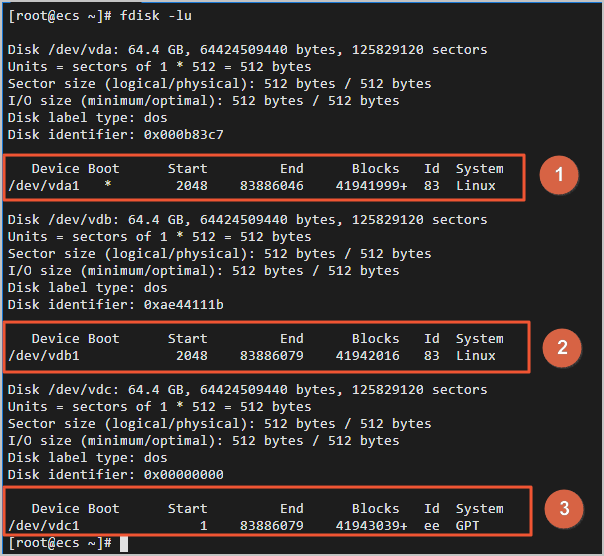
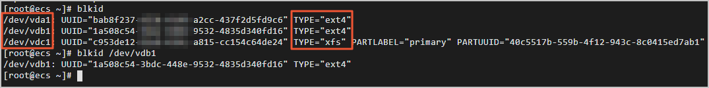
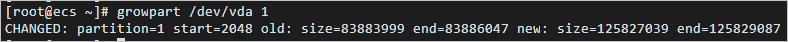
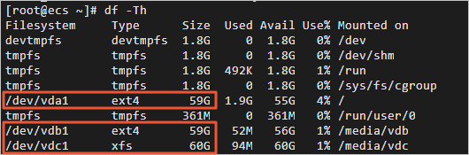

[阿里云在线文档](https://help.aliyun.com/document_detail/113316.html?spm=5176.13910061.sslink.1.4dd114a01qYU2P)

阿里云在线文档写的也很详细，但是有些细节欠缺，今天刚好需要云盘扩容，记录一下，。

- 创建快照(可选)

  ```shell
  在扩容云盘前，为云盘创建快照，做好数据备份。
  登录ECS管理控制台。
  在左侧导航栏，单击存储与快照 > 云盘。
  在顶部菜单栏左上角处，选择地域。
  找到需要扩容的云盘，在操作列单击创建快照。
  在弹出的对话框中，输入快照名称，并按需绑定标签后，单击确定。
  在左侧导航栏，单击存储与快照 > 快照。查看已创建的快照。
  当快照的进度为100%时，表示快照创建完成，您可以执行后续操作。
  ```

- 在控制台扩容云盘容量

  ```shell
  登录ECS管理控制台。
  在左侧导航栏，单击存储与快照 > 云盘。
  在顶部菜单栏左上角处，选择地域。
  选择需要扩容的云盘，在操作列单击更多 > 磁盘扩容。
  说明 如果需要批量扩容多个云盘，请使用阿里云主账号选择多个云盘后，单击底部的磁盘扩容。
  在磁盘扩容页面，选中在线扩容，并设置扩容后容量。
  设置的扩容后容量不允许小于当前容量。
  确认费用，阅读并选中《云服务器ECS服务条款》后，单击确认扩容。
  阅读磁盘扩容须知后，单击已阅读，继续扩容，完成支付。
  ```

- 查看云盘分区情况

  ```shell
  1、远程登录ECS实例
  2、运行命令fdisk -lu查看实例的云盘情况。
  示例以系统盘（/dev/vda1）和数据盘（/dev/vdb1、/vde/vdc1）的三个分区为例，如下图所示
  ```

  

  | 序号 | 分区        | 说明                                           |
  | :--- | :---------- | :--------------------------------------------- |
  | ①    | `/dev/vda1` | 系统盘，**System**取值**Linux**表示为MBR分区。 |
  | ②    | `/dev/vdb1` | 数据盘，**System**取值**Linux**表示为MBR分区。 |
  | ③    | `/dev/vdc1` | 数据盘，**System**取值**GPT**表示为GPT分区。   |

  ```shell
  3、运行命令blkid确认已有分区的文件系统类型  如果需要查询具体分区（例如/dev/vdb1），运行命令blkid /dev/vdb1
  ```

  

- 扩容分区

  ```shell
  1、远程登录ECS实例。
  2、安装gdisk工具。如果您的分区为GPT格式，必须执行此步骤；如果您的分区为MBR格式，请跳过此步骤。
  	yum install gdisk -y
  3、运行命令growpart /dev/vda 1扩容分区。此示例以扩容系统盘为例，/dev/vda和1之间需要空格分隔。如果需要扩容其他分区，请根据实际情况修改命令
  ```

  运行完3的命令后我的出现了 'bash: growpart: command not found'

  不要慌 安装一下就好了

  ```shell
  yum install cloud-utils-growpart yum install xfsprogs -y
  ```

  再执行growpart命令

  ```shell
  growpart /dev/vda 1
  ```

  

  此时还没有完成，还需要扩容文件系统

- 扩容文件系统
  1. 远程登录ECS实例。

  2. 根据查询的文件系统类型，扩容文件系统。
     - 扩容ext\*（例如ext4）文件系统：运行命令

       ```
       resize2fs /dev/vda1
       ```

       扩容文件系统。

       ```shell
       #扩容系统盘/dev/vda1的文件系统
       resize2fs /dev/vda1

       #扩容数据盘/dev/vdb1的文件系统
       e2fsck -f /dev/vdb1     //强制检查文件系统
       resize2fs /dev/vdb1
       ```

       - **说明** `/dev/vda1`和`/dev/vdb1`都是分区名称，您需要根据实际情况修改。

       - 扩容xfs文件系统：运行命令

         ```
         xfs_growfs /media/vdc
         ```

         **说明** `/media/vdc`为`/dev/vdc1`的挂载点，您需要根据实际情况修改。

     运行命令`df -Th`检查扩容后结果。

     [](http://static-aliyun-doc.oss-cn-hangzhou.aliyuncs.com/assets/img/zh-CN/0750367951/p135835.png)

- 校对数据(可选)

  扩容完成后，您需要根据实际情况检查数据是否正常。
  1. 远程登录ECS实例。
  2. 校对ECS实例中数据，保证原数据的完整性。
     - 如果数据正常，完成扩容操作。
     - 如果数据异常，可以通过备份的快照回滚数据。

