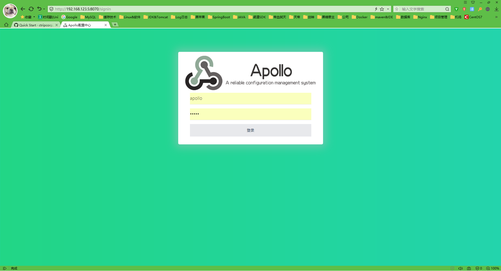
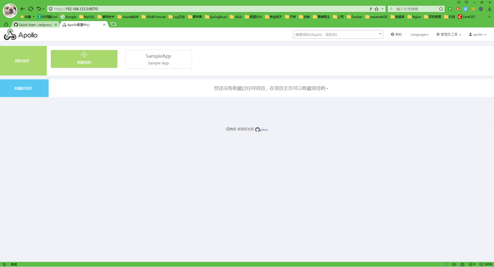

- [Github地址](https://github.com/ctripcorp/apollo)

- [快速部署教程](https://github.com/ctripcorp/apollo/wiki/Quick-Start)

  ## 一、准备工作

  ### 1、配置JDK环境

  ### 2、安装MySQL5.7.29

  ### 3、下载Quick Start安装包
  1. 从Github下载
     - checkout或下载[apollo-build-scripts项目](https://github.com/nobodyiam/apollo-build-scripts)
     - 由于Quick Start项目比较大，所以放在了另外的repository，请注意项目地址
       - https://github.com/nobodyiam/apollo-build-scripts
  2. 从百度网盘下载
     - 通过[网盘链接](https://pan.baidu.com/s/1mhVf9va#list/path=/sharelink1426331153-165614845139829/apollo-quick-start&parentPath=/sharelink1426331153-165614845139829)下载
     - 下载到本地后，在本地解压apollo-quick-start.zip

- 安装zip解压软件

  ```shell
  yum install zip
  yum install unzip
  ```

- 将从网盘下载的apollo-quick-start.zip包上传到/opt/apollo下并解压

  ```shell
  cd /opt
  mkdir apollo
  chmod 755 apollo
  #解压
  unzip apollo-quick-start-1.5.0.zip
  #将包移走
  mv apollo-quick-start-1.5.0.zip ../
  ```

- 创建ApolloPortalDB通过各种MySQL客户端导入[sql/apolloportaldb.sql](https://github.com/nobodyiam/apollo-build-scripts/blob/master/sql/apolloportaldb.sql)即可

- 创建ApolloConfigDB通过各种MySQL客户端导入[sql/apolloconfigdb.sql](https://github.com/nobodyiam/apollo-build-scripts/blob/master/sql/apolloconfigdb.sql)即可

- 配置数据库连接信息

  ```shell
  #编辑启动脚本文件 注意：不要修改demo.sh的其它部分 最好把localhost改成你的IP 这里不改了
  vim demo.sh
      apollo_config_db_url=jdbc:mysql://localhost:3306/ApolloconfigDB?characterEncoding=utf8
      apollo_config_db_username=root
      apollo_config_db_password=root

      # apollo portal db info
      apollo_portal_db_url=jdbc:mysql://localhost:3306/ApolloportalDB?characterEncoding=utf8
      apollo_portal_db_username=root
      apollo_portal_db_password=root

      # meta server url
      config_server_url=http://localhost:8080
      admin_server_url=http://localhost:8090
      eureka_service_url=$config_server_url/eureka/
      portal_url=http://localhost:8070
  ```

- 确保端口未被占用

  ```shell
  yum install lsof

  lsof -i:8070
  lsof -i:8080
  lsof -i:8090
  ```

- 启动Apollo配置中心

  ```shell
  #执行启动脚本
  ./demo.sh start
  #当看到如下输出后，就说明启动成功了
  ==== starting service ====
  Service logging file is ./service/apollo-service.log
  Started [21476]
  Waiting for config service startup......
  Config service started. You may visit http://localhost:8080 for service status now!
  Waiting for admin service startup..
  Admin service started
  ==== starting portal ====
  Portal logging file is ./portal/apollo-portal.log
  Started [21734]
  Waiting for portal startup......
  Portal started. You can visit http://localhost:8070 now!
  ```

- 初始化Apollo配置中心 打开http://192.168.123.5:8070 用户名apollo，密码admin

  

  

  如果遇到提示`系统出错，请重试或联系系统负责人`，请稍后几秒钟重试一下，因为通过Eureka注册的服务有一个刷新的延时

- 如果启动遇到了异常，可以分别查看service和portal目录下的log文件排查问题。

  > 注：在启动apollo-configservice的过程中会在日志中输出eureka注册失败的信息，如`com.sun.jersey.api.client.ClientHandlerException: java.net.ConnectException: Connection refused`。需要注意的是，这个是预期的情况，因为apollo-configservice需要向Meta Server（它自己）注册服务，但是因为在启动过程中，自己还没起来，所以会报这个错。后面会进行重试的动作，所以等自己服务起来后就会注册正常了。

