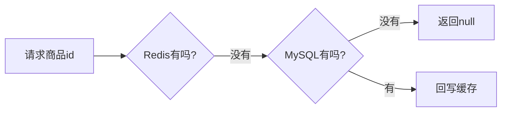
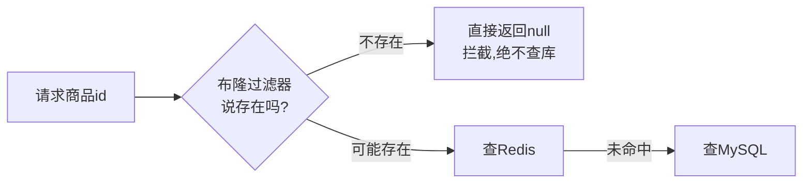
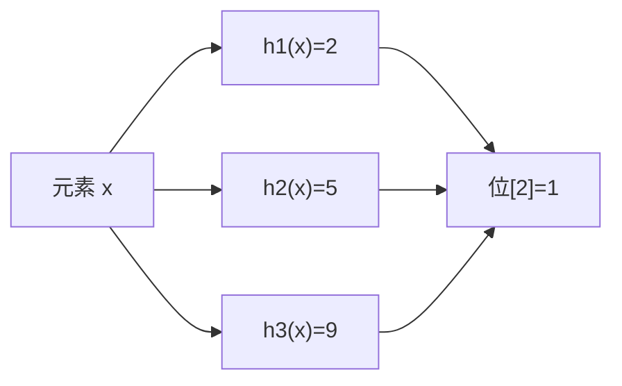
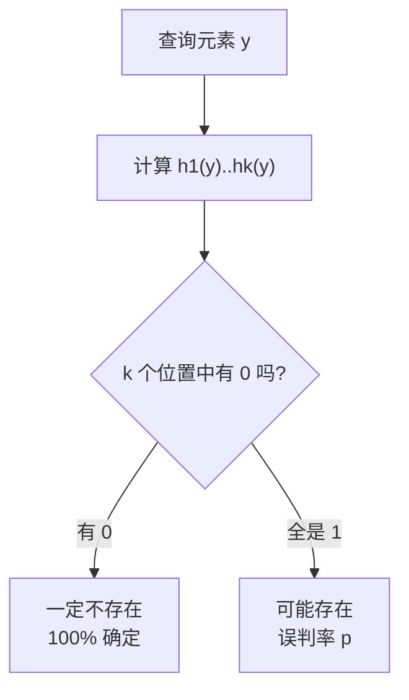

在高并发系统中，有一个非常经典的问题：**如何快速判断一个元素是否在一个巨大的集合里？**

比如：请求一个不存在的商品 id，怎么在**不查数据库**的前提下直接拦截？爬虫要判断一个 URL 是否已抓取过，几十亿条记录用 Set 存内存会爆，怎么办？

**布隆过滤器（Bloom Filter）**就是为解决这类问题而生：用极小的内存代价，实现"判断元素是否可能存在"的高效查询。

它最重要的两个特性（记住这两句话，全篇都在围绕它展开）：

> 1. **判断"不存在"是 100% 准确**——只要过滤器说没有，就一定没有；
> 2. **判断"存在"有误判率**——过滤器说有，可能实际并不存在（假阳性，false positive）。

## 一、为什么需要布隆过滤器

先看一个缓存穿透场景。用户请求商品详情，常规流程是「先查 Redis → 未命中查 MySQL」：



问题来了：**如果 id 本身不存在**（恶意遍历、脏数据），每次请求都会穿过 Redis 打到 MySQL。id 有几十亿种可能，缓存空值会撑爆内存，怎么办？

在 Redis 和 MySQL 之间加一道布隆过滤器，把**所有存在的 id 提前放进去**：



- 不存在的 id：布隆过滤器 100% 拦截，数据库零压力；
- 存在的 id：布隆过滤器放行（可能误判，但只是多走一次正常流程）；
- 代价仅是**极小概率**把"不存在"误判为"存在"而多查一次库，完全可接受。

这正是布隆过滤器最适合的场景——**用"假阳性"换"零漏判"和"极省内存"**。

## 二、原理：位数组 + 多个哈希函数

### 1. 数据结构

布隆过滤器的核心就是一个**很长的二进制位数组**（bit 数组，每位 0/1），加上 **k 个互相独立的哈希函数**。

```text
位数组（m 位，初始全 0）：
+---+---+---+---+---+---+---+---+---+---+---+
| 0 | 0 | 0 | 0 | 0 | 0 | 0 | 0 | 0 | 0 | 0 |
+---+---+---+---+---+---+---+---+---+---+---+

k 个哈希函数：h1(), h2(), ..., hk()，每个都输出 [0, m) 的一个下标
```

### 2. 插入元素（置 1）

把元素 `x` 分别经过 k 个哈希函数，算出 k 个下标，把位数组中**这 k 个位置全部置 1**：



### 3. 查询元素（全 1 则可能存在）

查询元素 `y` 时，同样算出 k 个下标，检查这 k 个位置：

- **只要有任意一个位置是 0** → `y` **一定不存在**（插入时会把 k 个位置全置 1，如果 y 存在，这 k 个位置不可能有 0）；
- **k 个位置全是 1** → `y` **可能存在**。为什么不是一定？因为这些 1 可能是**其他元素**置上去的，恰好把 y 的 k 个位置都"碰"成了 1——这就是误判的来源。



### 4. 一个直观例子

假设位数组 16 位，k=3 个哈希函数。插入 `"apple"` 后，位[2]、位[7]、位[11] 被置 1；插入 `"banana"` 后，位[5]、位[7]、位[13] 被置 1。

此时查询 `"cherry"`，哈希算出位置 {2, 5, 7}——**全被之前的水果占满了**，于是布隆过滤器会说 `"cherry" 可能存在`，但实际它从未被插入。这就是一次**误判**。

```text
位数组：  0  1  2  3  4  5  6  7  8  9 10 11 12 13 14 15
初始：    0  0  0  0  0  0  0  0  0  0  0  0  0  0  0  0
插apple: 0  0  1  0  0  0  0  1  0  0  0  1  0  0  0  0
插banana:0  0  1  0  0  1  0  1  0  0  0  1  0  1  0  0
查cherry:              ↑(h1=2)     ↑(h2=5)     ↑(h3=7)
         这 3 位全是 1 → 误判为"可能存在"
```

## 三、数学原理：误判率与参数选择

### 1. 误判率公式

假设位数组长度 m，哈希函数个数 k，已插入 n 个元素，误判率 p 的近似公式为：

\[
p \approx \left(1 - e^{-\frac{kn}{m}}\right)^k
\]

直觉理解：元素越多（n 大）、位数组越小（m 小），位被置 1 的概率越高，误判率越大；哈希函数越多（k 大），每个元素覆盖的位多，但位数组也更"挤"，所以 k 存在最优值。

### 2. 最优哈希函数个数

给定 m 和 n，最优的 k 为：

\[
k_{opt} = \frac{m}{n} \ln 2 \approx 0.7 \times \frac{m}{n}
\]

### 3. 位数组长度估算

反过来，给定预估元素数 n 和期望误判率 p，需要的位数组长度 m 为：

\[
m \approx -\frac{n \ln p}{(\ln 2)^2}
\]

**速算记忆**：每存一个元素约需 `1.44 × log2(1/p)` 位。

| 期望误判率 p | 每元素所需位数 | 示例：100 万元素 |
| --- | --- | --- |
| 1%（0.01） | 约 9.6 bit | 约 1.2 MB |
| 0.1%（0.001） | 约 14.4 bit | 约 1.8 MB |
| 0.01%（0.0001） | 约 19.2 bit | 约 2.4 MB |

**对比**：如果用 HashSet 存 100 万个长字符串（假设 40 字节/条 + 对象开销），轻松超过 50 MB；而布隆过滤器只要约 1.2 MB，**内存省了 40 倍以上**，且不管单个元素多大，占用只跟"元素个数 × 位数"有关。

## 四、优缺点分析

### 优点

- **空间极省**：与元素本身大小无关，只与 n、p 相关；
- **查询快**：O(k) 时间，k 通常只有几个到十几个，都是哈希位运算；
- **零漏判**：不存在的一定说不存在，杜绝"误放行"（对缓存穿透防护是硬要求）；
- **实现简单**：底层就是位数组，可轻松用 Redis 位图实现。

### 缺点

- **有误判率**：存在的元素可能被误判为不存在？**不会**。反过来——不存在的元素可能被误判为存在；
- **无法删除元素**：因为多个元素共享位，直接把某元素的 k 位清 0 会误删其他元素。这是布隆过滤器最"出名"的短板（解决方案见下文）；
- **无法统计元素个数**（标准版）；
- 误判率会随元素增多**持续上升**，且无法自动扩容（需要重建）。

## 五、手写一个 Java 布隆过滤器

理解了原理，30 行代码就能实现一个：

```java
public class SimpleBloomFilter {

    private final long[] bits;          // 位数组，用 long[] 实现
    private final int size;             // 位数组总位数 m
    private final int hashCount;        // 哈希函数个数 k

    public SimpleBloomFilter(int size, int hashCount) {
        this.size = size;
        this.hashCount = hashCount;
        this.bits = new long[(size + 63) / 64];
    }

    /** 插入元素 */
    public void add(String value) {
        for (int i = 0; i < hashCount; i++) {
            int pos = hash(value, i);
            bits[pos / 64] |= (1L << (pos % 64));   // 置 1
        }
    }

    /** 查询元素：存在返回 true（可能误判），不存在返回 false（100% 准确） */
    public boolean contains(String value) {
        for (int i = 0; i < hashCount; i++) {
            int pos = hash(value, i);
            if ((bits[pos / 64] & (1L << (pos % 64))) == 0) {
                return false;   // 有一位是 0 → 一定不存在
            }
        }
        return true;            // 全 1 → 可能存在
    }

    /** 用同一个字符串哈希 + 盐值，派生出 k 个独立哈希 */
    private int hash(String value, int seed) {
        int h = value.hashCode() + seed * 0x9E3779B9;
        h = Integer.rotateLeft(h, seed & 31);
        return Math.floorMod(h, size);
    }

    public static void main(String[] args) {
        // 位数组 1 万位，4 个哈希函数（演示用）
        SimpleBloomFilter bf = new SimpleBloomFilter(10_000, 4);
        bf.add("apple");
        bf.add("banana");

        System.out.println(bf.contains("apple"));   // true（真实存在）
        System.out.println(bf.contains("cherry"));  // 大概率 false（不存在，100% 拦截）
    }
}
```

## 六、生产实践：Guava 布隆过滤器

手写版适合理解原理，生产上直接用 **Google Guava** 提供的高质量实现——它内部自动按你给的 `n` 和 `p` 计算最优 m、k：

```xml
<dependency>
    <groupId>com.google.guava</groupId>
    <artifactId>guava</artifactId>
    <version>33.2.0-jre</version>
</dependency>
```

```java
import com.google.common.hash.BloomFilter;
import com.google.common.hash.Funnels;

public class BloomFilterDemo {

    public static void main(String[] args) {
        // 预估 100 万个元素，期望误判率 1%
        BloomFilter<String> bloom = BloomFilter.create(
                Funnels.stringFunnel(StandardCharsets.UTF_8),
                1_000_000, 0.01);

        // 初始化：把所有存在的商品 id 放进去
        for (Long id : productService.getAllIds()) {
            bloom.put(String.valueOf(id));
        }

        // 查询
        boolean maybeExist = bloom.mightContain("10086");
        System.out.println(maybeExist);
    }
}
```

**注意**：Guava 的 `BloomFilter` 在**应用内存**里，适合单机/内存可控的场景；多实例部署时每台机器要各自初始化一份，且不能共享。分布式场景要用 Redis 版本（见下节）。

## 七、Redis 布隆过滤器（生产首选）

### 1. 用 Redis 位图手写（无额外依赖）

Redis 的 `setbit/getbit` 本质就是位数组，可以直接实现布隆过滤器，适合不想装插件的情况：

```java
@Service
public class RedisBloomService {

    private static final String KEY_PREFIX = "bloom:product:";
    private static final int BIT_SIZE = 10_000_000;   // m
    private static final int HASH_COUNT = 7;          // k（由 n、p 算出）

    private final StringRedisTemplate redis;

    /** 初始化：把数据库里所有存在的 id 加入过滤器（应用启动时执行一次） */
    public void initAll(Long total) {
        // 用 Lua 脚本批量置位，避免逐个 setbit 的网络开销
        // 生产环境可拆批执行
        List<Long> allIds = productMapper.selectAllIds();
        allIds.forEach(this::add);
    }

    /** 插入：k 个 setbit */
    public void add(Long id) {
        for (int i = 0; i < HASH_COUNT; i++) {
            int pos = hash(String.valueOf(id), i, BIT_SIZE);
            redis.opsForValue().setBit(KEY_PREFIX, pos, true);
        }
    }

    /** 查询：有一个位是 0 就认为不存在 */
    public boolean mightContain(Long id) {
        for (int i = 0; i < HASH_COUNT; i++) {
            int pos = hash(String.valueOf(id), i, BIT_SIZE);
            Boolean bit = redis.opsForValue().getBit(KEY_PREFIX, pos);
            if (!Boolean.TRUE.equals(bit)) {
                return false;
            }
        }
        return true;
    }

    /** 与手写版相同的哈希派生逻辑 */
    private int hash(String value, int seed, int size) {
        int h = value.hashCode() + seed * 0x9E3779B9;
        h = Integer.rotateLeft(h, seed & 31);
        return Math.floorMod(h, size);
    }
}
```

查询接口里加一道拦截：

```java
public Object getProductById(Long id) {
    // 布隆过滤器拦截不存在的 id，避免打穿到数据库
    if (!bloomService.mightContain(id)) {
        return null;    // 一定不存在，直接返回
    }
    // 正常走 缓存 → 数据库 流程
    ...
}
```

### 2. RedisBloom 插件（官方推荐，原生命令）

Redis 4.0 起支持模块化扩展，**RedisBloom** 是官方布隆过滤器模块，原生命令效率最高：

```shell
# 加载模块（或以 --loadmodule 参数启动 redis）
redis-server --loadmodule /path/to/redisbloom.so
# Docker 启动
docker run -d -p 6379:6379 --name redis-bloom redislabs/rebloom
```

```shell
# 创建过滤器：BF.RESERVE key 误判率 容量
127.0.0.1:6379> BF.RESERVE product_bloom 0.01 1000000
OK

# 添加元素 / 批量添加
127.0.0.1:6379> BF.ADD product_bloom 10086
(integer) 1
127.0.0.1:6379> BF.MADD product_bloom 10087 10088
1) (integer) 1
2) (integer) 1

# 查询元素是否存在（0 = 一定不存在，1 = 可能存在）
127.0.0.1:6379> BF.EXISTS product_bloom 10086
(integer) 1
127.0.0.1:6379> BF.EXISTS product_bloom 99999
(integer) 0
```

### 3. Redisson 客户端（Java 一步到位）

**Redisson** 的 `RBloomFilter` 封装了 Redis 端的布隆过滤器，Java 侧最省事：

```java
@Configuration
public class RedissonConfig {
    @Bean(destroyMethod = "shutdown")
    public RedissonClient redissonClient() {
        Config config = new Config();
        config.useSingleServer().setAddress("redis://127.0.0.1:6379");
        return Redisson.create(config);
    }
}
```

```java
@Service
public class ProductBloomService {

    @Autowired
    private RedissonClient redisson;

    /** 初始化过滤器（tryInit：已存在则不重建） */
    public RBloomFilter<String> initBloom() {
        RBloomFilter<String> bloom = redisson.getBloomFilter("bloom:product");
        // 容量 100 万，误判率 1%
        bloom.tryInit(1_000_000L, 0.01);
        return bloom;
    }

    public void addAll() {
        RBloomFilter<String> bloom = initBloom();
        for (Long id : productMapper.selectAllIds()) {
            bloom.add(String.valueOf(id));   // 底层走 BF.ADD，对应用透明
        }
    }

    public boolean mightContain(Long id) {
        RBloomFilter<String> bloom = redisson.getBloomFilter("bloom:product");
        return bloom.contains(String.valueOf(id));
    }
}
```

## 八、应用场景

| 场景 | 说明 |
| --- | --- |
| **缓存穿透防护** | 缓存 + 布隆过滤器，拦截不存在的 key（最经典） |
| **爬虫 URL 去重** | 几十亿 URL 用 Set 存不下，布隆过滤器毫秒级判重 |
| **垃圾邮件/黑名单拦截** | 先过滤再白名单复核，误判可接受 |
| **数据库查询前置拦截** | 不存在的主键提前拦截，避免无效 SQL 洪峰 |
| **防止缓存雪崩诱因** | 大量不存在 key 被拦截后，DB 压力骤降 |
| **文档/文件指纹去重** | 检测重复上传内容 |
| **推荐系统已读过滤** | 记录用户已读过的内容 id（容忍误判） |

## 九、和谁做对比

| 结构 | 空间 | 误判 | 可删除 | 用途 |
| --- | --- | --- | --- | --- |
| HashSet/HashMap | 大 | 无 | 可以 | 精确去重，数据量小 |
| Bitmap | 小 | 无 | 可以 | 已知**连续**整型 id 的标记（如签到按用户 id 偏移） |
| **布隆过滤器** | 很小 | 有（假阳性） | **不能** | 海量、无规律元素的存在性判断 |
| HyperLogLog | 极小 | 有（基数误差） | 不能 | 统计**不重复元素个数**（UV），不关心具体是哪些元素 |

**和 Bitmap 的区别最关键**：Bitmap 要求 id 是**连续的整数**（能映射成位下标）；布隆过滤器通过**哈希**，对任意类型（字符串、URL、任意 long）都适用。

**和 HyperLogLog 的区别**：HyperLogLog 回答"**有多少个**不同的"，布隆过滤器回答"**某个特定的在不在**"。

## 十、布隆过滤器不能删除元素，怎么办？

标准布隆过滤器**不能删除元素**（多个元素共享位）。需要删除的场景有两个主流替代方案：

### 方案一：Counting Bloom Filter（计数布隆过滤器）

把每一位从 `0/1` 升级为**计数器**（如 4 位），插入时计数器 +1，删除时 -1：

```text
标准布隆过滤器：位[2] = 1          （只能存在/不存在）
计数布隆过滤器：位[2] = 3          （3 个元素共享这一位）
                删除一个 → 位[2] = 2
```

代价是内存变为原来的 3~4 倍（计数器位数），但换来了删除能力。

### 方案二：Cuckoo Filter（布谷鸟过滤器）

Cuckoo Filter 是更强的替代品，支持**删除元素**、**更低的误判率**、**更高的空间利用率**，很多新系统直接用它替代布隆过滤器。核心思想是"两个候选位置 + 哈希冲突时踢出对方"（像布谷鸟借巢）。

```java
// 需要额外引入实现库，如 CuckooFilter4J
CuckooFilter<Integer> filter = new CuckooFilter<>(1_000_000, 0.01);
filter.add(1);
filter.contains(1);      // true
filter.delete(1);        // 支持删除！
```

**如何选择**：只增不删用标准布隆过滤器（简单高效）；有删除需求、数据变动频繁用 Counting Bloom / Cuckoo Filter。

## 十一、参数设计速查

| 参数 | 含义 | 设计建议 |
| --- | --- | --- |
| n | 预估元素总数 | 必须**留出余量**（×1.2~1.5），因为过滤器无法扩容，满了只能重建 |
| p | 可接受误判率 | 一般 1% 够用，敏感场景 0.1% |
| m | 位数组长度 | 按公式 `m ≈ -n·ln(p)/(ln2)²` 计算 |
| k | 哈希函数个数 | 按公式 `k ≈ 0.7·m/n` 计算，k 过大过小都增加误判率 |

**生产注意**：

- **容量不可扩容**：预估 n 要留足余量，否则元素超过设计值后误判率急剧上升；
- **数据变化大时定期重建**：批量重建 = 新建一个过滤器 + 全量重新插入（停机窗口或双写切换）；
- **哈希函数要均衡**：用知名哈希（MurmurHash、FNV），避免碰撞集中；
- **位数组大小 m 是空间核心**：1% 误判率下每元素 9.6 bit，是"够用"的默认选择。

## 十二、总结

- **本质**：用一个位数组 + k 个哈希函数，把"元素是否在集合里"压缩成 k 个位的检查；
- **铁律**：说不存在 = 100% 不存在；说存在 = 可能误判（假阳性）；
- **核心价值**：以极小内存、O(k) 时间，把海量判重从"精确但昂贵"变成"近似但极廉"；
- **主要短板**：不能删除、不能扩容、误判率随数据量上升；
- **生产首选**：RedisBloom 模块 / Redisson `RBloomFilter`，配 `tryInit(n, p)` 一步到位；
- **最经典应用**：缓存穿透防护——把不存在的请求拦在数据库之前。

一句话记忆：**布隆过滤器是"宁可多放行，绝不漏判"的存在性过滤器，用极小内存换海量判重能力，是缓存穿透防护和去重场景的标配。**
