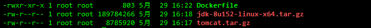
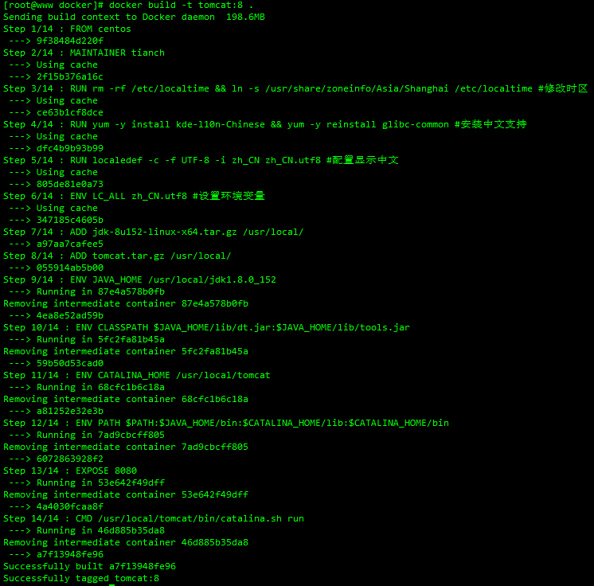
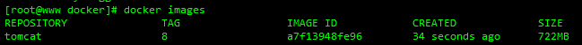

##### 1.上传到Linux服务器JDK和Tomcat包

- [JDK所有版本](https://www.oracle.com/cn/java/technologies/oracle-java-archive-downloads.html)

- [Tomcat8](https://tomcat.apache.org/download-80.cgi)

##### 2.新建一个文件夹存放JDK、Tomcat、Dockerfile在同一目录下

```shell
mkdir -p /opt/docker
cd /opt/docker
touch Dockerfile
chmod 755 Dockerfile
```



##### 3.编写Dockerfile文件

```shell
vim Dockerfile
```

```shell
#镜像来源
FROM centos:7
#维护者 作者
MAINTAINER tianch

#修改时区
RUN rm -rf /etc/localtime && ln -s /usr/share/zoneinfo/Asia/Shanghai /etc/localtime
#安装中文支持 不然会乱码
RUN yum -y install kde-l10n-Chinese && yum -y reinstall glibc-common
#配置显示中文
RUN localedef -c -f UTF-8 -i zh_CN zh_CN.utf8
#设置环境变量
ENV LC_ALL zh_CN.utf8

# 添加 jdk 和 tomcat
ADD jdk-8u152-linux-x64.tar.gz /usr/local/
ADD tomcat.tar.gz /usr/local/

# 配置jdk环境变量
ENV JAVA_HOME /usr/local/jdk1.8.0_152
ENV CLASSPATH $JAVA_HOME/lib/dt.jar:$JAVA_HOME/lib/tools.jar
ENV CATALINA_HOME /usr/local/tomcat
ENV PATH $PATH:$JAVA_HOME/bin:$CATALINA_HOME/lib:$CATALINA_HOME/bin

# 配置监听端口
EXPOSE 8080

# 启动tomcat服务
CMD /usr/local/tomcat/bin/catalina.sh run
```

##### 4.通过Dockerfile生成tomcat镜像

```shell
#注意最后有个点
docker build -t tomcat:8 .
```



##### 5.查看构建的镜像

```shell
docker images
```



##### 6.运行测试容器

```shell
#简单运行
run -d -p 8081:8080 --name mytomcat tomcat:8

#挂载目录运行
run -d -p 8081:8080 -v /opt/tomcat/apache-tomcat-8/webapps:/usr/local/tomcat/webapps -v /opt/tomcat/apache-tomcat-8/logs:/usr/local/tomcat/logs --restart=always --name mytomcat tomcat:8
```

###### 后续：将自己的镜像上传到dockerhub 制作jar包的docker镜像

