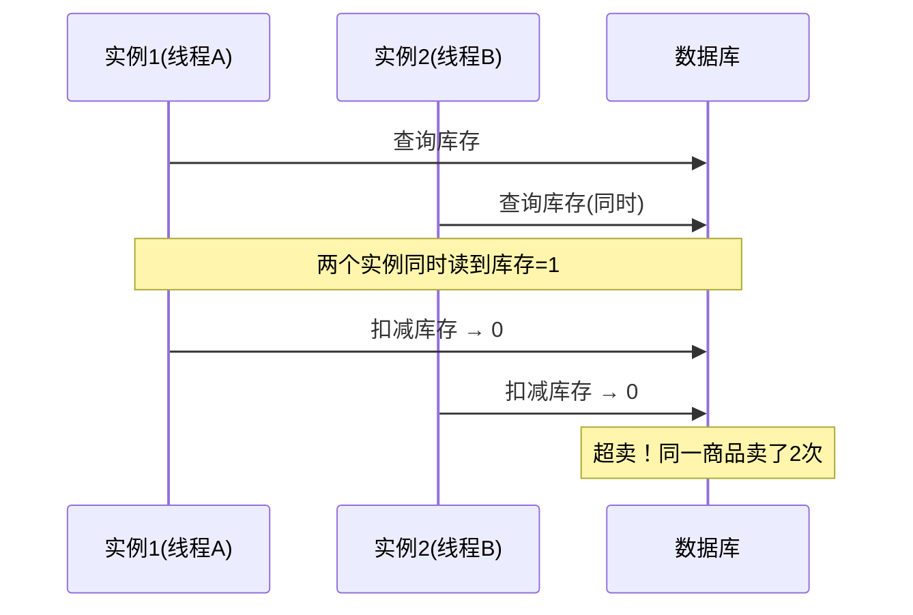
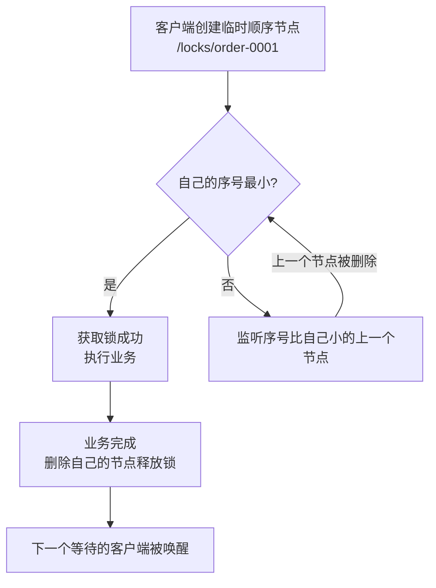

在单机应用中，我们用 `synchronized` 或 `ReentrantLock` 就能解决并发问题。但一旦应用部署成**多实例集群**（比如两台 Tomcat 后面挂负载均衡），JVM 锁就失效了——两个实例上的线程根本看不到彼此的锁。

**分布式锁**要解决的就是这个问题：在多个进程、多个实例之间保证"同一时刻只有一个线程能执行某段代码"。

本文从原理出发，手写一遍基于 Redis 和 ZooKeeper 的分布式锁，最后给出三种主流方案的选型对比。

## 一、分布式锁要满足什么条件

一个合格的分布式锁，至少要满足以下**三个核心要求**：

| 要求 | 说明 | 不满足的后果 |
| --- | --- | --- |
| 互斥性 | 任何时刻只有一个线程持锁 | 并发问题依旧存在 |
| 防死锁 | 持有者宕机/异常时锁能自动释放 | 其他线程永远拿不到锁，系统瘫痪 |
| 可重入性 | 同一线程可重复获取同一把锁 | 锁内递归调用自身方法会死锁 |

此外，实际生产还会关注：**加解锁的高可用性**（Redis 挂了怎么办）、**性能**（加解锁要快）、**公平性**（是否按请求顺序拿到锁）等。

先看一个业务场景：秒杀扣库存，两个实例同时处理同一用户的下单请求。



## 二、基于 Redis 实现

### 1. 第一版：`setnx + expire`（有坑）

最容易想到的做法：用 `setnx`（不存在才写入）加锁，用 `expire` 设置过期时间防死锁：

```shell
# 加锁：成功返回 1，锁已存在返回 0
127.0.0.1:6379> setnx lock:order:1001 threadA
(integer) 1

# 设置过期时间，防止持有者宕机后死锁
127.0.0.1:6379> expire lock:order:1001 10
(integer) 1
```

**这个写法有一个致命问题**：`setnx` 和 `expire` 是**两条独立命令**，如果 `setnx` 执行成功后、`expire` 执行前，进程突然崩溃（或 GC 停顿），锁就**永远不设过期时间**，其他线程永远拿不到锁，直接死锁。

### 2. 第二版：`set key value nx ex`（原子加锁）

Redis 2.6.12 之后，`set` 命令支持 `NX EX` 参数，一条命令完成「加锁 + 设过期时间」，从根源上解决了上面的问题：

```shell
# NX：不存在才设置（保证互斥）
# EX 10：10秒后自动过期（保证防死锁）
127.0.0.1:6379> set lock:order:1001 threadA NX EX 10
OK
```

Java 中对应 Spring Data Redis 的 `setIfAbsent`：

```java
public boolean tryLock(String key, String value, long expireSec) {
    return Boolean.TRUE.equals(
            redisTemplate.opsForValue().setIfAbsent(key, value, expireSec, TimeUnit.SECONDS));
}
```

### 3. 第三版：Lua 原子释放锁（防误删）

释放锁不能简单 `del`。设想这个场景：线程 A 持锁，业务执行超过 10 秒，锁自动过期；线程 B 拿到锁；此时 A 业务执行完执行 `del`——**把 B 的锁删掉了**，B 和白锁没有任何区别。

解决办法：**释放前校验 value 是不是自己的**。判断和删除必须原子执行，用 Lua 脚本：

```lua
-- KEYS[1] = 锁的 key，ARGV[1] = 自己加的锁 value
if redis.call('get', KEYS[1]) == ARGV[1] then
    return redis.call('del', KEYS[1])
else
    return 0
end
```

```java
public void unlock(String key, String value) {
    String script =
        "if redis.call('get', KEYS[1]) == ARGV[1] " +
        "then return redis.call('del', KEYS[1]) " +
        "else return 0 end";
    redisTemplate.execute(
            new DefaultRedisScript<>(script, Long.class),
            List.of(key), value);
}
```

### 4. 完整的手写版 Redis 分布式锁

把上面几步拼起来，就是一个可用的 Redis 分布式锁：

```java
public class RedisDistributedLock {

    private final StringRedisTemplate redis;

    public RedisDistributedLock(StringRedisTemplate redis) {
        this.redis = redis;
    }

    /** 加锁成功返回 true，value 用 UUID 保证唯一，用来安全释放 */
    public boolean lock(String key, String value, long expireSec) {
        return Boolean.TRUE.equals(
                redis.opsForValue().setIfAbsent(key, value, expireSec, TimeUnit.SECONDS));
    }

    /** 释放锁：Lua 校验 value 是自己才删除 */
    public void unlock(String key, String value) {
        String script =
            "if redis.call('get', KEYS[1]) == ARGV[1] " +
            "then return redis.call('del', KEYS[1]) " +
            "else return 0 end";
        redis.execute(new DefaultRedisScript<>(script, Long.class),
                List.of(key), value);
    }
}
```

使用方式：

```java
public void createOrder(Long userId, Long orderId) {
    String lockKey = "lock:order:" + userId;
    String lockValue = UUID.randomUUID().toString(); // 每个请求唯一

    // 自旋重试获取锁（非阻塞尝试 + 短暂睡眠）
    if (!tryLockLoop(lockKey, lockValue, 3, 50)) { // 最多等3秒
        throw new BizException("操作太频繁，请稍后重试");
    }
    try {
        // 临界区：防止重复下单
        doCreateOrder(userId, orderId);
    } finally {
        redisDistributedLock.unlock(lockKey, lockValue);
    }
}
```

### 5. 手动实现的坑：锁过期了业务没跑完

手写版有个**先天缺陷**：锁的过期时间是**写死的**。如果业务执行时间超过过期时间，锁提前释放，别的线程就进来了——互斥性被破坏。

- 方案 A：把过期时间设得很长（比如 30 秒）。但业务永远有不确定的慢请求，治标不治本；
- 方案 B：**看门狗机制**——锁持有期间，后台定时续期，业务没结束锁就不过期。这正 Redisson 做的事。

### 6. 生产级方案：Redisson

**Redisson** 是 Redis 官方推荐的 Java 客户端，内置完善的分布式锁实现，不用自己写任何底层逻辑。

**核心能力：**

- **看门狗自动续期**：默认锁有效期 30 秒，每 10 秒检查一次，业务没结束就自动续期 30 秒，避免锁提前过期；
- **可重入**：同一线程重复 `lock()` 不会死锁（内部有计数器）；
- **阻塞/非阻塞/带超时**的获取方式都有；
- **公平锁、读写锁、红锁**等高级锁类型。

```java
// 1. 引入依赖
// <dependency>
//     <groupId>org.redisson</groupId>
//     <artifactId>redisson-spring-boot-starter</artifactId>
// </dependency>

@Configuration
public class RedissonConfig {

    @Bean(destroyMethod = "shutdown")
    public RedissonClient redissonClient() {
        Config config = new Config();
        config.useSingleServer()
                .setAddress("redis://127.0.0.1:6379")
                .setPassword("你的密码");  // 无密码可去掉
        return Redisson.create(config);
    }
}
```

```java
@Service
public class OrderService {

    @Autowired
    private RedissonClient redisson;

    public void createOrder(Long userId, Long orderId) {
        // 锁的 key，按业务维度隔离
        RLock lock = redisson.getLock("lock:order:" + userId);

        try {
            // 等待2秒拿不到锁就放弃（不阻塞太长时间）
            boolean locked = lock.tryLock(2, 10, TimeUnit.SECONDS);
            if (!locked) {
                throw new BizException("操作太频繁，请稍后重试");
            }
            doCreateOrder(userId, orderId);
        } catch (InterruptedException e) {
            Thread.currentThread().interrupt();
        } finally {
            // 只有持有锁才释放（Redisson 内部校验）
            if (lock.isHeldByCurrentThread()) {
                lock.unlock();
            }
        }
    }
}
```

> `tryLock(waitTime, leaseTime, unit)`：`waitTime` 表示最多等多久拿锁，`leaseTime` 表示锁自动释放时间（传 -1 或省略时走看门狗自动续期）。

### 7. RedLock 与它的争议

Redis 锁在**主从架构**下有个隐患：线程 A 在 master 上加锁成功，master 还没同步到 slave 就宕机了，slave 升级为 master 后锁丢失，线程 B 又能加锁成功——互斥性被破坏。

`RedLock`（红锁）是 Redis 作者提出的解决思路：同时向 **N（通常 5）个独立的 Redis 节点**加锁，**超过半数成功**才算加锁成功。但业内对 RedLock 争议很大（Martin Kleppmann 写过著名的《How to do distributed locking》批判它），因为它在某些极端时间场景下依然不能严格保证互斥。

**现实建议**：

- 大多数业务场景（防重复提交、防超卖）允许极小的概率问题，**普通 Redis 锁 + Redisson 看门狗**完全够用；
- 要求**绝对严格互斥**（比如金融资金操作），要么引入 **ZooKeeper / etcd**（有严格的线性一致性保证），要么依赖数据库的唯一约束兜底。

## 三、基于 ZooKeeper 实现

### 1. 原理：临时顺序节点

ZooKeeper 实现分布式锁靠两个机制：

- **临时节点**：客户端会话断开（崩溃）时，节点自动删除 → 天然防死锁；
- **顺序节点**：每个请求创建带序号的节点，序号最小的持锁 → 天然公平，且符合**先来先服务**。

加锁流程：



```shell
# 模拟加锁过程（locks 目录下创建临时顺序节点）
# 客户端A
[zk: localhost:2181(CONNECTED)] create -e -s /locks/order_ lock
Created /locks/order_0000000001
# 客户端B
[zk: localhost:2181(CONNECTED)] create -e -s /locks/order_ lock
Created /locks/order_0000000002

# 客户端B 发现 0002 不是最小，监听 0001；客户端A 释放后删除 0001
# 客户端B 被唤醒，发现自己是 0002（最小）→ 获得锁
```

### 2. Curator 框架实现

直接用 ZK 原生 API 要自己写监听逻辑，生产上通常用 **Apache Curator**（ZK 官方推荐的高级客户端），它内置了 `InterProcessMutex` 分布式锁：

```java
// 1. 引入依赖
// <dependency>
//     <groupId>org.apache.curator</groupId>
//     <artifactId>curator-recipes</artifactId>
// </dependency>

@Configuration
public class ZkLockConfig {

    @Bean(destroyMethod = "close")
    public CuratorFramework curatorFramework() {
        // 连接串，多个节点逗号分隔
        CuratorFramework client = CuratorFrameworkFactory.newClient(
                "127.0.0.1:2181",
                new ExponentialBackoffRetry(1000, 3));
        client.start();
        return client;
    }
}
```

```java
@Service
public class InventoryService {

    @Autowired
    private CuratorFramework curator;

    public void reduceStock(Long productId, int num) {
        // 公平可重入锁
        InterProcessMutex lock = new InterProcessMutex(
                curator, "/locks/stock:" + productId);

        try {
            // 阻塞等待获取锁
            if (!lock.acquire(5, TimeUnit.SECONDS)) {
                throw new BizException("系统繁忙，请稍后重试");
            }
            doReduceStock(productId, num);
        } catch (Exception e) {
            throw new BizException("扣减库存失败", e);
        } finally {
            // 释放锁（若持有）
            try {
                lock.release();
            } catch (Exception ignored) {
                // 会话异常时节点已被自动清理
            }
        }
    }
}
```

Curator 的 `InterProcessMutex` 特点：

- **可重入**（同一线程重复 acquire 不会死锁）；
- **公平锁**（按请求顺序）；
- **自动防死锁**（临时节点，客户端崩了锁自动释放）；
- 实现方式就是上文说的「临时顺序节点 + 监听上一个节点」。

## 四、基于数据库实现（轻量备选）

在只有关系型数据库、不想引入新中间件的小项目里，也可以拿数据库实现简单分布式锁。

### 1. 唯一索引法（推荐）

利用数据库**唯一索引**保证互斥，抢锁=插入一行，释放=删除该行：

```sql
-- 表结构：lock_key 加唯一索引
CREATE TABLE t_lock (
    id          BIGINT AUTO_INCREMENT PRIMARY KEY,
    lock_key    VARCHAR(64) NOT NULL COMMENT '锁的key，如 order:1001',
    owner       VARCHAR(64) NOT NULL COMMENT '持有者标识，UUID',
    expire_time DATETIME    NOT NULL COMMENT '锁过期时间',
    UNIQUE KEY uk_lock_key (lock_key)
);
```

```java
@Transactional
public boolean tryLock(String lockKey, String owner, int expireSec) {
    try {
        // 插入成功 = 抢到锁；唯一索引冲突会抛异常 = 没抢到
        lockMapper.insert(new LockRow(lockKey, owner,
                LocalDateTime.now().plusSeconds(expireSec)));
        return true;
    } catch (DuplicateKeyException e) {
        return false; // 已被别人持有
    }
}
```

**防死锁兜底**：抢锁/持锁期间用定时任务清理 `expire_time < now()` 的过期行；释放锁用 `delete where lock_key=? and owner=?`（校验持有者）。

### 2. 悲观锁/乐观锁（行级锁）

- 悲观锁：`select ... for update` 锁住记录行，事务提交才释放。锁由数据库自己管理，天然防死锁，但吞吐量低、依赖事务；
- 乐观锁：`update ... set stock = stock - 1 where id=? and stock >= 1`，利用行受影响行数判断是否成功。适合扣库存这类简单场景，严格说它不是"锁"而是「乐观并发控制」。

**数据库方案的缺点**：性能差（每次都要查/写数据库）、依赖数据库可用性、没有现成的「自动续期」能力。只适合低并发、无中间件的场景。

## 五、三种方案对比与选型

| 对比项 | Redis | ZooKeeper / etcd | 数据库 |
| --- | --- | --- | --- |
| 性能 | 最高（内存操作） | 中等 | 最差 |
| 一致性保证 | 弱（主从切换可能丢锁） | 强（线性一致性） | 强（ACID 事务） |
| 防死锁 | 靠过期时间 | 临时节点自动清理 | 靠过期时间清理 |
| 可重入 | Redisson 支持 | Curator 支持 | 需自己实现 |
| 公平性 | 默认不公平 | 天然公平 | 默认公平 |
| 实现复杂度 | 低（Redisson 开箱即用） | 中（Curator 封装） | 中 |
| 额外依赖 | 已有 Redis 即可 | 需额外部署 ZK/etcd | 无需 |
| 适用场景 | 大部分业务场景（防重、限流） | 要求严格一致性的核心场景 | 低并发小项目 |

**选型建议：**

- **默认选 Redis**：绝大多数业务（防重复提交、防超卖、幂等控制）用 Redisson，性能好、接入成本低，允许极小的概率问题；
- **强一致场景选 ZooKeeper / etcd**：资金交易、分布式调度任务等对互斥性要求严格的场景，能接受多一个中间件的运维成本；
- **数据库方案**：仅在没有缓存也没有注册中心的存量小系统里过渡使用。

## 六、常见问题总结

**Q1：锁过期了业务还没执行完怎么办？**

看门狗自动续期（Redisson 默认支持）。不引入框架的话，可以写个定时任务在锁过期前续期，但实现容易出 bug，不建议手写。

**Q2：释放锁为什么要判断 value？**

防止误删别人的锁。业务超时后锁已自动释放，另一个线程拿到锁，此时旧线程结束执行 `del` 会把新锁删掉。用 Lua 脚本「判断 + 删除」保证原子性。

**Q3：Redis 主从切换时锁丢失怎么办？**

RedLock 多节点投票是一种方案但有争议。更务实的做法：a) 业务上接受极小概率并发问题；b) 数据库唯一约束/订单号做幂等兜底；c) 强一致场景直接用 ZooKeeper / etcd。

**Q4：什么时候不该用分布式锁？**

- 单纯的读多写少（用缓存即可）；
- 能用数据库唯一约束解决的幂等问题（如订单号唯一索引），比加锁更简单可靠；
- 性能极敏感且并发极低的场景（本地锁够用就别引入分布式锁）。

## 七、总结

- **分布式锁的本质**：多实例间的互斥，核心三要求是**互斥、防死锁、可重入**；
- **Redis 方案**：`set nx ex` 原子加锁 + Lua 原子释放 + 看门狗续期，生产直接用 Redisson；
- **ZooKeeper 方案**：临时顺序节点天然防死锁且公平，生产用 Curator 的 `InterProcessMutex`；
- **数据库方案**：唯一索引插入式抢锁，适合低并发过渡；
- **选型原则**：默认 Redis，强一致用 ZK/etcd，兜底靠数据库约束，不迷信任何单一方案。
