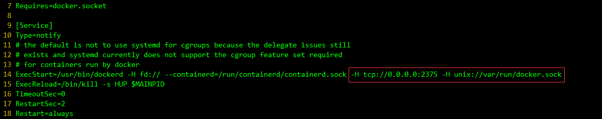
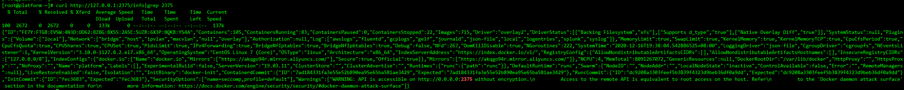
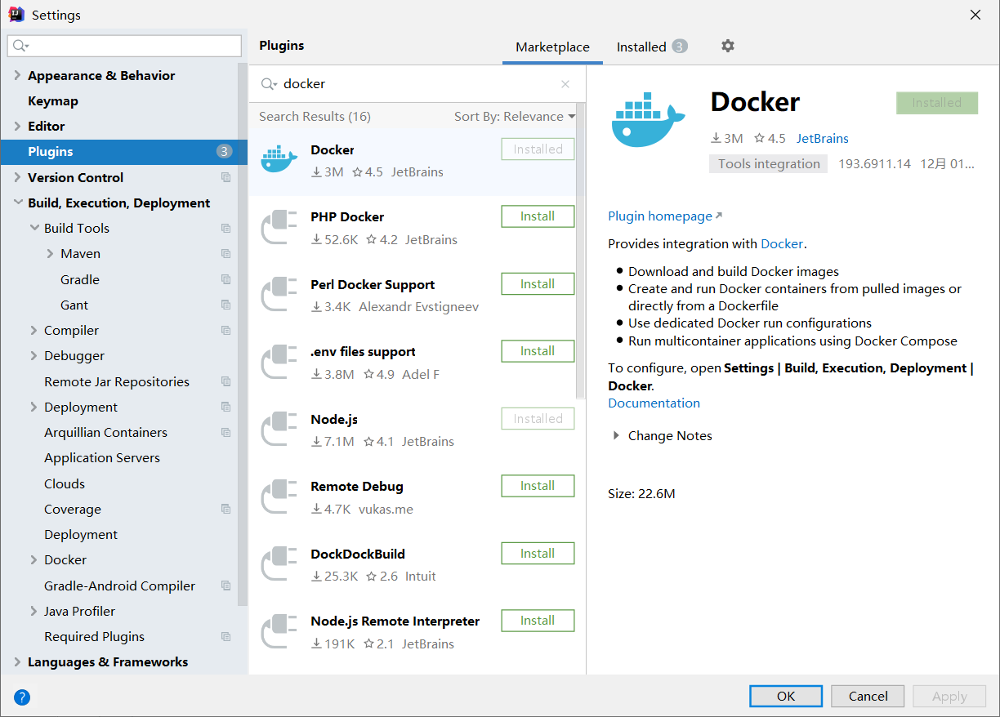
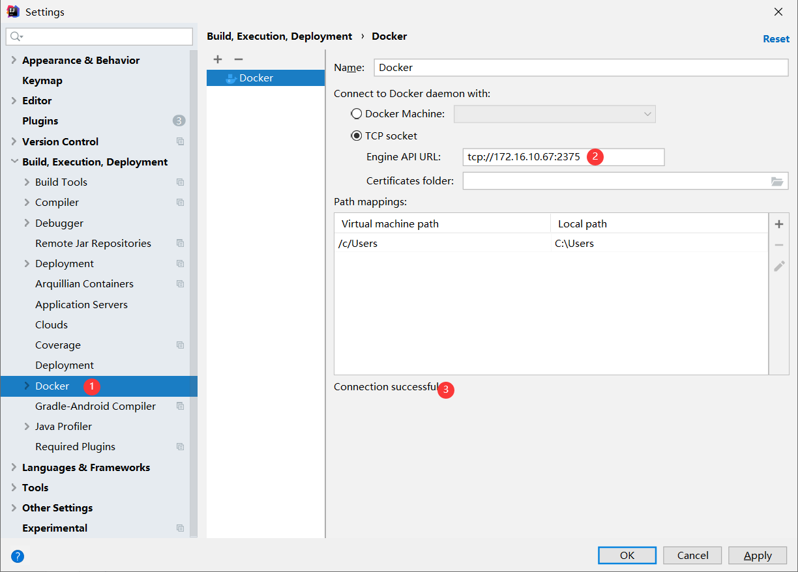
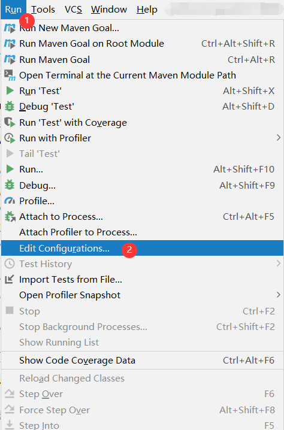
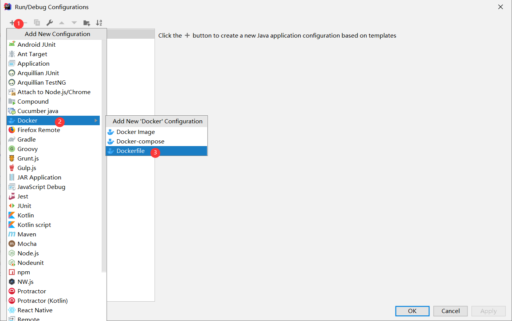
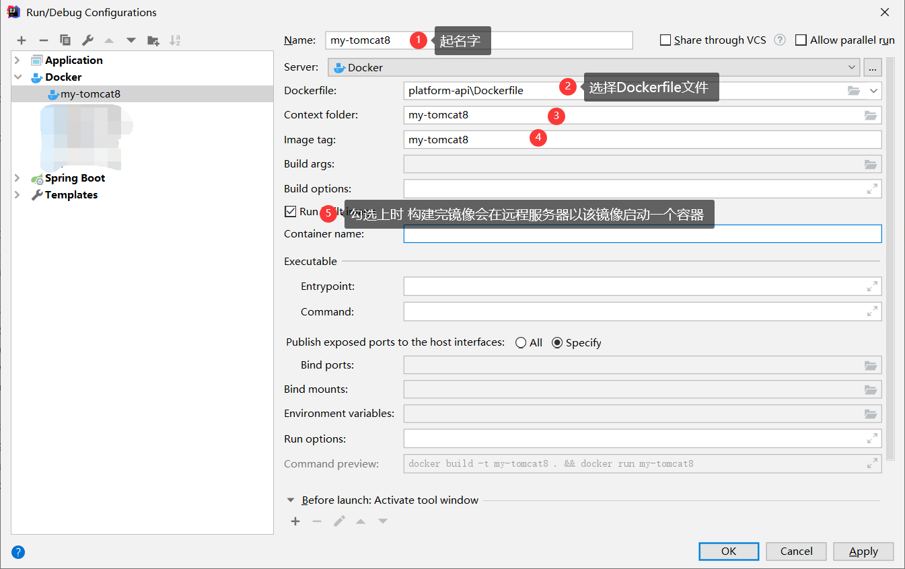
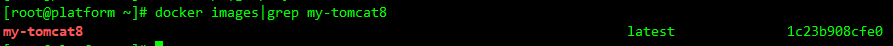
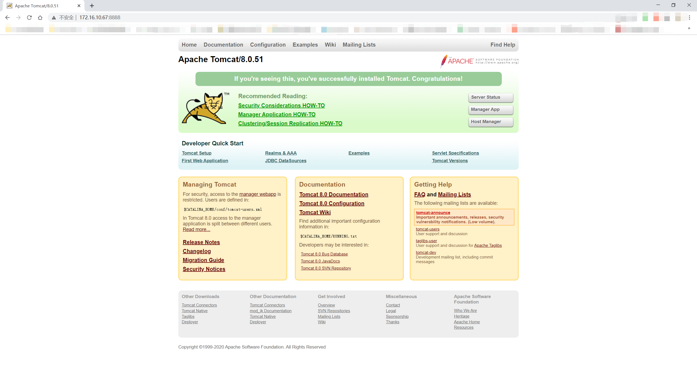
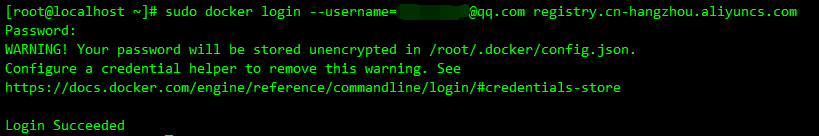

#### 1.前提准备

- 下载安装IDEA [最新win版](https://www.jetbrains.com/idea/download/#section=windows) [历史版本](https://www.jetbrains.com/idea/download/other.html)
- 远程服务器安装docker [CentOS7为例](http://blog.tianch.xyz/archives/CentOS7%E5%AE%89%E8%A3%85Docker)

#### 2.开启服务器docker远程访问

- 仅供学习参考，请勿在生产环境使用，会产生很大的安全风险

- 仅供学习参考，请勿在生产环境使用，会产生很大的安全风险

- 仅供学习参考，请勿在生产环境使用，会产生很大的安全风险

- 开启端口 默认2375 也可设置为其它

  ```shell
  vim /lib/systemd/system/docker.service

  # 在ExecStart后面追加 -H tcp://0.0.0.0:2375 -H unix://var/run/docker.sock
  ```

  

- 重新加载配置 重启docker

  ```shell
  #重新加载配置
  systemctl daemon-reload
  #重启docker
  systemctl restart docker
  ```

#### 3. 检查是否开启成功

```shell
curl http://127.0.0.1:2375/info|grep 2375
```



#### 4.配置IDEA

- 下载插件`Docker` 装完重启

  

- 在IDEA上配置远程docker服务器地址

  

#### 5.使用IDEA构建镜像测试

- 准备`Dockerfile`文件

  ```dockerfile
  #镜像来源
  FROM centos:centos7
  #维护者 作者
  MAINTAINER tianch

  #修改时区
  RUN rm -rf /etc/localtime && ln -s /usr/share/zoneinfo/Asia/Shanghai /etc/localtime
  #安装中文支持 不然会乱码
  RUN yum update -y && yum -y install kde-l10n-Chinese --nogpgcheck && yum -y reinstall glibc-common --nogpgcheck && yum install -y wget
  #配置显示中文
  RUN localedef -c -f UTF-8 -i zh_CN zh_CN.utf8
  #设置环境变量
  ENV LC_ALL zh_CN.utf8

  # 添加 jdk 和 tomcat
  ADD jdk-8u152-linux-x64.tar.gz /usr/local/
  ADD tomcat.tar.gz /usr/local/

  # 配置jdk环境变量
  ENV JAVA_HOME /usr/local/jdk1.8.0_152
  ENV CLASSPATH $JAVA_HOME/lib/dt.jar:$JAVA_HOME/lib/tools.jar
  ENV CATALINA_HOME /usr/local/tomcat
  ENV PATH $PATH:$JAVA_HOME/bin:$CATALINA_HOME/lib:$CATALINA_HOME/bin

  # 配置监听端口
  EXPOSE 8080
  # 启动tomcat服务
  CMD /usr/local/tomcat/bin/catalina.sh run
  ```

- 准备JDK文件 和 tomcat文件 放在和Dockerfile同级

- 在IDEA中添加Dockerfile配置

  

  

  

  

- 查看远程服务器上的docker镜像

  

- 启动一个容器并访问

  ```shell
  docker run -d -p 8888:8080 --name tomcat my-tomcat8
  ```

  

#### 6.将镜像上传到阿里云镜像服务器

- 开通阿里云并开通容器镜像服务

- 创建一个命名空间

- 在`访问凭证`中设置固定密码

- 在远程服务器上登录阿里云容器镜像服务

  ```shell
  sudo docker login --username=你的账号 registry.cn-hangzhou.aliyuncs.com
  ```

  

- 重新打tag

  ```shell
  sudo docker tag [ImageId] registry.cn-hangzhou.aliyuncs.com/[namespace]/my-tomcat8:latest
  ```

- 推送上传

  ```shell
  sudo docker push registry.cn-hangzhou.aliyuncs.com/[namespace]/my-tomcat8:latest
  ```

