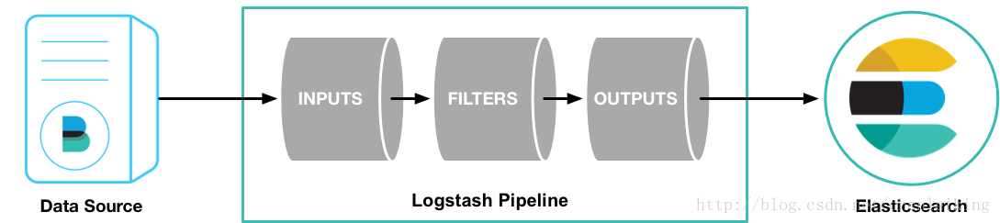
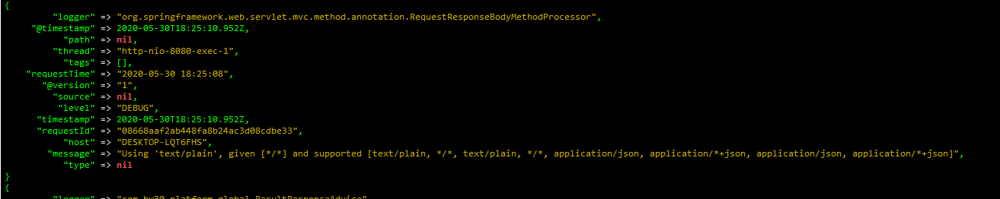
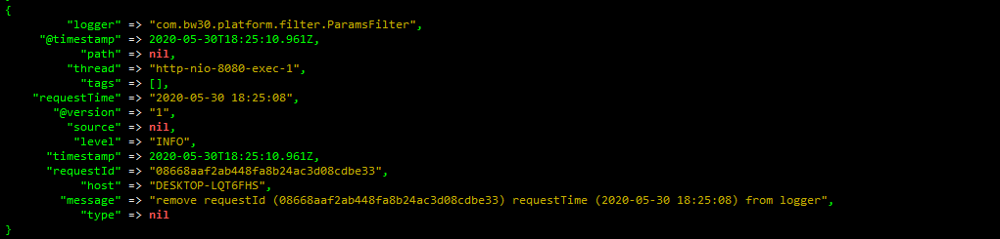
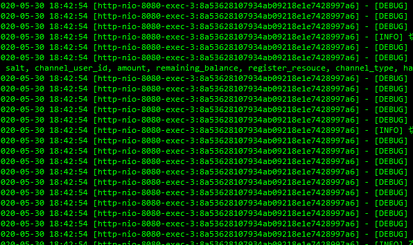

#### 1.需求产生的原因

- 服务集群下日志分散 不便于查询和定位问题
- 统一保存和归档

#### 2.logstash

- [官网地址](https://www.elastic.co/cn/logstash)

- 简介

  logstash是一个数据分析软件，主要目的是分析log日志。整一套软件可以当作一个MVC模型，logstash是controller层，Elasticsearch是一个model层，kibana是view层。首先将数据传给logstash，它将数据进行过滤和格式化（转成JSON格式），然后传给Elasticsearch进行存储、建搜索的索引，kibana提供前端的页面再进行搜索和图表可视化，它是调用Elasticsearch的接口返回的数据进行可视化。logstash和Elasticsearch是用Java写的，kibana使用node.js框架。

- 架构

  

- 应用场景

  Logstash最常用于ELK（Elastic Stack+ logstash + kibana）中作为日志收集器使用

#### 3.实际使用

- [前提 已经安装好了redis并配置端口密码](http://www.tianch.xyz/archives/linux%E7%BC%96%E8%AF%91%E5%AE%89%E8%A3%85redis)

- 下载并解压

  ```shell
  mkdir -p /opt/logstash
  cd /opt/logstash
  wget https://artifacts.elastic.co/downloads/logstash/logstash-7.7.0.tar.gz
  tar -xvf logstash-7.7.0.tar.gz
  ```

- 配置

  ```shell
  cd /opt/logstash/logstash-7.7.0/config
  cp logstash-sample.conf my-logstash.conf
  vim my-logstash.conf
  ```

  - my-logstash.conf

    [logstash最佳实践](http://doc.yonyoucloud.com/doc/logstash-best-practice-cn/get_start/full_config.html)

    ```shell
    input {
            redis {
                    data_type => "list"
                    key => "logstash-list"
                    host => "172.16.10.68"
                    port => "6379"
                    password => "12346"
                    batch_count => 100
                    threads => 1
            }
    }

    filter {
         ruby {
           code => "event.set('timestamp', event.get('@timestamp').time.localtime + 8*60*60)"
         }
         ruby {
           code => "event.set('@timestamp',event.get('timestamp'))"
         }
        if [message] == "Completed 200 OK" {
            drop {}
        }
    }

    output {
        file{
            path => "/opt/elk/logstash-7.1.1/logs/%{+yyyy}-%{+MM}-%{+dd}.log"
            codec => line { format => "%{+yyyy}-%{+MM}-%{+dd} %{+HH}:%{+mm}:%{+ss} [%{thread}:%{requestId}] - [%{level}] %{message}"}
        }
        	#这句话的意思是窗口输出内容 项目中要注释掉
            stdout {codec => rubydebug}
    }
    ```

  - logback.xml

    ```xml
    <?xml version="1.0" encoding="UTF-8"?>
    <configuration>
        <appender name="LOGSTASH" class="com.cwbase.logback.RedisAppender">
            <host>172.16.10.68</host>
            <port>6379</port>
            <password>123456</password>
            <key>logstash-list</key>
            <callerStackIndex>0</callerStackIndex>
            <additionalField>
                <key>requestId</key>
                <value>@{requestId}</value>
            </additionalField>
            <additionalField>
                <key>requestTime</key>
                <value>@{requestTime}</value>
            </additionalField>
        </appender>

        <appender name="ASYNC" class="ch.qos.logback.classic.AsyncAppender">
            <!-- 不丢失日志.默认的,如果队列的80%已满,则会丢弃TRACT、DEBUG、INFO级别的日志 -->
            <discardingThreshold>0</discardingThreshold>
            <!-- 更改默认的队列的深度,该值会影响性能.默认值为256 -->
            <queueSize>5120</queueSize>
            <appender-ref ref="LOGSTASH"/>
        </appender>

        <appender name="stdout" class="ch.qos.logback.core.ConsoleAppender">
            <Target>System.out</Target>
            <encoder>
                <pattern>%d{yyyy-MM-dd HH:mm:ss} [ %t:%r ] [%X{requestId}] - [ %p ] %m%n</pattern>
            </encoder>
        </appender>
        <root level="INFO">
            <appender-ref ref="ASYNC"/>
        </root>
    </configuration>

    ```

- 启动
  - 正常启动测试

    ```shell
    /opt/logstash/logstash-7.7.0/bin/logstash -f /opt/logstash/logstash-7.7.0/config/my-logstash.conf
    ```

  - 启动项目 并调用接口

  - 效果图

    

    

  - nohup 后台启动
    - 编写启动脚本文件 写入下面的内容

      ```shell
      vim /opt/logstash/logstash-7.7.0/runLogstash.sh
      ```

      ```shell
      nohup /opt/logstash/logstash-7.7.0/bin/logstash -f /opt/logstash/logstash-7.7.0/config/my-logstash.conf >/dev/null
      ```

      ```shell
      chmod 755 /opt/logstash/logstash-7.7.0/runLogstash.sh
      ```

    - 运行脚本

      ```shell
      cd /opt/logstash/logstash-7.7.0
      ./runLogstash.sh
      ```

    - 查看输出文件

    

