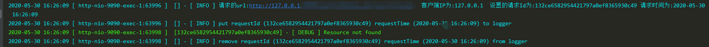

#### 1.MDC

MDC为“Mapped Diagnostic Context”（映射诊断上下文），即将一些运行时的上下文数据通过logback打印出来；此时我们需要借助org.sl4j.MDC类。

MDC类基本原理其实非常简单，其内部持有一个InheritableThreadLocal实例，用于保存context数据，MDC提供了put/get/remove等几个核心接口，用于操作ThreadLocal中的数据；ThreadLocal中的K-V，可以在logback.xml中声明，最终将会打印在日志中。

在使用MDC时需要注意一些问题，这些问题通常也是ThreadLocal引起的，比如我们需要在线程退出之前清除（clear）MDC中的数据；在线程池中使用MDC时，那么需要在子线程退出之前清除数据；可以调用MDC.remove()方法

#### 2.使用

- SpringBoot默认日志组件就是logback，无需导入jar包

- logback.xml配置 主要是 %X{requestId}

  ```xml
  <?xml version="1.0" encoding="UTF-8"?>
  <configuration>
      <!--日志文件轮询 每天一个日志文件-->
      <appender name="File" class="ch.qos.logback.core.rolling.RollingFileAppender">
          <Append>true</Append>
          <File>../logs/platform_logs/platformHome-api.log</File>
          <encoder>
              <pattern>%d{yyyy-MM-dd HH:mm:ss} [ %t:%r ] [%X{requestId}] - [ %p ] %m%n</pattern>
          </encoder>
          <rollingPolicy class="ch.qos.logback.core.rolling.TimeBasedRollingPolicy">
              <fileNamePattern>../logs/xxxxxxx.log.%d{-yyyy-MM-dd}</fileNamePattern>
          </rollingPolicy>
      </appender>

      <!--本地控制台输出-->
      <appender name="Console" class="ch.qos.logback.core.ConsoleAppender">
          <Target>System.out</Target>
          <encoder>
              <pattern>%d{yyyy-MM-dd HH:mm:ss} [ %t:%r ] [%X{requestId}] - [ %p ] %m%n</pattern>
          </encoder>
      </appender>

      <root level="INFO">
          <appender-ref ref="File"/>
          <appender-ref ref="Console"/>
      </root>
  </configuration>
  ```

- 拦截器

  ```java
  @Slf4j
  public class LogInterceptor implements HandlerInterceptor {


      private final static String REQUEST_ID = "requestId";

      private final static String REQUEST_TIME = "requestTime";

      @Override
      public boolean preHandle(HttpServletRequest httpServletRequest, HttpServletResponse httpServletResponse, Object o) {
          String ipAddress = IPAddressUtils.getIPAddress(httpServletRequest);
          String url = httpServletRequest.getRequestURL().toString();
          SimpleDateFormat sdf = new SimpleDateFormat("yyyy-MM-dd HH:mm:ss");
          String requestTime = sdf.format(new Date());
          String uuid = UUID.randomUUID().toString().replaceAll("-", "");
          log.info("请求的url:{}  客户端IP为:{}  设置的请求Id为:{} 请求时间为:{}", url, ipAddress, uuid, requestTime);
          log.info("put requestId ({}) requestTime ({}) to logger", uuid, requestTime);
          MDC.put(REQUEST_ID, uuid);
          MDC.put(REQUEST_TIME, requestTime);
          return true;
      }

      @Override
      public void postHandle(HttpServletRequest httpServletRequest, HttpServletResponse httpServletResponse, Object o, ModelAndView modelAndView) {
          String uuid = MDC.get(REQUEST_ID);
          String requestTime = MDC.get(REQUEST_TIME);
          MDC.remove(REQUEST_ID);
          MDC.remove(REQUEST_TIME);
          log.info("remove requestId ({}) requestTime ({}) from logger", uuid, requestTime);
      }

      @Override
      public void afterCompletion(HttpServletRequest httpServletRequest, HttpServletResponse httpServletResponse, Object o, Exception e) {
      }
  }
  ```

- 注册拦截器

  ```java
  @Configuration
  public class WebMvcConfig implements WebMvcConfigurer {

      @Override
      public void addInterceptors(InterceptorRegistry registry) {
          registry.addInterceptor(logInterceptor());

      }

      @Bean
      public LogInterceptor logInterceptor() {
          return new LogInterceptor();
      }
  }
  ```

#### 3.效果



​

