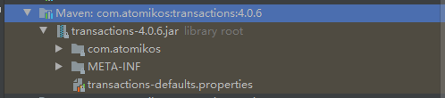

#### 1.应用场景

- 多库既多个数据源
- 读写分离和多数据切换

#### 2.主要依赖

- SpringBoot2.X
- mysql5.7
- mysql驱动：我用的8.0.11 其它版本自行尝试
- druid:1.1.20
- mybatis plus

```xml
<dependency>
    <groupId>org.springframework.boot</groupId>
    <artifactId>spring-boot-starter-web</artifactId>
</dependency>

<!--Mybatis Plus-->
<dependency>
    <groupId>com.baomidou</groupId>
    <artifactId>mybatis-plus-boot-starter</artifactId>
    <version>3.3.1</version>
</dependency>


<!--多数据源事务-->
<dependency>
    <groupId>org.springframework.boot</groupId>
    <artifactId>spring-boot-starter-jta-atomikos</artifactId>
</dependency>

<!--阿里巴巴druid数据源-->
<dependency>
    <groupId>com.alibaba</groupId>
    <artifactId>druid-spring-boot-starter</artifactId>
    <version>1.1.20</version>
</dependency>

<!--AOP-->
<dependency>
    <groupId>org.springframework.boot</groupId>
    <artifactId>spring-boot-starter-aop</artifactId>
</dependency>

<!-- mysql driver-->
<dependency>
    <groupId>mysql</groupId>
    <artifactId>mysql-connector-java</artifactId>
    <version>8.0.11</version>
</dependency>
```

#### 3.配置数据源

- 配置文件

  ```properties
  spring.datasource.druid.user.master.driver-class-name = com.mysql.cj.jdbc.Driver
  spring.datasource.druid.user.master.initialSize = 5
  spring.datasource.druid.user.master.maxActive = 100
  spring.datasource.druid.user.master.maxPoolPreparedStatementPerConnectionSize = 20
  spring.datasource.druid.user.master.maxWait = 60000
  spring.datasource.druid.user.master.minEvictableIdleTimeMillis = 300000
  spring.datasource.druid.user.master.minIdle = 5
  spring.datasource.druid.user.master.password = root
  spring.datasource.druid.user.master.poolPreparedStatements = true
  spring.datasource.druid.user.master.remove-abandoned-timeout = 1800
  spring.datasource.druid.user.master.testOnBorrow = false
  spring.datasource.druid.user.master.testOnReturn = false
  spring.datasource.druid.user.master.testWhileIdle = true
  spring.datasource.druid.user.master.timeBetweenEvictionRunsMillis = 60000
  spring.datasource.druid.user.master.url = jdbc:mysql://172.16.10.62:3306/user?useUnicode=true&characterEncoding=utf8&autoReconnect=true&useAffectedRows=true&useSSL=false&serverTimezone=Asia/Shanghai
  spring.datasource.druid.user.master.username = root
  spring.datasource.druid.user.master.validationQuery = SELECT 1
  spring.datasource.druid.user.master.validationQueryTimeout = 10000
  spring.datasource.druid.user.slave.driver-class-name = com.mysql.cj.jdbc.Driver
  spring.datasource.druid.user.slave.initialSize = 5
  spring.datasource.druid.user.slave.maxActive = 100
  spring.datasource.druid.user.slave.maxPoolPreparedStatementPerConnectionSize = 20
  spring.datasource.druid.user.slave.maxWait = 60000
  spring.datasource.druid.user.slave.minEvictableIdleTimeMillis = 300000
  spring.datasource.druid.user.slave.minIdle = 5
  spring.datasource.druid.user.slave.password = root
  spring.datasource.druid.user.slave.poolPreparedStatements = true
  spring.datasource.druid.user.slave.remove-abandoned-timeout = 1800
  spring.datasource.druid.user.slave.testOnBorrow = false
  spring.datasource.druid.user.slave.testOnReturn = false
  spring.datasource.druid.user.slave.testWhileIdle = true
  spring.datasource.druid.user.slave.timeBetweenEvictionRunsMillis = 60000
  spring.datasource.druid.user.slave.url = jdbc:mysql://172.16.10.62:3306/user?useUnicode=true&characterEncoding=utf8&autoReconnect=true&useAffectedRows=true&useSSL=false&serverTimezone=Asia/Shanghai
  spring.datasource.druid.user.slave.username = root
  spring.datasource.druid.user.slave.validationQuery = SELECT 1
  spring.datasource.druid.user.slave.validationQueryTimeout = 10000
  spring.datasource.druid.product.master.driver-class-name = com.mysql.cj.jdbc.Driver
  spring.datasource.druid.product.master.initialSize = 5
  spring.datasource.druid.product.master.maxActive = 100
  spring.datasource.druid.product.master.maxPoolPreparedStatementPerConnectionSize = 20
  spring.datasource.druid.product.master.maxWait = 60000
  spring.datasource.druid.product.master.minEvictableIdleTimeMillis = 300000
  spring.datasource.druid.product.master.minIdle = 5
  spring.datasource.druid.product.master.password = root
  spring.datasource.druid.product.master.poolPreparedStatements = true
  spring.datasource.druid.product.master.remove-abandoned-timeout = 1800
  spring.datasource.druid.product.master.testOnBorrow = false
  spring.datasource.druid.product.master.testOnReturn = false
  spring.datasource.druid.product.master.testWhileIdle = true
  spring.datasource.druid.product.master.timeBetweenEvictionRunsMillis = 60000
  spring.datasource.druid.product.master.url = jdbc:mysql://172.16.10.62:3306/product?useUnicode=true&characterEncoding=utf8&autoReconnect=true&useAffectedRows=true&useSSL=false&serverTimezone=Asia/Shanghai
  spring.datasource.druid.product.master.username = root
  spring.datasource.druid.product.master.validationQuery = SELECT 1
  spring.datasource.druid.product.master.validationQueryTimeout = 10000
  spring.datasource.druid.product.slave.driver-class-name = com.mysql.cj.jdbc.Driver
  spring.datasource.druid.product.slave.initialSize = 5
  spring.datasource.druid.product.slave.maxActive = 100
  spring.datasource.druid.product.slave.maxPoolPreparedStatementPerConnectionSize = 20
  spring.datasource.druid.product.slave.maxWait = 60000
  spring.datasource.druid.product.slave.minEvictableIdleTimeMillis = 300000
  spring.datasource.druid.product.slave.minIdle = 5
  spring.datasource.druid.product.slave.password = root
  spring.datasource.druid.product.slave.poolPreparedStatements = true
  spring.datasource.druid.product.slave.remove-abandoned-timeout = 1800
  spring.datasource.druid.product.slave.testOnBorrow = false
  spring.datasource.druid.product.slave.testOnReturn = false
  spring.datasource.druid.product.slave.testWhileIdle = true
  spring.datasource.druid.product.slave.timeBetweenEvictionRunsMillis = 60000
  spring.datasource.druid.product.slave.url = jdbc:mysql://172.16.10.62:3306/product?useUnicode=true&characterEncoding=utf8&autoReconnect=true&useAffectedRows=true&useSSL=false&serverTimezone=Asia/Shanghai
  spring.datasource.druid.product.slave.username = root
  spring.datasource.druid.product.slave.validationQuery = SELECT 1
  spring.datasource.druid.product.slave.validationQueryTimeout = 10000
  spring.datasource.type = com.alibaba.druid.pool.xa.DruidXADataSource
  ```

- DynamicDataSource

  ```java
  public class DynamicDataSource extends AbstractRoutingDataSource {

      private static final ThreadLocal<String> contextHolder = new ThreadLocal<>();

      public DynamicDataSource(DataSource defaultTargetDataSource, Map<Object, Object> targetDataSources) {
          super.setDefaultTargetDataSource(defaultTargetDataSource);
          super.setTargetDataSources(targetDataSources);
          super.afterPropertiesSet();
      }

      @Override
      protected Object determineCurrentLookupKey() {
          return getDataSource();
      }

      public static void setDataSource(String dataSource) {
          contextHolder.set(dataSource);
      }

      public static String getDataSource() {
          return contextHolder.get();
      }

      public static void clearDataSource() {
          contextHolder.remove();
      }

  }
  ```

- DynamicDataSourceConfig

  ```java
  @Configuration
  public class DynamicDataSourceConfig {

      @Value("${spring.datasource.type}")
      String xaDataSourceClassName;

      @Bean
      @ConfigurationProperties("spring.datasource.druid.user.master")
      public DruidXADataSource userMasterDruidDataSource() {
          return new DruidXADataSource();
      }

      @Bean
      @ConfigurationProperties("spring.datasource.druid.product.master")
      public DruidXADataSource productMasterDruidDataSource() {
          return new DruidXADataSource();
      }

      @Bean
      @ConfigurationProperties("spring.datasource.druid.user.slave")
      public DruidXADataSource userSlaveDruidDataSource() {
          return new DruidXADataSource();
      }

      @Bean
      @ConfigurationProperties("spring.datasource.druid.product.slave")
      public DruidXADataSource productSlaveDruidDataSource() {
          return new DruidXADataSource();
      }


      @Bean(name = "userMasterDataSource")
      public DataSource userMasterDataSource(DruidXADataSource userMasterDruidDataSource) {
          return getXaDataSource(userMasterDruidDataSource, "userMasterDruidDataSource");
      }

      @Bean(name = "productMasterDataSource")
      public DataSource orderMasterDataSource(DruidXADataSource productMasterDruidDataSource) {
          return getXaDataSource(productMasterDruidDataSource, "productMasterDruidDataSource");
      }

      @Bean(name = "userSlaveDataSource")
      public DataSource userSlaveDataSource(DruidXADataSource userSlaveDruidDataSource) {
          return getXaDataSource(userSlaveDruidDataSource, "userSlaveDruidDataSource");
      }

      @Bean(name = "productSlaveDataSource")
      public DataSource orderSlaveDataSource(DruidXADataSource productSlaveDruidDataSource) {
          return getXaDataSource(productSlaveDruidDataSource, "productSlaveDruidDataSource");
      }


      @Bean(name = "dynamicDataSource")
      @DependsOn({"transactionManager"})
      public DynamicDataSource dataSource(@Qualifier("userMasterDataSource") DataSource userMasterDataSource,
                                          @Qualifier("productMasterDataSource") DataSource productMasterDataSource,
                                          @Qualifier("userSlaveDataSource") DataSource userSlaveDataSource,
                                          @Qualifier("productSlaveDataSource") DataSource productSlaveDataSource) {
          Map<Object, Object> targetDataSources = new HashMap<>();
          String MASTER_SUFFIX = "Master";
          targetDataSources.put(DataSourceKey.USER + MASTER_SUFFIX, userMasterDataSource);
          targetDataSources.put(DataSourceKey.PRODUCT + MASTER_SUFFIX, productMasterDataSource);
          String SLAVE_SUFFIX = "Slave";
          targetDataSources.put(DataSourceKey.USER + SLAVE_SUFFIX, userSlaveDataSource);
          targetDataSources.put(DataSourceKey.PRODUCT + SLAVE_SUFFIX, productSlaveDataSource);
          return new DynamicDataSource(userMasterDataSource, targetDataSources);
      }

      @Bean(name = "sqlSessionFactory")
      public SqlSessionFactory sqlSessionFactory(@Qualifier("dynamicDataSource") DataSource dataSource) throws Exception {
          MybatisSqlSessionFactoryBean sqlSessionFactoryBean = new MybatisSqlSessionFactoryBean();
          sqlSessionFactoryBean.setDataSource(dataSource);
          return sqlSessionFactoryBean.getObject();
      }

      @Bean(name = "sqlSessionTemplate")
      public SqlSessionTemplate sqlSessionTemplate(@Qualifier("sqlSessionFactory") SqlSessionFactory sqlSessionFactory) {
          return new SqlSessionTemplate(sqlSessionFactory);
      }

      /**
       * 分布式事务使用JTA管理，
       * 不管有多少个数据源只要配置一个 JtaTransactionManager
       */

      @Bean
      public TransactionManager atomikosTransactionManager() {
          UserTransactionManager userTransactionManager = new UserTransactionManager();
          userTransactionManager.setForceShutdown(true);
          return userTransactionManager;
      }

      @Bean(name = "userTransaction")
      public UserTransaction userTransaction() throws Throwable {
          UserTransactionImp userTransactionImp = new UserTransactionImp();
          userTransactionImp.setTransactionTimeout(10000);
          return userTransactionImp;
      }

      @Bean(name = "transactionManager")
      @DependsOn({"userTransaction", "atomikosTransactionManager"})
      public PlatformTransactionManager transactionManager() throws Throwable {
          JtaTransactionManager jtaTransactionManager = new JtaTransactionManager(userTransaction(), atomikosTransactionManager());
          jtaTransactionManager.setAllowCustomIsolationLevels(true);
          jtaTransactionManager.setDefaultTimeout(30);
          return jtaTransactionManager;
      }

      public DataSource getXaDataSource(DruidXADataSource druidXADataSource, String resourceName) {
          AtomikosDataSourceBean xaDataSource = new AtomikosDataSourceBean();
          xaDataSource.setXaDataSource(druidXADataSource);
          xaDataSource.setXaDataSourceClassName(xaDataSourceClassName);
          xaDataSource.setUniqueResourceName(resourceName);
          xaDataSource.setMinPoolSize(10);
          xaDataSource.setMaxPoolSize(20000);
          xaDataSource.setBorrowConnectionTimeout(60);
          xaDataSource.setTestQuery("SELECT 1");
          return xaDataSource;
      }

  }
  ```

- TransactionConfig 使用申明式事务

  ```java
  @Aspect
  @Configuration
  public class TransactionConfig {

      private static final String AOP_POINTCUT_EXPRESSION = "execution(* com.xxx.xxxx.service.*.*(..))";

      @Autowired
      private TransactionManager transactionManager;

      @Bean
      public TransactionInterceptor txAdvice() {
          NameMatchTransactionAttributeSource source = new NameMatchTransactionAttributeSource();
          /*只读事务，不做更新操作*/
          RuleBasedTransactionAttribute readOnlyTx = new RuleBasedTransactionAttribute();
          readOnlyTx.setReadOnly(true);
          readOnlyTx.setPropagationBehavior(TransactionDefinition.PROPAGATION_NOT_SUPPORTED);
          /*当前存在事务就使用当前事务，当前不存在事务就创建一个新的事务*/
          RuleBasedTransactionAttribute requiredTx = new RuleBasedTransactionAttribute();
          requiredTx.setRollbackRules(
                  Collections.singletonList(new RollbackRuleAttribute(Exception.class)));
          requiredTx.setPropagationBehavior(TransactionDefinition.PROPAGATION_REQUIRED);
          Map<String, TransactionAttribute> txMap = new HashMap<>();
          txMap.put("get*", readOnlyTx);
          txMap.put("select*", readOnlyTx);
          txMap.put("find*", readOnlyTx);
          txMap.put("query*", readOnlyTx);
          txMap.put("search*", readOnlyTx);
          txMap.put("count*", readOnlyTx);
          txMap.put("list*", readOnlyTx);
          txMap.put("add*", requiredTx);
          txMap.put("save*", requiredTx);
          txMap.put("insert*", requiredTx);
          txMap.put("update*", requiredTx);
          txMap.put("delete*", requiredTx);
          txMap.put("existTable", readOnlyTx);
          txMap.put("*", requiredTx);
          source.setNameMap(txMap);
          TransactionInterceptor txAdvice = new TransactionInterceptor(transactionManager, source);
          return txAdvice;
      }

      @Bean
      public Advisor txAdviceAdvisor() {
          AspectJExpressionPointcut pointcut = new AspectJExpressionPointcut();
          pointcut.setExpression(AOP_POINTCUT_EXPRESSION);
          return new DefaultPointcutAdvisor(pointcut, txAdvice());
      }
  }
  ```

- DataSourceKey

  ```java
  public interface DataSourceKey {

      String USER = "user";

      String ORDER = "product";

  }

  ```

- DS 注解（同MP动态数据源重名 有致敬的意思）

  ```java
  @Target({ElementType.METHOD, ElementType.TYPE})
  @Retention(RetentionPolicy.RUNTIME)
  public @interface DS {
      String value() default "";
  }
  ```

- DBAspect 最为父切入点 切入点是DS注解

  ```java
  @Slf4j
  public class DBAspect {

      private final String MASTER_SUFFIX = "Master";

      private final String SLAVE_SUFFIX = "Slave";

      private final String[] methodArray = {"select", "find", "get", "query", "search", "list", "count"};

      @Pointcut("@annotation(com.xxx.xxxx.annotation.DS)")
      protected void dataSourcePointCut() {

      }


      @Around("dataSourcePointCut()")
      public Object around(ProceedingJoinPoint point) throws Throwable {
          String methodName = point.getSignature().getName();
          boolean readOnly = false;
          for (String methodPrefix : methodArray) {
              if (methodName.startsWith(methodPrefix)) {
                  readOnly = true;
                  break;
              }
          }
          String dataSourceName = determineDatasource(point);
          if (StringUtils.isBlank(dataSourceName)) {
              log.info("设置为默认数据源：{}", DataSourceKey.USER);
              DynamicDataSource.setDataSource(DataSourceKey.USER);
          } else {
              if (readOnly) {
                  if (DataSourceKey.PRODUCT.equals(dataSourceName)) {
                      log.info("切换到{}数据源", DataSourceKey.PRODUCT + SLAVE_SUFFIX);
                      DynamicDataSource.setDataSource(DataSourceKey.PRODUCT + SLAVE_SUFFIX);
                  } else {
                      log.info("切换到{}数据源", DataSourceKey.USER + SLAVE_SUFFIX);
                      DynamicDataSource.setDataSource(DataSourceKey.USER + SLAVE_SUFFIX);
                  }
              } else {
                  if (DataSourceKey.PRODUCT.equals(dataSourceName)) {
                      log.info("切换到{}数据源", DataSourceKey.PRODUCT + MASTER_SUFFIX);
                      DynamicDataSource.setDataSource(DataSourceKey.PRODUCT + MASTER_SUFFIX);
                  } else {
                      log.info("切换到{}数据源", DataSourceKey.USER + MASTER_SUFFIX);
                      DynamicDataSource.setDataSource(DataSourceKey.USER + MASTER_SUFFIX);
                  }
              }
          }
          return point.proceed();
      }

      private String determineDatasource(ProceedingJoinPoint point) {
          String methodName = point.getSignature().getName();
          Class targetClass = point.getSignature().getDeclaringType();
          String dataSourceForTargetClass = resolveDataSourceFromClass(point);
          String dataSourceForTargetMethod = resolveDataSourceFromMethod(targetClass, methodName);
          String resultDS = determinateDataSource(dataSourceForTargetClass, dataSourceForTargetMethod);
          return resultDS;
      }

      private String resolveDataSourceFromClass(ProceedingJoinPoint point) {
          //获取当前类上的注解
          DS classAnnotation = (DS) ((Class) AopUtils.getTargetClass(point.getTarget()).getGenericInterfaces()[0]).getAnnotation(DS.class);
          return null != classAnnotation ? resolveDataSourceName(classAnnotation) : null;
      }

      private String resolveDataSourceFromMethod(Class targetClass, String methodName) {
          Method m = findUniqueMethod(targetClass, methodName);
          if (m != null) {
              DS choDs = m.getAnnotation(DS.class);
              return resolveDataSourceName(choDs);
          }
          return null;
      }

      private String resolveDataSourceName(DS ds) {
          return ds == null ? null : ds.value();
      }

      private String determinateDataSource(String classDS, String methodDS) {
          return methodDS == null ? classDS : methodDS;
      }


      @After("dataSourcePointCut()")
      public void restoreActivityDataSource(JoinPoint point) {
          DynamicDataSource.clearDataSource();
      }

      private static Method findUniqueMethod(Class<?> clazz, String name) {
          Class<?> searchType = clazz;
          while (searchType != null) {
              Method[] methods = (searchType.isInterface() ? searchType.getMethods() : searchType.getDeclaredMethods());
              for (Method method : methods) {
                  if (name.equals(method.getName())) {
                      return method;
                  }
              }
              searchType = searchType.getSuperclass();
          }
          return null;
      }
  }
  ```

- DataSourceAspect DAO层切入点
  - 需要继承DBAspect 原因：因为在使用MP的的BaseMapper的接口时 这一个注解无法获取调用接口的方法名

  ```java
  @Aspect
  @Component
  public class DataSourceAspect extends DBAspect {
      /**
       * 对于多数据源 需要重写才能切入
       */

      @Pointcut("execution(* com.xxx.xxxx.mapper.*.*(..))")
      @Override
      protected void dataSourcePointCut() {
          super.dataSourcePointCut();
      }
  }
  ```

- 修改Atomikos配置文件

  
  - 从这个包里复制一份出来放到resources文件夹下 修改三处位置

    ```properties
    #屏蔽日志输出
    com.atomikos.icatch.enable_logging=false
    #超时时间 默认10秒
    com.atomikos.icatch.default_jta_timeout=120000
    # 最大活动数 默认50太小 也就是只支持50并发
    com.atomikos.icatch.max_actives=5000
    ```

