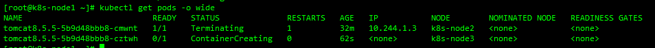
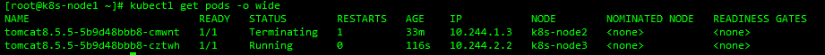
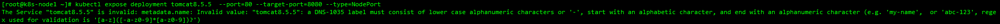
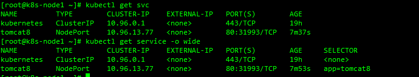

1. 部署一个tomcat

   ```shell
   kubectl create deployment tomcat8.5 --image=tomcat:8.5-jdk8

   #获取到tomcat信息
   kubectl get pods -o wide

   #查看所有
   kubectl get all

   #查看更详细信息
   kubectl get all -o wide
   ```

   - 模拟停掉:会自动再拉起一个新的服务

   - 模拟宕机:在另一个node会再拉起一个新的服务

     

     一段时间后

     

2. 暴露服务

   ```shell
   #这个暴露不了 原因在下面
   kubectl expose deployment tomcat8.5 --port=80 --target-port=8080 --type=NodePort
   ```

   ```shell
   --port:访问pod的端口
   --target-port:容器暴露的端口
   --type:将pod作为service暴露的模式
   pod的80映射容器的8080 service代理容器的80
   ```

   错误解决

   

   `意思是tomcat8.5是无效的名字 标签必须由小写字母数字字符或“-”组成，以字母字符开头，以字母数字字符结尾（例如，“我的名字”或“abc-123”，用于验证的regex是“[a-z]（[-a-z0-9]*[a-z0-9]）`

   ```shell
   #重新创建一个新的符合service名称规范的deployment
   kubectl create deployment tomcat8 --image=tomcat:8.5-jdk8
   ```

   ```shell
   #重新暴露服务
   kubectl expose deployment tomcat8  --port=80 --target-port=8080 --type=NodePort
   ```

3. 查看暴露的service

   ```shell
   #简写
   kubectl get svc -o wide
   #全写
   kubectl get service -o wide
   ```

   
   - 访问暴露的端口(此处为31993 此tomcat8容器访问会报404 需要进入容器将webapps.dist下的内容复制一份到webapps)

4. 扩容和删除

   ```shell
   kubectl scale --replicas=3 deployment tomcat8
   ```

   ```shell
   kubectl get all

   kubectl delete deployment.apps/tomcat8

   kubectl delete service/tomcat8
   ```

