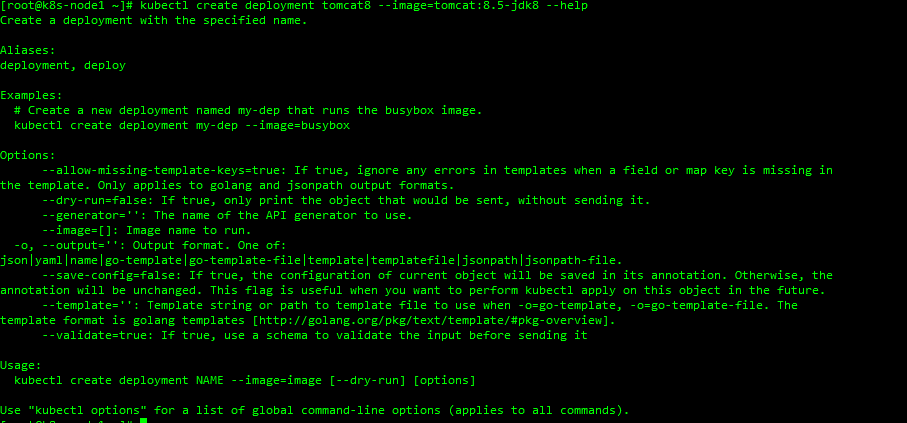
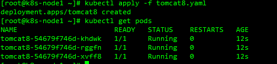
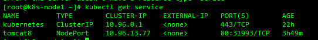
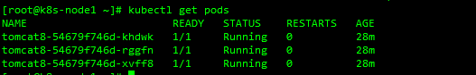

#### [kubernetes官网命令行介绍](https://kubernetes.io/zh/docs/reference/kubectl/overview/)

### 使用yaml创建一次部署

1. 使用 --help查看部署帮助

   ```shell
   kubectl create deployment tomcat8 --image=tomcat:8.5-jdk8 --help
   ```

   

   `--dry-run 尝试部署`

   `--o yaml 输出 YAML 格式的 API 对象`

2. 结合 --dry-run -o yaml 得到一个YAML格式的 API 对象

   ```shell
   kubectl create deployment tomcat8 --image=tomcat:8.5-jdk8 --dry-run -o yaml
   ```

   ```yaml
   apiVersion: apps/v1
   kind: Deployment
   metadata:
     creationTimestamp: null
     labels:
       app: tomcat8
     name: tomcat8
   spec:
     replicas: 1
     selector:
       matchLabels:
         app: tomcat8
     strategy: {}
     template:
       metadata:
         creationTimestamp: null
         labels:
           app: tomcat8
       spec:
         containers:
           - image: tomcat:8.5-jdk8
             name: tomcat
             resources: {}
   status: {}
   ```

3. 结合 --dry-run -o yaml 将得到一个YAML格式的 API 对象重定向输出到文件

   ```shell
   kubectl create deployment tomcat8 --image=tomcat:8.5-jdk8 --dry-run -o yaml > tomcat8.yaml
   ```

   修改精简 默认创建一个实例 改成3个

   ```yaml
   apiVersion: apps/v1
   kind: Deployment
   metadata:
     labels:
       app: tomcat8
     name: tomcat8
   spec:
     replicas: 3
     selector:
       matchLabels:
         app: tomcat8
     template:
       metadata:
         labels:
           app: tomcat8
       spec:
         containers:
           - image: tomcat:8.5-jdk8
             name: tomcat
   ```

4. 应用 tomcat8.yaml文件

   ```shell
   kubectl apply -f tomcat8.yaml
   ```

   

5. 得到service的yaml文件

   ```shell
   kubectl expose deployment tomcat8  --port=80 --target-port=8080 --type=NodePort --dry-run -o yaml > tomcat8-expose.yaml
   ```

   

6. 应用tomcat8-expose.yaml文件

   ```shell
   kubectl apply -f tomcat8-expose.yaml
   ```

7. 查看一个pod是怎么定义的

   ```shell
   kubectl get pods
   ```

   

   ```shell
   kubectl get pod tomcat8-54679f746d-khdwk -o yaml
   ```

   ```yaml
   apiVersion: v1
   kind: Pod
   metadata:
     creationTimestamp: "2020-06-01T06:28:23Z"
     generateName: tomcat8-54679f746d-
     labels:
       app: tomcat8
       pod-template-hash: 54679f746d
     name: tomcat8-54679f746d-khdwk
     namespace: default
     ownerReferences:
       - apiVersion: apps/v1
         blockOwnerDeletion: true
         controller: true
         kind: ReplicaSet
         name: tomcat8-54679f746d
         uid: 9d084d88-b48c-4042-bb94-6db399f38ab5
     resourceVersion: "194623"
     selfLink: /api/v1/namespaces/default/pods/tomcat8-54679f746d-khdwk
     uid: f91d3ee4-96bb-4d4f-86a5-a0ff479a3029
   spec:
     containers:
       - image: tomcat:8.5-jdk8
         imagePullPolicy: IfNotPresent
         name: tomcat
         resources: {}
         terminationMessagePath: /dev/termination-log
         terminationMessagePolicy: File
         volumeMounts:
           - mountPath: /var/run/secrets/kubernetes.io/serviceaccount
             name: default-token-rrc2f
             readOnly: true
     dnsPolicy: ClusterFirst
     enableServiceLinks: true
     nodeName: k8s-node3
     priority: 0
     restartPolicy: Always
     schedulerName: default-scheduler
     securityContext: {}
     serviceAccount: default
     serviceAccountName: default
     terminationGracePeriodSeconds: 30
     tolerations:
       - effect: NoExecute
         key: node.kubernetes.io/not-ready
         operator: Exists
         tolerationSeconds: 300
       - effect: NoExecute
         key: node.kubernetes.io/unreachable
         operator: Exists
         tolerationSeconds: 300
     volumes:
       - name: default-token-rrc2f
         secret:
           defaultMode: 420
           secretName: default-token-rrc2f
   status:
     conditions:
       - lastProbeTime: null
         lastTransitionTime: "2020-06-01T06:28:23Z"
         status: "True"
         type: Initialized
       - lastProbeTime: null
         lastTransitionTime: "2020-06-01T06:28:24Z"
         status: "True"
         type: Ready
       - lastProbeTime: null
         lastTransitionTime: "2020-06-01T06:28:24Z"
         status: "True"
         type: ContainersReady
       - lastProbeTime: null
         lastTransitionTime: "2020-06-01T06:28:23Z"
         status: "True"
         type: PodScheduled
     containerStatuses:
       - containerID: docker://b72526de852740b87745d97765187c16b900d73dd4475aba9bb5ca2f4fda6ef4
         image: tomcat:8.5-jdk8
         imageID: docker-pullable://tomcat@sha256:bb59f86923e098ad54f485853e8f8859e2243cfceae762cccc2e5460ab006237
         lastState: {}
         name: tomcat
         ready: true
         restartCount: 0
         started: true
         state:
           running:
             startedAt: "2020-06-01T06:28:24Z"
     hostIP: 172.16.10.69
     phase: Running
     podIP: 10.244.2.4
     podIPs:
       - ip: 10.244.2.4
     qosClass: BestEffort
     startTime: "2020-06-01T06:28:23Z"
   ```

8. 将部署和暴露合并 只需要用 `---` 隔开即可

   ```yaml
   apiVersion: apps/v1
   kind: Deployment
   metadata:
     labels:
       app: tomcat8
     name: tomcat8
   spec:
     replicas: 3
     selector:
       matchLabels:
         app: tomcat8
     template:
       metadata:
         labels:
           app: tomcat8
       spec:
         containers:
           - image: tomcat:8.5-jdk8
             name: tomcat
   ---
   apiVersion: v1
   kind: Service
   metadata:
     labels:
       app: tomcat8
     name: tomcat8
   spec:
     ports:
       - port: 80
         protocol: TCP
         targetPort: 8080
     selector:
       app: tomcat8
     type: NodePort
   ```

