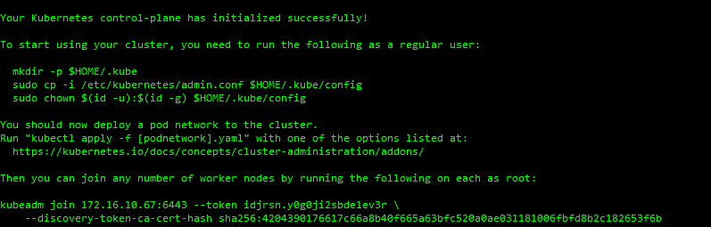
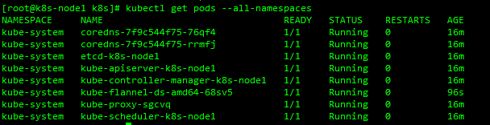
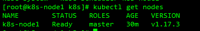
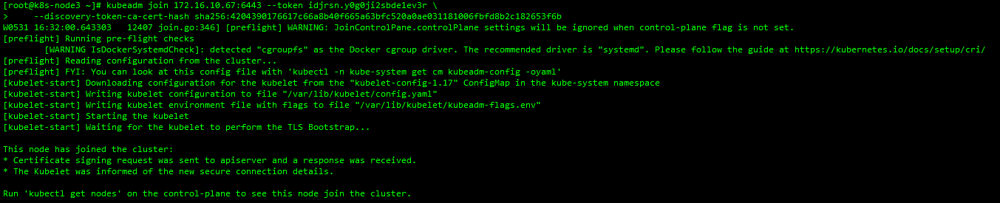
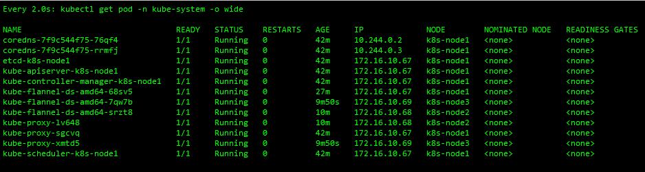

##### [Kubernetes官网](https://kubernetes.io/zh/)

#### 1.前置要求

- 3台Linux 搭建1个master节点和2个node节点
- 每台机器 2 GB 或更多的运行内存(少了可能起不来)
- 每台机器2CPU或以上
- 集群中的所有机器的网络彼此均能相互(能ping通)连接(公网和内网都可以)
- 节点之中不可以有重复的主机名、MAC 地址或 product_uuid
- 开启机器上的某些端口
- 禁用交换分区

#### 2.设置linux环境

- 关闭防火墙(开发时 生产环境请自定义规则)

  ```shell
  systemctl stop firewalld
  systemctl disable firewalld
  ```

- 关闭selinux

  ```shell
  #全局禁用
  sed -i 's/enforcing/disabled/' /etc/selinux/config
  #禁用当前会话
  setenforce 0
  ```

- 关闭swap 内存交换

  ```shell
  #关闭当前
  swapoff -a
  #全局禁用
  vim /etc/fstab
  #将带有swap的注释掉 wq保存
  #/dev/mapper/centos-swap swap    swap    defaults        0 0
  #验证 swap必须全为0  -m:兆单位 -g:吉单位
  free -m
  ```

- 设置主机名 不能是localhost

  ```shell
  #查看主机名
  hostname
  #设置主机名
  hostnamectl set-hostname 新主机名
  ```

- 添加主机名与IP的对应关系

  ```shell
  vim /etc/hosts
  ```

  ```shell
  172.16.10.67 k8s-node1
  172.16.10.68 k8s-node2
  172.16.10.69 k8s-node3
  ```

#### 3.安装(所有节点)

- 卸载之前的docker

  ```shell
  sudo yum remove docker \
  docker-client \
  docker-client-latest \
  docker-common \
  docker-latest \
  docker-latest-logrotate \
  docker-logrotate \
  docker-engine
  ```

- 安装docker的前置依赖

  ```shell
  yum install -y yum-utils device-mapper-persistent-data lvm2
  ```

- 设置docker的yun源

  ```shell
  sudo yum-config-manager \
  --add-repo \
  http://download.docker.com/linux/centos/docker-ce.repo
  ```

- 安装docker以及docker-ci

  ```shell
  sudo yum install -y docker-ce docker-ce-di containerd.io
  ```

- 配置docker加速

  ```shell
  sudo mkdir -p /etc/docker
  sudo tee /etc/docker/daemon.json <<-'EOF'
  {
    "registry-mirrors": ["https://akqgo94r.mirror.aliyuncs.com"]
  }
  EOF
  sudo systemctl daemon-reload
  sudo systemctl restart docker
  ```

- 设置开机启动

  ```shell
  systemctl enable docker
  ```

- 添加阿里yum源

  ```shell
  cat > /etc/yum.repos.d/kubernetes.repo << EOF
  [kubernetes]
  name=Kubernetes
  baseurl=https://mirrors.aliyun.com/kubernetes/yum/repos/kubernetes-el7-x86_64
  enabled=1
  gpgcheck=0
  repo_gpgcheck=0
  gpgkey=https://mirrors.aliyun.com/kubernetes/yum/doc/yum-key.gpg
  htsts://mirrors.aliyun.com/kubemnetes/yum/doc/rpm-package-key.gpg
  EOF
  ```

- 安装kubeadm、kubelet、kubectl

  ```shell
  #查看yum源  可以检测上一步配置的正确性
  yum list|grep kube
  #安装
  yum install -y kubelet-1.17.3 kubeadm-1.17.3 kubectl-1.17.3
  #启动kubelet和设置开机启动
  systemctl enable kubelet
  systemctl start kubelet
  ```

- 设置kubeadm、kubelet、kubectl镜像
  - 添加master_images.sh文件 赋予可执行权限

  ```shell
  #!/bin/bash

  images=(
  	kube-apiserver:v1.17.3
      kube-proxy:v1.17.3
  	kube-controller-manager:v1.17.3
  	kube-scheduler:v1.17.3
  	coredns:1.6.5
  	etcd:3.4.3-0
      pause:3.1
  )

  for imageName in ${images[@]} ; do
      docker pull registry.cn-hangzhou.aliyuncs.com/google_containers/$imageName
  done
  ```

- 初始化master apiserver-advertise-address地址是你自己master的地址

  ```shell
  kubeadm init \
  --apiserver-advertise-address=172.16.10.67 \
  --image-repository registry.cn-hangzhou.aliyuncs.com/google_containers \
  --kubernetes-version v1.17.3 \
  --service-cidr=10.96.0.0/16 \
  --pod-network-cidr=10.244.0.0/16
  ```

  - 错误解决

    `[preflight] Running pre-flight checks
[WARNING IsDockerSystemdCheck]: detected "cgroupfs" as the Docker cgroup driver. The recommended driver is "systemd". Please follow the guide at https://kubernetes.io/docs/setup/cri/
error execution phase preflight: [preflight] Some fatal errors occurred:
	[ERROR FileContent--proc-sys-net-bridge-bridge-nf-call-iptables]: /proc/sys/net/bridge/bridge-nf-call-iptables contents are not set to 1
[preflight] If you know what you are doing, you can make a check non-fatal with `--ignore-preflight-errors=...`
To see the stack trace of this error execute with --v=5 or higher`

    ```shell
    echo "1" >/proc/sys/net/bridge/bridge-nf-call-iptables
    ```

  

- 开始使用之前先按照提示执行几个命令

  ```shell
  mkdir -p $HOME/.kube
  sudo cp -i /etc/kubernetes/admin.conf $HOME/.kube/config
  sudo chown $(id -u):$(id -g) $HOME/.kube/config
  ```

- 安装网络插件(flannel)
  - 获取kube-flannel.yml 文件

    ```shell
    https://github.com/coreos/flannel/blob/master/Documentation/kube-flannel.yml
    ```

  - apply配置文件

    ```shell
    kubectl apply -f kube-flannel.yml
    ```

  - 查看pods 都要Running才行

    ```shell
    kubectl get pods --all-namespaces
    ```

    

- 查看主节点状态

  ```shell
  kubectl get nodes
  ```

  

- master节点Ready了 让其它节点加入

  ```shell
  kubeadm join 172.16.10.67:6443 --token idjrsn.y0g0ji2sbde1ev3r \
      --discovery-token-ca-cert-hash sha256:4204390176617c66a8b40f665a63bfc520a0ae031181006fbfd8b2c182653f6b
  ```

  
  - token过期解决 ttl 0为永不过期

    ```shell
    kubeadm token create --ttl 0 --print-join-command
    ```

- 监控pod进度

  ```shell
  watch kubectl get pod -n kube-system -o wide
  ```

  `全部Ready就安装完成了`

  

