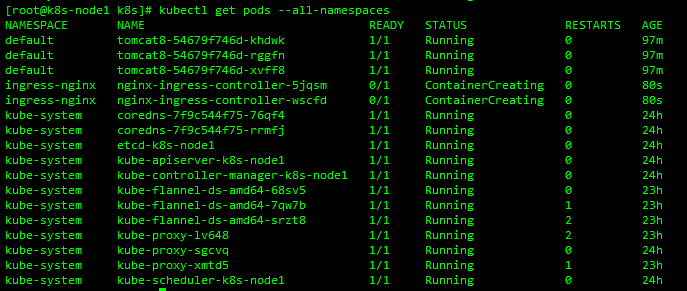
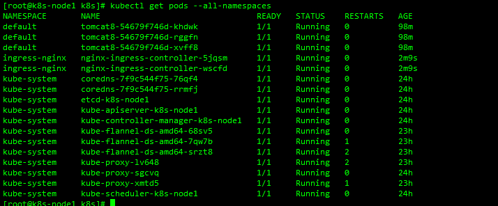

#### 1.Ingress 是什么？

底层是nginx

Ingress 是对集群中服务的外部访问进行管理的 API 对象，典型的访问方式是 HTTP。

Ingress 可以提供负载均衡、SSL 终结和基于名称的虚拟托管。

Ingress 公开了从集群外部到集群内 services 的 HTTP 和 HTTPS 路由。 流量路由由 Ingress 资源上定义的规则控制。

```none
    internet
        |
   [ Ingress ]
   --|-----|--
   [ Services ]
```

可以将 Ingress 配置为提供服务外部可访问的 URL、负载均衡流量、终止 SSL / TLS，以及提供基于名称的虚拟主机。Ingress 控制器 通常负责通过负载均衡器来实现 Ingress，尽管它也可以配置边缘路由器或其他前端来帮助处理流量。

Ingress 不会公开任意端口或协议。 将 HTTP 和 HTTPS 以外的服务公开到 Internet 时，通常使用 Service.Type=NodePort 或者 Service.Type=LoadBalancer 类型的服务

#### 2.Ingress解决的痛点

- 使用node的IP+service的端口才能访问到服务
- 域名的绑定

#### 3.部署Ingress-controller-yaml方式

- ingress-controller.yaml

  ```yaml
  apiVersion: v1
  kind: Namespace
  metadata:
    name: ingress-nginx
    labels:
      app.kubernetes.io/name: ingress-nginx
      app.kubernetes.io/part-of: ingress-nginx

  ---
  kind: ConfigMap
  apiVersion: v1
  metadata:
    name: nginx-configuration
    namespace: ingress-nginx
    labels:
      app.kubernetes.io/name: ingress-nginx
      app.kubernetes.io/part-of: ingress-nginx

  ---
  kind: ConfigMap
  apiVersion: v1
  metadata:
    name: tcp-services
    namespace: ingress-nginx
    labels:
      app.kubernetes.io/name: ingress-nginx
      app.kubernetes.io/part-of: ingress-nginx

  ---
  kind: ConfigMap
  apiVersion: v1
  metadata:
    name: udp-services
    namespace: ingress-nginx
    labels:
      app.kubernetes.io/name: ingress-nginx
      app.kubernetes.io/part-of: ingress-nginx

  ---
  apiVersion: v1
  kind: ServiceAccount
  metadata:
    name: nginx-ingress-serviceaccount
    namespace: ingress-nginx
    labels:
      app.kubernetes.io/name: ingress-nginx
      app.kubernetes.io/part-of: ingress-nginx

  ---
  apiVersion: rbac.authorization.k8s.io/v1beta1
  kind: ClusterRole
  metadata:
    name: nginx-ingress-clusterrole
    labels:
      app.kubernetes.io/name: ingress-nginx
      app.kubernetes.io/part-of: ingress-nginx
  rules:
    - apiGroups:
        - ""
      resources:
        - configmaps
        - endpoints
        - nodes
        - pods
        - secrets
      verbs:
        - list
        - watch
    - apiGroups:
        - ""
      resources:
        - nodes
      verbs:
        - get
    - apiGroups:
        - ""
      resources:
        - services
      verbs:
        - get
        - list
        - watch
    - apiGroups:
        - "extensions"
      resources:
        - ingresses
      verbs:
        - get
        - list
        - watch
    - apiGroups:
        - ""
      resources:
        - events
      verbs:
        - create
        - patch
    - apiGroups:
        - "extensions"
      resources:
        - ingresses/status
      verbs:
        - update

  ---
  apiVersion: rbac.authorization.k8s.io/v1beta1
  kind: Role
  metadata:
    name: nginx-ingress-role
    namespace: ingress-nginx
    labels:
      app.kubernetes.io/name: ingress-nginx
      app.kubernetes.io/part-of: ingress-nginx
  rules:
    - apiGroups:
        - ""
      resources:
        - configmaps
        - pods
        - secrets
        - namespaces
      verbs:
        - get
    - apiGroups:
        - ""
      resources:
        - configmaps
      resourceNames:
        # Defaults to "<election-id>-<ingress-class>"
        # Here: "<ingress-controller-leader>-<nginx>"
        # This has to be adapted if you change either parameter
        # when launching the nginx-ingress-controller.
        - "ingress-controller-leader-nginx"
      verbs:
        - get
        - update
    - apiGroups:
        - ""
      resources:
        - configmaps
      verbs:
        - create
    - apiGroups:
        - ""
      resources:
        - endpoints
      verbs:
        - get

  ---
  apiVersion: rbac.authorization.k8s.io/v1beta1
  kind: RoleBinding
  metadata:
    name: nginx-ingress-role-nisa-binding
    namespace: ingress-nginx
    labels:
      app.kubernetes.io/name: ingress-nginx
      app.kubernetes.io/part-of: ingress-nginx
  roleRef:
    apiGroup: rbac.authorization.k8s.io
    kind: Role
    name: nginx-ingress-role
  subjects:
    - kind: ServiceAccount
      name: nginx-ingress-serviceaccount
      namespace: ingress-nginx

  ---
  apiVersion: rbac.authorization.k8s.io/v1beta1
  kind: ClusterRoleBinding
  metadata:
    name: nginx-ingress-clusterrole-nisa-binding
    labels:
      app.kubernetes.io/name: ingress-nginx
      app.kubernetes.io/part-of: ingress-nginx
  roleRef:
    apiGroup: rbac.authorization.k8s.io
    kind: ClusterRole
    name: nginx-ingress-clusterrole
  subjects:
    - kind: ServiceAccount
      name: nginx-ingress-serviceaccount
      namespace: ingress-nginx

  ---
  apiVersion: apps/v1
  kind: DaemonSet
  metadata:
    name: nginx-ingress-controller
    namespace: ingress-nginx
    labels:
      app.kubernetes.io/name: ingress-nginx
      app.kubernetes.io/part-of: ingress-nginx
  spec:
    selector:
      matchLabels:
        app.kubernetes.io/name: ingress-nginx
        app.kubernetes.io/part-of: ingress-nginx
    template:
      metadata:
        labels:
          app.kubernetes.io/name: ingress-nginx
          app.kubernetes.io/part-of: ingress-nginx
        annotations:
          prometheus.io/port: "10254"
          prometheus.io/scrape: "true"
      spec:
        hostNetwork: true
        serviceAccountName: nginx-ingress-serviceaccount
        containers:
          - name: nginx-ingress-controller
            image: siriuszg/nginx-ingress-controller:0.20.0
            args:
              - /nginx-ingress-controller
              - --configmap=$(POD_NAMESPACE)/nginx-configuration
              - --tcp-services-configmap=$(POD_NAMESPACE)/tcp-services
              - --udp-services-configmap=$(POD_NAMESPACE)/udp-services
              - --publish-service=$(POD_NAMESPACE)/ingress-nginx
              - --annotations-prefix=nginx.ingress.kubernetes.io
            securityContext:
              allowPrivilegeEscalation: true
              capabilities:
                drop:
                  - ALL
                add:
                  - NET_BIND_SERVICE
              # www-data -> 33
              runAsUser: 33
            env:
              - name: POD_NAME
                valueFrom:
                  fieldRef:
                    fieldPath: metadata.name
              - name: POD_NAMESPACE
                valueFrom:
                  fieldRef:
                    fieldPath: metadata.namespace
            ports:
              - name: http
                containerPort: 80
              - name: https
                containerPort: 443
            livenessProbe:
              failureThreshold: 3
              httpGet:
                path: /healthz
                port: 10254
                scheme: HTTP
              initialDelaySeconds: 10
              periodSeconds: 10
              successThreshold: 1
              timeoutSeconds: 10
            readinessProbe:
              failureThreshold: 3
              httpGet:
                path: /healthz
                port: 10254
                scheme: HTTP
              periodSeconds: 10
              successThreshold: 1
              timeoutSeconds: 10

  ---
  apiVersion: v1
  kind: Service
  metadata:
    name: ingress-nginx
    namespace: ingress-nginx
  spec:
    #type: NodePort
    ports:
      - name: http
        port: 80
        targetPort: 80
        protocol: TCP
      - name: https
        port: 443
        targetPort: 443
        protocol: TCP
    selector:
      app.kubernetes.io/name: ingress-nginx
      app.kubernetes.io/part-of: ingress-nginx
  ```

- 部署

  ```shell
  kubectl apply -f ingress-controller.yaml
  ```

- 查看

  ```shell
  kubectl get pods --all-namespaces
  ```

  

  ​ 

#### 4.暴露一个ingress服务 使项目(tomcat8)支持域名访问

- 准备ingress-tomcat8.yaml

  servicePort: 80 是之前pods的端口

  ```shell
  apiVersion: extensions/v1beta1
  kind: Ingress
  metadata:
    name: web
  spec:
    rules:
    - host: example.tianch.com
      http:
        paths:
          - backend:
              serviceName: tomcat8
              servicePort: 80
  ```

- 部署

  ```shell
  kubectl apply -f ingress-tomcat8.yaml
  ```

- 修改本地hosts文件

  ```hosts
  172.16.10.68  example.tianch.com
  ```

- 访问测试 自行测试

