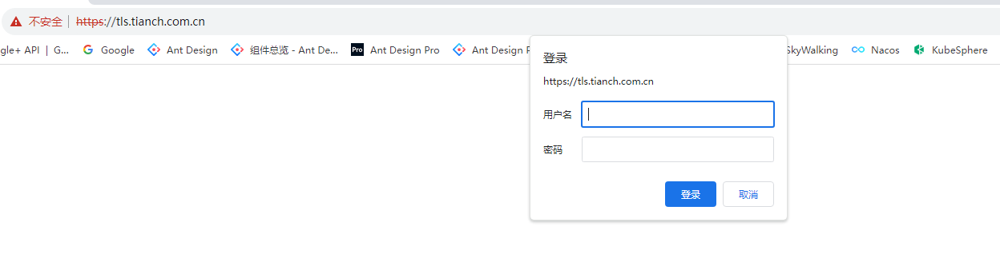

## 运行原理

`ingress-nginx` 控制器主要是用来组装一个 `nginx.conf` 的配置文件，当配置文件发生任何变动的时候就需要重新加载 Nginx 来生效，但是并不会只在影响 `upstream` 配置的变更后就重新加载 Nginx，控制器内部会使用一个 `lua-nginx-module` 来实现该功能。

Kubernetes 控制器使用控制循环模式来检查控制器中所需的状态是否已更新或是否需要变更，所以 `ingress-nginx` 需要使用集群中的不同对象来构建模型，比如 Ingress、Service、Endpoints、Secret、ConfigMap 等可以生成反映集群状态的配置文件的对象，控制器需要一直 Watch 这些资源对象的变化，但是并没有办法知道特定的更改是否会影响到最终生成的 `nginx.conf` 配置文件，所以一旦 Watch 到了任何变化控制器都必须根据集群的状态重建一个新的模型，并将其与当前的模型进行比较，如果模型相同则就可以避免生成新的 Nginx 配置并触发重新加载，否则还需要检查模型的差异是否只和端点有关，如果是这样，则需要使用 HTTP POST 请求将新的端点列表发送到在 Nginx 内运行的 Lua 处理程序，并再次避免生成新的 Nginx 配置并触发重新加载，如果运行和新模型之间的差异不仅仅是端点，那么就会基于新模型创建一个新的 Nginx 配置了，这样构建模型最大的一个好处就是在状态没有变化时避免不必要的重新加载，可以节省大量 Nginx 重新加载。

下面简单描述了需要重新加载的一些场景：

- 创建了新的 Ingress 资源
- TLS 添加到现有 Ingress
- 从 Ingress 中添加或删除 path 路径
- Ingress、Service、Secret 被删除了
- Ingress 的一些缺失引用对象变可用了，例如 Service 或 Secret
- 更新了一个 Secret

对于集群规模较大的场景下频繁的对 Nginx 进行重新加载显然会造成大量的性能消耗，所以要尽可能减少出现重新加载的场景。

## 安装

由于 `ingress-nginx` 所在的节点需要能够访问外网，这样域名可以解析到这些节点上直接使用，所以需要让 `ingress-nginx` 绑定节点的 80 和 443 端口，所以可以使用 hostPort 来进行访问，当然对于线上环境来说为了保证高可用，一般是需要运行多个 ingress-nginx 实例的，然后可以用一个 nginx/haproxy 作为入口，通过 keepalived 来访问边缘节点的 vip 地址。

**边缘节点:**即集群内部用来向集群外暴露服务能力的节点，集群外部的服务通过该节点来调用集群内部的服务，边缘节点是集群内外交流的一个 Endpoint。

这里使用 Helm Chart 的方式来进行安装：

支持的版本列表,根据k8s的版本下载支持的ingress-nginx:


```sh
helm repo add ingress-nginx https://kubernetes.github.io/ingress-nginx
helm repo update
helm fetch ingress-nginx/ingress-nginx --version 4.5.2
# 解压下载的版本
tar -xvf ingress-nginx-x.x.x.tgz
cd ingress-nginx
```

```sh
├── changelog
│   └── Changelog-4.5.2.md
├── CHANGELOG.md
├── changelog.md.gotmpl
├── Chart.yaml
├── ci
│   ├── controller-admission-tls-cert-manager-values.yaml
│   ├── controller-custom-ingressclass-flags.yaml
│   ├── daemonset-customconfig-values.yaml
│   ├── daemonset-customnodeport-values.yaml
│   ├── daemonset-extra-modules.yaml
│   ├── daemonset-headers-values.yaml
│   ├── daemonset-internal-lb-values.yaml
│   ├── daemonset-nodeport-values.yaml
│   ├── daemonset-podannotations-values.yaml
│   ├── daemonset-tcp-udp-configMapNamespace-values.yaml
│   ├── daemonset-tcp-udp-portNamePrefix-values.yaml
│   ├── daemonset-tcp-udp-values.yaml
│   ├── daemonset-tcp-values.yaml
│   ├── deamonset-default-values.yaml
│   ├── deamonset-metrics-values.yaml
│   ├── deamonset-psp-values.yaml
│   ├── deamonset-webhook-and-psp-values.yaml
│   ├── deamonset-webhook-values.yaml
│   ├── deployment-autoscaling-behavior-values.yaml
│   ├── deployment-autoscaling-values.yaml
│   ├── deployment-customconfig-values.yaml
│   ├── deployment-customnodeport-values.yaml
│   ├── deployment-default-values.yaml
│   ├── deployment-extra-modules-default-container-sec-context.yaml
│   ├── deployment-extra-modules-specific-container-sec-context.yaml
│   ├── deployment-extra-modules.yaml
│   ├── deployment-headers-values.yaml
│   ├── deployment-internal-lb-values.yaml
│   ├── deployment-metrics-values.yaml
│   ├── deployment-nodeport-values.yaml
│   ├── deployment-podannotations-values.yaml
│   ├── deployment-psp-values.yaml
│   ├── deployment-tcp-udp-configMapNamespace-values.yaml
│   ├── deployment-tcp-udp-portNamePrefix-values.yaml
│   ├── deployment-tcp-udp-values.yaml
│   ├── deployment-tcp-values.yaml
│   ├── deployment-webhook-and-psp-values.yaml
│   ├── deployment-webhook-extraEnvs-values.yaml
│   ├── deployment-webhook-resources-values.yaml
│   └── deployment-webhook-values.yaml
├── OWNERS
├── README.md
├── README.md.gotmpl
├── templates
│   ├── admission-webhooks
│   │   ├── cert-manager.yaml
│   │   ├── job-patch
│   │   │   ├── clusterrolebinding.yaml
│   │   │   ├── clusterrole.yaml
│   │   │   ├── job-createSecret.yaml
│   │   │   ├── job-patchWebhook.yaml
│   │   │   ├── networkpolicy.yaml
│   │   │   ├── psp.yaml
│   │   │   ├── rolebinding.yaml
│   │   │   ├── role.yaml
│   │   │   └── serviceaccount.yaml
│   │   └── validating-webhook.yaml
│   ├── clusterrolebinding.yaml
│   ├── clusterrole.yaml
│   ├── controller-configmap-addheaders.yaml
│   ├── controller-configmap-proxyheaders.yaml
│   ├── controller-configmap-tcp.yaml
│   ├── controller-configmap-udp.yaml
│   ├── controller-configmap.yaml
│   ├── controller-daemonset.yaml
│   ├── controller-deployment.yaml
│   ├── controller-hpa.yaml
│   ├── controller-ingressclass.yaml
│   ├── controller-keda.yaml
│   ├── controller-poddisruptionbudget.yaml
│   ├── controller-prometheusrules.yaml
│   ├── controller-psp.yaml
│   ├── controller-rolebinding.yaml
│   ├── controller-role.yaml
│   ├── controller-serviceaccount.yaml
│   ├── controller-service-internal.yaml
│   ├── controller-service-metrics.yaml
│   ├── controller-servicemonitor.yaml
│   ├── controller-service-webhook.yaml
│   ├── controller-service.yaml
│   ├── controller-webhooks-networkpolicy.yaml
│   ├── default-backend-deployment.yaml
│   ├── default-backend-hpa.yaml
│   ├── default-backend-poddisruptionbudget.yaml
│   ├── default-backend-psp.yaml
│   ├── default-backend-rolebinding.yaml
│   ├── default-backend-role.yaml
│   ├── default-backend-serviceaccount.yaml
│   ├── default-backend-service.yaml
│   ├── dh-param-secret.yaml
│   ├── _helpers.tpl
│   ├── NOTES.txt
│   └── _params.tpl
└── values.yaml

5 directories, 95 files
```

Helm Chart 包下载下来后解压可以看到里面包含的模板文件，其中的 `ci` 目录中就包含了各种场景下面安装的 Values 配置文件，`values.yaml` 文件中包含的是所有可配置的默认值，可以对这些默认值进行覆盖，这里测试环境就将 master 节点看成边缘节点，所以直接将 `ingress-nginx` 固定到 master 节点上，采用 hostNetwork 模式(生产环境可以使用 LB + DaemonSet hostNetwork 模式)，为了避免创建的错误 Ingress 等资源对象影响控制器重新加载，所以强烈建议大家开启准入控制器，`ingess-nginx` 中会提供一个用于校验资源对象的 Admission Webhook，可以通过 Values 文件进行开启。然后新建一个名为 `ci/daemonset-prod.yaml` 的 Values 文件，用来覆盖 ingress-nginx 默认的 Values 值。


```sh
kubectl create ns ingress-nginx
helm upgrade --install ingress-nginx . -f values.yaml --namespace ingress-nginx
```

```text
Release "ingress-nginx" does not exist. Installing it now.
NAME: ingress-nginx
LAST DEPLOYED: Wed Nov 15 11:26:50 2023
NAMESPACE: ingress-nginx
STATUS: deployed
REVISION: 1
TEST SUITE: None
NOTES:
The ingress-nginx controller has been installed.
It may take a few minutes for the LoadBalancer IP to be available.
You can watch the status by running 'kubectl --namespace ingress-nginx get services -o wide -w ingress-nginx-controller'

An example Ingress that makes use of the controller:
  apiVersion: networking.k8s.io/v1
  kind: Ingress
  metadata:
    name: example
    namespace: foo
  spec:
    ingressClassName: nginx
    rules:
      - host: www.example.com
        http:
          paths:
            - pathType: Prefix
              backend:
                service:
                  name: exampleService
                  port:
                    number: 80
              path: /
    # This section is only required if TLS is to be enabled for the Ingress
    tls:
      - hosts:
        - www.example.com
        secretName: example-tls

If TLS is enabled for the Ingress, a Secret containing the certificate and key must also be provided:

  apiVersion: v1
  kind: Secret
  metadata:
    name: example-tls
    namespace: foo
  data:
    tls.crt: <base64 encoded cert>
    tls.key: <base64 encoded key>
  type: kubernetes.io/tls
```


安装完成后会自动创建一个 名为 `nginx` 的 `IngressClass` 对象：

```sh
kubectl get ingressclass
kubectl get ingressclass nginx -o yaml
```

```yaml
apiVersion: networking.k8s.io/v1
kind: IngressClass
metadata:
  annotations:
    meta.helm.sh/release-name: ingress-nginx
    meta.helm.sh/release-namespace: ingress-nginx
  creationTimestamp: "2023-11-15T03:27:16Z"
  generation: 1
  labels:
    app.kubernetes.io/component: controller
    app.kubernetes.io/instance: ingress-nginx
    app.kubernetes.io/managed-by: Helm
    app.kubernetes.io/name: ingress-nginx
    app.kubernetes.io/part-of: ingress-nginx
    app.kubernetes.io/version: 1.6.4
    helm.sh/chart: ingress-nginx-4.5.2
  name: nginx
  resourceVersion: "59635"
  uid: 620adf44-e02f-4837-9bcd-3983050297e8
spec:
  controller: k8s.io/ingress-nginx
```

不过这里只提供了一个 `controller` 属性，如果还需要配置一些额外的参数，则可以在安装的 values 文件中进行配置。

## 第一个示例

安装成功后，为一个 nginx 应用创建一个 Ingress 资源，如下所示：

```yaml
apiVersion: apps/v1
kind: Deployment
metadata:
  name: my-nginx
spec:
  selector:
    matchLabels:
      app: my-nginx
  template:
    metadata:
      labels:
        app: my-nginx
    spec:
      containers:
        - name: my-nginx
          image: nginx
          ports:
            - containerPort: 80
          resources:
            limits:
              cpu: 100m
              memory: 128Mi
---
apiVersion: v1
kind: Service
metadata:
  name: my-nginx
  labels:
    app: my-nginx
spec:
  ports:
    - port: 80
      protocol: TCP
      name: http
  selector:
    app: my-nginx
---
apiVersion: networking.k8s.io/v1
kind: Ingress
metadata:
  name: my-nginx
  namespace: default
spec:
  ingressClassName: nginx # 使用 nginx 的 IngressClass（关联的 ingress-nginx 控制器）
  rules:
    - host: ngdemo.tianch.com.cn # 将域名映射到 my-nginx 服务
      http:
        paths:
          - path: /
            pathType: Prefix
            backend:
              service: # 将所有请求发送到 my-nginx 服务的 80 端口
                name: my-nginx
                port:
                  number: 80
# 不过需要注意大部分Ingress控制器都不是直接转发到Service
# 而是只是通过Service来获取后端的Endpoints列表，直接转发到Pod，这样可以减少网络跳转，提高性能
```

```sh
kubectl apply -f my-nginx.yaml
```


在上面的 Ingress 资源对象中使用配置 `ingressClassName: nginx` 指定让安装的 `ingress-nginx` 这个控制器来处理 Ingress 资源，配置的匹配路径类型为前缀的方式去匹配 `/`，将来自域名 `ngdemo.tianch.com.cn` 的所有请求转发到 `my-nginx` 服务的后端 Endpoints 中去。

上面资源创建成功后，将域名 `ngdemo.tianch.com.cn` 解析到 `ingress-nginx` 所在的**边缘节点**中的任意一个，当然也可以在本地 `/etc/hosts` 中添加对应的映射也可以，然后就可以通过域名进行访问了。


客户端是如何通过 Ingress 控制器连接到其中一个 Pod 的流程: 客户端首先对 `ngdemo.tianch.com`.cn 执行 DNS 解析，得到 Ingress 控制器所在节点的 IP，然后客户端向 Ingress 控制器发送 HTTP 请求，然后根据 Ingress 对象里面的描述匹配域名，找到对应的 Service 对象，并获取关联的 Endpoints 列表，将客户端的请求转发给其中一个 Pod。

前面也提到了 `ingress-nginx` 控制器的核心原理就是将 `Ingress` 这些资源对象映射翻译成 Nginx 配置文件 `nginx.conf`，通过查看控制器中的配置文件来验证这点：

```conf
## start server ngdemo.tianch.com.cn
	server {
		server_name ngdemo.tianch.com.cn ;

		listen 80  ;
		listen [::]:80  ;
		listen 443  ssl http2 ;
		listen [::]:443  ssl http2 ;

		set $proxy_upstream_name "-";

		ssl_certificate_by_lua_block {
			certificate.call()
		}

		location / {

			set $namespace      "default";
			set $ingress_name   "my-nginx";
			set $service_name   "my-nginx";
			set $service_port   "80";
			set $location_path  "/";
			set $global_rate_limit_exceeding n;

			rewrite_by_lua_block {
				lua_ingress.rewrite({
					force_ssl_redirect = false,
					ssl_redirect = true,
					force_no_ssl_redirect = false,
					preserve_trailing_slash = false,
					use_port_in_redirects = false,
					global_throttle = { namespace = "", limit = 0, window_size = 0, key = { }, ignored_cidrs = { } },
				})
				balancer.rewrite()
				plugins.run()
			}

			# be careful with `access_by_lua_block` and `satisfy any` directives as satisfy any
			# will always succeed when there's `access_by_lua_block` that does not have any lua code doing `ngx.exit(ngx.DECLINED)`
			# other authentication method such as basic auth or external auth useless - all requests will be allowed.
			#access_by_lua_block {
			#}

			header_filter_by_lua_block {
				lua_ingress.header()
				plugins.run()
			}

			body_filter_by_lua_block {
				plugins.run()
			}

			log_by_lua_block {
				balancer.log()

				monitor.call()

				plugins.run()
			}

			port_in_redirect off;

			set $balancer_ewma_score -1;
			set $proxy_upstream_name "default-my-nginx-80";
			set $proxy_host          $proxy_upstream_name;
			set $pass_access_scheme  $scheme;

			set $pass_server_port    $server_port;

			set $best_http_host      $http_host;
			set $pass_port           $pass_server_port;

			set $proxy_alternative_upstream_name "";

			client_max_body_size                    1m;

			proxy_set_header Host                   $best_http_host;

			# Pass the extracted client certificate to the backend

			# Allow websocket connections
			proxy_set_header                        Upgrade           $http_upgrade;

			proxy_set_header                        Connection        $connection_upgrade;

			proxy_set_header X-Request-ID           $req_id;
			proxy_set_header X-Real-IP              $remote_addr;

			proxy_set_header X-Forwarded-For        $remote_addr;

			proxy_set_header X-Forwarded-Host       $best_http_host;
			proxy_set_header X-Forwarded-Port       $pass_port;
			proxy_set_header X-Forwarded-Proto      $pass_access_scheme;
			proxy_set_header X-Forwarded-Scheme     $pass_access_scheme;

			proxy_set_header X-Scheme               $pass_access_scheme;

			# Pass the original X-Forwarded-For
			proxy_set_header X-Original-Forwarded-For $http_x_forwarded_for;

			# mitigate HTTPoxy Vulnerability
			# https://www.nginx.com/blog/mitigating-the-httpoxy-vulnerability-with-nginx/
			proxy_set_header Proxy                  "";

			# Custom headers to proxied server

			proxy_connect_timeout                   5s;
			proxy_send_timeout                      60s;
			proxy_read_timeout                      60s;

			proxy_buffering                         off;
			proxy_buffer_size                       4k;
			proxy_buffers                           4 4k;

			proxy_max_temp_file_size                1024m;

			proxy_request_buffering                 on;
			proxy_http_version                      1.1;

			proxy_cookie_domain                     off;
			proxy_cookie_path                       off;

			# In case of errors try the next upstream server before returning an error
			proxy_next_upstream                     error timeout;
			proxy_next_upstream_timeout             0;
			proxy_next_upstream_tries               3;

			proxy_pass http://upstream_balancer;

			proxy_redirect                          off;

		}

	}
	## end server ngdemo.tianch.com.cn

```

可以在 `nginx.conf` 配置文件中看到上面新增的 Ingress 资源对象的相关配置信息，不过需要注意的是现在并不会为每个 backend 后端都创建一个 `upstream` 配置块，现在是使用 Lua 程序进行动态处理的，所以没有直接看到后端的 Endpoints 相关配置数据。

## Nginx配置

如果想进行一些自定义配置，则有几种方式可以实现：使用 Configmap 在 Nginx 中设置全局配置、通过 Ingress 的 Annotations 设置特定 Ingress 的规则、自定义模板。接下来重点介绍使用注解来对 Ingress 对象进行自定义。

### Basic Auth

可以在 Ingress 对象上配置一些基本的 Auth 认证，比如 Basic Auth，可以用 `htpasswd` 生成一个密码文件来验证身份验证。

```sh
# 没有htpasswd命令的先安装一下
yum -y install httpd-tools
```

```shell
htpasswd -c auth foo
New password:
Re-type new password:
Adding password for user foo
```

```sh
kubectl create secret generic basic-auth --from-file=auth
```

```sh
kubectl get secret basic-auth -o yaml
```


然后对上面的 my-nginx 应用创建一个具有 Basic Auth 的 Ingress 对象：

```yaml
apiVersion: networking.k8s.io/v1
kind: Ingress
metadata:
  name: ingress-with-auth
  namespace: default
  annotations:
    nginx.ingress.kubernetes.io/auth-type: basic # 认证类型
    nginx.ingress.kubernetes.io/auth-secret: basic-auth # 包含 user/password 定义的 secret 对象名
    nginx.ingress.kubernetes.io/auth-realm: "Authentication Required - foo" # 要显示的带有适当上下文的消息，说明需要身份验证的原因
spec:
  ingressClassName: nginx # 使用 nginx 的 IngressClass（关联的 ingress-nginx 控制器）
  rules:
    - host: bauth.tianch.com.cn # 将域名映射到 my-nginx 服务
      http:
        paths:
          - path: /
            pathType: Prefix
            backend:
              service: # 将所有请求发送到 my-nginx 服务的 80 端口
                name: my-nginx
                port:
                  number: 80
```


```sh
curl -v http://bauth.tianch.com.cn -H 'Host: bauth.tianch.com.cn'
```


可以看到出现了 401 认证失败错误，然后带上配置的用户名和密码进行认证：

```sh
curl -v http://bauth.tianch.com.cn -H 'Host: bauth.tianch.com.cn' -u 'foo:77589910'
```


可以看到已经认证成功了。除了可以使用自己在本地集群创建的 Auth 信息之外，还可以使用外部的 Basic Auth 认证信息，比如使用 `https://httpbin.org` 的外部 Basic Auth 认证，创建如下所示的 Ingress 资源对象：

```yaml
apiVersion: networking.k8s.io/v1
kind: Ingress
metadata:
  annotations:
    # 配置外部认证服务地址
    nginx.ingress.kubernetes.io/auth-url: https://httpbin.org/basic-auth/user/passwd
  name: external-auth
  namespace: default
spec:
  ingressClassName: nginx
  rules:
    - host: external-bauth.tianch.com.cn
      http:
        paths:
          - path: /
            pathType: Prefix
            backend:
              service:
                name: my-nginx
                port:
                  number: 80
```

创建资源对象:

```sh
kubectl apply -f my-nginx-with-external-auth.yaml
```

测试:

```sh
curl -k http://external-bauth.tianch.com.cn -v -H 'Host: external-bauth.tianch.com.cn'
```


使用正确的用户名和密码测试：

```sh
curl -k http://external-bauth.tianch.com.cn -v -H 'Host: external-bauth.tianch.com.cn' -u 'user:passwd'
```


用户名或者密码错误则同样会出现 401 的状态码：

```sh
curl -k http://external-bauth.tianch.com.cn -v -H 'Host: external-bauth.tianch.com.cn' -u 'user:passwd111'
```


```sh
curl -k http://external-bauth.tianch.com.cn -v -H 'Host: external-bauth.tianch.com.cn' -u 'user111:passwd'
```


除了 Basic Auth 这一种简单的认证方式之外，`ingress-nginx` 还支持一些其他高级的认证，比如可以使用 GitHub OAuth 来认证 Kubernetes 的 Dashboard。

### URL Rewrite

`ingress-nginx` 很多高级的用法可以通过 Ingress 对象的 `annotation` 进行配置，比如常用的 URL Rewrite 功能。很多时候会将 `ingress-nginx` 当成网关使用，比如对访问的服务加上 `/app` 这样的前缀，在 `nginx` 的配置里面有一个 `proxy_pass` 指令可以实现：

```shell
location /app/ {
  proxy_pass http://127.0.0.1/remote/;
}
```

`proxy_pass` 后面加了 `/remote` 这个路径，此时会将匹配到该规则路径中的 `/app` 用 `/remote` 替换掉，相当于截掉路径中的 `/app`。同样的在 Kubernetes 中使用 `ingress-nginx` 的 `rewrite-target` 注解来实现这个需求，比如现在要通过 `rewrite.tianch.com.cn/gateway/` 来访问到 Nginx 服务，则需要对访问的 URL 路径做一个 Rewrite，在 PATH 中添加一个 gateway 的前缀，关于 Rewrite 的操作在 [ingress-nginx 官方文档](https://kubernetes.github.io/ingress-nginx/examples/rewrite/)中也给出对应的说明:


按照要求需要在 `path` 中匹配前缀 `gateway`，然后通过 `rewrite-target` 指定目标，Ingress 对象如下所示：

```yaml
apiVersion: networking.k8s.io/v1
kind: Ingress
metadata:
  name: rewrite
  annotations:
    nginx.ingress.kubernetes.io/rewrite-target: /$2
spec:
  ingressClassName: nginx
  rules:
    - host: rewrite.tianch.com.cn
      http:
        paths:
          - path: /gateway(/|$)(.*)
            pathType: Prefix
            backend:
              service:
                name: my-nginx
                port:
                  number: 80
```

更新后，可以预见到直接访问域名肯定是不行了，因为没有匹配 `/` 的 path 路径：


带上 `gateway` 的前缀再去访问:


可以看到已经可以访问到了，这是因为在 `path` 中通过正则表达式 `/gateway(/|$)(.*)` 将匹配的路径设置成了 `rewrite-target` 的目标路径了，所以访问 `rewite.tianch.com.cn/gateway/` 的时候实际上相当于访问的就是后端服务的 `/` 路径。

要解决访问主域名出现 404 的问题，可以给应用设置一个 `app-root` 的注解，这样当访问主域名的时候会自动跳转到指定的 `app-root` 目录下面，如下所示：

```yaml
apiVersion: networking.k8s.io/v1
kind: Ingress
metadata:
  name: rewrite
  annotations:
    nginx.ingress.kubernetes.io/app-root: /gateway/
    nginx.ingress.kubernetes.io/rewrite-target: /$2
spec:
  ingressClassName: nginx
  rules:
    - host: rewrite.tianch.com.cn
      http:
        paths:
          - path: /gateway(/|$)(.*)
            pathType: Prefix
            backend:
              service:
                name: my-nginx
                port:
                  number: 80
```

更新应用后访问主域名 `rewrite.tianch.com.cn` 就会自动跳转到 `rewrite.tianch.com.cn/gateway/` 路径下面去了。但是还有一个问题是 path 路径其实也匹配了 `/app` 这样的路径，希望应用在最后添加一个 `/` 这样的 slash，同样可以通过 `configuration-snippet` 配置来完成，如下 Ingress 对象：

```yaml
apiVersion: networking.k8s.io/v1
kind: Ingress
metadata:
  name: rewrite
  annotations:
    nginx.ingress.kubernetes.io/app-root: /gateway/
    nginx.ingress.kubernetes.io/rewrite-target: /$2
    nginx.ingress.kubernetes.io/configuration-snippet: |
      rewrite ^(/gateway)$ $1/ redirect;
spec:
  ingressClassName: nginx
  rules:
    - host: rewrite.tianch.com.cn
      http:
        paths:
          - path: /gateway(/|$)(.*)
            pathType: Prefix
            backend:
              service:
                name: my-nginx
                port:
                  number: 80
```

更新后应用就都会以 `/` 这样的 slash 结尾了。

### 灰度发布

在日常工作中经常需要对服务进行版本更新升级，所以经常会使用到滚动升级、蓝绿发布、灰度发布等不同的发布操作。而 `ingress-nginx` 支持通过 Annotations 配置来实现不同场景下的灰度发布和测试，可以满足金丝雀发布、蓝绿部署与 A/B 测试等业务场景。

[ingress-nginx 的 Annotations](https://kubernetes.github.io/ingress-nginx/user-guide/nginx-configuration/annotations/#canary) 支持以下 4 种 Canary 规则：

- `nginx.ingress.kubernetes.io/canary-by-header`：基于 Request Header 的流量切分，适用于灰度发布以及 A/B 测试。当 Request Header 设置为 always 时，请求将会被一直发送到 Canary 版本；当 Request Header 设置为 never 时，请求不会被发送到 Canary 入口；对于任何其他 Header 值，将忽略 Header，并通过优先级将请求与其他金丝雀规则进行优先级的比较。
- `nginx.ingress.kubernetes.io/canary-by-header-value`：要匹配的 Request Header 的值，用于通知 Ingress 将请求路由到 Canary Ingress 中指定的服务。当 Request Header 设置为此值时，它将被路由到 Canary 入口。该规则允许用户自定义 Request Header 的值，必须与上一个 annotation (`canary-by-header`) 一起使用。
- `nginx.ingress.kubernetes.io/canary-weight`：基于服务权重的流量切分，适用于蓝绿部署，权重范围 0 - 100 按百分比将请求路由到 Canary Ingress 中指定的服务。权重为 0 意味着该金丝雀规则不会向 Canary 入口的服务发送任何请求，权重为 100 意味着所有请求都将被发送到 Canary 入口。
- `nginx.ingress.kubernetes.io/canary-by-cookie`：基于 cookie 的流量切分，适用于灰度发布与 A/B 测试。用于通知 Ingress 将请求路由到 Canary Ingress 中指定的服务的 cookie。当 cookie 值设置为 always 时，它将被路由到 Canary 入口；当 cookie 值设置为 never 时，请求不会被发送到 Canary 入口；对于任何其他值，将忽略 cookie 并将请求与其他金丝雀规则进行优先级的比较。

> 需要注意的是金丝雀规则按优先顺序进行排序：`canary-by-header - > canary-by-cookie - > canary-weight`

总的来说可以把以上的四个 annotation 规则划分为以下两类：

- 基于权重的 Canary 规则 
- 基于用户请求的 Canary 规则 

下面我们通过一个示例应用来对灰度发布功能进行说明。

#### 第一步. 部署 Production 应用

首先创建一个 production 环境的应用资源清单：

```yaml
apiVersion: apps/v1
kind: Deployment
metadata:
  name: production
  labels:
    app: production
spec:
  selector:
    matchLabels:
      app: production
  template:
    metadata:
      labels:
        app: production
    spec:
      containers:
        - name: production
          image: cnych/echoserver
          ports:
            - containerPort: 8080
          env:
            - name: NODE_NAME
              valueFrom:
                fieldRef:
                  fieldPath: spec.nodeName
            - name: POD_NAME
              valueFrom:
                fieldRef:
                  fieldPath: metadata.name
            - name: POD_NAMESPACE
              valueFrom:
                fieldRef:
                  fieldPath: metadata.namespace
            - name: POD_IP
              valueFrom:
                fieldRef:
                  fieldPath: status.podIP
---
apiVersion: v1
kind: Service
metadata:
  name: production
  labels:
    app: production
spec:
  ports:
    - port: 80
      targetPort: 8080
      name: http
  selector:
    app: production
```

然后创建一个用于 production 环境访问的 Ingress 资源对象：

```sh
apiVersion: networking.k8s.io/v1
kind: Ingress
metadata:
  name: production
spec:
  ingressClassName: nginx
  rules:
  - host: echo.tianch.com.cn
    http:
      paths:
      - path: /
        pathType: Prefix
        backend:
          service:
            name: production
            port:
              number: 80
```

直接创建上面的几个资源对象：

```sh
kubectl apply -f production.yaml
kubectl apply -f production-ingress.yaml
kubectl get pods -l app=production
```


应用部署成功后，将域名 `echo.tianch.com.cn` 解析到 master 节点（ingress-nginx 所在的节点）的 IP 即可正常访问应用：


#### 第二步. 创建 Canary 版本

参考将上述 Production 版本的 `production.yaml` 文件，再创建一个 Canary 版本的应用。

```yaml
apiVersion: apps/v1
kind: Deployment
metadata:
  name: canary
  labels:
    app: canary
spec:
  selector:
    matchLabels:
      app: canary
  template:
    metadata:
      labels:
        app: canary
    spec:
      containers:
        - name: canary
          image: cnych/echoserver
          ports:
            - containerPort: 8080
          env:
            - name: NODE_NAME
              valueFrom:
                fieldRef:
                  fieldPath: spec.nodeName
            - name: POD_NAME
              valueFrom:
                fieldRef:
                  fieldPath: metadata.name
            - name: POD_NAMESPACE
              valueFrom:
                fieldRef:
                  fieldPath: metadata.namespace
            - name: POD_IP
              valueFrom:
                fieldRef:
                  fieldPath: status.podIP
---
apiVersion: v1
kind: Service
metadata:
  name: canary
  labels:
    app: canary
spec:
  ports:
    - port: 80
      targetPort: 8080
      name: http
  selector:
    app: canary
```

创建上面的资源对象,接下来就可以通过配置 Annotation 规则进行流量切分了。

```sh
kubectl apply -f canary.yaml
```


#### 第三步. Annotation 规则配置

**1. 基于权重**：基于权重的流量切分的典型应用场景就是蓝绿部署，可通过将权重设置为 0 或 100 来实现。例如，可将 Green 版本设置为主要部分，并将 Blue 版本的入口配置为 Canary。最初，将Blue版本的权重设置为 0，因此不会将流量代理到 Blue 版本。一旦新版本测试和验证都成功后，即可将 Blue 版本的权重设置为 100，即所有流量从 Green 版本转向 Blue。

创建一个基于权重的 Canary 版本的应用路由 Ingress 对象:

```sh
apiVersion: networking.k8s.io/v1
kind: Ingress
metadata:
  name: canary
  annotations:
    nginx.ingress.kubernetes.io/canary: 'true' # 要开启灰度发布机制，首先需要启用 Canary
    nginx.ingress.kubernetes.io/canary-weight: '30' # 分配30%流量到当前Canary版本
spec:
  ingressClassName: nginx
  rules:
  - host: echo.tianch.com.cn
    http:
      paths:
      - path: /
        pathType: Prefix
        backend:
          service:
            name: canary
            port:
              number: 80
```

创建上面的资源对象：


Canary 版本应用创建成功后，在命令行终端中来不断访问这个应用，观察 Hostname 变化：

```sh
for i in $(seq 1 10); do curl -s echo.tianch.com.cn | grep "Hostname"; done
```


由于给 Canary 版本应用分配了 30% 左右权重的流量，所以上面每访问 10 次有 3-4 次访问到了 Canary 版本的应用，是符合预期的。

**2. 基于 Request Header**: 基于 Request Header 进行流量切分的典型应用场景即灰度发布或 A/B 测试场景。

在上面的 Canary 版本的 Ingress 对象中新增一条 annotation 配置 `nginx.ingress.kubernetes.io/canary-by-header: canary`（这里的 value 可以是任意值），使当前的 Ingress 实现基于 Request Header 进行流量切分，由于 `canary-by-header` 的优先级大于 `canary-weight`，所以会忽略原有的 `canary-weight` 的规则。

```yaml
apiVersion: networking.k8s.io/v1
kind: Ingress
metadata:
  name: canary
  annotations:
    nginx.ingress.kubernetes.io/canary: "true" # 要开启灰度发布机制，首先需要启用 Canary
    nginx.ingress.kubernetes.io/canary-by-header: canary # 基于header的流量切分
    nginx.ingress.kubernetes.io/canary-weight: "30" # 分配30%流量到当前Canary版本
spec:
  ingressClassName: nginx
  rules:
    - host: echo.tianch.com.cn
      http:
        paths:
          - path: /
            pathType: Prefix
            backend:
              service:
                name: canary
                port:
                  number: 80
```

更新上面的 Ingress 资源对象后，在请求中加入不同的 Header 值，再次访问应用的域名。

> 注意：当 Request Header 设置为 never 或 always 时，请求将不会或一直被发送到 Canary 版本，对于任何其他 Header 值，将忽略 Header，并通过优先级将请求与其他 Canary 规则进行优先级的比较。

```sh
for i in $(seq 1 10); do curl -s -H "canary: never" echo.tianch.com.cn | grep "Hostname"; done
```


在请求的时候设置了 `canary: never` 这个 Header 值，所以请求没有发送到 Canary 应用中去。如果设置为其他值:

```sh
for i in $(seq 1 10); do curl -s -H "canary: other-value" echo.tianch.com.cn | grep "Hostname"; done
```


由于请求设置的 Header 值为 `canary: other-value`，所以 ingress-nginx 会通过优先级将请求与其他 Canary 规则进行优先级的比较，也就会进入 `canary-weight: "30"` 这个规则去。

在请求的时候设置 `canary: always`

```sh
for i in $(seq 1 10); do curl -s -H "canary: always" echo.tianch.com.cn | grep "Hostname"; done
```


在请求的时候设置了 `canary: always` 这个 Header 值，所以请求都发送到了 Canary 应用中去。

在上一个 annotation (即 `canary-by-header`）的基础上添加一条 `nginx.ingress.kubernetes.io/canary-by-header-value: user-value` 这样的规则，就可以将请求路由到 Canary Ingress 中指定的服务了。

```yaml
apiVersion: networking.k8s.io/v1
kind: Ingress
metadata:
  name: canary
  annotations:
    nginx.ingress.kubernetes.io/canary: "true" # 要开启灰度发布机制，首先需要启用 Canary
    nginx.ingress.kubernetes.io/canary-by-header-value: user-value
    nginx.ingress.kubernetes.io/canary-by-header: canary # 基于header的流量切分
    nginx.ingress.kubernetes.io/canary-weight: "30" # 分配30%流量到当前Canary版本
spec:
  ingressClassName: nginx
  rules:
    - host: echo.tianch.com.cn
      http:
        paths:
          - path: /
            pathType: Prefix
            backend:
              service:
                name: canary
                port:
                  number: 80
```

同样更新 Ingress 对象后，重新访问应用，当 Request Header 满足 `canary: user-value`时，所有请求就会被路由到 Canary 版本：

```sh
for i in $(seq 1 10); do curl -s -H "canary: user-value" echo.tianch.com.cn | grep "Hostname"; done
```


**3. 基于 Cookie**：与基于 Request Header 的 annotation 用法规则类似。例如在 A/B 测试场景下，需要让地域为北京的用户访问 Canary 版本。那么当 cookie 的 annotation 设置为 `nginx.ingress.kubernetes.io/canary-by-cookie: "users_from_Beijing"`，此时后台可对登录的用户请求进行检查，如果该用户访问源来自北京则设置 cookie `users_from_Beijing` 的值为 `always`，这样就可以确保北京的用户仅访问 Canary 版本。

```yaml
apiVersion: networking.k8s.io/v1
kind: Ingress
metadata:
  name: canary
  annotations:
    nginx.ingress.kubernetes.io/canary: "true" # 要开启灰度发布机制，首先需要启用 Canary
    nginx.ingress.kubernetes.io/canary-by-cookie: "users_from_Beijing" # 基于 cookie
    nginx.ingress.kubernetes.io/canary-weight: "30" # 分配30%流量到当前Canary版本
spec:
  ingressClassName: nginx
  rules:
    - host: echo.tianch.com.cn
      http:
        paths:
          - path: /
            pathType: Prefix
            backend:
              service:
                name: canary
                port:
                  number: 80
```

更新 Canary 版本的 Ingress 资源对象，采用基于 Cookie 来进行流量切分

更新上面的 Ingress 资源对象后，在请求中设置一个 `users_from_Beijing=always` 的 Cookie 值，再次访问应用的域名。

```sh
for i in $(seq 1 10); do curl -s -b "users_from_Beijing=always" echo.tianch.com.cn | grep "Hostname"; done
```


可以看到应用都被路由到了 Canary 版本的应用中去了，如果将这个 Cookie 值设置为 never，则不会路由到 Canary 应用中。

### HTTPS

如果需要用 HTTPS 来访问这个应用的话，就需要监听 443 端口了，同样用 HTTPS 访问应用必然就需要证书，这里用 `openssl` 来创建一个自签名的证书：

```sh
openssl req -x509 -nodes -days 3650 -newkey rsa:2048 -keyout tls.tianch.com.cn.key -out tls.tianch.com.cn.crt -subj "/CN=tls.tianch.com.cn"
```

然后通过 Secret 对象来引用证书文件：

```sh
kubectl create secret tls tls.tianch.com.cn-tls --cert=tls.tianch.com.cn.crt --key=tls.tianch.com.cn.key
```

创建一个 HTTPS 访问的应用：

```yaml
apiVersion: networking.k8s.io/v1
kind: Ingress
metadata:
  name: ingress-with-auth
  annotations:
    # 认证类型
    nginx.ingress.kubernetes.io/auth-type: basic
    # 包含 user/password 定义的 secret 对象名
    nginx.ingress.kubernetes.io/auth-secret: basic-auth
    # 要显示的带有适当上下文的消息，说明需要身份验证的原因
    nginx.ingress.kubernetes.io/auth-realm: "Authentication Required - foo"
spec:
  ingressClassName: nginx
  tls: # 配置 tls 证书
    - hosts:
        - tls.tianch.com.cn
      secretName: tls.tianch.com.cn-tls
  rules:
    - host: tls.tianch.com.cn
      http:
        paths:
          - path: /
            pathType: Prefix
            backend:
              service:
                name: my-nginx
                port:
                  number: 80
```



除了自签名证书或者购买正规机构的 CA 证书之外，还可以通过一些工具来自动生成合法的证书，[cert-manager](https://cert-manager.io/) 是一个云原生证书管理开源项目，可以用于在 Kubernetes 集群中提供 HTTPS 证书并自动续期，支持 `Let's Encrypt/HashiCorp/Vault` 这些免费证书的签发。在 Kubernetes 中，可以通过 Kubernetes Ingress 和 Let's Encrypt 实现外部服务的自动化 HTTPS。

### TCP 与 UDP

由于在 Ingress 资源对象中没有直接对 TCP 或 UDP 服务的支持，要在 `ingress-nginx` 中提供支持，需要在控制器启动参数中添加 `--tcp-services-configmap` 和 `--udp-services-configmap` 标志指向一个 ConfigMap，其中的 key 是要使用的外部端口，value 值是使用格式 `<namespace/service name>:<service port>:[PROXY]:[PROXY]` 暴露的服务，端口可以使用端口号或者端口名称，最后两个字段是可选的，用于配置 PROXY 代理。

比如现在要通过 `ingress-nginx` 来暴露一个 MongoDB 服务，首先创建如下的应用：

```yaml
apiVersion: apps/v1
kind: Deployment
metadata:
  name: mongo
  labels:
    app: mongo
spec:
  selector:
    matchLabels:
      app: mongo
  template:
    metadata:
      labels:
        app: mongo
    spec:
      volumes:
        - name: data
          emptyDir: {}
      containers:
        - name: mongo
          image: mongo:4.0
          ports:
            - containerPort: 27017
          volumeMounts:
            - name: data
              mountPath: /data/db
---
apiVersion: v1
kind: Service
metadata:
  name: mongo
spec:
  selector:
    app: mongo
  ports:
    - port: 27017
```

创建上面的资源对象：

```sh
kubectl apply -f mongo.yaml
kubectl get svc
kubectl get pods -l app=mongo
```


要通过 `ingress-nginx` 来暴露上面的 MongoDB 服务，需要创建一个如下所示的 ConfigMap：

```yaml
apiVersion: v1
kind: ConfigMap
metadata:
  name: mango-tcp-service
  namespace: ingress-nginx
data:
  "27017": default/mongo:27017
```

然后在 `ingress-nginx` 的启动参数中添加 `--tcp-services-configmap=$(POD_NAMESPACE)/ingress-nginx-tcp` 这样的配置即可，由于这里使用的是 Helm Chart 进行安装的，只需要去覆盖 Values 值重新安装即可，修改 `values.yaml` 文件：

```yaml
tcp: # 配置 tcp 服务
  27017: "default/mongo:27017" # 使用 27017 端口去映射 mongo 服务
  # 9000: "default/test:8080"   # 如果还需要暴露其他 TCP 服务，继续添加即可
```

配置完成后重新更新当前的 `ingress-nginx`：

```sh
# 进入到values.yaml所在的文件夹
helm upgrade --install ingress-nginx . -f values.yaml --namespace ingress-nginx
```

重新部署完成后会自动生成一个名为 `ingress-nginx-tcp` 的 ConfigMap 对象，如下所示：

```sh
kubectl get configmap -n ingress-nginx ingress-nginx-tcp -o yaml
```


```sh
kubectl get pods -n ingress-nginx
kubectl get pod ingress-nginx-controller-fzlpl -n ingress-nginx -o yaml
```


可以看到在 `ingress-nginx` 的启动参数中也添加上了 `--tcp-services-configmap=$(POD_NAMESPACE)/ingress-nginx-tcp` 这样的配置

现在就可以通过 `ingress-nginx` 暴露的 27017 端口去访问 Mongo 服务了：


同样也可以去查看最终生成的 `nginx.conf` 配置文件：

```sh
kubectl exec -it ingress-nginx-controller-fzlpl -n ingress-nginx -- cat /etc/nginx/nginx.conf
```


TCP 相关的配置位于 `stream` 配置块下面。从 Nginx 1.9.13 版本开始提供 UDP 负载均衡，同样也可以在 `ingress-nginx` 中来代理 UDP 服务，比如可以去暴露 `kube-dns` 的服务，同样需要创建一个如下所示的 ConfigMap：

```sh
apiVersion: v1
kind: ConfigMap
metadata:
  name: udp-services
  namespace: ingress-nginx
data:
  53: 'kube-system/kube-dns:53'
```

然后需要在 `ingress-nginx` 参数中添加一个 `- --udp-services-configmap=$(POD_NAMESPACE)/udp-services` 这样的配置，当然这里只需要去修改 Values 文件值即可，修改 `values.yaml` 文件：

```yaml
# ...... 其他部分省略，和之前的保持一致

tcp: # 配置 tcp 服务
  27017: "default/mongo:27017" # 使用 27017 端口去映射 mongo 服务
  # 9000: "default/test:8080"   # 如果还需要暴露其他 TCP 服务，继续添加即可

udp: # 配置 udp 服务
  53: "kube-system/kube-dns:53"
```

然后重新更新即可。

### 全局配置

除了可以通过 `annotations` 对指定的 Ingress 进行定制之外，还可以配置 `ingress-nginx` 的全局配置，在控制器启动参数中通过标志 `--configmap` 指定了一个全局的 ConfigMap 对象，可以将全局的一些配置直接定义在该对象中即可：

```yaml
containers:
  - args:
    - /nginx-ingress-controller
    - --configmap=$(POD_NAMESPACE)/ingress-nginx-controller
    ......
```

比如这里用于全局配置的 ConfigMap 名为 `ingress-nginx-controller`：

```shell
kubectl get configmap -n ingress-nginx
```


比如可以添加如下所示的一些常用配置：

```shell
kubectl edit configmap ingress-nginx-controller -n ingress-nginx
```

```yaml
apiVersion: v1
data:
  allow-snippet-annotations: "true"
  client-header-buffer-size: 32k  # 注意不是下划线
  client-max-body-size: 5m
  use-gzip: "true"
  gzip-level: "7"
  large-client-header-buffers: 4 32k
  proxy-connect-timeout: 11s
  proxy-read-timeout: 12s
  keep-alive: "75"   # 启用keep-alive，连接复用，提高QPS
  keep-alive-requests: "100"
  upstream-keepalive-connections: "10000"
  upstream-keepalive-requests: "100"
  upstream-keepalive-timeout: "60"
  disable-ipv6: "true"
  disable-ipv6-dns: "true"
  max-worker-connections: "65535"
  max-worker-open-files: "10240"
kind: ConfigMap
......
```

修改完成后 Nginx 配置会自动重载生效，可以查看 `nginx.conf` 配置文件进行验证：

```sh
kubectl exec -it ingress-nginx-controller-fzlpl -n ingress-nginx -- cat /etc/nginx/nginx.conf |grep large_client_header_buffers
```


由于这里是 Helm Chart 安装的，为了保证重新部署后配置还在，同样需要通过 Values 进行全局配置：

```yaml
controller:
  config:
    allow-snippet-annotations: 'true'
    client-header-buffer-size: 32k # 注意不是下划线
    client-max-body-size: 5m
    use-gzip: 'true'
    gzip-level: '7'
    large-client-header-buffers: 4 32k
    proxy-connect-timeout: 11s
    proxy-read-timeout: 12s
    keep-alive: '75' # 启用keep-alive，连接复用，提高QPS
    keep-alive-requests: '100'
    upstream-keepalive-connections: '10000'
    upstream-keepalive-requests: '100'
    upstream-keepalive-timeout: '60'
    disable-ipv6: 'true'
    disable-ipv6-dns: 'true'
    max-worker-connections: '65535'
    max-worker-open-files: '10240'
......
```

此外往往还需要对 `ingress-nginx` 部署的节点进行性能优化，修改一些内核参数，使得适配 Nginx 的使用场景，一般是直接去修改节点上的内核参数，为了能够统一管理，可以使用 `initContainers` 来进行配置：

```yaml
initContainers:
- command:
  - /bin/sh
  - -c
  - |
    mount -o remount rw /proc/sys
    sysctl -w net.core.somaxconn=65535  # 具体的配置视具体情况而定
    sysctl -w net.ipv4.tcp_tw_reuse=1
    sysctl -w net.ipv4.ip_local_port_range="1024 65535"
    sysctl -w fs.file-max=1048576
    sysctl -w fs.inotify.max_user_instances=16384
    sysctl -w fs.inotify.max_user_watches=524288
    sysctl -w fs.inotify.max_queued_events=16384
image: busybox
imagePullPolicy: IfNotPresent
name: init-sysctl
securityContext:
  capabilities:
    add:
    - SYS_ADMIN
    drop:
    - ALL
......
```

由于这里使用的是 Helm Chart 安装的 `ingress-nginx`，同样只需要去配置 Values 值即可，模板中提供了对 `initContainers` 的支持，配置如下所示：

```yaml
controller:
  # 其他省略，配置 initContainers
  extraInitContainers:
    - name: init-sysctl
      image: busybox
      securityContext:
        capabilities:
          add:
            - SYS_ADMIN
          drop:
            - ALL
      command:
        - /bin/sh
        - -c
        - |
          mount -o remount rw /proc/sys
          sysctl -w net.core.somaxconn=65535  # socket监听的backlog上限
          sysctl -w net.ipv4.tcp_tw_reuse=1  # 开启重用，允许将 TIME-WAIT sockets 重新用于新的TCP连接
          sysctl -w net.ipv4.ip_local_port_range="1024 65535"
          sysctl -w fs.file-max=1048576
          sysctl -w fs.inotify.max_user_instances=16384
          sysctl -w fs.inotify.max_user_watches=524288
          sysctl -w fs.inotify.max_queued_events=16384
```

重新部署即可：

```sh
helm upgrade --install ingress-nginx . -f values.yaml --namespace ingress-nginx
```

部署完成后通过 `initContainers` 就可以修改节点内核参数了，生产环境建议对节点内核参数进行相应的优化。

