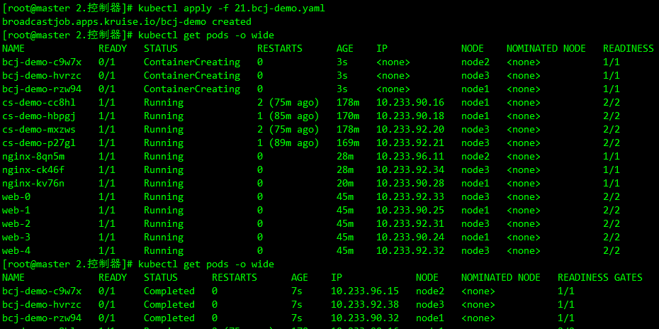

[OpenKruise](https://openkruise.io/) 是一个基于 Kubernetes 的**扩展套件**，主要聚焦于云原生应用的自动化，比如部署、发布、运维以及可用性防护。OpenKruise 提供的绝大部分能力都是基于 CRD 扩展来定义的，它们不存在于任何外部依赖，可以运行在任意纯净的 Kubernetes 集群中。Kubernetes 自身提供的一些应用部署管理功能，对于大规模应用与集群的场景这些功能是远远不够的，OpenKruise 弥补了 Kubernetes 在应用部署、升级、防护、运维等领域的不足。

OpenKruise 提供了以下核心能力：

- **增强版本的 Workloads**

  OpenKruise 包含了一系列增强版本的 Workloads（工作负载），比如 CloneSet、Advanced StatefulSet、Advanced DaemonSet、BroadcastJob 等。

  它们不仅支持类似于 Kubernetes 原生 Workloads 的基础功能，还提供了如原地升级、可配置的扩缩容/发布策略、并发操作等。

  其中，原地升级是一种升级应用容器镜像甚至环境变量的全新方式。它只会用新的镜像重建 Pod 中的特定容器，整个 Pod 以及其中的其他容器都不会被影响。因此它带来了更快的发布速度，以及避免了对其他 Scheduler、CNI、CSI 等组件的负面影响。

- **应用的旁路管理**

  OpenKruise 提供了多种通过旁路管理应用 sidecar 容器、多区域部署的方式，“旁路” 意味着你可以不需要修改应用的 Workloads 来实现它们。

  比如，SidecarSet 能帮助你在所有匹配的 Pod 创建的时候都注入特定的 sidecar 容器，甚至可以原地升级已经注入的 sidecar 容器镜像、并且对 Pod 中其他容器不造成影响。

  而 WorkloadSpread 可以约束无状态 Workload 扩容出来 Pod 的区域分布，赋予单一 workload 的多区域和弹性部署的能力。

- **高可用性防护**

  OpenKruise 在为应用的高可用性防护方面也做出了很多努力。

  目前它可以保护你的 Kubernetes 资源不受级联删除机制的干扰，包括 CRD、Namespace、以及几乎全部的 Workloads 类型资源。

  相比于 Kubernetes 原生的 PDB 只提供针对 Pod Eviction 的防护，PodUnavailableBudget 能够防护 Pod Deletion、Eviction、Update 等许多种 voluntary disruption 场景。

- **高级的应用运维能力**

  OpenKruise 也提供了很多高级的运维能力来帮助你更好地管理应用。

  可以通过 ImagePullJob 来在任意范围的节点上预先拉取某些镜像，或者指定某个 Pod 中的一个或多个容器被原地重启。

## 系统架构

下图是 OpenKruise 的整体架构：


### API

所有 OpenKruise 的功能都是通过 **Kubernetes API** 来提供, 比如：

- 新的 CRD 定义，比如

  ```sh
  kubectl get crd | grep kruise.io
  ```

  

  其中 `Kruise-manager` 是一个运行控制器和 webhook 的中心组件，它通过 Deployment 部署在 `kruise-system` 命名空间中。 从逻辑上来看，如 `cloneset-controller`、`sidecarset-controller` 这些的控制器都是独立运行的，不过为了减少复杂度，它们都被打包在一个独立的二进制文件、并运行在 `kruise-controller-manager-xxx` 这个 Pod 中。除了控制器之外，`kruise-controller-manager-xxx` 中还包含了针对 Kruise CRD 以及 Pod 资源的 admission webhook。`Kruise-manager` 会创建一些 webhook configurations 来配置哪些资源需要感知处理、以及提供一个 Service 来给 kube-apiserver 调用。

  从 v0.8.0 版本开始提供了一个新的 `Kruise-daemon` 组件，它通过 DaemonSet 部署到每个节点上，提供镜像预热、容器重启等功能。

## 安装

从 v1.0.0 (alpha/beta) 开始，OpenKruise 要求在 **Kubernetes >= 1.16** 以上版本的集群中安装和使用。

- 添加 charts 仓库

  ```sh
  helm repo add openkruise https://openkruise.github.io/charts/
  helm repo update
  ```

- 执行下面的命令安装最新版本的应用：

  ```sh
  helm install kruise openkruise/kruise --version 1.5.0
  ```

  

  该 charts 在模板中默认定义了命名空间为 `kruise-system`，所以在安装的时候可以不用指定，如果你的环境访问 DockerHub 官方镜像较慢，则可以使用下面的命令将镜像替换成阿里云的镜像：

  ```sh
  helm upgrade --install kruise openkruise/kruise --set manager.image.repository=openkruise-registry.cn-hangzhou.cr.aliyuncs.com/openkruise/kruise-manager --version 1.5.0
  ```

  应用部署完成后会在 `kruise-system` 命名空间下面运行 2 个 `kruise-manager` 的 Pod，同样它们之间采用 leader-election 的方式选主，同一时间只有一个提供服务，达到高可用的目的，此外还会以 DaemonSet 的形式启动 `kruise-daemon` 组件：

  ```sh
  kubectl get pod -n kruise-system
  ```

  

## CloneSet

`CloneSet` 控制器是 OpenKruise 提供的对原生 Deployment 的增强控制器，在使用方式上和 Deployment 几乎一致，如下所示是我们声明的一个 CloneSet 资源对象：_cloneset-demo.yaml_

```yaml
apiVersion: apps.kruise.io/v1alpha1
kind: CloneSet
metadata:
  name: cs-demo
spec:
  replicas: 3
  selector:
    matchLabels:
      app: cs
  template:
    metadata:
      labels:
        app: cs
    spec:
      containers:
        - name: nginx
          image: nginx
          imagePullPolicy: IfNotPresent
          ports:
            - containerPort: 80
```

直接创建上面的这个 CloneSet 对象：

```sh
kubectl apply -f cloneset-demo.yaml
```


```sh
kubectl describe cloneset cs-demo
```

```text
Name:         cs-demo
Namespace:    default
Labels:       <none>
Annotations:  <none>
API Version:  apps.kruise.io/v1alpha1
Kind:         CloneSet
Metadata:
  Creation Timestamp:  2023-11-03T04:26:56Z
  Generation:          1
  Managed Fields:
    API Version:  apps.kruise.io/v1alpha1
    Fields Type:  FieldsV1
    fieldsV1:
      f:status:
        .:
        f:availableReplicas:
        f:collisionCount:
        f:currentRevision:
        f:expectedUpdatedReplicas:
        f:labelSelector:
        f:observedGeneration:
        f:readyReplicas:
        f:replicas:
        f:updateRevision:
        f:updatedReadyReplicas:
        f:updatedReplicas:
    Manager:      kruise-manager
    Operation:    Update
    Subresource:  status
    Time:         2023-11-03T04:26:56Z
    API Version:  apps.kruise.io/v1alpha1
    Fields Type:  FieldsV1
    fieldsV1:
      f:metadata:
        f:annotations:
          .:
          f:kubectl.kubernetes.io/last-applied-configuration:
      f:spec:
        .:
        f:replicas:
        f:selector:
          .:
          f:matchLabels:
            .:
            f:app:
        f:template:
          .:
          f:metadata:
            .:
            f:labels:
              .:
              f:app:
          f:spec:
            .:
            f:containers:
    Manager:         kubectl-client-side-apply
    Operation:       Update
    Time:            2023-11-03T04:26:56Z
  Resource Version:  32196
  UID:               3bdb4d0c-f298-42e6-ac32-85808e4be2c9
Spec:
  Replicas:                3
  Revision History Limit:  10
  Scale Strategy:
  Selector:
    Match Labels:
      App:  cs
  Template:
    Metadata:
      Creation Timestamp:  <nil>
      Labels:
        App:  cs
    Spec:
      Containers:
        Image:              nginx
        Image Pull Policy:  IfNotPresent
        Name:               nginx
        Ports:
          Container Port:  80
          Protocol:        TCP
        Resources:
        Termination Message Path:    /dev/termination-log
        Termination Message Policy:  File
      Dns Policy:                    ClusterFirst
      Restart Policy:                Always
      Scheduler Name:                default-scheduler
      Security Context:
      Termination Grace Period Seconds:  30
  Update Strategy:
    Max Surge:        0
    Max Unavailable:  20%
    Partition:        0
    Type:             ReCreate
Status:
  Available Replicas:         0
  Collision Count:            0
  Current Revision:           cs-demo-6599fc6cdd
  Expected Updated Replicas:  3
  Label Selector:             app=cs
  Observed Generation:        1
  Ready Replicas:             0
  Replicas:                   3
  Update Revision:            cs-demo-6599fc6cdd
  Updated Ready Replicas:     0
  Updated Replicas:           3
Events:
  Type    Reason            Age   From                 Message
  ----    ------            ----  ----                 -------
  Normal  SuccessfulCreate  40s   cloneset-controller  succeed to create pod cs-demo-8zbgl
  Normal  SuccessfulCreate  40s   cloneset-controller  succeed to create pod cs-demo-cc8hl
  Normal  SuccessfulCreate  40s   cloneset-controller  succeed to create pod cs-demo-mxzws
```

```sh
kubectl get pods -l app=cs
```


CloneSet 虽然在使用上和 Deployment 比较类似，但还是有非常多比 Deployment 更高级的功能:

### 扩缩容

CloneSet 在扩容的时候可以通过 `ScaleStrategy.MaxUnavailable` 来限制扩容的步长，这样可以对服务应用的影响最小，可以设置一个绝对值或百分比，如果不设置该值，则表示不限制。

比如在上面的资源清单中添加如下所示数据：

```yaml
apiVersion: apps.kruise.io/v1alpha1
kind: CloneSet
metadata:
  name: cs-demo
spec:
  minReadySeconds: 60
  scaleStrategy:
    maxUnavailable: 1
  replicas: 5
  ......
```

上面配置的 `scaleStrategy.maxUnavailable` 为 1，结合 `minReadySeconds` 参数，表示在扩容时，只有当上一个扩容出的 Pod 已经 Ready 超过一分钟后，CloneSet 才会执行创建下一个 Pod，比如这里我们扩容成 5 个副本，更新上面对象后查看 CloneSet 的事件：


可以看到第一时间扩容了一个 Pod，由于配置了 `minReadySeconds: 60`，也就是新扩容的 Pod 创建成功超过 1 分钟后才会扩容另外一个 Pod，上面的 Events 信息也能表现出来，查看 Pod 的 `AGE` 也能看出来扩容的 2 个 Pod 之间间隔了 1 分钟左右：


当 CloneSet 被缩容时，还可以指定一些 Pod 来删除，这对于 StatefulSet 或者 Deployment 来说是无法实现的， StatefulSet 是根据序号来删除 Pod，而 Deployment/ReplicaSet 目前只能根据控制器里定义的排序来删除。而 CloneSet 允许用户在缩小 replicas 数量的同时，指定想要删除的 Pod 名字，如下所示：

```yaml
apiVersion: apps.kruise.io/v1alpha1
kind: CloneSet
metadata:
  name: cs-demo
spec:
  minReadySeconds: 60
  scaleStrategy:
    maxUnavailable: 1
    podsToDelete:
    - cs-demo-8zbgl
  replicas: 4
  ......
```

更新上面的资源对象后，会将应用缩到 4 个 Pod，如果在 `podsToDelete` 列表中指定了 Pod 名字，则控制器会优先删除这些 Pod，对于已经被删除的 Pod，控制器会自动从 `podsToDelete` 列表中清理掉。比如更新上面的资源对象后 `cs-demo-8zbgl` 这个 Pod 会被移除，其余会保留下来：


如果只把 Pod 名字加到 `podsToDelete`，但没有修改 replicas 数量，那么控制器会先把指定的 Pod 删掉，然后再扩一个新的 Pod，另一种直接删除 Pod 的方式是在要删除的 Pod 上打 `apps.kruise.io/specified-delete: true` 标签。

相比于手动直接删除 Pod，使用 `podsToDelete` 或 `apps.kruise.io/specified-delete: true` 方式会有 CloneSet 的 `maxUnavailable/maxSurge` 来保护删除， 并且会触发 `PreparingDelete` 生命周期的钩子。

### 升级

CloneSet 一共提供了 3 种升级方式：

- `ReCreate`: 删除旧 Pod 和它的 PVC，然后用新版本重新创建出来，这是默认的方式
- `InPlaceIfPossible`: 会优先尝试原地升级 Pod，如果不行再采用重建升级
- `InPlaceOnly`: 只允许采用原地升级，因此，用户只能修改上一条中的限制字段，如果尝试修改其他字段会被拒绝

这里有一个重要概念：**原地升级**，这也是 OpenKruise 提供的核心功能之一，当要升级一个 Pod 中镜像的时候，下图展示了**重建升级**和**原地升级**的区别：


**重建升级**时会删除旧 Pod、创建新 Pod：

- Pod 名字和 uid 发生变化，因为它们是完全不同的两个 Pod 对象（比如 Deployment 升级）
- Pod 名字可能不变、但 uid 变化，因为它们是不同的 Pod 对象，只是复用了同一个名字（比如 StatefulSet 升级）
- Pod 所在 Node 名字可能发生变化，因为新 Pod 很可能不会调度到之前所在的 Node 节点
- Pod IP 发生变化，因为新 Pod 很大可能性是不会被分配到之前的 IP 地址

但是对于**原地升级**，仍然复用同一个 Pod 对象，只是修改它里面的字段：

- 可以避免如*调度*、_分配 IP_、*挂载盘*等额外的操作和代价
- 更快的镜像拉取，因为会复用已有旧镜像的大部分 layer 层，只需要拉取新镜像变化的一些 layer
- 当一个容器在原地升级时，Pod 中的其他容器不会受到影响，仍然维持运行

所以用**原地升级**方式来升级工作负载，对在线应用的影响是最小的。上面提到 CloneSet 升级类型支持 `InPlaceIfPossible`，这意味着 Kruise 会尽量对 Pod 采取原地升级，如果不能则退化到重建升级，以下的改动会被允许执行原地升级：

- 更新 workload 中的 `spec.template.metadata.*`，比如 labels/annotations，Kruise 只会将 metadata 中的改动更新到存量 Pod 上。
- 更新 workload 中的 `spec.template.spec.containers[x].image`，Kruise 会原地升级 Pod 中这些容器的镜像，而不会重建整个 Pod。
- 从 Kruise v1.0 版本开始，更新 `spec.template.metadata.labels/annotations` 并且 container 中有配置 env from 这些改动的 `labels/anntations`，Kruise 会原地升级这些容器来生效新的 env 值。

否则，其他字段的改动，比如 `spec.template.spec.containers[x].env` 或 `spec.template.spec.containers[x].resources`，都是会回退为重建升级。

比如将上面的应用升级方式设置为 `InPlaceIfPossible`，只需要在资源清单中添加 `spec.updateStrategy.type: InPlaceIfPossible` 即可：

```yaml
apiVersion: apps.kruise.io/v1alpha1
kind: CloneSet
metadata:
  name: cs-demo
spec:
  updateStrategy:
    type: InPlaceIfPossible
  ......
```

升级前:


升级后:


更新后可以发现 Pod 的状态并没有发生什么大的变化，名称、IP 都一样，唯一变化的是镜像 tag

这就是原地升级的效果，原地升级整体工作流程如下图所示：


如果在安装或升级 Kruise 的时候启用了 `PreDownloadImageForInPlaceUpdate` 这个 feature-gate，CloneSet 控制器会自动在所有旧版本 pod 所在节点上预热你正在灰度发布的新版本镜像，这对于应用发布加速很有帮助。

默认情况下 CloneSet 每个新镜像预热时的并发度都是 1，也就是一个一个节点拉镜像，如果需要调整，你可以在 CloneSet annotation 上设置并发度：

```yaml
apiVersion: apps.kruise.io/v1alpha1
kind: CloneSet
metadata:
  annotations:
    apps.kruise.io/image-predownload-parallelism: "5"
```

注意，为了避免大部分不必要的镜像拉取，目前只针对 `replicas > 3` 的 CloneSet 做自动预热。

此外 CloneSet 还支持分批进行灰度，在 `updateStrategy` 属性中可以配置 `partition` 参数，该参数可以用来**保留旧版本 Pod 的数量或百分比**，默认为 0：

- 如果是数字，控制器会将 `(replicas - partition)` 数量的 Pod 更新到最新版本
- 如果是百分比，控制器会将 `(replicas * (100% - partition))` 数量的 Pod 更新到最新版本

将上面示例中的的 image 更新为 `nginx:latest` 并且设置 `partition=2`，更新后，过一会查看可以发现只升级了 2 个 Pod：


## Advanced StatefulSet

该控制器在原生的 StatefulSet 基础上增强了发布能力，比如 `maxUnavailable` 并行发布、原地升级等，该对象的名称也是 StatefulSet，但是 apiVersion 是 `apps.kruise.io/v1beta1`，这个 CRD 的所有默认字段、默认行为与原生 StatefulSet 完全一致，除此之外还提供了一些 optional 字段来扩展增强的策略。因此，用户从原生 StatefulSet 迁移到 Advanced StatefulSet，只需要把 apiVersion 修改后提交即可：

```yaml
-  apiVersion: apps/v1
+  apiVersion: apps.kruise.io/v1beta1
   kind: StatefulSet
   metadata:
     name: sample
   spec:
     #...
```

注意从 Kruise 0.7.0 开始，Advanced StatefulSet 版本升级到了 `v1beta1`，并与 `v1alpha1` 兼容。对于低于 v0.7.0 版本的 Kruise，只能使用 `v1alpha1`。

### 最大不可用

Advanced StatefulSet 在滚动更新策略中新增了 maxUnavailable 来支持并行 Pod 发布，它会保证发布过程中最多有多少个 Pod 处于不可用状态。注意，maxUnavailable 只能配合 `podManagementPolicy` 为 Parallel 来使用。

这个策略的效果和 Deployment 中的类似，但是可能会导致发布过程中的 order 顺序不能严格保证，如果不配置 maxUnavailable，它的默认值为 1，也就是和原生 StatefulSet 一样只能串行发布 Pod，即使把 podManagementPolicy 配置为 Parallel 也是这样。

创建一个如下所示的 Advanced StatefulSet：_asts-demo.yaml_

```yaml
apiVersion: apps.kruise.io/v1beta1
kind: StatefulSet
metadata:
  name: web
  namespace: default
spec:
  serviceName: "nginx-headless"
  podManagementPolicy: Parallel
  replicas: 5
  updateStrategy:
    type: RollingUpdate
    rollingUpdate:
      maxUnavailable: 3
      # partition: 4
  selector:
    matchLabels:
      app: nginx
  template:
    metadata:
      labels:
        app: nginx
    spec:
      containers:
        - name: nginx
          image: nginx
          ports:
            - containerPort: 80
```

直接创建该对象，由于对象名称也是 StatefulSet，所以不能直接用 `get sts` 来获取了，要通过 `get asts` 获取：

```sh
kubectl apply -f asts-demo.yaml
```

```sh
kubectl get asts -n default
```


该应用下有五个 Pod，假设应用能容忍 3 个副本不可用，当把 StatefulSet 里的 Pod 升级版本的时候，可以通过以下步骤来做：

1. 设置 maxUnavailable=3
2. (可选) 如果需要灰度升级，设置 partition=4，Partition 默认的意思是 order 大于等于这个数值的 Pod 才会更新，在这里就只会更新 P4，即使我们设置了 maxUnavailable=3。
3. 在 P4 升级完成后，把 partition 调整为 0，此时，控制器会同时升级 P1、P2、P3 三个 Pod。注意，如果是原生 StatefulSet，只能串行升级 P3、P2、P1。
4. 一旦这三个 Pod 中有一个升级完成了，控制器会立即开始升级 P0。

把上面应用的镜像版本进行修改，更新后查看 Pod 状态，可以看到有 3 个 Pod 并行升级的：

```sh
kubectl get pods -l app=nginx
```


### 原地升级

Advanced StatefulSet 增加了 `podUpdatePolicy` 来允许用户指定重建升级还是原地升级。此外还在原地升级中提供了 graceful period 选项，作为优雅原地升级的策略。用户如果配置了 `gracePeriodSeconds` 这个字段，控制器在原地升级的过程中会先把 Pod status 改为 not-ready，然后等一段时间（gracePeriodSeconds），最后再去修改 Pod spec 中的镜像版本。这样，就为 endpoints-controller 这些控制器留出了充足的时间来将 Pod 从 endpoints 端点列表中去除。

如果使用 `InPlaceIfPossible` 或 `InPlaceOnly` 策略，必须要增加一个 `InPlaceUpdateReady readinessGate`，用来在原地升级的时候控制器将 Pod 设置为 NotReady，比如设置上面的应用为原地升级的方式：

```yaml
apiVersion: apps.kruise.io/v1beta1
kind: StatefulSet
metadata:
  name: web
  namespace: default
spec:
  serviceName: "nginx-headless"
  podManagementPolicy: Parallel
  replicas: 5
  updateStrategy:
    type: RollingUpdate
    rollingUpdate:
      podUpdatePolicy: InPlaceIfPossible # 尽可能执行原地升级
      maxUnavailable: 3
      # partition: 4
  selector:
    matchLabels:
      app: nginx
  template:
    metadata:
      labels:
        app: nginx
    spec:
      readinessGates:
        - conditionType: InPlaceUpdateReady # 一个新的条件，可确保 Pod 在发生原地更新时保持在 NotReady 状态
      containers:
        - name: nginx
          image: nginx
          ports:
            - containerPort: 80
```

这里设置 `updateStrategy.rollingUpdate.podUpdatePolicy` 为 `InPlaceIfPossible` 模式，表示尽可能使用原地升级的方式进行更新，此外在 Pod 模板中还添加了一个 `readinessGates` 属性，可以用来确保 Pod 在发生原地更新时保持在 NotReady 状态。比如现在使用上面资源清单更新应用，然后重新修改镜像的版本更新，则会进行原地升级：

```sh
kubectl describe asts web
```


同样的 Advanced StatefulSet 也支持原地升级自动预热。

也可以通过设置 paused 为 true 来暂停发布，不过控制器还是会做 replicas 数量管理：

```yaml
apiVersion: apps.kruise.io/v1beta1
kind: StatefulSet
spec:
  # ...
  updateStrategy:
    rollingUpdate:
      paused: true
```

另外 Advanced StatefulSet 还支持序号保留功能，通过在 `reserveOrdinals` 字段中写入需要保留的序号，Advanced StatefulSet 会自动跳过创建这些序号的 Pod，如果 Pod 已经存在，则会被删除。

> 注意，`spec.replicas` 是期望运行的 Pod 数量，`spec.reserveOrdinals` 是要跳过的序号。

```yaml
apiVersion: apps.kruise.io/v1beta1
kind: StatefulSet
spec:
  # ...
  replicas: 4
  reserveOrdinals:
    - 1
```

比如上面的描述 `replicas=4, reserveOrdinals=[1]` 的 Advanced StatefulSet，表示实际运行的 Pod 序号为 [0,2,3,4]。

- 如果要把 Pod-3 做迁移并保留序号，则把 3 追加到 reserveOrdinals 列表中，控制器会把 Pod-3 删除并创建 Pod-5（此时运行中 Pod 为 [0,2,4,5]）。
- 如果只想删除 Pod-3，则把 3 追加到 reserveOrdinals 列表并同时把 replicas 减一修改为 3。控制器会把 Pod-3 删除（此时运行中 Pod 为 [0,2,4]）。

为了避免在一个新 Advanced StatefulSet 创建后有大量失败的 pod 被创建出来，从 Kruise v0.10.0 版本开始引入了在 scale strategy 中的 maxUnavailable 策略。

```yaml
apiVersion: apps.kruise.io/v1beta1
kind: StatefulSet
spec:
  # ...
  replicas: 100
  scaleStrategy:
    maxUnavailable: 10% # percentage or absolute number
```

当这个字段被设置之后，Advanced StatefulSet 会保证创建 pod 之后不可用 pod 数量不超过这个限制值。比如说，上面这个 StatefulSet 一开始只会一次性创建 100\*10%=10 个 pod，在此之后，每当一个 pod 变为 running、ready 状态后，才会再创建一个新 pod 出来。

> 注意，这个功能只允许在 podManagementPolicy 是 `Parallel` 的 StatefulSet 中使用。

## Advanced DaemonSet

这个控制器基于原生 DaemonSet 上增强了发布能力，比如灰度分批、按 Node label 选择、暂停、热升级等。同样的该对象的 Kind 名字也是 DaemonSet，只是 apiVersion 是 `apps.kruise.io/v1alpha1`，这个 CRD 的所有默认字段、默认行为与原生 DaemonSet 完全一致，除此之外还提供了一些 optional 字段来扩展增强的策略。

因此，用户从原生 DaemonSet 迁移到 Advanced DaemonSet，只需要把 apiVersion 修改后提交即可：

```sh
-  apiVersion: apps/v1
+  apiVersion: apps.kruise.io/v1alpha1
   kind: DaemonSet
   metadata:
     name: sample-ds
   spec:
     #...
```

### 升级

Advanced DaemonSet 在 `spec.updateStrategy.rollingUpdate` 中有一个 `rollingUpdateType` 字段，标识了如何进行滚动升级：

- `Standard`: 对于每个节点，控制器会先删除旧的 daemon Pod，再创建一个新 Pod，和原生 DaemonSet 行为一致。
- `Surging`: 对于每个 node，控制器会先创建一个新 Pod，等它 ready 之后再删除老 Pod。

创建如下所示的资源对象：

```yaml
apiVersion: apps.kruise.io/v1alpha1
kind: DaemonSet
metadata:
  name: nginx
  namespace: default
spec:
  updateStrategy:
    type: RollingUpdate
    rollingUpdate:
      rollingUpdateType: Standard
  selector:
    matchLabels:
      k8s-app: nginx
  template:
    metadata:
      labels:
        k8s-app: nginx
    spec:
      containers:
        - name: nginx
          image: nginx
          ports:
            - name: http
              containerPort: 80
```

```sh
kubectl apply -f ads-demo.yaml
```

```sh
kubectl get daemon -n default
```


我们这里只有3个 Work 节点，所以一共运行了 3 个 Pod，每个节点上一个，和默认的 DaemonSet 行为基本一致。此外这个策略还支持用户通过配置 node 标签的 selector，来指定灰度升级某些特定类型 node 上的 Pod，比如现在只升级 node1 节点的应用，则可以使用 `selector` 标签来标识：

```yaml
apiVersion: apps.kruise.io/v1alpha1
kind: DaemonSet
spec:
  # ...
  updateStrategy:
    type: RollingUpdate
    rollingUpdate:
      rollingUpdateType: Standard
      selector:
        matchLabels:
          kubernetes.io/hostname: node1
# ...
```

更新应用后可以看到只会更新 node1 节点上的 Pod：


和前面两个控制器一样，Advanced DaemonSet 也支持分批灰度升级，使用 Partition 进行配置，Partition 的语义是**保留旧版本 Pod 的数量**，默认为 0，如果在发布过程中设置了 partition，则控制器只会将 `(status.DesiredNumberScheduled - partition)` 数量的 Pod 更新到最新版本。

```yaml
apiVersion: apps.kruise.io/v1alpha1
kind: DaemonSet
spec:
  # ...
  updateStrategy:
    type: RollingUpdate
    rollingUpdate:
      partition: 10 #保留10个旧版本的pod
      paused: true # 暂停发布
```

同样 Advanced DaemonSet 也是支持原地升级的，只需要设置 `rollingUpdateType` 为支持原地升级的类型即可，比如这里将上面的应用升级方式设置为 `InPlaceIfPossible` 即可：

```yaml
apiVersion: apps.kruise.io/v1alpha1
kind: DaemonSet
spec:
  # ...
  updateStrategy:
    type: RollingUpdate
    rollingUpdate:
      rollingUpdateType: InPlaceIfPossible
```

## BroadcastJob

这个控制器将 Pod 分发到集群中每个节点上，类似于 DaemonSet，但是 BroadcastJob 管理的 Pod 并不是长期运行的 daemon 服务，而是类似于 Job 的任务类型 Pod，在每个节点上的 Pod 都执行完成退出后，BroadcastJob 和这些 Pod 并不会占用集群资源。 这个控制器非常有利于做升级基础软件、巡检等过一段时间需要在整个集群中跑一次的工作。

比如声明一个如下所示的 BroadcastJob 对象：_bcj-demo.yaml_

```yaml
apiVersion: apps.kruise.io/v1alpha1
kind: BroadcastJob
metadata:
  name: bcj-demo
  namespace: default
spec:
  template:
    spec:
      restartPolicy: Never
      containers:
        - name: counter
          image: busybox
          command:
            - /bin/sh
            - -c
            - for i in 9 8 7 6 5 4 3 2 1; do echo $i; done;
```

```sh
kubectl apply -f bcj-demo.yaml
```

```sh
kubectl get bcj bcj-demo
```

```sh
kubectl get pod -n default -o wide
```


可以看到创建了一个 BroadcastJob 对象后，同时启动了3个 Pod 任务，每个节点上一个，这和原生的 Job 是不太一样的。创建的 BroadcastJob 一共有以下几种状态：

- Desired : 期望的 Pod 数量（等同于当前集群中匹配的节点数量）
- Active: 运行中的 Pod 数量
- SUCCEEDED: 执行成功的 Pod 数量
- FAILED: 执行失败的 Pod 数量

此外在 BroadcastJob 对象中还可以配置任务完成后的一些策略，比如配置 `completionPolicy.ttlSecondsAfterFinished: 30`，表示这个 job 会在执行结束后 30s 被删除。

```yaml
apiVersion: apps.kruise.io/v1alpha1
kind: BroadcastJob
metadata:
  name: bcj-demo
  namespace: default
spec:
  template:
    spec:
      completionPolicy:
        type: Always
        ttlSecondsAfterFinished: 30
      restartPolicy: Never
      containers:
        - name: counter
          image: busybox
          command:
            - /bin/sh
            - -c
            - for i in 9 8 7 6 5 4 3 2 1; do echo $i; done;
```



配置 `completionPolicy.activeDeadlineSeconds` 为 10，表示这个 job 会在运行超过 10s 之后被标记为失败，并把下面还在运行的 Pod 删除掉。

```yaml
apiVersion: apps.kruise.io/v1alpha1
kind: BroadcastJob
metadata:
  name: bcj-demo
  namespace: default
spec:
  template:
    spec:
      completionPolicy:
        type: Always
        activeDeadlineSeconds: 10
      restartPolicy: Never
      containers:
        - name: counter
          image: busybox
          command:
            - /bin/sh
            - -c
            - for i in 9 8 7 6 5 4 3 2 1; do echo $i; done;
```

completionPolicy 类型除了 Always 之外还可以设置为 `Never`，表示这个 job 会持续运行即使当前所有节点上的 Pod 都执行完成了。

```yaml
apiVersion: apps.kruise.io/v1alpha1
kind: BroadcastJob

spec:
  completionPolicy:
    type: Never
  # ......
```

## AdvancedCronJob

AdvancedCronJob 是对于原生 CronJob 的扩展版本，根据用户设置的 schedule 规则，周期性创建 Job 执行任务，而 AdvancedCronJob 的 template 支持多种不同的 job 资源：

```yaml
apiVersion: apps.kruise.io/v1alpha1
kind: AdvancedCronJob
spec:
  template:
    # Option 1: use jobTemplate, which is equivalent to original CronJob
    jobTemplate:
      # ...
    # Option 2: use broadcastJobTemplate, which will create a BroadcastJob object when cron schedule triggers
    broadcastJobTemplate:
      # ...
```

- `jobTemplate`：与原生 CronJob 一样创建 Job 执行任务
- `broadcastJobTemplate`：周期性创建 BroadcastJob 执行任务


```yaml
apiVersion: apps.kruise.io/v1alpha1
kind: AdvancedCronJob
metadata:
  name: acj-demo
spec:
  schedule: "*/1 * * * *"
  template:
    broadcastJobTemplate:
      spec:
        completionPolicy:
          type: Always
          ttlSecondsAfterFinished: 30
        template:
          spec:
            restartPolicy: Never
            containers: # 一定不是一个常驻前台的进程，一定是一个任务，执行完成后需要退出的
              - name: counter
                image: busybox
                command:
                  - "/bin/sh"
                  - "-c"
                  - "for i in 9 8 7 6 5 4 3 2 1; do echo $i; done"
```

上述 YAML 定义了一个 AdvancedCronJob，每分钟创建一个 BroadcastJob 对象，这个 BroadcastJob 会在所有节点上运行一个 job 任务。

```sh
kubectl apply -f acj-demo.yaml
```

```sh
kubectl get acj
```

```sh
kubectl get bcj
```

```sh
kubectl get pod -n default
```


## SidecarSet

SidecarSet 支持通过 admission webhook 来自动为集群中创建的符合条件的 Pod 注入 sidecar 容器，除了在 Pod 创建时候注入外，SidecarSet 还提供了为 Pod 原地升级其中已经注入的 sidecar 容器镜像的能力。SidecarSet 将 sidecar 容器的定义和生命周期与业务容器解耦，它主要用于管理无状态的 sidecar 容器，比如监控、日志等 agent。

比如定义一个如下所示的 SidecarSet 资源对象：_sidecarset.yaml_

```yaml
apiVersion: apps.kruise.io/v1alpha1
kind: SidecarSet
metadata:
  name: test-sidecarset
spec:
  selector:
    matchLabels:
      app: nginx
  updateStrategy:
    type: RollingUpdate
    maxUnavailable: 1
  containers:
    - name: sidecar1
      image: busybox
      command: ["sleep", "999d"]
      volumeMounts:
        - name: log-volume
          mountPath: /var/log
  volumes: # this field will be merged into pod.spec.volumes
    - name: log-volume
      emptyDir: {}
```

直接创建这个资源对象:

```sh
kubectl apply -f sidecarset.yaml
```

```sh
kubectl get sidecarset -n default
```


需要注意上面我们在定义 SidecarSet 对象的时候里面有一个非常终于的属性就是 label selector，会去匹配具有 `app=nginx` 的 Pod，然后向其中注入下面定义的 `sidecar1` 这个容器，比如定义如下所示的一个 Pod，该 Pod 中包含 `app=nginx` 的标签，这样可以和上面的 SidecarSet 对象匹配：

```yaml
apiVersion: v1
kind: Pod
metadata:
  labels:
    app: nginx # matches the SidecarSet's selector
  name: test-pod
spec:
  containers:
    - name: app
      image: nginx
```


可以看到该 Pod 中有 2 个容器，被自动注入了上面定义的 `sidecar1` 容器：

```sh
kubectl get pod test-pod -n default -o yaml
```


现在更新 SidecarSet 中的 sidecar 容器镜像替换成 `busybox:1.35.0`：

```sh
kubectl patch sidecarset test-sidecarset --type='json' -p='[{"op": "replace", "path": "/spec/containers/0/image", "value": "busybox:1.35.0"}]'
```


可以看到 Pod 中的 sidecar 容器镜像被原地升级成 `busybox:1.35.0` 了， 对主容器没有产生任何影响。

### 同意特性

需要注意的是 sidecar 的注入只会发生在 Pod 创建阶段，并且只有 Pod spec 会被更新，不会影响 Pod 所属的 workload template 模板。 `spec.containers` 除了默认的 k8s container 字段，还扩展了如下一些字段，来方便注入：

```yaml
apiVersion: apps.kruise.io/v1alpha1
kind: SidecarSet
metadata:
  name: sidecarset
spec:
  selector:
    matchLabels:
      app: sample
  containers:
    # 默认的K8s容器字段
    - name: nginx
      image: nginx:alpine
      volumeMounts:
        - mountPath: /nginx/conf
          name: nginx.conf
      # 扩展的sidecar容器字段
      podInjectPolicy: BeforeAppContainer
      shareVolumePolicy:
        type: disabled | enabled
      transferEnv:
        - sourceContainerName: main
          envName: PROXY_IP
  volumes:
    - name: nginx.conf
      hostPath: /data/nginx/conf
```

- podInjectPolicy定义了容器 注入到pod.spec.containers中的位置
  - `BeforeAppContainer`：表示注入到 pod 原 containers 的前面（(默认) ）
  - `AfterAppContainer`： 表示注入到 pod 原 containers 的后面
- 数据卷共享
  - 共享指定卷：通过 `spec.volumes` 来定义 sidecar 自身需要的 volume
  - 共享所有卷：通过 `spec.containers[i].shareVolumePolicy.type = enabled | disabled` 来控制是否挂载 pod 应用容器的卷，常用于日志收集等 sidecar，配置为 `enabled` 后会把应用容器中所有挂载点注入 sidecar 同一路经下(sidecar 中本身就有声明的数据卷和挂载点除外）
- 环境变量共享：可以通过 `spec.containers[i].transferEnv` 来从别的容器获取环境变量，会把名为 `sourceContainerName` 容器中名为 `envName` 的环境变量拷贝到本容器

SidecarSet 不仅支持 sidecar 容器的原地升级，而且提供了非常丰富的升级、灰度策略。同样在 SidecarSet 对象中 `updateStrategy` 属性下面也可以配置 `partition` 来定义保留旧版本 Pod 的数量或百分比，默认为 0；同样还可以配置的有 `maxUnavailable` 属性，表示在发布过程中的最大不可用数量。

- 当 `{matched pod}=100,partition=50,maxUnavailable=10`，控制器会发布 50 个 Pod 到新版本，但是同一时间只会发布 10 个 Pod，每发布好一个 Pod 才会再找一个发布，直到 50 个发布完成。
- 当 `{matched pod}=100,partition=80,maxUnavailable=30`，控制器会发布 20 个 Pod 到新版本，因为满足 maxUnavailable 数量，所以这 20 个 Pod 会同时发布。

同样也可以设置 `paused: true` 来暂停发布，此时对于新创建的、扩容的 pod 依旧会实现注入能力，已经更新的 pod 会保持更新后的版本不动，还没有更新的 pod 会暂停更新。

```yaml
apiVersion: apps.kruise.io/v1alpha1
kind: SidecarSet
metadata:
  name: sidecarset
spec:
  # ...
  updateStrategy:
    type: RollingUpdate
    maxUnavailable: 20%
    partition: 10
    paused: true
```

### 金丝雀发布

对于有金丝雀发布需求的业务，可以通过 `selector` 来实现，对于需要率先金丝雀灰度的 pod 打上固定的 `[canary.release] = true` 的标签，再通过 `selector.matchLabels` 来选中该 pod 即可。

比如现在有一个 3 副本的 Pod，也具有 `app=nginx` 的标签，如下所示:

```yaml
apiVersion: apps/v1
kind: Deployment
metadata:
  name: nginx
  namespace: default
spec:
  replicas: 3
  revisionHistoryLimit: 3
  selector:
    matchLabels:
      app: nginx
  template:
    metadata:
      labels:
        app: nginx
    spec:
      containers:
        - name: ngx
          image: nginx
          ports:
            - containerPort: 80
          resources:
            limits:
              memory: "128Mi"
              cpu: "500m"
```

创建后现在就具有 4 个 `app=nginx` 标签的 Pod 了，由于都匹配上面创建的 SidecarSet 对象，所以都会被注入一个 `sidecar1` 的容器，镜像为 `busybox`：


现在如果想为 `test-pod` 这个应用来执行灰度策略，将 sidecar 容器镜像更新成 `busybox:1.35.0`，则可以在 `updateStrategy` 下面添加 `selector.matchLabels` 属性 `canary.release: "true"`：

```yaml
apiVersion: apps.kruise.io/v1alpha1
kind: SidecarSet
metadata:
  name: test-sidecarset
spec:
  selector:
    matchLabels:
      app: nginx
  updateStrategy:
    type: RollingUpdate
    selector:
      matchLabels:
        canary.release: "true"
  containers:
    - name: sidecar1
      image: busybox:1.35.0
      command: ["sleep", "999d"]
      volumeMounts:
        - name: log-volume
          mountPath: /var/log
  volumes: # this field will be merged into pod.spec.volumes
    - name: log-volume
      emptyDir: {}
```

```yaml
apiVersion: v1
kind: Pod
metadata:
  labels:
    app: nginx # matches the SidecarSet's selector
    canary.release: "true"
  name: test-pod
spec:
  containers:
    - name: app
      image: nginx
```


### 热升级

SidecarSet 原地升级会先停止旧版本的容器，然后创建新版本的容器，这种方式适合不影响 Pod 服务可用性的 sidecar 容器，比如说日志收集的 Agent。

但是对于很多代理或运行时的 sidecar 容器，例如 Istio Envoy，这种升级方法就有问题了，Envoy 作为 Pod 中的一个代理容器，代理了所有的流量，如果直接重启，Pod 服务的可用性会受到影响，如果需要单独升级 envoy sidecar，就需要复杂的优雅终止和协调机制，所以我们为这种 sidecar 容器的升级提供了一种新的解决方案。

```yaml
apiVersion: apps.kruise.io/v1alpha1
kind: SidecarSet
metadata:
  name: hotupgrade-sidecarset
spec:
  selector:
    matchLabels:
      app: hotupgrade
  containers:
    - name: sidecar
      image: openkruise/hotupgrade-sample:sidecarv1
      imagePullPolicy: Always
      lifecycle:
        postStart:
          exec:
            command:
              - /bin/sh
              - /migrate.sh
      upgradeStrategy:
        upgradeType: HotUpgrade
        hotUpgradeEmptyImage: openkruise/hotupgrade-sample:empty
```

- `upgradeType`: `HotUpgrade` 代表该 sidecar 容器的类型是热升级方案
- `hotUpgradeEmptyImage`: 当热升级 sidecar 容器时，业务必须要提供一个 empty 容器用于热升级过程中的容器切换，empty 容器同 sidecar 容器具有相同的配置（除了镜像地址），例如：command、lifecycle、probe 等，但是它不做任何工作。
- `lifecycle.postStart`: 在 postStart 这个 hook 中完成热升级过程中的状态迁移，该脚本需要由业务根据自身的特点自行实现，例如：nginx 热升级需要完成 Listen FD 共享以及 reload 操作。

整体来说热升级特性总共包含以下两个过程：

- Pod 创建时，注入热升级容器
- 原地升级时，完成热升级流程

**注入热升级容器**

Pod 创建时，SidecarSet Webhook 将会注入两个容器：

- `{sidecarContainer.name}-1`: 如下图所示 envoy-1，这个容器代表正在实际工作的 sidecar 容器，例如：envoy:1.16.0
- `{sidecarContainer.name}-2`: 如下图所示 envoy-2，这个容器是业务配置的 hotUpgradeEmptyImage 容器，例如：empty:1.0，用于后面的热升级机制


这里以 OpenKruise 的官方示例来进行说明，首先创建上面的 `hotupgrade-sidecarset` 这个 SidecarSet。然后创建一个如下所示的 CloneSet 对象：

```yaml
apiVersion: apps.kruise.io/v1alpha1
kind: CloneSet
metadata:
  labels:
    app: hotupgrade
  name: busybox
spec:
  replicas: 1
  selector:
    matchLabels:
      app: hotupgrade
  template:
    metadata:
      labels:
        app: hotupgrade
    spec:
      containers:
        - name: busybox
          image: openkruise/hotupgrade-sample:busybox
```

创建完成后，CloneSet 管理的 Pod 已经注入 `sidecar-1` 和 `sidecar-2` 两个容器：


```sh
kubectl describe pods busybox-hqvck
```


busybox 主容器每 100 毫秒会请求一次 sidecar(version=v1)服务：

```sh
kubectl logs -f busybox-hqvck -c busybox
```


升级 sidecar 容器，将镜像修改为 `openkruise/hotupgrade-sample:sidecarv2`：

```sh
kubectl patch sidecarset hotupgrade-sidecarset --type='json' -p='[{"op": "replace", "path": "/spec/containers/0/image", "value": "openkruise/hotupgrade-sample:sidecarv2"}]'
```


并且在更新过程中观察 busybox 容器仍然会不断请求 sidecar 服务，但是并没有失败的请求出现：

```shell
kubectl logs -f busybox-hqvck -c busybox
```


## Container Restart

`ContainerRecreateRequest` 控制器可以帮助用户重启/重建存量 Pod 中一个或多个容器。和 Kruise 提供的原地升级类似，当一个容器重建的时候，Pod 中的其他容器还保持正常运行，重建完成后，Pod 中除了该容器的 restartCount 增加以外不会有什么其他变化。

为要重建容器的 Pod 提交一个 `ContainerRecreateRequest` 自定义资源（缩写 CRR）：

```yaml
apiVersion: apps.kruise.io/v1alpha1
kind: ContainerRecreateRequest
metadata:
  namespace: pod-namespace
  name: xxx
spec:
  podName: pod-name
  containers: # 要重建的容器名字列表，至少要有 1 个
    - name: app
    - name: sidecar
  strategy:
    failurePolicy: Fail # 'Fail' 或 'Ignore'，表示一旦有某个容器停止或重建失败， CRR 立即结束
    orderedRecreate: false # 'true' 表示要等前一个容器重建完成了，再开始重建下一个
    terminationGracePeriodSeconds: 30 # 等待容器优雅退出的时间，不填默认用 Pod 中定义的
    unreadyGracePeriodSeconds: 3 # 在重建之前先把 Pod 设为 not ready，并等待这段时间后再开始执行重建
    minStartedSeconds: 10 # 重建后新容器至少保持运行这段时间，才认为该容器重建成功
  activeDeadlineSeconds: 300 # 如果 CRR 执行超过这个时间，则直接标记为结束（未结束的容器标记为失败）
  ttlSecondsAfterFinished: 1800 # CRR 结束后，过了这段时间自动被删除掉
```

一般来说，列表中的容器会一个一个被停止，但可能同时在被重建和启动，除非 `orderedRecreate` 被设置为 true。 `unreadyGracePeriodSeconds` 功能依赖于 `KruisePodReadinessGate` 这个 feature-gate，后者会在每个 Pod 创建的时候注入一个 `readinessGate`，否则，默认只会给 Kruise workload 创建的 Pod 注入 readinessGate，也就是说只有这些 Pod 才能在 CRR 重建时使用 `unreadyGracePeriodSeconds`。

## ImagePullJob

`NodeImage` 和 `ImagePullJob` 是从 Kruise v0.8.0 版本开始提供的 CRD。Kruise 会自动为每个 Node 创建一个 NodeImage，它包含了哪些镜像需要在这个 Node 上做预热，比如我们这里 4 个节点，则会自动创建 4 个 NodeImage 对象：

```shell
kubectl get nodeimage
```


查看 node1 节点上的 NodeImage 对象：

```yaml
kubectl get nodeimage node1 -o yaml
```


比如在这个节点上拉去一个 `ubuntu:latest` 镜像，则可以按照如下所示的去修改 spec：

```sh
......
spec:
  images:
    ubuntu:  # 镜像 name
      tags:
      - tag: latest  # 镜像 tag
        pullPolicy:
          ttlSecondsAfterFinished: 300  # [required] 拉取完成（成功或失败）超过 300s 后，将这个任务从 NodeImage 中清除
          timeoutSeconds: 600           # [optional] 每一次拉取的超时时间, 默认为 600
          backoffLimit: 3               # [optional] 拉取的重试次数，默认为 3
          activeDeadlineSeconds: 1200   # [optional] 整个任务的超时时间，无默认值
```

```sh
kubectl edit nodeimage node1

# 把spec: {}替换成上面的spec那一堆配置
```


更新后可以从 status 中看到拉取进度以及结果，并且拉取完成 600s 后任务会被清除。

此外用户可以创建 `ImagePullJob` 对象，来指定一个镜像要在哪些节点上做预热。


比如创建如下所示的 `ImagePullJob` 资源对象：

```yaml
apiVersion: apps.kruise.io/v1alpha1
kind: ImagePullJob
metadata:
  name: job-with-always
spec:
  image: nginx:1.9.1 # [required] 完整的镜像名 name:tag
  parallelism: 10 # [optional] 最大并发拉取的节点梳理, 默认为 1
  selector: # [optional] 指定节点的 名字列表 或 标签选择器 (只能设置其中一种)
    names:
      - node-1
      - node-2
    matchLabels:
      node-type: xxx
  # podSelector:         # [optional] pod label 选择器来在这些 pod 所在节点上拉取镜像, 与 selector 不能同时设置.
  #  pod-label: xxx
  completionPolicy:
    type: Always # [optional] 默认为 Always
    activeDeadlineSeconds: 1200 # [optional] 无默认值, 只对 Alway 类型生效
    ttlSecondsAfterFinished: 300 # [optional] 无默认值, 只对 Alway 类型生效
  pullPolicy: # [optional] 默认 backoffLimit=3, timeoutSeconds=600
    backoffLimit: 3
    timeoutSeconds: 300
  pullSecrets:
    - secret-name1
    - secret-name2
```

可以在 `selector` 字段中指定节点的名字列表或标签选择器 (只能设置其中一种)，如果没有设置 selector 则会选择所有节点做预热。或者可以配置 `podSelector` 来在这些 pod 所在节点上拉取镜像，podSelector 与 selector 不能同时设置。

同时，ImagePullJob 有两种 `completionPolicy` 类型:

- `Always`：表示这个 job 是一次性预热，不管成功、失败都会结束
- `activeDeadlineSeconds`：整个 job 的 deadline 结束时间
- `ttlSecondsAfterFinished`：结束后超过这个时间，自动清理删除 job
- `Never`：表示这个 job 是长期运行、不会结束，并且会每天都会在匹配的节点上重新预热一次指定的镜像

同样如果预热的镜像来自私有仓库，则可以通过 `pullSecrets` 来指定仓库的 Secret 信息。

## 容器启动顺序

`Container Launch Priority` 提供了控制一个 Pod 中容器启动顺序的方法。通常来说 Pod 容器的启动和退出顺序是由 Kubelet 管理的，Kubernetes 曾经有一个 [KEP](https://github.com/kubernetes/enhancements/tree/master/keps/sig-node/753-sidecar-containers) 计划在 container 中增加一个 type 字段来标识不同类型容器的启停优先级，但是由于[sig-node 考虑到对现有代码架构的改动太大](https://github.com/kubernetes/enhancements/issues/753#issuecomment-713471597)，所以将该提案拒绝了。

> 这个功能作用在 Pod 对象上，不管它的 owner 是什么类型的，因此可以适用于 Deployment、CloneSet 以及其他的 workload 种类。

比如我们可以设置按照容器顺序启动，只需要在 Pod 中定义一个 `apps.kruise.io/container-launch-priority` 的注解即可：

```yaml
apiVersion: v1
kind: Pod
  annotations:
    apps.kruise.io/container-launch-priority: Ordered
spec:
  containers:
  - name: sidecar
    # ...
  - name: main
    # ...
```

Kruise 会保证前面的容器（sidecar）会在后面的容器（main）之前启动。

此外还可以按自定义顺序启动，但是需要在 Pod 容器中添加 `KRUISE_CONTAINER_PRIORITY` 这个环境变量:

```yaml
apiVersion: v1
kind: Pod
spec:
  containers:
    - name: main
      # ...
    - name: sidecar
      env:
        - name: KRUISE_CONTAINER_PRIORITY
          value: "1"
      # ...
```

该环境变量值的范围在 `[-2147483647, 2147483647]`，不写默认是 0，权重高的容器，会保证在权重低的容器之前启动，但是需要注意相同权重的容器不保证启动顺序。

除了这些常用的增强控制器之外 OpenKruise 还有很多高级的特性，可以前往官网 [https://openkruise.io](https://openkruise.io/) 了解更多信息。

