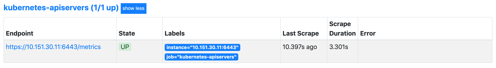

Prometheus 最初是 SoundCloud 构建的开源系统监控和报警工具，是一个独立的开源项目，于 2016 年加入了 CNCF 基金会，作为继 Kubernetes 之后的第二个托管项目。Prometheus 相比于其他传统监控工具主要有以下几个特点：

- 具有由 metric 名称和键/值对标识的时间序列数据的多维数据模型
- 有一个灵活的查询语言
- 不依赖分布式存储，只和本地磁盘有关
- 通过 HTTP 的服务拉取时间序列数据
- 也支持推送的方式来添加时间序列数据
- 还支持通过服务发现或静态配置发现目标
- 多种图形和仪表板支持

Prometheus 由多个组件组成，但是其中有些组件是可选的：

- `Prometheus Server`：用于抓取指标、存储时间序列数据
- `exporter`：暴露指标让任务来抓
- `pushgateway`：push 的方式将指标数据推送到该网关
- `alertmanager`：处理报警的报警组件
- `adhoc`：用于数据查询

大多数 Prometheus 组件都是用 Go 编写的，因此很容易构建和部署为静态的二进制文件。下图是 Prometheus 官方提供的架构及其一些相关的生态系统组件：


整体流程比较简单，Prometheus 直接接收或者通过中间的 Pushgateway 网关被动获取指标数据，在本地存储所有的获取的指标数据，并对这些数据进行一些规则整理，用来生成一些聚合数据或者报警信息，Grafana 或者其他工具用来可视化这些数据。

# 安装

由于 Prometheus 是 Golang 编写的程序，所以要安装的话也非常简单，只需要将二进制文件下载下来直接执行即可，前往地址：https://prometheus.io/download 下载最新版本即可。

Prometheus 是通过一个 YAML 配置文件来进行启动的，如果使用二进制的方式来启动的话，可以使用下面的命令：

```shell
./prometheus --config.file=prometheus.yml
```

其中 `prometheus.yml` 文件的基本配置如下：

```yaml
global:
  scrape_interval: 15s
  evaluation_interval: 15s

rule_files:
# - "first.rules"
# - "second.rules"

scrape_configs:
  - job_name: prometheus
    static_configs:
      - targets: ["localhost:9090"]
```

上面这个配置文件中包含了 3 个模块：`global`、`rule_files` 和 `scrape_configs`。

- `global` 模块控制 `Prometheus Server` 的全局配置：
  - `scrape_interval`：表示 prometheus 抓取指标数据的频率，默认是 15s，我们可以覆盖这个值
  - `evaluation_interval`：用来控制评估规则的频率，prometheus 使用规则产生新的时间序列数据或者产生警报
- `rule_files`：指定了报警规则所在的位置，prometheus 可以根据这个配置加载规则，用于生成新的时间序列数据或者报警信息，当前没有配置任何报警规则。
- `scrape_configs` 用于控制 prometheus 监控哪些资源。

由于 prometheus 通过 HTTP 的方式来暴露的它本身的监控数据，prometheus 也能够监控本身的健康情况。在默认的配置里有一个单独的 job，叫做 prometheus，它采集 prometheus 服务本身的时间序列数据。这个 job 包含了一个单独的、静态配置的目标：监听 localhost 上的 9090 端口。prometheus 默认会通过目标的 `/metrics` 路径采集 metrics。所以，默认的 job 通过 URL：`http://localhost:9090/metrics` 采集 metrics。收集到的时间序列包含 prometheus 服务本身的状态和性能。如果还有其他的资源需要监控的话，直接配置在 `scrape_configs` 模块下面就可以了。

## 示例应用

比如在本地启动一些样例来让 Prometheus 采集。Go 客户端库包含一个示例，该示例为具有不同延迟分布的三个服务暴露 RPC 延迟。

首先确保已经安装了 Go 环境并启用 go modules，下载 Prometheus 的 Go 客户端库并运行这三个示例：

```shell
git clone https://github.com/prometheus/client_golang.git
cd client_golang/examples/random
export GO111MODULE=on
export GOPROXY=https://goproxy.cn
go build
```

然后在 3 个独立的终端里面运行 3 个服务：

```shell
./random -listen-address=:8080
./random -listen-address=:8081
./random -listen-address=:8082
```

这个时候可以得到 3 个不同的监控接口：http://localhost:8080/metrics、http://localhost:8081/metrics 和 http://localhost:8082/metrics。

然后配置 Prometheus 来采集这些新的目标，将这三个目标分组到一个名为 example-random 的任务。假设前两个端点（即：http://localhost:8080/metrics、http://localhost:8081/metrics ）都是生产级目标应用，第三个端点（即：http://localhost:8082/metrics ）为金丝雀实例。要在 Prometheus 中对此进行建模，可以将多组端点添加到单个任务中，为每组目标添加额外的标签。 在此示例中，将 `group =“production”` 标签添加到第一组目标，同时将 `group=“canary”`添加到第二组。将以下配置添加到 `prometheus.yml` 中的 `scrape_configs` 部分，然后重新启动 Prometheus 实例：

```yaml
scrape_configs:
  - job_name: "example-random"
    # Override the global default and scrape targets from this job every 5 seconds.
    scrape_interval: 5s
    static_configs:
      - targets: ["localhost:8080", "localhost:8081"]
        labels:
          group: "production"
      - targets: ["localhost:8082"]
        labels:
          group: "canary"
```

然后到浏览器中查看 Prometheus 的配置是否有新增的任务，这就是 Prometheus 添加监控配置最基本的配置方式了，非常简单，只需要提供一个符合 metrics 格式的可访问的接口配置给 Prometheus 就可以了。


由于最终要运行在 Kubernetes 系统中，所以用 Docker 镜像的方式运行。

为了能够方便的管理配置文件，这里将 `prometheus.yml` 文件用 ConfigMap 的形式进行管理：_prometheus-cm.yaml_

```yaml
apiVersion: v1
kind: ConfigMap
metadata:
  name: prometheus-config
  namespace: monitor
data:
  prometheus.yml: |
    global:
      scrape_interval: 15s
      scrape_timeout: 15s
    scrape_configs:
    - job_name: 'prometheus'
      static_configs:
      - targets: ['localhost:9090']
```

这里暂时只配置了对 prometheus 本身的监控，直接创建该资源对象：

```sh
kubectl apply -f prometheus-cm.yaml
```

配置文件创建完成了，以后有新的资源需要被监控，只需要将上面的 ConfigMap 对象更新即可。现在创建 prometheus 的 Pod 资源：

```yaml
apiVersion: apps/v1
kind: Deployment
metadata:
  name: prometheus
  namespace: monitor
  labels:
    app: prometheus
spec:
  selector:
    matchLabels:
      app: prometheus
  template:
    metadata:
      labels:
        app: prometheus
    spec:
      serviceAccountName: prometheus
      containers:
        - image: prom/prometheus:v2.48.1
          name: prometheus
          args:
            - "--config.file=/etc/prometheus/prometheus.yml"
            - "--storage.tsdb.path=/prometheus" # 指定tsdb数据路径
            - "--storage.tsdb.retention.time=24h"
            - "--web.enable-admin-api" # 控制对admin HTTP API的访问，其中包括删除时间序列等功能
            - "--web.enable-lifecycle" # 支持热更新，直接执行localhost:9090/-/reload立即生效
          ports:
            - containerPort: 9090
              name: http
          volumeMounts:
            - mountPath: "/etc/prometheus"
              name: config-volume
            - mountPath: "/prometheus"
              name: data
          resources:
            requests:
              cpu: 100m
              memory: 512Mi
            limits:
              cpu: 100m
              memory: 512Mi
      volumes:
        - name: data
          persistentVolumeClaim:
            claimName: prometheus-data
        - configMap:
            name: prometheus-config
          name: config-volume
```

另外为了 prometheus 的性能和数据持久化这里是直接将通过一个 LocalPV 来进行数据持久化的，通过 `--storage.tsdb.path=/prometheus` 指定数据目录，创建如下所示的一个 PVC 资源对象，注意是一个 LocalPV，和 node1 节点具有亲和性：_prometheus-pv.yaml_

```yaml
apiVersion: v1
kind: PersistentVolume
metadata:
  name: prometheus-local
  labels:
    app: prometheus
spec:
  accessModes:
    - ReadWriteOnce
  capacity:
    storage: 20Gi
  storageClassName: local-storage
  local:
    path: /data/k8s/prometheus
  nodeAffinity:
    required:
      nodeSelectorTerms:
        - matchExpressions:
            - key: kubernetes.io/hostname
              operator: In
              values:
                - node1
  persistentVolumeReclaimPolicy: Retain
---
apiVersion: v1
kind: PersistentVolumeClaim
metadata:
  name: prometheus-data
  namespace: monitor
spec:
  selector:
    matchLabels:
      app: prometheus
  accessModes:
    - ReadWriteOnce
  resources:
    requests:
      storage: 20Gi
  storageClassName: local-storage
```

由于 prometheus 可以访问 Kubernetes 的一些资源对象，所以需要配置 rbac 相关认证，这里使用了一个名为 prometheus 的 serviceAccount 对象：_prometheus-rbac.yaml_

```yaml
apiVersion: v1
kind: ServiceAccount
metadata:
  name: prometheus
  namespace: monitor
---
apiVersion: rbac.authorization.k8s.io/v1
kind: ClusterRole
metadata:
  name: prometheus
rules:
  - apiGroups:
      - ""
    resources:
      - nodes
      - services
      - endpoints
      - pods
      - nodes/proxy
    verbs:
      - get
      - list
      - watch
  - apiGroups:
      - "extensions"
    resources:
      - ingresses
    verbs:
      - get
      - list
      - watch
  - apiGroups:
      - ""
    resources:
      - configmaps
      - nodes/metrics
    verbs:
      - get
  - nonResourceURLs:
      - /metrics
    verbs:
      - get
---
apiVersion: rbac.authorization.k8s.io/v1beta1
kind: ClusterRoleBinding
metadata:
  name: prometheus
roleRef:
  apiGroup: rbac.authorization.k8s.io
  kind: ClusterRole
  name: prometheus
subjects:
  - kind: ServiceAccount
    name: prometheus
    namespace: monitor
```

由于要获取的资源信息，在每一个 namespace 下面都有可能存在，所以这里使用的是 `ClusterRole` 的资源对象，值得一提的是这里的权限规则声明中有一个 `nonResourceURLs` 的属性，是用来对非资源型 metrics 进行操作的权限声明，这个在以前很少遇到过，然后直接创建上面的资源对象即可：

```sh
kubectl apply -f prometheus-rbac.yaml
```

现在可以添加 promethues 的资源对象了：

```sh
kubectl apply -f prometheus-deploy.yaml
```

```sh
kubectl get pods -n monitor
```

创建 Pod 后，看到并没有成功运行，出现了 `open /prometheus/queries.active: permission denied` 这样的错误信息，这是因为 prometheus 的镜像中是使用的 nobody 用户，但是通过 LocalPV 挂载到宿主机上面的目录的 `ownership` 却是 `root`：

```sh
ls -la /data/k8s
```

所以当然会出现操作权限问题了，这个时候我们就可以通过 `securityContext` 来为 Pod 设置下 volumes 的权限，通过设置 `runAsUser=0` 指定运行的用户为 root，也可以通过设置一个 initContainer 来修改数据目录权限：

```yaml
......
initContainers:
- name: fix-permissions
  image: busybox
  command: [chown, -R, "nobody:nobody", /prometheus]
  volumeMounts:
  - name: data
    mountPath: /prometheus
```

重新更新下 prometheus：

```sh
kubectl apply -f prometheus-deploy.yaml
```

Pod 创建成功后，为了能够在外部访问到 prometheus 的 webUI 服务，还需要创建一个 Service 对象：_prometheus-svc.yaml_

```yaml
apiVersion: v1
kind: Service
metadata:
  name: prometheus
  namespace: monitor
  labels:
    app: prometheus
spec:
  selector:
    app: prometheus
  type: NodePort
  ports:
    - name: web
      port: 9090
      targetPort: http
```

为了方便测试，这里创建一个 `NodePort` 类型的服务:

```sh
kubectl apply -f prometheus-svc.yaml
```

还可以创建一个 `Ingress`对象，通过域名来进行访问：_prometheus-ingress.yaml_

```yaml
apiVersion: networking.k8s.io/v1
kind: Ingress
metadata:
  name: prometheus-nginx
  namespace: monitor
spec:
  ingressClassName: nginx
  rules:
    - host: prometheus.tianch.com.cn
      http:
        paths:
          - path: /
            pathType: Prefix
            backend:
              service:
                name: prometheus-k8s
                port:
                  number: 9090
```

```sh
kubectl apply -f prometheus-ingress.yaml
```

现在我们就可以通过`域名`或者`http://任意节点IP:nodePort端口`访问 prometheus 的 webUI 服务了。

# 应用监控

前面介绍了 Prometheus 的数据指标是通过一个公开的 HTTP(S) 数据接口获取到的，不需要单独安装监控的 agent，只需要暴露一个 metrics 接口，Prometheus 就会定期去拉取数据；对于一些普通的 HTTP 服务，完全可以直接重用这个服务，添加一个 `/metrics` 接口暴露给 Prometheus；而且获取到的指标数据格式是非常易懂的，不需要太高的学习成本。

现在很多服务从一开始就内置了一个 `/metrics` 接口，比如 Kubernetes 的各个组件、istio 服务网格都直接提供了数据指标接口。有一些服务即使没有原生集成该接口，也完全可以使用一些 `exporter` 来获取到指标数据，比如 `mysqld_exporter`、`node_exporter`，这些 `exporter` 就有点类似于传统监控服务中的 agent，作为服务一直存在，用来收集目标服务的指标数据然后直接暴露给 Prometheus。

## 普通应用

对于普通应用只需要能够提供一个满足 prometheus 格式要求的 `/metrics` 接口就可以让 Prometheus 来接管监控，比如 Kubernetes 集群中非常重要的 CoreDNS 插件，一般默认情况下就开启了 `/metrics` 接口：

```sh
kubectl get cm coredns -n kube-system -o yaml
```

```yaml
apiVersion: v1
data:
  Corefile: |
    .:53 {
        errors
        health {
           lameduck 5s
        }
        ready
        kubernetes cluster.local in-addr.arpa ip6.arpa {
           pods insecure
           fallthrough in-addr.arpa ip6.arpa
           ttl 30
        }
        prometheus :9153
        forward . /etc/resolv.conf {
           max_concurrent 1000
        }
        cache 30
        loop
        reload
        loadbalance
    }
kind: ConfigMap
metadata:
  creationTimestamp: "2023-11-14T08:49:41Z"
  name: coredns
  namespace: kube-system
  resourceVersion: "234"
  uid: febb80f5-bfc7-483b-8484-387e31d7f8ef
```

上面 ConfigMap 中 `prometheus :9153` 就是开启 prometheus 的插件：


可以先尝试手动访问下 `/metrics` 接口，如果能够手动访问到那证明接口是没有任何问题的。

可以看到可以正常访问到，从这里可以看到 CoreDNS 的监控数据接口是正常的了，然后就可以将这个 `/metrics` 接口配置到 `prometheus.yml` 中去了，直接加到默认的 prometheus 这个 `job` 下面：

```yaml
apiVersion: v1
kind: ConfigMap
metadata:
  name: prometheus-config
  namespace: monitor
data:
  prometheus.yml: |
    global:
      scrape_interval: 15s
      scrape_timeout: 15s

    scrape_configs:
    - job_name: 'prometheus'
      static_configs:
        - targets: ['localhost:9090']

    - job_name: 'coredns'
      static_configs:
        - targets: ['10.233.90.117:9153', '10.233.90.122:9153']
```

这里只是一个很简单的配置，`scrape_configs` 下面可以支持很多参数，例如：

- `basic_auth` 和 `bearer_token`：比如我们提供的 `/metrics` 接口需要 basic 认证的时候，通过传统的用户名/密码或者在请求的 header 中添加对应的 token 都可以支持
- `kubernetes_sd_configs` 或 `consul_sd_configs`：可以用来自动发现一些应用的监控数据

重新更新这个 ConfigMap 资源对象：

```sh
kubectl apply -f prometheus-cm.yaml
```

现在 Prometheus 的配置文件内容已经更改了，过一会儿被挂载到 Pod 中的 prometheus.yml 文件也会更新，由于之前的 Prometheus 启动参数中添加了 `--web.enable-lifecycle` 参数，所以现在只需要执行一个 `reload` 命令即可让配置生效：

```shell
kubectl get pods -n monitor -o wide
```

**由于 ConfigMap 通过 Volume 的形式挂载到 Pod 中去的热更新需要一定的间隔时间才会生效，所以需要稍微等一小会儿。**

再去看 Prometheus 的 Dashboard 中查看采集的目标数据：


可以看到刚刚添加的 coredns 这个任务已经出现了，同样的可以切换到 Graph 下面去，可以找到一些 CoreDNS 的指标数据，至于这些指标数据代表什么意义，一般情况下，可以去查看对应的 `/metrics` 接口，里面一般情况下都会有对应的注释。

## 使用exporter监控

上面说过有一些应用可能没有自带 `/metrics` 接口供 Prometheus 使用，在这种情况下，就需要利用 `exporter` 服务来为 Prometheus 提供指标数据了。Prometheus 官方为许多应用就提供了对应的 `exporter` 应用，也有许多第三方的实现，可以前往官方网站进行查看：[exporters](https://prometheus.io/docs/instrumenting/exporters/)，当然如果你的应用本身也没有 exporter 实现，那么就要自己想办法去实现一个 `/metrics` 接口了，只要你能提供一个合法的 `/metrics` 接口，Prometheus 就可以监控你的应用。

比如这里通过一个 [redis-exporter](https://github.com/oliver006/redis_exporter) 的服务来监控 redis 服务，对于这类应用，一般会以 `sidecar` 的形式和主应用部署在同一个 Pod 中，比如这里部署一个 redis 应用，并用 redis-exporter 的方式来采集监控数据供 Prometheus 使用，如下资源清单文件：_6.prometheus-redis.yaml_

```yaml
apiVersion: apps/v1
kind: Deployment
metadata:
  name: redis
  namespace: monitor
spec:
  selector:
    matchLabels:
      app: redis
  template:
    metadata:
      labels:
        app: redis
    spec:
      containers:
        - name: redis
          image: redis:6
          resources:
            limits:
              cpu: 100m
              memory: 100Mi
          ports:
            - containerPort: 6379
        - name: redis-exporter
          image: oliver006/redis_exporter:latest
          resources:
            limits:
              cpu: 100m
              memory: 100Mi
          ports:
            - containerPort: 9121
---
kind: Service
apiVersion: v1
metadata:
  name: redis
  namespace: monitor
spec:
  selector:
    app: redis
  ports:
    - name: redis
      port: 6379
      targetPort: 6379
    - name: prometheus
      port: 9121
      targetPort: 9121
```

可以看到上面 redis 这个 Pod 中包含了两个容器，一个就是 redis 本身的主应用，另外一个容器就是 redis_exporter。现在直接创建上面的应用：

```shell
kubectl apply -f prome-redis.yaml
```


创建完成后，可以看到 redis 的 Pod 里面包含有两个容器：


可以通过 9121 端口来校验是否能够采集到数据：

```sh
curl 10.233.26.191:9121/metrics
```

同样的，现在只需要更新 Prometheus 的配置文件：

```yaml
- job_name: "redis"
  static_configs:
    - targets: ["redis:9121"]
```

由于这里是通过 Service 去配置的 redis 服务，当然直接配置 Pod IP 也是可以的，因为和 Prometheus 处于同一个 namespace，所以直接使用 servicename 即可。配置文件更新后，重新加载：

```shell
➜ kubectl apply -f prometheus-cm.yaml
configmap/prometheus-config configured
# 隔一会儿执行reload操作
➜ curl -X POST "http://10.233.26.191:9090/-/reload"
```

这个时候再去看 Prometheus 的 Dashboard 中查看采集的目标数据：


可以看到配置的 redis 这个 job 已经生效了。切换到 Graph 下面可以看到很多关于 redis 的指标数据，选择任意一个指标，比如 `redis_exporter_scrapes_total`，然后点击执行就可以看到对应的数据图表了：


# 集群节点

上面记录了用 Promethues 来监控 Kubernetes 集群中的应用，但是对于 Kubernetes 集群本身的监控也是非常重要的，需要时时刻刻了解集群的运行状态。

对于集群的监控一般需要考虑以下几个方面：

- Kubernetes 节点的监控：比如节点的 cpu、load、disk、memory 等指标
- 内部系统组件的状态：比如 kube-scheduler、kube-controller-manager、kubedns/coredns 等组件的详细运行状态
- 编排级的 metrics：比如 Deployment 的状态、资源请求、调度和 API 延迟等数据指标

Kubernetes 集群的监控方案目前主要有以下几种方案：

- Heapster：Heapster 是一个集群范围的监控和数据聚合工具，以 Pod 的形式运行在集群中。 heapster 除了 Kubelet/cAdvisor 之外，还可以向 Heapster 添加其他指标源数据，比如 kube-state-metrics，需要注意的是 Heapster 已经被废弃了，后续版本中会使用 metrics-server 代替。
- cAdvisor：[cAdvisor](https://github.com/google/cadvisor) 是 Google 开源的容器资源监控和性能分析工具，它是专门为容器而生，本身也支持 Docker 容器。
- kube-state-metrics：[kube-state-metrics](https://github.com/kubernetes/kube-state-metrics) 通过监听 API Server 生成有关资源对象的状态指标，比如 Deployment、Node、Pod，需要注意的是 kube-state-metrics 只是简单提供一个 metrics 数据，并不会存储这些指标数据，所以可以使用 Prometheus 来抓取这些数据然后存储。
- metrics-server：metrics-server 也是一个集群范围内的资源数据聚合工具，是 Heapster 的替代品，同样的，metrics-server 也只是显示数据，并不提供数据存储服务。

不过 kube-state-metrics 和 metrics-server 之间还是有很大不同的，二者的主要区别如下：

- kube-state-metrics 主要关注的是业务相关的一些元数据，比如 Deployment、Pod、副本状态等
- metrics-server 主要关注的是[资源度量 API](https://github.com/kubernetes/community/blob/master/contributors/design-proposals/instrumentation/resource-metrics-api.md) 的实现，比如 CPU、文件描述符、内存、请求延时等指标。

## 监控集群节点

要监控节点其实已经有很多非常成熟的方案了，比如 Nagios、zabbix，甚至自己来收集数据也可以，这里通过 Prometheus 来采集节点的监控指标数据，可以通过 [node_exporter](https://github.com/prometheus/node_exporter) 来获取，顾名思义，`node_exporter` 就是抓取用于采集服务器节点的各种运行指标，目前 `node_exporter` 支持几乎所有常见的监控点，比如 conntrack，cpu，diskstats，filesystem，loadavg，meminfo，netstat 等，详细的监控点列表可以参考其 [Github 仓库](https://github.com/prometheus/node_exporter)。

可以通过 DaemonSet 控制器来部署该服务，这样每一个节点都会自动运行一个这样的 Pod，如果从集群中删除或者添加节点后，也会进行自动扩展。

在部署 `node-exporter` 的时候有一些细节需要注意，如下资源清单文件：_prome-node-exporter.yaml_

```yaml
apiVersion: apps/v1
kind: DaemonSet
metadata:
  name: node-exporter
  namespace: monitor
  labels:
    app: node-exporter
spec:
  selector:
    matchLabels:
      app: node-exporter
  template:
    metadata:
      labels:
        app: node-exporter
    spec:
      hostPID: true
      hostIPC: true
      hostNetwork: true
      nodeSelector:
        kubernetes.io/os: linux
      containers:
        - name: node-exporter
          image: prom/node-exporter:v1.3.1
          args:
            - --web.listen-address=$(HOSTIP):9100
            - --path.procfs=/host/proc
            - --path.sysfs=/host/sys
            - --path.rootfs=/host/root
            - --no-collector.hwmon # 禁用不需要的一些采集器
            - --no-collector.nfs
            - --no-collector.nfsd
            - --no-collector.nvme
            - --no-collector.dmi
            - --no-collector.arp
            - --collector.filesystem.ignored-mount-points=^/(dev|proc|sys|var/lib/containerd/.+|/var/lib/docker/.+|var/lib/kubelet/pods/.+)($|/)
            - --collector.filesystem.ignored-fs-types=^(autofs|binfmt_misc|cgroup|configfs|debugfs|devpts|devtmpfs|fusectl|hugetlbfs|mqueue|overlay|proc|procfs|pstore|rpc_pipefs|securityfs|sysfs|tracefs)$
          ports:
            - containerPort: 9100
          env:
            - name: HOSTIP
              valueFrom:
                fieldRef:
                  fieldPath: status.hostIP
          resources:
            requests:
              cpu: 150m
              memory: 180Mi
            limits:
              cpu: 150m
              memory: 180Mi
          securityContext:
            runAsNonRoot: true
            runAsUser: 65534
          volumeMounts:
            - name: proc
              mountPath: /host/proc
            - name: sys
              mountPath: /host/sys
            - name: root
              mountPath: /host/root
              mountPropagation: HostToContainer
              readOnly: true
      tolerations:
        - operator: "Exists"
      volumes:
        - name: proc
          hostPath:
            path: /proc
        - name: dev
          hostPath:
            path: /dev
        - name: sys
          hostPath:
            path: /sys
        - name: root
          hostPath:
            path: /
```

由于要获取到的数据是主机的监控指标数据，而 `node-exporter` 是运行在容器中的，所以在 Pod 中需要配置一些 Pod 的安全策略，这里就添加了 `hostPID: true`、`hostIPC: true`、`hostNetwork: true` 3 个策略，用来使用主机的 `PID namespace`、`IPC namespace` 以及主机网络，这些 namespace 就是用于容器隔离的关键技术，要注意这里的 namespace 和集群中的 namespace 是两个完全不相同的概念。

另外还将主机的 `/dev`、`/proc`、`/sys`这些目录挂载到容器中，这些因为采集的很多节点数据都是通过这些文件夹下面的文件来获取到的，比如在使用 `top` 命令可以查看当前 cpu 使用情况，数据就来源于文件 `/proc/stat`，使用 `free` 命令可以查看当前内存使用情况，其数据来源是来自 `/proc/meminfo` 文件。

另外由于集群使用的是 `kk` 搭建的，所以如果希望 master 节点也一起被监控，则需要添加相应的容忍，然后直接创建上面的资源对象：

```shell
kubectl apply -f prome-node-exporter.yaml
```

```sh
kubectl get pods -n kubesphere-monitoring-system -l app.kubernetes.io/name=node-exporter -o wide
```


部署完成后，可以看到在几个节点上都运行了一个 Pod，由于指定了 `hostNetwork=true`，所以在每个节点上就会绑定一个端口 9100，我们可以通过这个端口去获取到监控指标数据：

```shell
curl 10.168.1.21:9100/metrics
...
node_filesystem_device_error{device="shm",fstype="tmpfs",mountpoint="/rootfs/var/lib/docker/containers/aefe8b1b63c3aa5f27766053ec817415faf8f6f417bb210d266fef0c2da64674/shm"} 1
node_filesystem_device_error{device="shm",fstype="tmpfs",mountpoint="/rootfs/var/lib/docker/containers/c8652ca72230496038a07e4fe4ee47046abb5f88d9d2440f0c8a923d5f3e133c/shm"} 1
node_filesystem_device_error{device="tmpfs",fstype="tmpfs",mountpoint="/dev"} 0
node_filesystem_device_error{device="tmpfs",fstype="tmpfs",mountpoint="/dev/shm"} 0
...
```

当然如果觉得上面的手动安装方式比较麻烦，也可以使用 Helm 的方式来安装：

```shell
helm upgrade --install node-exporter --namespace monitor stable/prometheus-node-exporter
```

## 服务发现

由于每个节点上面都运行了 `node-exporter` 程序，如果通过一个 Service 来将数据收集到一起用静态配置的方式配置到 Prometheus 去中，就只会显示一条数据，就得自己在指标数据中去过滤每个节点的数据，当然也可以手动的把所有节点用静态的方式配置到 Prometheus 中去，但是以后要新增或者去掉节点的时候就还得手动去配置，那么有没有一种方式可以让 Prometheus 去自动发现节点的 `node-exporter` 程序，并且按节点进行分组呢？这就是 Prometheus 里面非常重要的**服务发现**功能了。

在 Kubernetes 下，Promethues 通过与 Kubernetes API 集成，主要支持 5 中服务发现模式，分别是：`Node`、`Service`、`Pod`、`Endpoints`、`Ingress`。

通过 kubectl 命令可以很方便的获取到当前集群中的所有节点信息：

```sh
kubectl get node
```

但是要让 Prometheus 也能够获取到当前集群中的所有节点信息的话，就需要利用 Node 的服务发现模式，同样的，在 `prometheus.yml` 文件中配置如下的 job 任务即可：

```yaml
- job_name: "nodes"
  kubernetes_sd_configs:
    - role: node
```

通过指定 `kubernetes_sd_configs` 的模式为 `node`，Prometheus 就会自动从 Kubernetes 中发现所有的 node 节点并作为当前 job 监控的目标实例，发现的节点 `/metrics` 接口是默认的 kubelet 的 HTTP 接口。

prometheus 的 ConfigMap 更新完成后，执行 reload 操作，让配置生效：

```sh
 kubectl apply -f prometheus-cm.yaml
# 隔一会儿执行reload操作
 curl -X POST "http://10.233.26.191:9090/-/reload"
```

配置生效后，再去 prometheus 的 dashboard 中查看 Targets 是否能够正常抓取数据


可以看到上面的 `nodes` 这个 job 任务已经自动发现了我们 4 个 node 节点，但是在获取数据的时候失败了，出现了类似于下面的错误信息：

```shell
server returned HTTP status 400 Bad Request
```

这个是因为 prometheus 去发现 Node 模式的服务的时候，访问的端口默认是 10250，而默认是需要认证的 https 协议才有权访问的，但实际上并不是希望让去访问 10250 端口的 `/metrics` 接口，而是 `node-exporter` 绑定到节点的 9100 端口，所以应该将这里的 `10250` 替换成 `9100`，但是应该怎样替换呢？

这里就需要使用到 Prometheus 提供的 `relabel_configs` 中的 `replace` 能力了，`relabel` 可以在 Prometheus 采集数据之前，通过 Target 实例的 `Metadata` 信息，动态重新写入 Label 的值。除此之外，还能根据 Target 实例的 `Metadata` 信息选择是否采集或者忽略该 Target 实例。比如这里就可以去匹配 `__address__` 这个 Label 标签，然后替换掉其中的端口，如果不知道有哪些 Label 标签可以操作的话，可以在 `Service Discovery` 页面获取到相关的元标签，这些标签都是可以进行 Relabel 的标签：


替换掉端口，修改 ConfigMap：

```yaml
- job_name: "nodes"
  kubernetes_sd_configs:
    - role: node
  relabel_configs:
    - source_labels: [__address__]
      regex: "(.*):10250"
      replacement: "${1}:9100"
      target_label: __address__
      action: replace
```

这里就是一个正则表达式，去匹配 `__address__` 这个标签，然后将 host 部分保留下来，port 替换成了 9100，重新更新配置文件，执行 reload 操作，然后再去看 Prometheus 的 Dashboard 的 Targets 路径下面 kubernetes-nodes 这个 job 任务是否正常了。

但是还有一个问题就是采集的指标数据 Label 标签就只有一个节点的 hostname，这对于在进行监控分组分类查询的时候带来了很多不方便的地方，要是能够将集群中 Node 节点的 Label 标签也能获取到就很好了。这里我们可以通过 `labelmap` 这个属性来将 Kubernetes 的 Label 标签添加为 Prometheus 的指标数据的标签：

```yaml
- job_name: "kubernetes-nodes"
  kubernetes_sd_configs:
    - role: node
  relabel_configs:
    - source_labels: [__address__]
      regex: "(.*):10250"
      replacement: "${1}:9100"
      target_label: __address__
      action: replace
    - action: labelmap
      regex: __meta_kubernetes_node_label_(.+)
```

添加了一个 action 为 `labelmap`，正则表达式是 `__meta_kubernetes_node_label_(.+)` 的配置，这里的意思就是表达式中匹配都的数据也添加到指标数据的 Label 标签中去。

对于 `kubernetes_sd_configs` 下面可用的元信息标签如下：

- `__meta_kubernetes_node_name`：节点对象的名称
- `_meta_kubernetes_node_label`：节点对象中的每个标签
- `_meta_kubernetes_node_annotation`：来自节点对象的每个注释
- `_meta_kubernetes_node_address`：每个节点地址类型的第一个地址（如果存在）

关于 kubernets_sd_configs 更多信息可以查看官方文档：[kubernetes_sd_config](https://prometheus.io/docs/prometheus/latest/configuration/configuration/#)

另外由于 kubelet 也自带了一些监控指标数据，就上面提到的 10250 端口，所以这里也把 kubelet 的监控任务也一并配置上：

```yaml
- job_name: "kubelet"
  kubernetes_sd_configs:
    - role: node
  scheme: https
  tls_config:
    ca_file: /var/run/secrets/kubernetes.io/serviceaccount/ca.crt
    insecure_skip_verify: true
  bearer_token_file: /var/run/secrets/kubernetes.io/serviceaccount/token
  relabel_configs:
    - action: labelmap
      regex: __meta_kubernetes_node_label_(.+)
```

但是这里需要特别注意的是这里必须使用 `https` 协议访问，这样就必然需要提供证书，这里是通过配置 `insecure_skip_verify: true` 来跳过了证书校验，但是除此之外，要访问集群的资源，还必须要有对应的权限才可以，也就是对应的 ServiceAccount 棒的 权限允许才可以，这里部署的 prometheus 关联的 ServiceAccount 对象前面已经提到过了，这里只需要将 Pod 中自动注入的 `/var/run/secrets/kubernetes.io/serviceaccount/ca.crt` 和 `/var/run/secrets/kubernetes.io/serviceaccount/token` 文件配置上，就可以获取到对应的权限了。

现在再去更新下配置文件，执行 reload 操作，让配置生效，然后访问 Prometheus 的 Dashboard 查看 Targets 路径：


现在可以看到上面添加的 `kubernetes-kubelet` 和 `kubernetes-nodes` 这两个 job 任务都已经配置成功了，而且二者的 Labels 标签都和集群的 node 节点标签保持一致了。

现在就可以切换到 Graph 路径下面查看采集的一些指标数据了，比如查询 node_load1 指标：


可以看到将几个节点对应的 `node_load1` 指标数据都查询出来了，同样的，还可以使用 `PromQL` 语句来进行更复杂的一些聚合查询操作，还可以根据 Labels 标签对指标数据进行聚合，比如这里只查询 `node1` 节点的数据，可以使用表达式 `node_load1{instance="node1"}` 来进行查询：


到这里就把 Kubernetes 集群节点使用 Prometheus 监控起来了，接下来我们再学习怎样监控 Pod 或者 Service 之类的资源对象。

# 容器监控

说到容器监控自然会想到 `cAdvisor`，前面也说过 cAdvisor 已经内置在了 kubelet 组件之中，所以不需要单独去安装，`cAdvisor` 的数据路径为 `/api/v1/nodes/<node>/proxy/metrics`，但是不推荐使用这种方式，因为这种方式是通过 APIServer 去代理访问的，对于大规模的集群比如会对 APIServer 造成很大的压力，所以可以直接通过访问 kubelet 的 `/metrics/cadvisor` 这个路径来获取 cAdvisor 的数据， 同样这里使用 node 的服务发现模式，因为每一个节点下面都有 kubelet，自然都有 `cAdvisor` 采集到的数据指标，配置如下：

```yaml
- job_name: "kubernetes-cadvisor"
  kubernetes_sd_configs:
    - role: node
  scheme: https
  tls_config:
    ca_file: /var/run/secrets/kubernetes.io/serviceaccount/ca.crt
  bearer_token_file: /var/run/secrets/kubernetes.io/serviceaccount/token
  relabel_configs:
    - action: labelmap
      regex: __meta_kubernetes_node_label_(.+)
      replacement: $1
    - source_labels: [__meta_kubernetes_node_name]
      regex: (.+)
      replacement: /metrics/cadvisor # <nodeip>/metrics -> <nodeip>/metrics/cadvisor
      target_label: __metrics_path__
# 下面的方式不推荐使用
# - target_label: __address__
#   replacement: kubernetes.default.svc:443
# - source_labels: [__meta_kubernetes_node_name]
#   regex: (.+)
#   target_label: __metrics_path__
#   replacement: /api/v1/nodes/${1}/proxy/metrics/cadvisor
```

上面的配置和之前配置 `node-exporter` 的时候几乎是一样的，区别是这里使用了 https 的协议，另外需要注意的是配置了 ca.cart 和 token 这两个文件，这两个文件是 Pod 启动后自动注入进来的，然后加上 `__metrics_path__` 的访问路径 `/metrics/cadvisor`，现在同样更新下配置，然后查看 Targets 路径：


可以切换到 Graph 路径下面查询容器相关数据，比如这里来查询集群中所有 Pod 的 CPU 使用情况，kubelet 中的 cAdvisor 采集的指标和含义，可以查看 [Monitoring cAdvisor with Prometheus](https://github.com/google/cadvisor/blob/master/docs/storage/prometheus.md) 说明，其中有一项：

```text
container_cpu_usage_seconds_total   Counter     Cumulative cpu time consumed    seconds
```

`container_cpu_usage_seconds_total` 是容器累计使用的 CPU 时间，用它除以 CPU 的总时间，就可以得到容器的 CPU 使用率了：

首先计算容器的 CPU 占用时间，由于节点上的 CPU 有多个，所以需要将容器在每个 CPU 上占用的时间累加起来，Pod 在 1m 内累积使用的 CPU 时间为：(根据 pod 和 namespace 进行分组查询)

```text
sum(rate(container_cpu_usage_seconds_total{image!="",pod!=""}[1m])) by (namespace, pod)
```

**METRICS 变化:**在 Kubernetes 1.16 版本中移除了 cadvisor metrics 的 pod_name 和 container_name 这两个标签，改成了 pod 和 container。

“Removed cadvisor metric labels pod_name and container_name to match instrumentation guidelines. Any Prometheus queries that match pod_name and container_name labels (e.g. cadvisor or kubelet probe metrics) must be updated to use pod and container instead. (#80376, @ehashman)”

然后计算 CPU 的总时间，这里的 CPU 数量是容器分配到的 CPU 数量，`container_spec_cpu_quota` 是容器的 CPU 配额，它的值是容器指定的 `CPU 个数 * 100000`，所以 Pod 在 1s 内 CPU 的总时间为：Pod 的 CPU 核数 \* 1s：

```text
sum(container_spec_cpu_quota{image!="", pod!=""}) by(namespace, pod) / 100000
```

**CPU 配额:**由于 `container_spec_cpu_quota` 是容器的 CPU 配额，所以只有配置了 resource-limit CPU 的 Pod 才可以获得该指标数据。

将上面这两个语句的结果相除，就得到了容器的 CPU 使用率：

```text
(sum(rate(container_cpu_usage_seconds_total{image!="",pod!=""}[1m])) by (namespace, pod))
/
(sum(container_spec_cpu_quota{image!="", pod!=""}) by(namespace, pod) / 100000) * 100
```

在 promethues 里面执行上面的 promQL 语句可以得到下面的结果：


Pod 内存使用率的计算就简单多了，直接用内存实际使用量除以内存限制使用量即可：

```text
sum(container_memory_rss{image!=""}) by(namespace, pod) / sum(container_spec_memory_limit_bytes{image!=""}) by(namespace, pod) * 100 != +inf
```

在 promethues 里面执行上面的 promQL 语句可以得到下面的结果：


# 监控apiserver

apiserver 作为 Kubernetes 最核心的组件，当然他的监控也是非常有必要的，对于 apiserver 的监控可以直接通过 kubernetes 的 Service 来获取：

```shell
kubectl get svc
```

上面这个 Service 就是集群的 apiserver 在集群内部的 Service 地址，要自动发现 Service 类型的服务，就需要用到 role 为 Endpoints 的 `kubernetes_sd_configs`，可以在 ConfigMap 对象中添加上一个 Endpoints 类型的服务的监控任务：

```yaml
- job_name: "kubernetes-apiservers"
  kubernetes_sd_configs:
    - role: endpoints
```

上面这个任务是定义的一个类型为 endpoints 的 kubernetes_sd_configs ，添加到 Prometheus 的 ConfigMap 的配置文件中，然后更新配置：

```shell
kubectl apply -f prometheus-cm.yaml
curl -X POST "http://10.244.3.174:9090/-/reload"
```

更新完成后，再去查看 Prometheus 的 Dashboard 的 target 页面：


可以看到 kubernetes-apiservers 下面出现了很多实例，这是因为这里使用的是 Endpoints 类型的服务发现，所以 Prometheus 把所有的 Endpoints 服务都抓取过来了，同样的，上面需要的服务名为 `kubernetes` 这个 apiserver 的服务也在这个列表之中，那么应该怎样来过滤出这个服务来呢？还记得前面的 `relabel_configs` 吗？没错，同样需要使用这个配置，只是这里不是使用 `replace` 这个动作了，而是 `keep`，就是只把符合要求的给保留下来，哪些才是符合要求的呢？可以把鼠标放置在任意一个 target 上，可以查看到 `Before relabeling`里面所有的元数据，比如要过滤的服务是 `default` 这个 namespace 下面，服务名为 `kubernetes` 的元数据，所以这里就可以根据对应的 `__meta_kubernetes_namespace` 和 `__meta_kubernetes_service_name` 这两个元数据来 relabel，另外由于 kubernetes 这个服务对应的端口是 443，需要使用 https 协议，所以这里需要使用 https 的协议，对应的就需要将 ca 证书配置上，如下所示：

```yaml
- job_name: "kubernetes-apiservers"
  kubernetes_sd_configs:
    - role: endpoints
  scheme: https
  tls_config:
    ca_file: /var/run/secrets/kubernetes.io/serviceaccount/ca.crt
  bearer_token_file: /var/run/secrets/kubernetes.io/serviceaccount/token
  relabel_configs:
    - source_labels:
        [
          __meta_kubernetes_namespace,
          __meta_kubernetes_service_name,
          __meta_kubernetes_endpoint_port_name,
        ]
      action: keep
      regex: default;kubernetes;https
```

现在重新更新配置文件、重新加载 Prometheus，切换到 Prometheus 的 Targets 路径下查看：



现在可以看到 `kubernetes-apiserver` 这个任务下面只有 apiserver 这一个实例了，证明 `relabel` 是成功的，现在切换到 Graph 路径下面查看下采集到的数据，比如查询 apiserver 的总的请求数：


这样就完成了对 Kubernetes APIServer 的监控。

另外如果要来监控其他系统组件，比如 kube-controller-manager、kube-scheduler 的话应该怎么做呢？由于 apiserver 服务 namespace 在 default 使用默认的 Service kubernetes，而其余组件服务在 kube-system 这个 namespace 下面，如果想要来监控这些组件的话，需要手动创建单独的 Service，其中 kube-sheduler 的指标数据端口为 10251，kube-controller-manager 对应的端口为 10252，大家可以尝试下自己来配置下这几个系统组件。

# 监控 Pod

上面的 apiserver 实际上就是一种特殊的 Endpoints，现在同样来配置一个任务用来专门发现普通类型的 Endpoint，其实就是 Service 关联的 Pod 列表：

```yaml
- job_name: "kubernetes-endpoints"
  kubernetes_sd_configs:
    - role: endpoints
  relabel_configs:
    - source_labels: [__meta_kubernetes_service_annotation_prometheus_io_scrape]
      action: keep
      regex: true
    - source_labels: [__meta_kubernetes_service_annotation_prometheus_io_scheme]
      action: replace
      target_label: __scheme__
      regex: (https?)
    - source_labels: [__meta_kubernetes_service_annotation_prometheus_io_path]
      action: replace
      target_label: __metrics_path__
      regex: (.+)
    - source_labels:
        [__address__, __meta_kubernetes_service_annotation_prometheus_io_port]
      action: replace
      target_label: __address__
      regex: ([^:]+)(?::\d+)?;(\d+) # RE2 正则规则，+是一次多多次，?是0次或1次，其中?:表示非匹配组(意思就是不获取匹配结果)
      replacement: $1:$2
    - action: labelmap
      regex: __meta_kubernetes_service_label_(.+)
    - source_labels: [__meta_kubernetes_namespace]
      action: replace
      target_label: kubernetes_namespace
    - source_labels: [__meta_kubernetes_service_name]
      action: replace
      target_label: kubernetes_name
    - source_labels: [__meta_kubernetes_pod_name]
      action: replace
      target_label: kubernetes_pod_name
```

注意这里在 `relabel_configs` 区域做了大量的配置，特别是第一个保留 `__meta_kubernetes_service_annotation_prometheus_io_scrape` 为 true 的才保留下来，这就是说要想自动发现集群中的 Endpoint，就需要在 Service 的 `annotation` 区域添加 `prometheus.io/scrape=true` 的声明，现在先将上面的配置更新，查看下效果：


可以看到 `kubernetes-endpoints` 这一个任务下面只发现了两个服务，这是因为在 `relabel_configs` 中过滤了 `annotation` 有 `prometheus.io/scrape=true` 的 Service，而现在我们系统中只有这样一个 `kube-dns` 服务符合要求，该 Service 下面有两个实例，所以出现了两个实例：

```shell
kubectl get svc kube-dns -n kube-system -o yaml
apiVersion: v1
kind: Service
metadata:
  annotations:
    prometheus.io/port: "9153"  # metrics 接口的端口
    prometheus.io/scrape: "true"  # 这个注解可以让prometheus自动发现
  creationTimestamp: "2019-11-08T11:59:50Z"
  labels:
    k8s-app: kube-dns
    kubernetes.io/cluster-service: "true"
    kubernetes.io/name: KubeDNS
  name: kube-dns
  namespace: kube-system
......
```

现在在之前创建的 redis 这个 Service 中添加上 `prometheus.io/scrape=true` 这个 annotation：(prometheus-redis.yaml)

```yaml
kind: Service
apiVersion: v1
metadata:
  name: redis
  namespace: monitor
  annotations:
    prometheus.io/scrape: "true"
    prometheus.io/port: "9121"
spec:
  selector:
    app: redis
  ports:
    - name: redis
      port: 6379
      targetPort: 6379
    - name: prom
      port: 9121
      targetPort: 9121
```

由于 redis 服务的 metrics 接口在 9121 这个 redis-exporter 服务上面，所以还需要添加一个 `prometheus.io/port=9121` 这样的 annotations，然后更新这个 Service：

```shell
kubectl apply -f prometheus-redis.yaml
```

更新完成后，去 Prometheus 查看 Targets 路径，可以看到 redis 服务自动出现在了 `kubernetes-endpoints` 这个任务下面：


这样以后我们有了新的服务，服务本身提供了 `/metrics` 接口，我们就完全不需要用静态的方式去配置了，到这里我们就可以将之前配置的 redis 的静态配置去掉了。

# kube-state-metrics

上面配置了自动发现 Endpoints 的监控，但是这些监控数据都是应用内部的监控，需要应用本身提供一个 `/metrics` 接口，或者对应的 exporter 来暴露对应的指标数据，但是在 Kubernetes 集群上 Pod、DaemonSet、Deployment、Job、CronJob 等各种资源对象的状态也需要监控，这也反映了使用这些资源部署的应用的状态。比如：

- 我调度了多少个副本？现在可用的有几个？
- 多少个 Pod 是 `running/stopped/terminated` 状态？
- Pod 重启了多少次？
- 有多少 job 在运行中等等

通过查看前面从集群中拉取的指标(这些指标主要来自 apiserver 和 kubelet 中集成的 cAdvisor)，并没有具体的各种资源对象的状态指标。对于 Prometheus 来说，当然是需要引入新的 exporter 来暴露这些指标，Kubernetes 提供了一个[kube-state-metrics](https://github.com/kubernetes/kube-state-metrics) 就是我们需要的。

## 与 metric-server 的对比

- `metric-server` 是从 APIServer 中获取 cpu、内存使用率这种监控指标，并把他们发送给存储后端，如 influxdb 或云厂商，当前的核心作用是为 HPA 等组件提供决策指标支持。
- `kube-state-metrics` 关注于获取 Kubernetes 各种资源的最新状态，如 deployment 或者 daemonset，metric-server 仅仅是获取、格式化现有数据，写入特定的存储，实质上是一个监控系统。而 kube-state-metrics 是获取集群最新的指标。
- 像 Prometheus 这种监控系统，并不会去用 metric-server 中的数据，他都是自己做指标收集、集成的，但 Prometheus 可以监控 metric-server 本身组件的监控状态并适时报警，这里的监控就可以通过 `kube-state-metrics` 来实现，如 metric-server pod 的运行状态。

## 安装

kube-state-metrics 已经给出了在 Kubernetes 部署的 manifest 定义文件，我们直接将代码 Clone 到集群中(能用 kubectl 工具操作就行)，不过需要注意兼容的版本：

```shell
git clone https://github.com/kubernetes/kube-state-metrics.git
cd kube-state-metrics/examples/standard
```

默认的镜像为gcr 的，这里可以将 `deployment.yaml` 下面的镜像替换成 `cnych/kube-state-metrics:v2.0.0-rc.0`，此外上面为 Prometheus 配置了 Endpoints 的自动发现，所以可以给 kube-state-metrics 的 Service 配置上对应的 annotations 来自动被发现，然后直接创建即可：

```shell
cat service.yaml
apiVersion: v1
kind: Service
metadata:
  labels:
    app.kubernetes.io/name: kube-state-metrics
    app.kubernetes.io/version: 2.0.0-rc.0
  annotations:
    prometheus.io/scrape: "true"
    prometheus.io/port: "8080"  # 8081是kube-state-metrics应用本身指标的端口
  name: kube-state-metrics
  namespace: kube-system
......
kubectl apply -f .
clusterrolebinding.rbac.authorization.k8s.io/kube-state-metrics created
clusterrole.rbac.authorization.k8s.io/kube-state-metrics created
deployment.apps/kube-state-metrics created
serviceaccount/kube-state-metrics created
service/kube-state-metrics created
```

部署完成后正常就可以被 Prometheus 采集到指标了：


## 水平缩放(分片)

`kube-state-metrics` 已经内置实现了一些自动分片功能，可以通过 `--shard` 和 `--total-shards` 参数进行配置。现在还有一个实验性功能，如果将 `kube-state-metrics` 部署在 StatefulSet 中，它可以**自动发现**其命名位置，以便自动配置分片，这是一项实验性功能，可能以后会被移除。

要启用自动分片，必须运行一个 kube-state-metrics 的 StatefulSet，并且必须通过 `--pod` 和 `--pod-namespace` 标志将 pod 名称和名称空间传递给 `kube-state-metrics` 进程。可以参考 `/examples/autosharding` 目录下面的示例清单文件进行说明。

## 使用

使用 kube-state-metrics 的一些典型场景：

- 存在执行失败的 Job: `kube_job_status_failed`
- 集群节点状态错误: `kube_node_status_condition{condition="Ready", status!="true"}==1`
- 集群中存在启动失败的 Pod：`kube_pod_status_phase{phase=~"Failed|Unknown"}==1`
- 最近 30 分钟内有 Pod 容器重启: `changes(kube_pod_container_status_restarts_total[30m])>0`

现在有一个问题是前面做 `endpoints` 类型的服务发现的时候做了一次 labelmap，将 namespace 和 pod 标签映射到了指标中，但是由于 `kube-state-metrics` 暴露的指标中本身就包含 namespace 和 pod 标签，这就会产生冲突，这种情况会将映射的标签变成 `exported_namespace` 和 `exported_pod`，这变会对指标的查询产生影响，如下所示：


这个情况下可以使用 `metric_relabel_configs` 这 Prometheus 保存数据前的最后一步重新编辑标签，`metric_relabel_configs` 模块和 `relabel_configs` 模块很相似，`metric_relabel_configs` 一个很常用的用途就是可以将监控不需要的数据，直接丢掉，不在 Prometheus 中保存。比如这里可以重新配置 `endpoints` 类型的指标发现配置：

```yaml
- job_name: "endpoints"
  kubernetes_sd_configs:
    - role: endpoints
  metric_relabel_configs:
    - source_labels: [__name__, exported_pod]
      regex: kube_pod_info;(.+)
      target_label: pod
    - source_labels: [__name__, exported_namespace]
      regex: kube_pod_info;(.+)
      target_label: namespace
    - source_labels: [__name__, exported_node]
      regex: kube_pod_info;(.+)
      target_label: node
    - source_labels: [__name__, exported_service]
      regex: kube_pod_info;(.+)
      target_label: service
  relabel_configs:
  # ......
```

`metric_relabel_configs` 与 `relabel_configs` 虽然非常类似，但是还是有很大不同的，relabel_configs 是针对 target 指标**采集前和采集中**的筛选，而 `metric_relabel_configs` 是针对指标**采集后**的筛选，如果一个不起作用，那么可以随时尝试使用另一个！

Prometheus 需要知道要抓取什么，这就是服务发现和 `relabel_configs` 配置的地方，`relabel_configs` 允许你选择**要抓取的目标以及目标标签是什么**，所以如果想抓取这种类型的机器而不是那种类型的机器，请使用`relabel_configs`。

`metric_relabel_configs` 相比之下，在抓取发生之后，但在数据被存储系统摄取之前应用，因此，如果你想要删除一些昂贵的指标，或者你想要操作来自抓取目标本身的标签（例如来自 /metrics 页面），那就用 `metric_relabel_configs`。

譬如下面的 relabel_configs drop 动作：

```yaml
relabel_configs:
  - source_labels: [__meta_xxx_label_xxx]
    regex: Example.*
    action: drop
```

那么将不会收集这个指标，而 `metric_relabel_configs` 使用的时候指标已经采集过了：

```yaml
metric_relabel_configs:
  - source_labels: [__name__]
    regex: "(container_tasks_state|container_memory_failures_total)"
    action: drop
```

所以 `metric_relabel_configs` 相对来说，更加昂贵，因为指标已经采集了。

关于 kube-state-metrics 的更多用法可以查看官方 GitHub 仓库：https://github.com/kubernetes/kube-state-metrics

