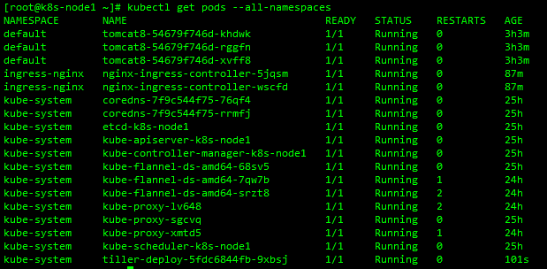
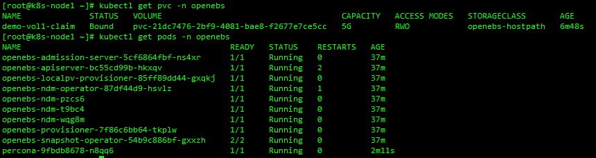

### [kubersphere官网](https://kubesphere.io/zh-CN/install/)

#### 1.前提条件

KubeSphere 支持离线和在线的方式部署至现有的 Kubernetes 集群，部署之前请确保您的 Kubernetes 环境满足以下 4 个前提条件：

- `Kubernetes`版本： `1.15.x ≤ K8s version ≤ 1.17.x`；
- `Helm`版本： `2.10.0 ≤ Helm Version ＜ 3.0.0`（不支持 helm 2.16.0 [#6894](https://github.com/helm/helm/issues/6894)），且已安装了 Tiller，参考 [如何安装与配置 Helm](https://devopscube.com/install-configure-helm-kubernetes/) （预计 3.0 支持 Helm v3）；
- 集群已有默认的存储类型（StorageClass），若还没有准备存储请参考 [安装 OpenEBS 创建 LocalPV 存储类型](https://kubesphere.io/docs/zh-CN/appendix/install-openebs) 用作开发测试环境。
- 集群能够访问外网，若无外网请参考 [在 Kubernetes 离线安装 KubeSphere](https://kubesphere.com.cn/docs/installation/install-on-k8s-airgapped/)。

#### 2.安装Helm(master节点)

`Helm是Kubernetes 的包管理器。包管理器类似于我们在Ubuntu中使用的apt、CentOS中使用的yum或者Python中的pip一样，能快速查找、下载和安装软件包。Helm由客户端组件helm和服务端组件Tiller组成，能够将一组K8S资源打包统一管理，是查找、共享和使用为Kubernetes构建的软件的最佳方式。`

1. 验证版本

   ```shell
   helm version
   ```

2. 安装

   ```shell
   curl -L https://git.io/get_helm.sh | bash
   ```

3. 创建权限

   `创建helm-rbac.yaml 写入如下内容`

   ```yaml
   apiVersion: v1
   kind: ServiceAccount
   metadata:
     name: tiller
     namespace: kube-system
   ---
   apiVersion: rbac.authorization.k8s.io/v1
   kind: ClusterRoleBinding
   metadata:
     name: tiller
   roleRef:
     apiGroup: rbac.authorization.k8s.io
     kind: ClusterRole
     name: cluster-admin
   subjects:
     - kind: ServiceAccount
       name: tiller
       namespace: kube-system
   ```

   ```shell
   kubectl apply -f helm-rbac.yaml
   ```

4. 安装tiller(master上)
   - 初始化

     ```shell
     helm init --service-account=tiller --tiller-image=sapcc/tiller:v2.16.3 --history-max 300
     ```

   - 验证是否安装完成

     ```shell
     helm
     tiller
     kubectl get pods --all-namespaces
     ```

     

5. 安装 OpenEBS 创建 LocalPV 存储类型
   - 确认 k8s-node1节点是否有 Taint

   ```shell
   kubectl describe node k8s-node1 | grep Taint
   ```

   - 去掉 k8s-node1节点的 Taint

   ```shell
   kubectl taint nodes k8s-node1 node-role.kubernetes.io/master:NoSchedule-
   ```

   - 创建 OpenEBS 的 namespace

   ```shell
   kubectl create ns openebs
   ```

   - 若集群已安装了 Helm，可通过 Helm 命令来安装 OpenEBS

   ```shell
   helm install --namespace openebs --name openebs stable/openebs --version 1.5.0
   ```

   - 通过 kubectl 命令安装

   ```shell
   kubectl apply -f https://openebs.github.io/charts/openebs-operator-1.5.0.yaml
   ```

   - 查看创建的 StorageClass

   ```shell
   kubectl get sc
   ```

   - 将 `openebs-hostpath`设置为 **默认的 StorageClass**

   ```shell
   kubectl patch storageclass openebs-hostpath -p '{"metadata": {"annotations":{"storageclass.kubernetes.io/is-default-class":"true"}}}'
   ```

   - 重新给k8s-node1加上 Taint (`安装kubesphere时不要有污点 有的话去掉再装 需要让master也参与调度`)

     ```shell
     kubectl taint nodes k8s-node1 node-role.kubernetes.io/master=:NoSchedule
     ```

6. 测试 StorageClass
   - 创建一个 demo-openebs-hostpath.yaml

   ```shell
   apiVersion: apps/v1
   kind: Deployment
   metadata:
     name: percona
     labels:
       name: percona
   spec:
     replicas: 1
     selector:
       matchLabels:
         name: percona
     template:
       metadata:
         labels:
           name: percona
       spec:
         securityContext:
           fsGroup: 999
         tolerations:
         - key: "ak"
           value: "av"
           operator: "Equal"
           effect: "NoSchedule"
         containers:
           - resources:
               limits:
                 cpu: 0.5
             name: percona
             image: percona
             args:
               - "--ignore-db-dir"
               - "lost+found"
             env:
               - name: MYSQL_ROOT_PASSWORD
                 value: k8sDem0
             ports:
               - containerPort: 3306
                 name: percona
             volumeMounts:
               - mountPath: /var/lib/mysql
                 name: demo-vol1
         volumes:
           - name: demo-vol1
             persistentVolumeClaim:
               claimName: demo-vol1-claim
   ---
   kind: PersistentVolumeClaim
   apiVersion: v1
   metadata:
     name: demo-vol1-claim
   spec:
     storageClassName: openebs-hostpath
     accessModes:
       - ReadWriteOnce
     resources:
       requests:
         storage: 5G
   ---
   apiVersion: v1
   kind: Service
   metadata:
     name: percona-mysql
     labels:
       name: percona-mysql
   spec:
     ports:
       - port: 3306
         targetPort: 3306
     selector:
         name: percona
   ```

   - 使用 kubectl 命令创建相关资源

   ```shell
   kubectl apply -f demo-openebs-hostpath.yaml -n openebs
   ```

   - 如果 PVC 的状态为 Bound 并且 Pod 状态为 running，则说明已经成功挂载，证明了默认的 StorageClass（openebs-hostpath）是正常工作的

     ```shell
     kubectl get pvc -n openebs
     ```

     

#### 3.最小化安装kubesphere

### [kubesphere-minimal.yaml](https://github.com/kubesphere/ks-installer/blob/master/kubesphere-minimal.yaml)

- 应用

  ```shell
  kubectl apply -f https://raw.githubusercontent.com/kubesphere/ks-installer/master/kubesphere-minimal.yaml
  ```

- 查看滚动刷新的安装日志

```shell
kubectl logs -n kubesphere-system $(kubectl get pod -n kubesphere-system -l app=ks-install -o jsonpath='{.items[0].metadata.name}') -f
```

- 安装完成后 重新给k8s-node1加上 Taint

  ```shell
  kubectl taint nodes k8s-node1 node-role.kubernetes.io/master=:NoSchedule
  ```

#### 4.最小化安装后的定制化安装

- 通过修改 ks-installer 的 configmap 可以选装组件 将False改成True wq保存退出就会开始安装了 花费时间有点长

```shell
kubectl edit cm -n kubesphere-system ks-installer
```

