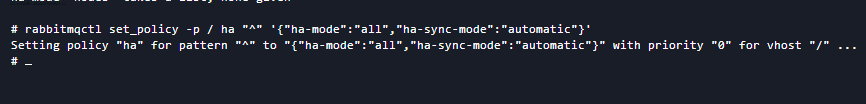

### 1.安装krew

从[krew官网](https://krew.sigs.k8s.io/)进去,再进入[安装文档](https://krew.sigs.k8s.io/docs/user-guide/setup/install/)页


1. 安装git

   ```shell
   yum install -y git
   ```

2. 执行黑框里的命令

   ```shell
   (
     set -x; cd "$(mktemp -d)" &&
     OS="$(uname | tr '[:upper:]' '[:lower:]')" &&
     ARCH="$(uname -m | sed -e 's/x86_64/amd64/' -e 's/\(arm\)\(64\)\?.*/\1\2/' -e 's/aarch64$/arm64/')" &&
     KREW="krew-${OS}_${ARCH}" &&
     curl -fsSLO "https://github.com/kubernetes-sigs/krew/releases/latest/download/${KREW}.tar.gz" &&
     tar zxvf "${KREW}.tar.gz" &&
     ./"${KREW}" install krew
   )
   ```

3. 将下面的语句添加到环境变量中
   - 当前窗口执行改命令 只在当前窗口有效 新开的窗口无效

     ```shell
     export PATH="${KREW_ROOT:-$HOME/.krew}/bin:$PATH"
     ```

   - 全局生效

     ```shell
     vim ~/.bashrc
     ```

     在最后一行添加上诉命令,新开一个窗口即可

4. 安装检查

   ```shell
   kubectl krew
   ```

   

### 2.在kubesphere后台创建一个项目(命名空间)

为什么这么做呢?因为在操作过程中,通过命令直接安装后,kubesphere后台不显示


### 3.安装插件

```shell
kubectl krew install rabbitmq
```


### 3.安装rabbitmq-cluster-operator

可以使用`kubectl rabbitmq -h`查询可以携带的参数 这里默认

```shell
kubectl rabbitmq install-cluster-operator
```


### 4.创建集群

```shell
kubectl rabbitmq -n demo-project create rabbitmq-cluster --replicas 3 --service ClusterIP --image rabbitmq:3.9.13-management
```

```shell
-n 指定命名空间
rabbitmq-cluster 是实例名称
--replicas 副本数
--service 创建的服务类型
--image 使用的镜像
```


### 5.设置NodePort外网访问


用户名密码从保密字段里找


### 6.通过任意终端添加用户

- 查看集群状态

  ```shell
  rabbitmqctl cluster_status
  ```

- 添加用户，用户名为admin，密码为admin

  ```shell
  rabbitmqctl add_user admin admin
  ```

- 查看用户列表

  ```shell
  rabbitmqctl list_users
  ```

- 给admin用户设置管理员权限

  ```shell
  rabbitmqctl set_user_tags admin administrator
  ```

- 其它命令

  ```shell
  rabbitmqctl delete_user admin # 删除admin用户
  rabbitmq-server -detached # 启动rabbitmq服务，该命令可以启动erlang虚拟机和rabbitmq服务
  ```

- ​ 将某一节点从硬盘模式改为内存模式

  ```shell
  rabbitmqctl stop_app
  rabbitmqctl change_cluster_node_type ram
  rabbitmqctl start_app
  ```

  

### 7.配置镜像集群

1. 方式一：通过命令行设置

   针对某一个队列去配置其对应的镜像其实比较简单，我们只需要去添加一个镜像策略即可：

   ```shell
   rabbitmqctl set_policy [-p <vhost>] [--priority <priority>] [--apply-to <apply-to>] <name> <pattern> <definition>
   ```

   ```shell
   #设置/交换机的策略名称为ha 对所有队列生效  镜像队列模式为节点 镜像队列消息的同步方式为automatic
   rabbitmqctl set_policy -p / ha "^" '{"ha-mode":"all","ha-sync-mode":"automatic"}'
   ```

   

   

2. 方式二：通过后台管理设置

   

   

