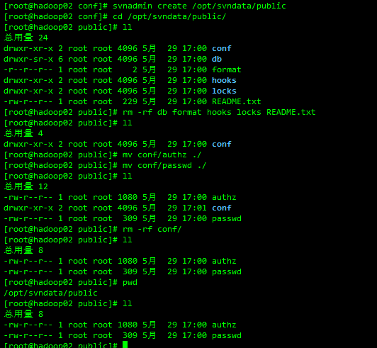
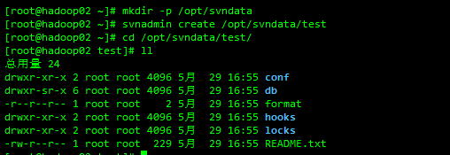

#### 1.检查是否安装了SVN

```shell
rpm -qa subversion
```

#### 2.如果安装了执行这一步 没有则跳过

```shell
yum remove subversion
```

#### 3.安装SVN

```shell
yum -y install subversion
```

#### 4.查看安装版本

```shell
svnserve --version
```

#### 5.建立本地文件权限库

```shell
mkdir -p /opt/svndata
svnadmin create /opt/svndata/public
```

- 删除其他文件 只保留authz passwd两个文件

  

- 配置用户

  ```shell
  vim passwd

  #在users下按照提示添加用户名和密码
  [users]
  tianch = tianch123456
  ```

- 配置权限

  ```shell
  vim authz

  # 在groups下配置仓库的用户权限 test是你创建的仓库
  [groups]
  [test:/]
  tianch = rw
  ```

#### 6.创建代码库

```shell
svnadmin create /opt/svndata/test
#执行上面的命令后，自动建立svndata库，查看/opt/svndata/test 文件夹发现包含了conf, db,format,hooks, locks, README.txt等文件，说明一个SVN库已经建立
```



#### 7.配置代码库

- 配置test仓库的用户和权限

  ```shell
  vim /opt/svndata/test/conf/svnserve.conf
  # 在general里新增下面两行 也可打开注释修改
  password-db = ../../public/passwd
  authz-db = ../../public/authz

  # 权限修改
  anon-access = none
  auth-access = write
  ```

#### 8.启动SVN

```shell
svnserve -d -r /opt/svndata
```

#### 9.停止和重启

```shell
pkill svnserve                #停止
svnserve -d -r /opt/svndata   #启动
```

#### 10.测试

- 使用小乌龟连接测试
- 地址：svn://172.16.10.68/test
- 输入用户名和密码

#### 11.设置钩子自动更新

```shell
#建立web程序目录
mkdir -p /opt/webroot/test

#不重命名文件夹，直接在当前目录下检出
svn checkout svn://localhost/test
#检出文件并且重命名文件夹
svn checkout svn://localhost/test test

#进入项目库的 hooks目录
cd /opt/svndata/test/hooks/
cp post-commit.tmpl post-commit

vim post-commit

#添加下面的脚本  路径 用户名和密码用你自己的
export LANG=zh_CN.UTF-8 #防止中文乱码
svn update /opt/webroot/test --username tianch --password tianch123456

#赋予post-commit脚本可执行权限 没权限会报错：post-commit hook failed (exit code 255) with no output
chmod 755 post-commit
```

