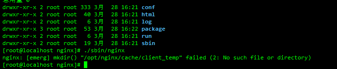

- 所需软件环境

  ```shell
  yum -y install gcc gcc-c++ automake pcre pcre-devel zlip zlib-devel openssl openssl-devel
  ```

- 新建用户

  ```shell
  #之所以没有把用户根目录放到/home下 是软件安装在opt下 用nginx用户可能没权限
  useradd nginx  -d /opt/nginx -s /sbin/nologin
  ```

- 进入用户目录下载nginx包

  ```shell
  cd /opt/nginx
  wget http://nginx.org/download/nginx-1.18.0.tar.gz
  ```

- 解压并进入解压后的目录

  ```shell
  tar -xvf nginx-1.18.0.tar.gz
  cd nginx-1.16.1
  ```

- 配置

  ```shell
  ./configure \
  --prefix=/opt/nginx \
  --sbin-path=/opt/nginx/sbin/nginx \
  --modules-path=/opt/nginx/lib/modules \
  --conf-path=/opt/nginx/conf/nginx.conf \
  --error-log-path=/opt/nginx/log/error.log \
  --http-log-path=/opt/nginx/log/access.log \
  --pid-path=/opt/nginx/run/nginx.pid \
  --lock-path=/opt/nginx/run/nginx.lock \
  --http-client-body-temp-path=/opt/nginx/cache/client_temp \
  --http-proxy-temp-path=/opt/nginx/cache/proxy_temp \
  --http-fastcgi-temp-path=/opt/nginx/cache/fastcgi_temp \
  --http-uwsgi-temp-path=/opt/nginx/cache/uwsgi_temp \
  --http-scgi-temp-path=/opt/nginx/cache/scgi_temp \
  --user=nginx \
  --group=nginx \
  --with-compat \
  --with-file-aio \
  --with-threads \
  --with-http_addition_module \
  --with-http_auth_request_module \
  --with-http_dav_module \
  --with-http_flv_module \
  --with-http_gunzip_module \
  --with-http_gzip_static_module \
  --with-http_mp4_module \
  --with-http_random_index_module \
  --with-http_realip_module \
  --with-http_secure_link_module \
  --with-http_slice_module \
  --with-http_ssl_module \
  --with-http_stub_status_module \
  --with-http_sub_module \
  --with-http_v2_module \
  --with-mail \
  --with-mail_ssl_module \
  --with-stream \
  --with-stream_realip_module \
  --with-stream_ssl_module \
  --with-stream_ssl_preread_module
  ```

- 编译

  ```shell
  make
  ```

- 安装

  ```shell
  make install
  ```

- 启动

  ```shell
  #默认配置文件启动 ./configure的时候已经指定了配置文件位置
  /opt/nginx/sbin/nginx
  #指定配置文件启动
  /opt/nginx/sbin/nginx -c /opt/nginx/conf/nginx.conf
  ```

  

  ```shell
  #出现错误没关系 根据提示新建文件夹 再次启动就行了就行了
  mkdir -p /opt/nginx/cache/client_temp
  ```

  

- 启动停止

  ```shell
  cd /opt/nginx/sbin
  ./nginx
  ./nginx -s stop
  ./nginx -s quit
  ./nginx -s reload
  ```

- 相关命令

  ```shell
  Options:
    -?,-h         : 打开帮助信息
    -v            : 显示版本信息并退出
    -V            : 显示版本和配置选项信息，然后退出
    -t            : 检测配置文件是否有语法错误，然后退出
    -T            : 在检测配置文件期间屏蔽非错误信息
    -q            : suppress non-error messages during configuration testing
    -s signal     : 给一个 nginx 主进程发送信号：stop（停止）, quit（退出）, reopen（重启）, reload（重新加载配置文件）
    -p prefix     : 设置前缀路径 (默认: /opt/nginx/)
    -c filename   : 设置配置文件 (默认: /opt/nginx/conf/nginx.conf)
    -g directives : 设置配置文件外的全局指令
  ```

