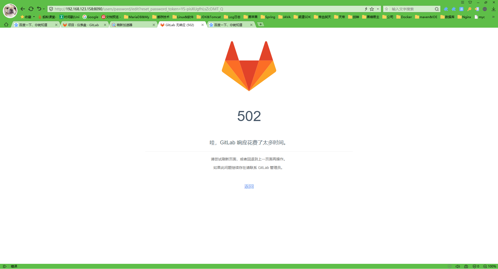
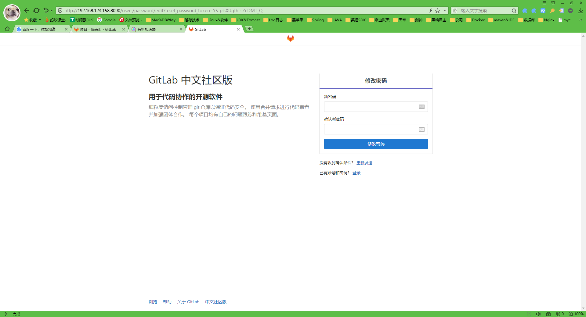
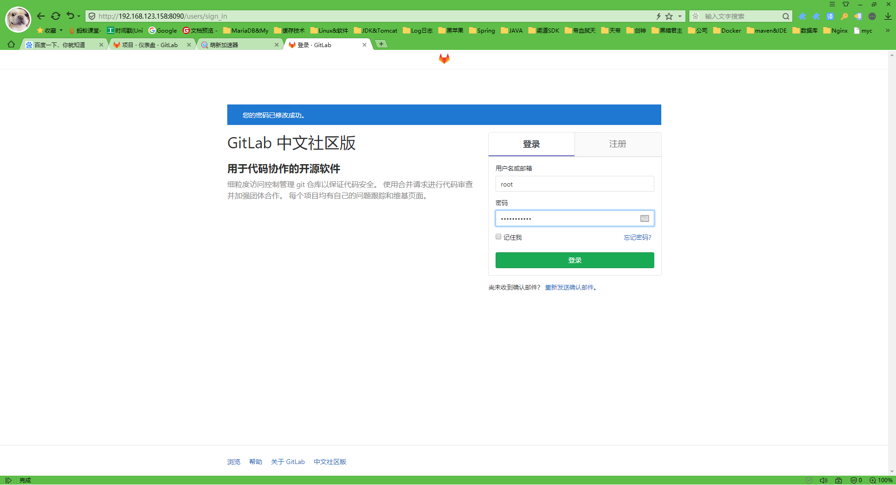

- 拉取镜像

  ```shell
  docker pull twang2218/gitlab-ce-zh
  ```

- 新建文件夹

  ```shell
  mkdir -p /opt/gitlab/etc
  mkdir -p /opt/gitlab/log
  mkdir -p /opt/gitlab/data
  ```

- 修改文件夹权限

  ```shell
  chmod 755 -R /opt/gitlab
  ```

- 启动 这次启动主要是把容器内部文件映射到外部 方便修改

  ```shell
  docker run \
      --detach \
      --publish 8443:443 \
      --publish 9090:80 \
      --publish 4222:22 \
      --name gitlab \
      --restart always \
      --privileged=true \
      -v /opt/gitlab/etc:/etc/gitlab \
      -v /opt/gitlab/log:/var/log/gitlab \
      -v /opt/gitlab/data:/var/opt/gitlab \
      twang2218/gitlab-ce-zh
  ```

- 复制docker容器文件到本地

  ```shell
  docker cp  gitlab:/opt/gitlab /opt
  ```

- 修改/opt/gitlab/etc/gitlab.rb

  ```shell
  vim /opt/gitlab/etc/gitlab.rb
  	#把这行的注释打开 写上自己服务器的地址 一定要写上http://
  	external_url 'http://192.168.123.158'
  ```

- 修改/opt/gitlab/data/gitlab-rails/etc/gitlab.yml

  ```shell
  vim /opt/gitlab/data/gitlab-rails/etc/gitlab.yml
  	#修改下面两个地方
  	## GitLab settings
        gitlab:
          ## Web server settings (note: host is the FQDN, do not include http://)
          host: 192.169.123.158
          port: 9090
          https: false
  ```

- 停止并删除当前gitlab容器

  ```shell
  docker stop gitlab
  docker rm gitlab
  ```

- 再次启动

  ```shell
  docker run \
      --detach \
      --publish 8443:443 \
      --publish 9090:80 \
      --publish 4222:22 \
      --name gitlab \
      --restart always \
      --privileged=true \
      -v /opt/gitlab/etc:/etc/gitlab \
      -v /opt/gitlab/log:/var/log/gitlab \
      -v /opt/gitlab/data:/var/opt/gitlab \
      twang2218/gitlab-ce-zh
  ```

启动需要时间 在启动过程中访问会出现下面情景 等1~2分钟即可 因为服务还没有启动完成



服务启动完成之后就会出现下面的界面



会先让设置密码 账号是root 设置完密码之后会进入登录界面



登录之后是下面的界面 至此 安装完成

