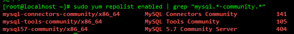
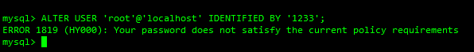

- 查看有没有安装mariadb

  ```shell
  rpm -qa | grep mariadb
  ```

  

- 有的话卸载 --nodeps是强制卸载 不加可能会导致依赖检测失败

  ```shell
  rpm -e --nodeps mariadb-libs-5.5.64-1.el7.x86_64
  ```

- 删除mariadb配置文件

  ```shell
  rm -rf /etc/my.cnf*
  ```

- 下载MySQL源安装包

  ```shell
  sudo wget http://dev.mysql.com/get/mysql57-community-release-el7-8.noarch.rpm
  ```

- 安装MySQL源

  ```shell
  sudo yum localinstall mysql57-community-release-el7-8.noarch.rpm
  ```

- 检查MySQL源是否安装成功

  ```shell
  sudo yum repolist enabled | grep "mysql.*-community.*"
  ```

  

- 安装MySQL

  ```shell
  sudo yum install mysql-community-server
  ```

- 启动MySQL服务

  ```shell
  sudo systemctl start mysqld
  ```

- 查看MySQL的启动状态

  ```shell
  sudo systemctl status mysqld
  #或者
  sudo ps -le | grep mysqld
  ```

- 设置开机启动

  ```shell
  sudo systemctl enable mysqld
  sudo systemctl daemon-reload
  ```

- 修改 MySQL 中 root 本地登录密码

  ```shell
  sudo grep 'temporary password' /var/log/mysqld.log
  #如果没有grep出来 执行下面的操作
      #删除原来安装过的mysql残留的数据（这一步非常重要，问题就出在这）
      rm -rf /var/lib/mysql
      #重启mysqld服务 之后就会有了
      systemctl restart mysqld
  ```

- 登录MySQL，使用刚才找到的密码

  ```shell
  mysql -u root -p
  ```

- 修改root用户密码（二选一）

  ```shell
  ALTER USER 'root'@'localhost' IDENTIFIED BY 'MyNewPass4!';
  set password for 'root'@'localhost'=password('MyNewPass4!');
  ```

- 修改密码策略 修改完就可以改成简单密码了 设置安全级别为LOW 密码长度为6

  ```shell
  set global validate_password_policy=LOW;
  set global validate_password_length=6;
  ```

  注意：mysql5.7默认安装了密码安全检查插件（validate_password），默认密码检查策略要求密码必须包含：大小写字母、数字和特殊符号，并且长度不能少于8位。否则会提示ERROR 1819 (HY000): Your password does not satisfy the current policy requirements错误，如下图所示：

  

  通过msyql环境变量可以查看密码策略的相关信息

  ```shell
  show variables like '%password%';
  ```

- 设置远程登录

  ```shell
  #MySQL默认只允许root帐户在本地登录，想要远程连接MySQL，必须开启root用户允许远程连接，或者添加一个允许远程连接的帐户

  #开启root用户远程连接（任意IP都可以访问）
  GRANT ALL PRIVILEGES ON *.* TO 'root'@'%' IDENTIFIED BY 'root用户的密码' WITH GRANT OPTION;
  #开启root用户远程连接（指定192.168.110.120访问）
  GRANT ALL PRIVILEGES ON *.* TO 'root'@'192.168.110.120' IDENTIFIED BY 'root用户的密码' WITH GRANT OPTION;
  #安全起见， 创建远程访问用户
  GRANT ALL PRIVILEGES ON *.* TO 'dadeity'@'%' IDENTIFIED BY 'daDeity@163.com' WITH GRANT OPTION;
  #刷新MySQL的系统权限相关表，否则会出现拒绝访问
  flush privileges;
  ```

- MySQL设置

  ```shell
  #设置MySQL默认编码为utf8
  #修改 /etc/my.cnf配置文件 在[mysqld]下添加
  character_set_server=utf8
  init_connect='SET NAMES utf8'
  #重启MySQL服务
  systemctl restart mysqld
  #查看MySQL默认编码如下
  mysql> show variables like '%character%';
  +--------------------------+----------------------------+
  | Variable_name            | Value                      |
  +--------------------------+----------------------------+
  | character_set_client     | utf8                       |
  | character_set_connection | utf8                       |
  | character_set_database   | utf8                       |
  | character_set_filesystem | binary                     |
  | character_set_results    | utf8                       |
  | character_set_server     | utf8                       |
  | character_set_system     | utf8                       |
  | character_sets_dir       | /usr/share/mysql/charsets/ |
  +--------------------------+----------------------------+
  8 rows in set (0.01 sec)

  #默认配置文件路径
  配置文件：    /etc/my.cnf
  日志文件：    /var/log//var/log/mysqld.log
  服务启动脚本： /usr/lib/systemd/system/mysqld.service
  socket文件：  /var/run/mysqld/mysqld.pid

  #查看MySQL版本
  mysql> SHOW VARIABLES WHERE Variable_name = 'version';
  +---------------+--------+
  | Variable_name | Value  |
  +---------------+--------+
  | version       | 5.7.29 |
  +---------------+--------+
  ```

- MySQL忘记root用户密码，解决方案

  ```shell
  #在 /etc/my.cnf文件[mysqld]下面加如下命令
  skip-grant-tables
  #指定登录 不要密码
  mysql  -u root
  #修改密码
  update mysql.user set authentication_string=password('newPass') where user='root' and Host = 'localhost';
  #刷新权限
  flush privileges;

  GRANT ALL PRIVILEGES ON *.* TO 'bewinner'@'10.25.60.120' IDENTIFIED BY 'BeWinner2020#@!' WITH GRANT OPTION;

  GRANT ALL PRIVILEGES ON *.* TO 'bewinner_remote'@'114.251.40.124' IDENTIFIED BY 'BeWinner!!.' WITH GRANT OPTION;
  ```

