[**先回顾一下Linux编译安装Redis 单机版**](http://www.tianch.xyz/archives/linux编译安装redis)

- 安装一份Redis单机 参考单机版 安装的复制redis.conf就可以了 因为集群和单机的配置有所不同

- 先修改新安装的redis中的redis.conf文件 所有打开的配置后面不能带注释 否则可能启动不起来 **redis5之前可以先设置两个密码 redis5之后 包括redis5搭建集群先不要设置密码 设置了密码创建集群时会提示需要密码**

  ```shell
  bind 172.16.10.68 #69行 bind的IP 从127.0.0.1改成你机器的内网IP(一般是内网)

  port 9001 #92行 端口我们从9001开始

  daemonize yes #136行 daemonize no改成yes 以后台守护进程启动

  pidfile /var/run/redis_9001.pid #158行 重新命名

  masterauth 123456 #293行 打开注释 设置你自己的密码 这个是集群的密码

  requirepass 123456 #507行 打开注释 设置你自己的密码 这个是单节点的密码 推荐和集群密码一致

  appendonly yes #699行 appendonly 从no改成yes 开启aof备份

  cluster-enabled yes  #832行 把注释打开  这个是关键 开启集群配置
  ```

- 安装完之后先不要启动 是为了不让redis生成备份文件 如果有rdb或aof文件 统统删除

- 我这里用了2台机器安装 一台当master 另一台当slave

  master机器

  ​ 修改配置文件

  ```shell
  mkdir -p /opt/redis-cluster/redis9001
  mkdir -p /opt/redis-cluster/redis9002
  mkdir -p /opt/redis-cluster/redis9003

  cp -r /opt/redis/bin/ /opt/redis-cluster/redis9001
  cp -r /opt/redis/bin/ /opt/redis-cluster/redis9002
  cp -r /opt/redis/bin/ /opt/redis-cluster/redis9003

  #修改下9002 9003 配置文件 92行的端口 158行的pidfile名称
  ```

  ​ 编写启动脚本

  ```shell
  cd /opt/redis-cluster
  vim redisClusterStart.sh

  # 这6行是脚本内容
  cd /opt/redis-cluster/redis9001/bin
  ./redis-server redis.conf
  cd /opt/redis-cluster/redis9002/bin
  ./redis-server redis.conf
  cd /opt/redis-cluster/redis9003/bin
  ./redis-server redis.conf

  #赋予可执行权限(下面两条命令二选一)
  chmod +x redisClusterStart.sh
  chmod 755 redisClusterStart.sh
  ```

  slave机器

  ​ 修改配置文件

  ```shell
  mkdir -p /opt/redis-cluster/redis9004
  mkdir -p /opt/redis-cluster/redis9005
  mkdir -p /opt/redis-cluster/redis9006

  cp -r /opt/redis/bin/ /opt/redis-cluster/redis9004
  cp -r /opt/redis/bin/ /opt/redis-cluster/redis9005
  cp -r /opt/redis/bin/ /opt/redis-cluster/redis9006

  #修改下9005 9006 配置文件 92行的端口 158行的pidfile名称
  ```

  ​ 编写启动脚本

  ```shell
  cd /opt/redis-cluster
  vim redisClusterStart.sh

  # 这6行是脚本内容
  cd /opt/redis-cluster/redis9004/bin
  ./redis-server redis.conf
  cd /opt/redis-cluster/redis9005/bin
  ./redis-server redis.conf
  cd /opt/redis-cluster/redis9006/bin
  ./redis-server redis.conf

  #赋予可执行权限(下面两条命令二选一)
  chmod +x redisClusterStart.sh
  chmod 755 redisClusterStart.sh
  ```

- 分别执行脚本 启动所有节点

  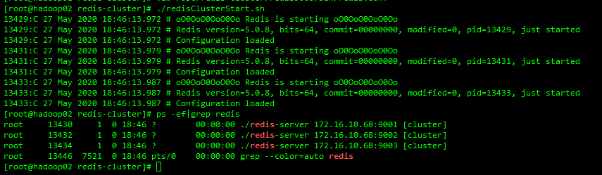

  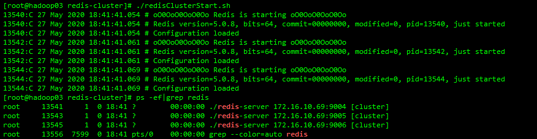

--------------------------------------------------------下面这几步是redis5之前需要的操作-------------------------------------------------

- 安装ruby 不要使用yum安装 yum安装的版本低 这里需要ruby在2.4以上

  ```shell
  gpg --keyserver hkp://keys.gnupg.net --recv-keys 409B6B1796C275462A1703113804BB82D39DC0E3 7D2BAF1CF37B13E2069D6956105BD0E739499BDB
  ```

  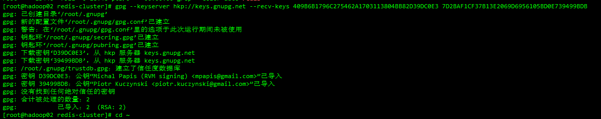

  ```shell
  cd ~
  ```

  ```shell
  curl -sSL https://get.rvm.io | bash -s stable
  ```

  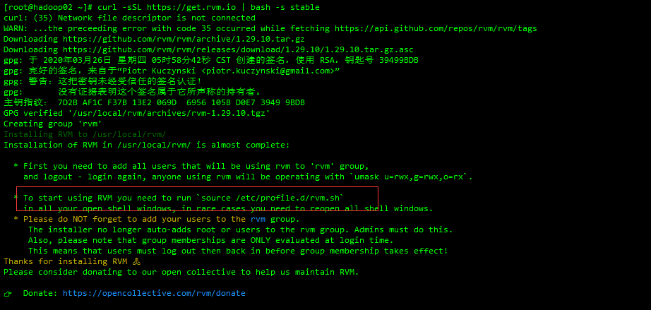
  - 根据提示执行命令

    ```shell
    source /etc/profile.d/rvm.sh
    ```

  - 查看可rvm安装列表 []里是几就代表有多少个小版本

    ```shell
    rvm list known
    ```

    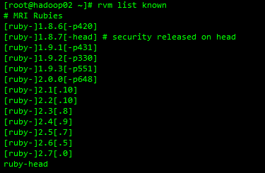

  - 这里安装2.6.5 安装需要一些时间

    ```shell
    rvm install 2.6.5
    ```

    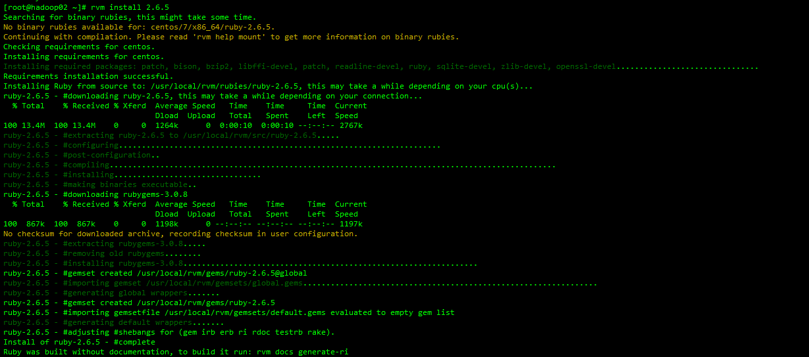

  - 查看版本

    ```shell
    ruby -v
    gem -v
    ```

    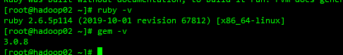

  - gem安装redis redis集群所需

    ```shell
    gem install redis
    ```

    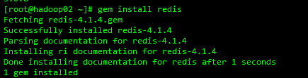

  - 查找client.rb文件

    ```shell
    find / -name client.rb -print
    ```

  - 文件查找出来有多个 用下面这个 修改主机端口和密码

    ```shell
    vim /usr/local/rvm/gems/ruby-2.6.5/gems/redis-4.1.4/lib/redis/client.rb
    ```

    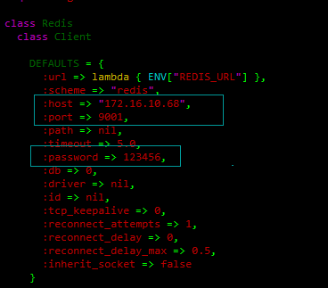

  - 创建集群 redis4.0之前的命令

    ```shell
    ./redis-trib.rb create --replicas  1 172.16.10.68:9001 172.16.10.68:9002 172.16.10.68:9003 172.16.10.69:9004 172.16.10.69:9005 172.16.10.69:9006
    ```

    ---------------------------------------------上面这几步是redis5之前需要的操作---------------------------------------------

  - 创建集群 redis5.0以后 redis-trib.rb的方式已经废弃 改用redis-cli

    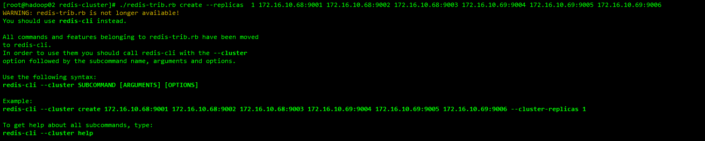

    ```shell
    cd /opt/redis-cluster/redis9001/bin

    redis-cli --cluster create 172.16.10.68:9001 172.16.10.68:9002 172.16.10.68:9003 172.16.10.69:9004 172.16.10.69:9005 172.16.10.69:9006 --cluster-replicas 1
    ```

    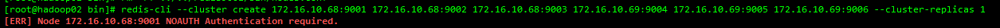

    会报下面的错

    [ERR] Node 172.16.10.68:9001 NOAUTH Authentication required.

    要清除每个节点的密码 注释掉即可

    ```shell
    #masterauth 123456
    #requirepass 123456
    ```

  - 修改配置文件后重新启动 再执行上面创建集群的命令 看到OK就说明搭建成功了

    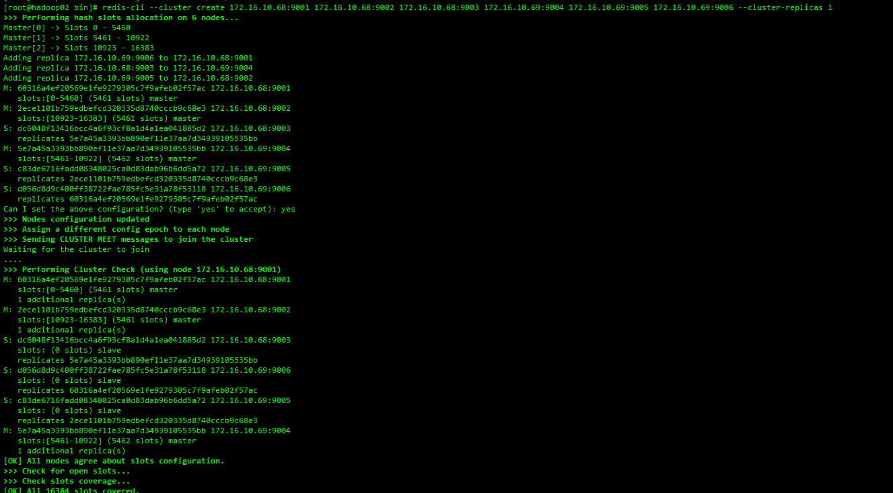

  - 设置密码 每个节点都需要来一遍 (不需要重启redis，且重启后仍然有效) 第一次设置完密码后再指定其他命令会报没有权限的错误 重新连接一下就可以了

    ```shell
    cd /opt/redis-cluster/redis9001/bin
    ./redis-cli -h 172.16.10.68 -p 9001 -a 123456 -c # -c 一定要加 表示是集群

    config set masterauth 'password'	// 设置连接密码
    config set requirepass 'password'   // 设置节点密码
    #执行完上面两步 断开连接 再连接 再执行下面的命令
    config rewrite						// 把config set 操作写入配置文件中
    ```

    6个节点都执行完设置密码的命令后 查看配置文件 在最后会有设置的密码

    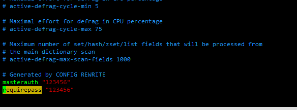

  - 模拟宕机 再次启动 依旧OK

    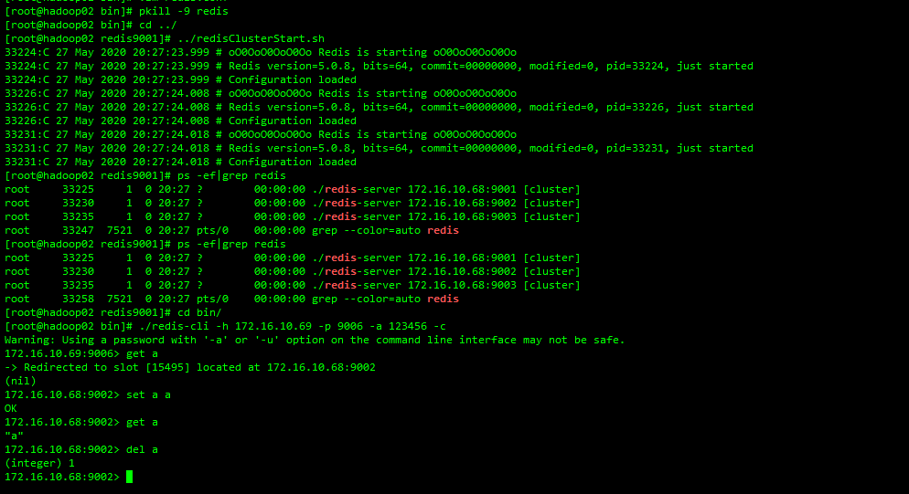

