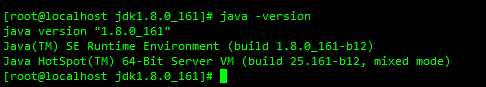

- 卸载openJDK(如果有)

  ```shell
  #查看已有的openjdk版本
  rpm -qa|grep jdk
  #卸载删除自己服务器上的openJDK
  rpm -e --nodeps java-1.8.0-openjdk-1.8.0.232.b09-0.el7_7.x86_64 java-1.8.0-openjdk-headless-1.8.0.232.b09-0.el7_7.x86_64 java-1.7.0-openjdk-headless-1.7.0.241-2.6.20.0.el7_7.x86_64
  ```

- 将同目录下的jdk-8u161-linux-x64.tar.gz包上传到服务器

- 拖拽上传安装rz

  ```shell
  yum -y install lrzsz
  ```

- cd到文件目录 解压

  ```shell
  tar -xvf jdk-8u161-linux-x64.tar.gz
  ```

- 将解压出来的文件夹移动到/usr/local

  ```shell
  mv jdk1.8.0_161 /usr/local
  ```

- 进入到移动后的jdk目录

  ```shell
  cd /usr/local/jdk1.8.0_161
  #pwd可查看当前目录
  ```

- 编辑环境变量配置文件/etc/profile

  ```shell
  vim /etc/profile
  # shift+g可直接到最后一行
  # 在最后一行后面添加下面几行
  JAVA_HOME=/usr/local/jdk1.8.0_161
  CLASSPATH=$JAVA_HOME/lib/
  PATH=$PATH:$JAVA_HOME/bin
  export PATH JAVA_HOME CLASSPATHG
  ```

- 重新加载环境变量

  ```shell
  source /etc/profile
  ```

- 验证

  ```shell
  java -version
  java
  javac
  ```

  

