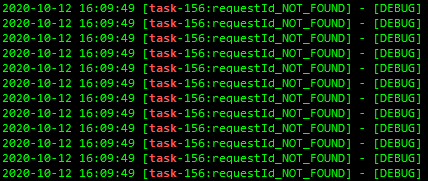

[之前写过了MDC的简单用法](http://blog.tianch.xyz/archives/mdc%E6%98%AF%E4%BB%80%E4%B9%88%E9%AC%BC%E7%94%A8%E6%B3%95%E6%BA%90%E7%A0%81%E4%B8%80%E9%94%85%E7%AB%AF)。

traceId的实现思路是通过ThreadLocal来实现的。使用ThreadLocal有一个前提就是一个请求进来始终是一个线程在处理。如果用到spring中的异步方法，traceId就会失效了

打印的日志，在logstash中读取不到requestId的值就会默认变成requestId_NOT_FOUND



想要给异步线程添加上唯一id其实也很简单，只要对异步线程池的对象稍加封装即可。

```java
@EnableAsync
@Configuration
public class AsyncConfiguration {

    @Bean("async")
    public Executor taskExecutor() {
        // 线程池的具体配置根据实际情况去配置，不要直接复制粘贴就不管了
        ThreadPoolTaskExecutor executor = new ThreadPoolTaskExecutor();
        //设置核心线程数量
        executor.setCorePoolSize(8);
        //设置最大线程数量
        executor.setMaxPoolSize(4);
        //设置队列最大长度
        executor.setQueueCapacity(16);
        //设置线程空闲时间
        executor.setKeepAliveSeconds(60);
        //设置线程前缀
        executor.setThreadNamePrefix("async-");
        //设置拒绝策略
        executor.setRejectedExecutionHandler(new ThreadPoolExecutor.CallerRunsPolicy());
        //设置线程装饰器
        executor.setTaskDecorator(runnable -> ThreadMdcUtils.wrapAsync(runnable, MDC.getCopyOfContextMap()));
        return executor;
    }
}

class ThreadMdcUtils {
    public static Runnable wrapAsync(Runnable task, Map<String, String> context) {
        return () -> {
            if (context == null) {
                MDC.clear();
            } else {
                MDC.setContextMap(context);
            }
            if (MDC.get("requestId") == null) {
                MDC.put("requestId", UUID.randomUUID().toString());
            }
            try {
                task.run();
            } finally {
                MDC.clear();
            }
        };
    }
}
```

这样的话，即便调用异步方法，也能获得统一的日志id。

