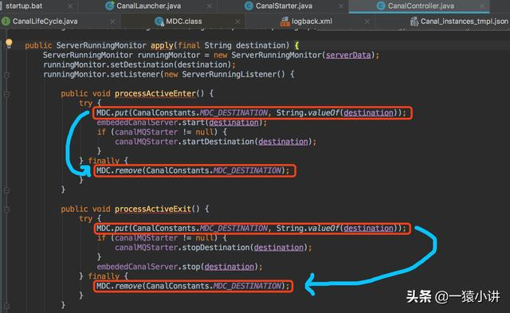
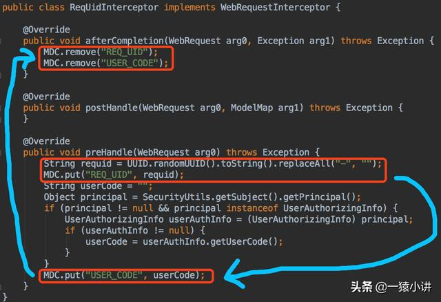
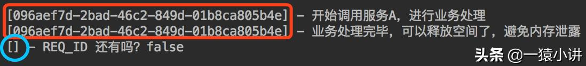
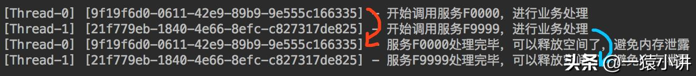
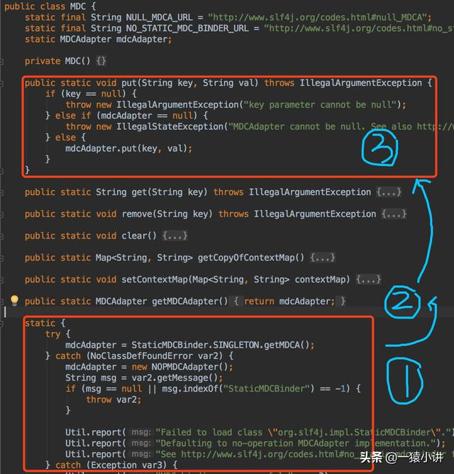
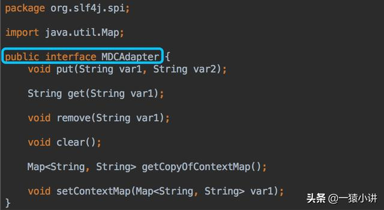
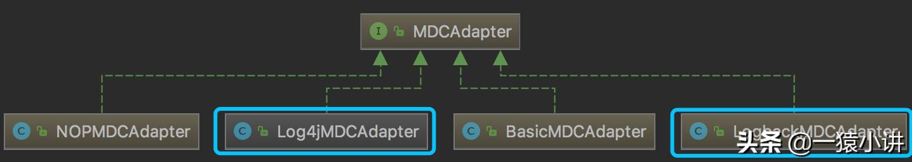
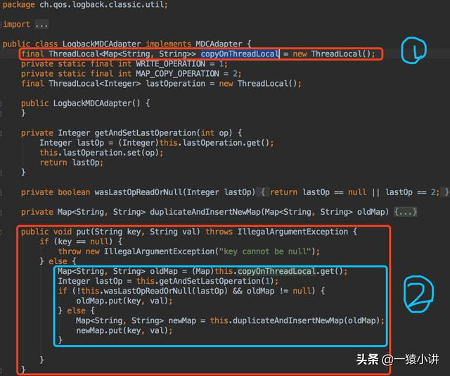

**阿里开源项目 Canal：**



**老项目这么用过：**



但是无论怎么用，都逃不过 MDC API 的使用，下面先花一分钟快速入门，然后再逐步去深入 MDC。

# 1. MDC 快速入门

MDC 全称是 Mapped Diagnostic Context，可以粗略的理解成是一个线程安全的存放诊断日志的容器。

首先看看 MDC 基本的 API 的用法，能抛代码的就不多废话（根据 logback 官方案例改编）。

```java
import org.slf4j.Logger;
import org.slf4j.LoggerFactory;
import org.slf4j.MDC;
import java.util.UUID;

public class SimpleMDC {
    private static final Logger logger = LoggerFactory.getLogger(SimpleMDC.class);    public static final String REQ_ID = "REQ_ID";
    public static void main(String[] args) {
        MDC.put(REQ_ID, UUID.randomUUID().toString());
        logger.info("开始调用服务A，进行业务处理");
        logger.info("业务处理完毕，可以释放空间了，避免内存泄露");
        MDC.remove(REQ_ID);
        logger.info("REQ_ID 还有吗？{}", MDC.get(REQ_ID) != null);
    }
}
```

代码编写完，貌似只有 MDC.put(K,V) 、MDC.remove(K) 两句是陌生的，先不着急解释它，等案例跑完就懂了，咱们继续往下看。

接下来配置 logback.xml，通过 %X{REQ_ID} 来打印 REQ_ID 的信息，logback.xml 文件内容如下。

```xml
<?xml version="1.0" encoding="UTF-8" ?>
<configuration>
    <appender name="CONSOLE" class="ch.qos.logback.core.ConsoleAppender">
        <layout class="ch.qos.logback.classic.PatternLayout">
            <Pattern>[%t] [%X{REQ_ID}] - %m%n</Pattern>
        </layout>
    </appender>
    <root level="debug">
        <appender-ref ref="CONSOLE"/>
    </root>
</configuration>
```

引入依赖包，让程序快点跑起来看看效果。

```xml
<dependencies>

    <dependency>
        <groupId>org.slf4j</groupId>
        <artifactId>slf4j-api</artifactId>
        <version>1.7.7</version>
    </dependency>

    <dependency>
        <groupId>ch.qos.logback</groupId>
        <artifactId>logback-core</artifactId>
        <version>1.2.3</version>
    </dependency>

    <dependency>
        <groupId>ch.qos.logback</groupId>
        <artifactId>logback-access</artifactId>
        <version>1.2.3</version>
    </dependency>

    <dependency>
    <groupId>ch.qos.logback</groupId>
        <artifactId>logback-classic</artifactId>
        <version>1.2.3</version>
    </dependency>

</dependencies>
```

程序跑起来，输出截图如下。



**根据输出结果分析，能够得到两条结论。**

**第一：**如图中红色圈住部分所示，当 logback 内置的日志字段不能满足业务需求时，便可以借助 MDC 机制，将业务上想要输出的信息，通过 logback 给打印出来；

**第二：**如蓝色圈住部分所示，当调用 MDC.remove(Key) 后，便可将业务字段从 MDC 中删除，日志中就不再打印请求 ID 啦；

**趁热打铁，我们迅速看看在多线程情况下，使用 MDC 会发生什么现象呢？**

还是基于上面的代码，把代码段放到了线程体内，稍微进行改造了一下，代码如下。

```java
import org.slf4j.Logger;
import org.slf4j.LoggerFactory;
import org.slf4j.MDC;
import java.util.UUID;


public class SimpleMDC {
    public static void main(String[] args) {
        new BizHandle("F0000").start();
        new BizHandle("F9999").start();
    }
}

class BizHandle extends Thread {

    private static final Logger logger = LoggerFactory.getLogger(SimpleMDC.class);
    public static final String REQ_ID = "REQ_ID";

    private String funCode;

    public BizHandle(String funCode) {
        this.funCode = funCode;
    }

    @Override
    public void run() {
        MDC.put(REQ_ID, UUID.randomUUID().toString());
        logger.info("开始调用服务{}，进行业务处理", funCode);
        try {
            Thread.sleep(10000);
        } catch (InterruptedException e) {
            logger.info(e.getMessage());
        }
        logger.info("服务{}处理完毕，可以释放空间了，避免内存泄露", funCode);
        MDC.remove(REQ_ID);
    }
}
```

程序跑起来看看效果。



依据程序输出进行分析，能够看到线程 Thread-0 与 Thread-1 在 MDC 中放入的 REQ_ID 的值是互不影响，也就是说 MDC 中的值是与线程绑定在一起的。

**好了，入门程序就这么简单，简单做个小结。**

**a）MDC 提供的 put 方法，可以将一个 K-V 的键值对放到容器中，并且能保证同一个线程内，Key 是唯一的，不同的线程 MDC 的值互不影响；**

**b) 在 logback.xml 中，在 layout 中可以通过声明 %X{REQ_ID} 来输出 MDC 中 REQ_ID 的信息；**

**c）MDC 提供的 remove 方法，可以清除 MDC 中指定 key 对应的键值对信息。**

通过快速入门的程序，得知 MDC 的值与线程是绑定在一起的，不同线程互不影响，**MDC 背后到底是怎么实现的呢？**不妨从源码上看一看。

# 2. MDC 源码解读

解读源码之前，要提提 SLF4J，全称是 Simple Logging Facade for Java，翻译过来就是「一套简单的日志门面」。是为了让研发人员在项目中切换日志组件的方便，特意抽象出的一层。

**项目开发中经常这么定义日志对象：**

```java
Logger logger = LoggerFactory.getLogger(SimpleMDC.class)
```

其中 Logger 就来自于 SLF4J 的规范包，项目中一旦这样定义 Logger，在底层就可以无缝切换 logback、log4j 等日志组件啦，这或许就是 Java 为什么要提倡要面向接口编程的好处。

见证奇迹的时刻要到了，下面就好好揭秘一下 MDC 背后藏着什么东东？

首先通过 org.slf4j.MDC 的源码，可以很清楚的知道 MDC 主要是通过 MDCAdapter 来完成 put、get、remove 等操作。



不出所料 MDCAdapter 也是个接口。在 Java 的世界里，应该都知道定义接口的目的：就是为了定义规范，让子类去实现。

MDCAdapter 就和 JDBC 的规范类似，专门用于定义操作规范。JDBC 是为了定义数据库操作规范，让数据库厂商（MySQL、DB2、Oracle 等）去实现；而 MDCAdapter 则是让具体的日志组件（logback、log4j等）去实现。



MDCAdapter 接口的实现类，有 NOPMDCAdapter、BasicMDCAdapter、LogbackMDCAdapter 以及 Log4jMDCAdapter 等等几种，其中 log4j 使用的是 Log4jMDCAdapter，而 Logback 使用的是 LogbackMDCAdapter。



本次重点说 LogbackMDCAdapter 的源码，截图如下。



通过图中标注 1、2 的代码，可以清晰的知道 MDC 底层最终使用的是 ThreadLocal 来进行的实现（水落石出，花落它家）。

> a）ThreadLocal 很多地方叫做线程本地变量，也有些地方叫做线程本地存储。
>
> b）ThreadLocal 的作用是提供线程内的局部变量，这种变量在线程的生命周期内起作用，减少同一个线程内多个函数或者组件之间一些公共变量的传递的复杂度。
>
> c）ThreadLocal 使用场景为用来解决数据库连接、Session 管理等。
>
> 对 ThreadLocal 感兴趣的可自行填补一下，本次不做展开。

# 3. MDC 能干什么？

MDC 的应用场景其实蛮多的，下面简单列举几个。

**a）在 WEB 应用中，如果想在日志中输出请求用户 IP 地址、请求 URL、统计耗时等等，MDC 基本都能支撑；**

**b）在 WEB 应用中，如果能画出用户的请求到响应整个过程，势必会快速定位生产问题，那么借助 MDC 来保存用户请求时产生的 reqId，当请求完成后，再将这个 reqId 进行移除，这么一来通过 grep reqId 就能轻松 get 整个请求流程的日志轨迹；**

**c）在微服务盛行的当下，链路跟踪是个难题，而借助 MDC 去埋点，巧妙实现链路跟踪应该不是问题。**

# 4. 写在最后

若想 get 更多案例及用法，可参考 logback 官方链接。

```html
http://logback.qos.ch/manual/mdc.html
```

本次主要让大家对 MDC 进行快速入门，并通过剖析源码，窥探 MDC 的背后，最终分享了一些 MDC 在项目研发中能做什么的实践思路，欢迎大家多去尝试实现。

原文:https://www.toutiao.com/i6817967528074019335/

