一个快速迭代的项目，时间久了之后，代码中可能会充斥着大量的if/else，嵌套6、7层，一个函数几百行，简！直！看！死！人！

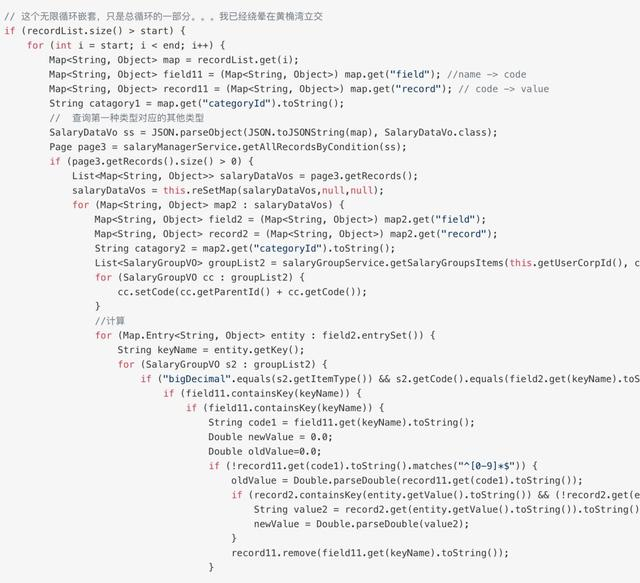

> 这个无限循环嵌套，只是总循环的一部分。。。我已经绕晕在黄桷湾立交

仔细数了数，一共有 11 层的嵌套！！！接手这种项目的同学，内心应该是绝望的。

出现这种情况的原因很多

- 设计不够完善
- 需求考虑不完全
- 开发人员变动

但最为致命的是“懒”

你懒，我也懒，前期迭代懒得优化，来一个需求，加一个if，久而久之，就串成了一座金字塔。

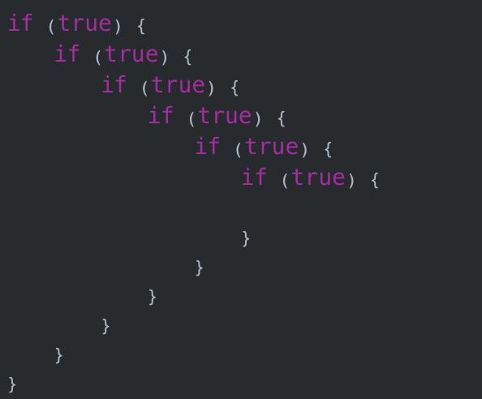

当代码已经复杂到难以维护的程度之后，只能狠下心重构优化。**那，有什么方案可以优雅的优化掉这些多余的if/else?**

\1. 提前return

这是判断条件取反的做法，代码在逻辑表达上会更清晰，看下面代码：

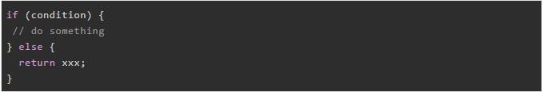

其实，每次看到上面这种代码，我都心里抓痒，完全可以先判断 !condition，干掉else。

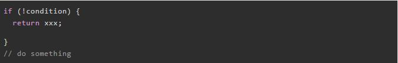

\2. 策略模式

有这么一种场景，根据不同的参数走不同的逻辑，其实这种场景很常见。

最一般的实现：

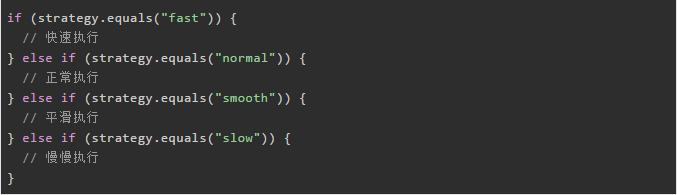

看上面代码，有4种策略，有两种优化方案。

2.1 多态

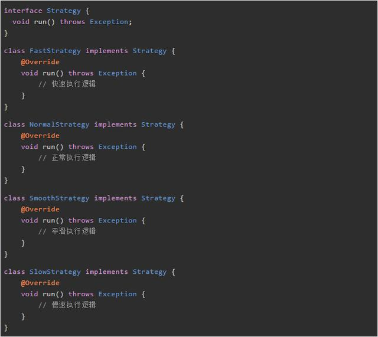

具体策略对象存放在一个Map中，优化后的实现

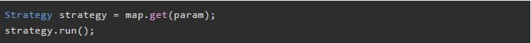

上面这种优化方案有一个弊端，为了能够快速拿到对应的策略实现，需要map对象来保存策略，当添加一个新策略的时候，还需要手动添加到map中，容易被忽略。

2.2 枚举

发现很多同学不知道在枚举中可以定义方法，这里定义一个表示状态的枚举，另外可以实现一个run方法。

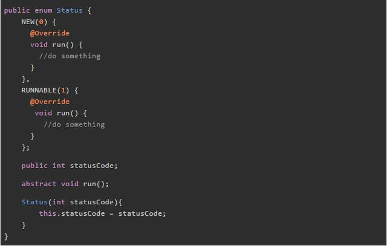

重新定义策略枚举

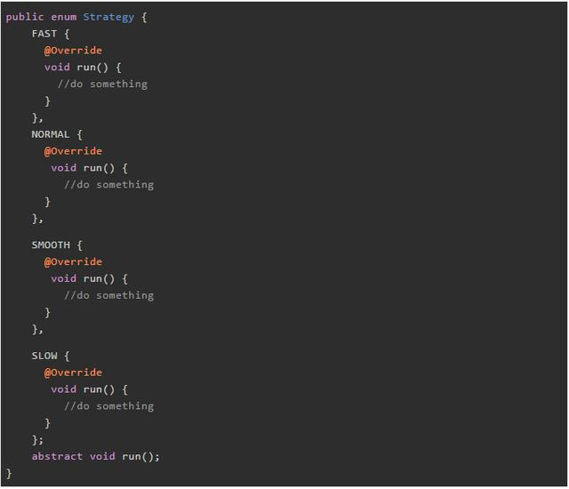

通过枚举优化之后的代码如下

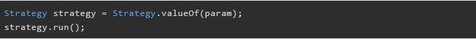

\3. 学会使用 Optional

Optional主要用于非空判断，由于是jdk8新特性，所以使用的不是特别多，但是用起来真的爽。

使用之前：

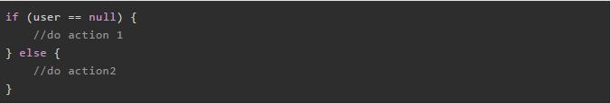

如果登录用户为空，执行action1，否则执行action 2，使用Optional优化之后，让非空校验更加优雅，间接的减少if操作

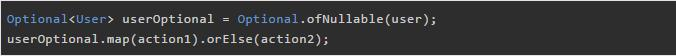

\4. 数组小技巧

来自google解释，这是一种编程模式，叫做表驱动法，本质是从表里查询信息来代替逻辑语句，比如有这么一个场景，通过月份来获取当月的天数，仅作为案例演示，数据并不严谨。

一般的实现：

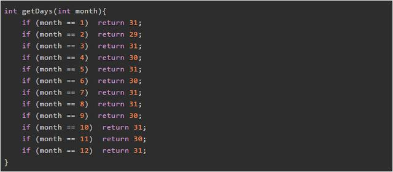

优化后的代码

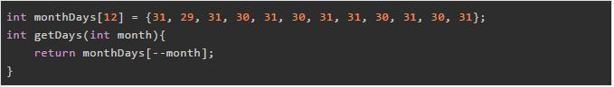

结束

if else作为每种编程语言都不可或缺的条件语句，在编程时会大量的用到。一般建议嵌套不要超过三层，如果一段代码存在过多的if else嵌套，代码的可读性就会急速下降，后期维护难度也大大提高。

> 原文地址：https://dwz.cn/J1JECdOr

