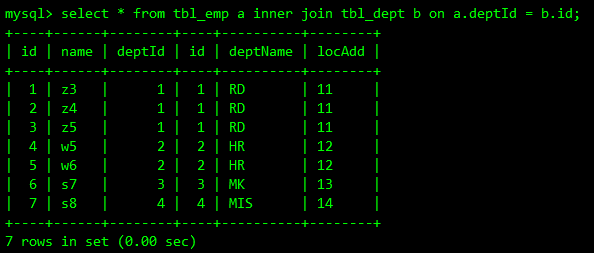
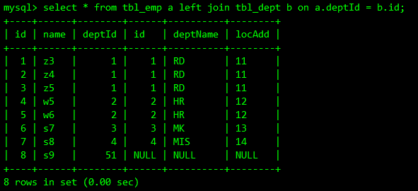
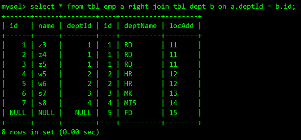
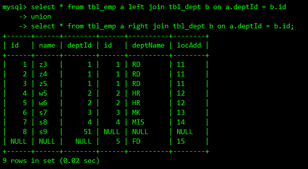

### 1. SQL JOINS


### 2. 创建表

```sql
-- 部门表
CREATE TABLE `tbl_dept` (
  `id` int(11) NOT NULL AUTO_INCREMENT,
  `deptName` varchar(30) DEFAULT NULL,
  `locAdd` varchar(40) DEFAULT NULL,
  PRIMARY KEY (`id`)
) ENGINE=InnoDB DEFAULT CHARSET=utf8;

-- 员工表
CREATE TABLE `tbl_emp` (
  `id` int(11) NOT NULL AUTO_INCREMENT,
  `name` varchar(20) DEFAULT NULL,
  `deptId` int(11) DEFAULT NULL,
  PRIMARY KEY (`id`),
  KEY `deptId` (`deptId`)
  # CONSTRAINT `tbl_emp_ibfk_1` FOREIGN KEY (`deptId`) REFERENCES `tbl_dept` (`id`)
) ENGINE=InnoDB DEFAULT CHARSET=utf8;

INSERT INTO tbl_dept(deptName,locAdd) VALUES('RD',11);
INSERT INTO tbl_dept(deptName,locAdd) VALUES('HR',12);
INSERT INTO tbl_dept(deptName,locAdd) VALUES('MK',13);
INSERT INTO tbl_dept(deptName,locAdd) VALUES('MIS',14);
INSERT INTO tbl_dept(deptName,locAdd) VALUES('FD',15);

INSERT INTO `tbl_emp`(`id`, `name`, `deptId`) VALUES (1, 'z3', 1);
INSERT INTO `tbl_emp`(`id`, `name`, `deptId`) VALUES (2, 'z4', 1);
INSERT INTO `tbl_emp`(`id`, `name`, `deptId`) VALUES (3, 'z5', 1);
INSERT INTO `tbl_emp`(`id`, `name`, `deptId`) VALUES (4, 'w5', 2);
INSERT INTO `tbl_emp`(`id`, `name`, `deptId`) VALUES (5, 'w6', 2);
INSERT INTO `tbl_emp`(`id`, `name`, `deptId`) VALUES (6, 's7', 3);
INSERT INTO `tbl_emp`(`id`, `name`, `deptId`) VALUES (7, 's8', 4);
INSERT INTO `tbl_emp`(`id`, `name`, `deptId`) VALUES (8, 's9', 51);
```

### 3.join查询

- 内连接（图中间 查询两张表的公有部分）

  

- 左连接（图左上 查询员工表的全部 部门表没有补NULL）

  

- 右连接（图右上 查询部门表的全部 员工表没有补NULL）

  

- 左外连接（图左中 查询员工表独有的数据）

  

- 右外连接（图右中 查询部门表独有的数据）

  

- 全连接 （图下中 MySQL不支持 FULL OUTER JOIN 需要`曲线救国`）

  

  

