### 1.查询优化

- 永远小表驱动大表 （类似嵌套循环）

  优化原则：小表驱动大表，即小的数据集驱动大的数据集

  ```sql
  select * from A where id in(select id from B)
  -- 等价于
  for select id from B
  for select * from A where A.id = B.id
  ```

  当B表的数据集小于A表的数据集时，用in优于exists

  ```sql
  select * from A where exists (select 1 from B where B.id = A.id)
  -- 等价于
  for select * from A
  for select * from B where B.id = A.id
  ```

  当A表的数据集小于B表的数据集时，用exists优于in

  注意：A表与B表的id字段应建立索引
  - EXISTS

    ```sql
    select ... from table where exists(subquery)
    -- 该语法可以理解为：将主查询的数据，放到子查询中做条件验证，根据验证结果（TRUE或FALSE）来决定主查询的数据结果是否得以保留。
    ```

  - 提示
    1. exists(subquery)只返回TRUE或FALSE，因此子查询中的select \*也可以是select 1或其它。官方的说法是实际执行时会忽略select清单，因此没有区别
    2. exists子查询的实际执行过程可能经过了优化而不是我们理解上的逐条对比，如果担忧效率问题，可进行实际检验以确定是否有效率问题。
    3. exists子查询往往也可以用条件表达式、其它子查询或者join来替代，何种最优要具体问题具体分析。

### 2.order by 优化

- order by子句，尽量使用index方式排序，避免使用filesort方式排序

  ```sql
  CREATE TABLE `tblA` (
    `age` int(11) DEFAULT NULL,
    `birth` timestamp NULL DEFAULT NULL
  ) ENGINE=InnoDB DEFAULT CHARSET=utf8;

  INSERT INTO tblA(age,birth) VALUES(22,NOW());
  INSERT INTO tblA(age,birth) VALUES(23,NOW());
  INSERT INTO tblA(age,birth) VALUES(24,NOW());

  create index idx_age_birth on tblA(age,birth);
  ```

  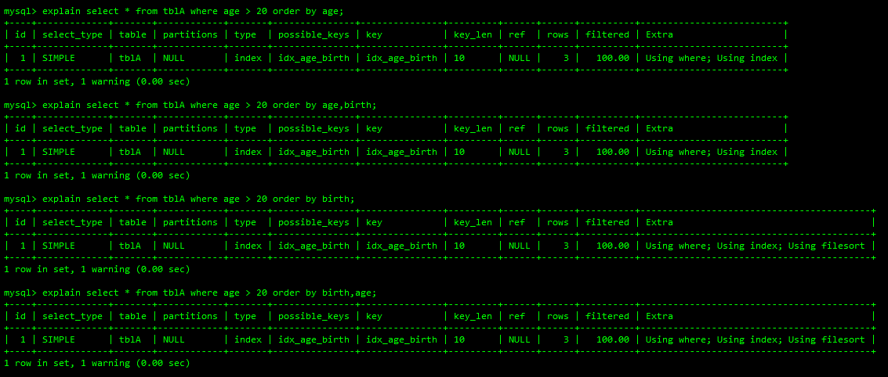

  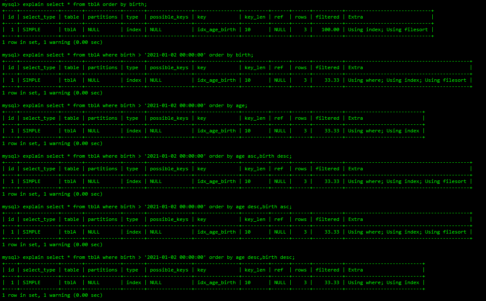

  MySQL支出两种方式的排序：filesort和index，index效率高，它指MySQL扫描索引本身完成排序。filesort效率低。

  order by满足两种情况，会使用index方式排序：
  1. order by语句使用索引最左前列
  2. 使用where子句与order by子句条件组合满足索引最左前缀

  所以，要尽可能在索引列上完成排序操作，遵照最左前缀原则。

  如果不在索引列上，filesort有两种算法：
  - 双路排序

    MySQL4.1之前是使用双路排序，字面意思就是两次扫描磁盘，最终得到数据。读取行指针和orderby列，对它们进行排序，然后扫描已经排序好的列表，按照列表中的值重新从列表中读取对应的数据输出。从磁盘读取排序字段，在buffer进行排序，再从磁盘读取其它字段。

    取一批数据，要对磁盘进行两次扫描，I/O是很耗时的，所以在MySQL4.1之后，出现可第二种改进的算法，就是单路排序。

  - 单路排序

    从磁盘读取查询需要的所有列，按照order by列在buffer对它们进行排序，然后扫描排序后的列表进行行输出，避免了第二次读取数据，它的效率更快一些。并且把随机IO变成了顺序IO，但是他会使用更多的空间，因为它把每一行都保存在了内存中。

  由于单路是后出的，总体而言好过双路，但是单路也存在一定的问题：

  在sort_buffer中，单路排序比多路排序要多占用很多空间，因为单路排序是把所有字段都取出，所以有可能取出的数据的总大小超出了sort_buffer的容量，导致每次只能读取sort_buffer容量大小的数据，进行排序（创建tmp文件，多路合并），排完再去取sort_buffer容量大小的数据，再排序...，从而多次IO。

- 优化策略
  - 增大sort_buffer_size参数的设置值
  - 增大max_length_for_sort_data参数的设置

- 优化策略解释
  - order by时，select \* 是大忌，只query需要的字段，这点非常重要，在这里影响的是：
    1. 当query的字段大小总和小于max_length_for_sort_data而且排序字段不是TEXT|BLOG类型时，会用单路排序算法，否则会使用多路排序算法。
    2. 两种算法的数据都有可能超出sort_buffer的容量，超出之后，会创建tmp文件进行合并排序，导致多次IO，但是用单路排序的风险会更大一些，所以要提高sort_buffe的参数配置。

  - 尝试提高sort_buffer_size

    不管使用哪种算法，提高这个参数都会提高效率，当然要根据系统的能力去提高，因为这个参数是针对每个进程的

  - 尝试提高max_length_for_sort_data

    提高这个参数，会增加使用单路排序算法的概率。但是如果设置的太大，数据的总容量超出sort_buffer_size的概率就会增大，明显症状就是高的磁盘IO活动和低的处理器使用率。

- 总结
  - MySQL两种排序方式：文件排序、索引排序

  - MySQL能为排序和查询使用相同的索引

  Index idx_a_b_c(a,b,c)
  - order by能使用索引最左前缀

    ```sql
    order by a
    order by a,b
    order by a,b,c
    order by a DESC,b DESC,c DESC
    ```

  - 如果where使用索引的最左前缀定义为常量，则order by能使用索引

    ```sql
    where a = const order by b,c
    where a = const and b = const order by c
    where a = const and b > const order by b,c
    ```

  - 不能使用索引进行排序

    ```sql
    order by a ASC,b DESC,c DESC  -- 排序升降不一致
    where g = const order by b,c  -- 丢失a索引
    where a = const order by c    -- 丢失b索引
    where a = const order by a,d  -- d不是索引的一部分
    where a in(...) order by b,c  -- 对于排序来说，多个相等条件也是范围查询
    ```

### 3.group by优化

group实质是先排序后进行分组，遵照索引建的最佳左前缀

当无法使用索引列时，增大max_length_for_sort_data参数的设置+增大sort_buffer_zize参数的设置

where高于having，能写在where限定的条件就不要去having限定。

### 4.慢查询日志

MySQL的慢查询日志是MySQL提供的一种日志记录，它用来记录在MySQL中响应时间超过阈值的语句，具体指运行时间超过long_query_time值的SQL，会被记录在慢查询日志中。long_query_time的默认值为10，单位是秒，默认不开启。由它来查看哪些SQL是慢SQL，结合explain进行全面分析。

- 查看是否开启

  ```sql
  show variables like '%slow_query_log%';
  ```

  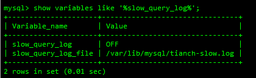

- 开启

  ```sql
  -- 只对当前数据库生效 MySQL重启后失效
  set global slow_query_log = 1;
  ```

  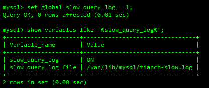

  如果要永久生效，需要修改MySQL配置文件，在[mysqld]下增加或修改参数，注意文件名称的主机名是你自己的。

  ```sql
  slow_query_log = 1
  slow_query_log_file = /var/lib/mysql/tianch-slow.log
  ```

- 开启慢查询日志后，什么样的SQL会被记录到慢查询日志中

  这个是由参数long_query_time控制，默认long_query_time的值是10秒。可以使用命令修改，也可在配置文件中修改。注意，只有大于long_query_time的SQL才会被记录下来，而非大于等于。

  ```sql
  show variables like '%long_query_time%';
  ```

  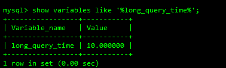

- 设置慢查询日志时间

  ```sql
  set global long_query_time = 3;
  ```

  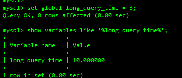
  - 为什么设置后没变化呢？

    需要重新开启一个会话才能看到修改的值

    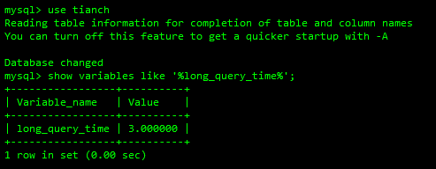

- 慢查询日志记录

  使用sleep模拟慢查询

  ```sql
  select sleep(4);
  ```

  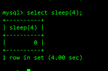

- 查看慢查询日志

  ```shell
  cd /var/lib/mysql/
  cat tianch-slow.log
  ```

  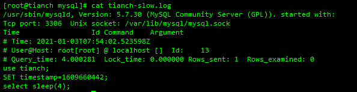

- 查询当前系统中有多少条慢查询日志

  ```sql
  show global status like '%Slow_queries%';
  ```

  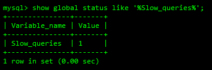

- MySQL慢查询日志永久生效的配置（会有性能损耗）

  [mysqld]下配置

  ```sql
  slow_query_log = 1
  slow_query_log_file = /var/lib/mysql/tianch-slow.log
  long_query_time = 3
  log_output=FILE
  ```

- 慢查询日志分析工具-mysqldumpslow
  - mysqldumpslow --help

    s:表示按照何种方式进行排序

    c:访问次数

    l:锁定时间

    r:返回记录

    t:查询时间

    al:平均锁定时间

    ar:平均返回记录数

    t:返回前面多少条的数据

    g:后面搭正则匹配模式，大小写不敏感

  - 得到返回记录集最多的10个SQL

    ```shell
    mysqldumpslow -s r -t 10 /var/lib/mysql/tianch-slow.log
    ```

  - 道道访问次数最多的10个SQL

    ```shell
    mysqldumpslow -s c -t 10 /var/lib/mysql/tianch-slow.log
    ```

  - 得到按照时间排序的前10条里面含有左连接的查询语句

    ```shell
    mysqldumpslow -s t -t 10 -g "left join" /var/lib/mysql/tianch-slow.log
    ```

  - 建议在使用这些命令时结合`|more`使用，否则可能出现爆屏情况

    ```shell
    mysqldumpslow -s r -t 10 /var/lib/mysql/tianch-slow.log |more
    ```

- 批量插入数据
  - 建表

    ```sql
    use bigdata;

    CREATE TABLE `dept` (
      `id` int(11) NOT NULL AUTO_INCREMENT,
      `deptno` mediumint(8) unsigned DEFAULT '0',
      `dname` varchar(20) DEFAULT NULL,
      `loc` varchar(13) DEFAULT NULL,
      PRIMARY KEY (`id`)
    ) ENGINE=InnoDB DEFAULT CHARSET=utf8;

    CREATE TABLE `emp` (
    `id` int(11) NOT NULL AUTO_INCREMENT,
      `empno` mediumint(8) unsigned DEFAULT '0' COMMENT '编号',
      `ename` varchar(20) DEFAULT NULL COMMENT '名字',
      `job` varchar(9) DEFAULT NULL COMMENT '工作',
      `mgr` mediumint(8) unsigned DEFAULT '0' COMMENT '上级编号',
      `hiredate` date DEFAULT NULL COMMENT '入职时间',
      `sal` decimal(7,2) DEFAULT NULL COMMENT '薪水',
      `comm` decimal(7,2) DEFAULT NULL COMMENT '红利',
      `deptno` mediumint(8) unsigned DEFAULT '0' COMMENT '部门编号',
      PRIMARY KEY (`id`)
    ) ENGINE=InnoDB DEFAULT CHARSET=utf8;
    ```

  - 设置参数`log_bin_trust_function_creators`

    创建参数时，如果报错：This function has none of DETERMINISTIC...

    由于开启过慢查询日志，并且我们开启了bin_log，我们就必须为我们的function指定一个参数

    ```sql
    -- 查看
    show variables like 'log_bin_trust_function_creators%';
    -- 开启
    set global log_bin_trust_function_creators = 1;
    ```

    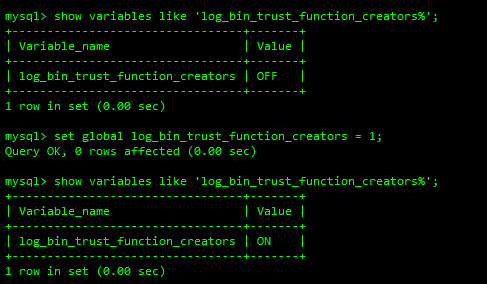

    这样设置，MySQL重启之后，设置会失效，永久设置需要修改配置文件：

    [mysqld]下添加`log_bin_trust_function_creators = 1`

  - 创建函数，保证每条数据都不同

    delimiter $$:将换行符修改为$$
    - 随机产生字符串

      ```sql
      delimiter $$
      create function random_string(n int) returns VARCHAR(255)
      begin
       DECLARE chars_str VARCHAR(100) DEFAULT 'abcdefghijklmnopqrstuvwxyzABCDEFGHIJKLMNOPQRSTUVWXYZ';
       DECLARE return_str varchar(255) DEFAULT '';
       DECLARE i int DEFAULT 0;
       WHILE i<n DO
          set return_str = CONCAT(return_str,substring(chars_str,FLOOR(1+RAND()*52),1));
          set i=i+1;
       END WHILE;
       RETURN return_str;
      end $$
      ```

- 随机产生部门编号
  ````sql
      delimiter $$
      create function random_dept_no() returns int(10)
      begin
       DECLARE i int DEFAULT 0;
       set i = FLOOR(100+RAND()*10);
       RETURN i;
      end $$
      ```

  ````
- 创建存储过程
  - 创建往emp表中插入数据的存储过程

    ```sql
      delimiter $$
      create procedure insert_emp(in start int, in max_num int)
      begin
       DECLARE i int DEFAULT 0;
       set autocommit=0;
       REPEAT
          set i=i+1;
          insert into emp values (null,(start+i),random_string(6),'SALESMAN',0001,CURDATE(),2000,400,random_dept_no());
        UNTIL i = max_num
       END REPEAT;
       COMMIT;
      end $$
    ```

  - 创建往dept表中插入数据的存储过程

    ```sql
      delimiter $$
      create procedure insert_dept(in start int,in int_max int)
      begin
      DECLARE i int default 0;
      set autocommit =0;
      REPEAT
          set i = i+1;
          insert into dept values(null,(start+i),random_string(10),random_string(8));
      UNTIL i=int_max END REPEAT;
      commit;
      end $$
    ```

- 调用存储过程
  - 将换行符改为分号

    ```sql
      delimiter ;
    ```

  - 调用dept存储过程

    ```sql
      call insert_dept(100,10);
    ```

  - 调用emp存储过程

    ```sql
      -- 往emp表添加1000w条数据
      call insert_emp(100001,10000000);
    ```

### 5.profile

是MySQL提供的可以用来分析当前会话中语句执行的资源消耗情况。可以用于SQL调优的测量。默认设置是关闭，并保存最近15次的运行结果。

- 查看当前版本是否支持

  ```sql
  show variables like 'profiling'; -- 默认关闭
  ```

  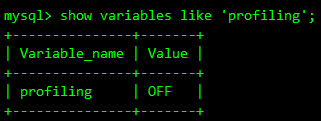

- 开启

  ```sql
  set profiling=on;
  ```

  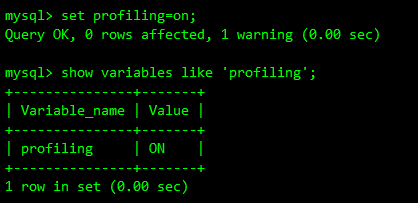

- 执行一些SQL

  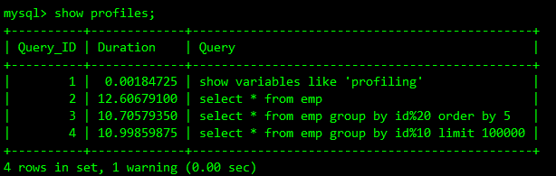

- 诊断SQL

  ```sql
  show profiles;
  ```

  | 字段       | 含义                      |
  | ---------- | ------------------------- |
  | Status     | SQL语句的执行状态         |
  | Duration   | SQL执行过程中每一步的耗时 |
  | CPU_user   | 当前用户占有的cpu         |
  | CPU_system | 系统占有的cpu             |

  | 字段             | 含义                                                          |
  | ---------------- | ------------------------------------------------------------- |
  | all              | 显示所有的开销信息                                            |
  | cpu              | 显示用户CPU时间、系统CPU时间开销信息                          |
  | block io         | 显示块IO相关开销                                              |
  | context switches | 显示上下文切换开销，不管是主动还是被动                        |
  | page faults      | 显示页错误的相关开销                                          |
  | ipc              | 显示发送和接收的开销信息                                      |
  | source           | 显示和Source_function、Source_file、Source_line相关的开销信息 |
  | memory           | 显示内存相关的开销信息                                        |
  | swaps            | 显示SWAP的次数                                                |
  - 诊断具体项的性能开销 如COU、IO

    ```sql
    show profile cpu,block io for query Query_ID
    ```

  - 日常开发需要注意的结论
    - converting HEAP to MyISAM：查询结果太大，内存都不够用了，往磁盘上搬。
    - Creating tmp table:创建临时表
      - 拷贝数据到临时表
      - 用完后删除
    - Copying to tmp table on disk：把内存中的临时表复制到磁盘，极其危险！
    - locked：锁

### 6.全局查询日志-永远不要再生产环境开启这个功能

- 开启
  - 通过配置

    ```sql
    -- kaiq
    general_log = 1
    -- 日志路径
    general_log_file = /path/logfile
    -- 输出格式
    log_output = FILE
    ```

  - 通过命令

    ```sql
    set global general_log = 1;
    set global log_output = 'TABLE';
    ```

  开启后，你所编写的SQL语句，将会记录到MySQL库里的general_log表，可以用下面的命令查看：

  ```sql
  select * from mysql.general_log;
  ```

