### 1.锁的分类

- 按对数据的操作类型分
  - 读锁（共享锁）

    针对同一份数据，多个读操作可以同时进行而不会相互影响

  - 写锁（排它锁）

    当前写操作没有完成前，它会阻断其它写锁或读锁

- 按对数据的操作粒度分
  - 表锁
  - 行锁

### 2.表锁

- 特点

  偏向MyISAM存储引擎，开销小，加锁快，无死锁，锁定粒度大，发生锁冲突的概率最高。并发度偏低。

- 建表

  ```sql
  -- 注意引擎是MyISAM
  CREATE TABLE `mylock` (
    `id` int(11) NOT NULL AUTO_INCREMENT,
    `name` varchar(20) DEFAULT NULL,
    PRIMARY KEY (`id`)
  ) ENGINE=MyISAM DEFAULT CHARSET=utf8;

  insert into mylock values
  (null,'a1'),
  (null,'a2'),
  (null,'a3'),
  (null,'a4'),
  (null,'a5'),
  (null,'a6');
  ```

- 查看表上加过的锁

  ```sql
  show open tables;
  ```

- 手动增加表锁

  ```sql
  -- 可以一次锁定多个表
  lock table 表名1 read/write,表名2 read/write,...;
  ```

  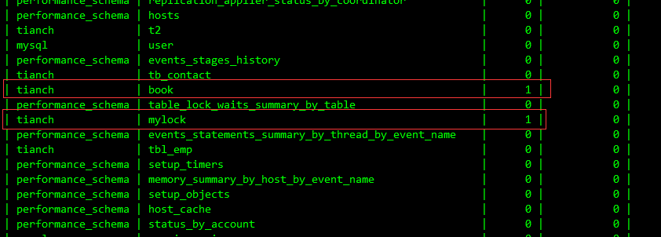

- 手动解锁

  ```sql
  unlock tables;
  ```

  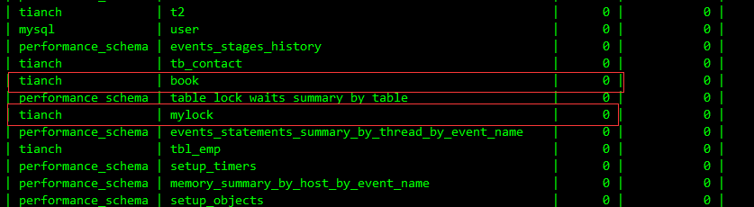

- 开启两个会话：session1、session2
  - session1给mylock表加读锁，session1只可读mylock，session2可读mylock，也可读其它未锁定的表

    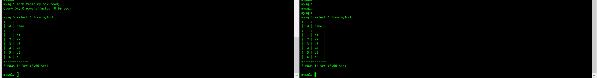

  - session1给mylock表加读锁，session1不可修改

    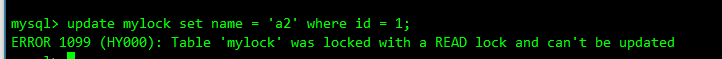

  - session1给mylock表加读锁，session1不可以再去读其它表

    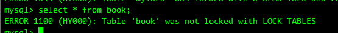

  - session1给mylock表加读锁，session2执行更新操作会锁等待，session1释放锁后，session2才会执行

    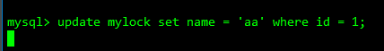

    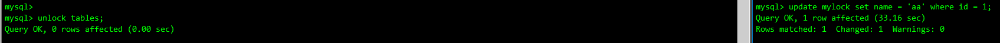

  - 给session1解锁

    ```sql
    unlock tables;
    ```

  - session1给mylock表加写锁，session1可读，可写，不写操作其它表

    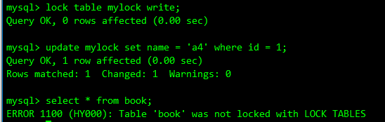

  - session1给mylock表加写锁，sseeion2读写mylock都要等待，session2可读写其它表。

    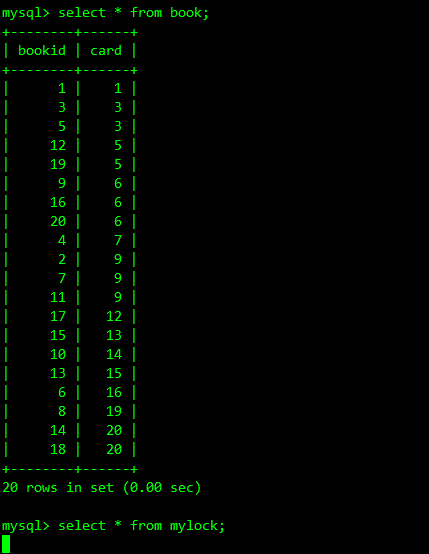

  - session1释放写锁，session2才可读mylock

    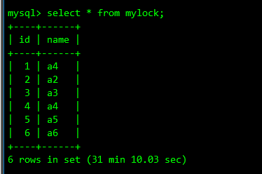

- 结论

  MyISAM在执行查询语句之前，会自动给涉及的所有表加读锁，在执行增删改操作前，会自动给涉及的表加写锁。MySQL的表级锁有两种模式：
  - 表共享读锁（Table Read Lock）
  - 表独占写锁（Table Write Lock）

  | 锁类型 | 可否兼容 | 读锁 | 写锁 |
  | ------ | -------- | ---- | ---- |
  | 读锁   | 是       | 是   | 否   |
  | 写锁   | 是       | 否   | 否   |

  结合上表，对MyISAM表进行操作，会有以下情况
  1. 对MyISAM表进行读操作（加读锁），不会阻塞其它进程对同一表的读请求，但会阻塞对同一表的写请求，只有当读锁释放后，才能执行其它进程的写操作。
  2. 对MyISAM表的写操作（加写锁），会阻塞其它进程对同一表的读和写操作，只有当写锁释放后，才会执行其它进程的读写操作。

  简而言之，就是读锁会阻塞写，但是不会阻塞读。写锁读和写都会阻塞。

- 表锁分析
  - 查看哪些表被锁（上面有提到）

    ```sql
    show open tables;
    ```

  - 如何分析表锁定

    可以通过检查table_locks_waited和table_locks_immediate状态变量来分析系统上的表锁定

    ```sql
    show status like 'table%';
    ```

    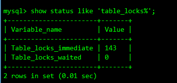

    这里有两个状态变量记录MySQL内部表级锁定的情况：

    Table_locks_immediate：产生表级锁定的次数，表示可以立即获取锁的查询次数，每立即获取锁值加1

    Table_locks_waited：出现表级锁定争用而发生等待的次数（不能立即获取锁的次数，每等待一次锁值加1），此值高则说明存在较严重的表级锁争用情况。

    此外，MyISAM的读写锁调度是写优先，这也是MyISAM不适合做写为主`表的引擎`。因为写锁后，其它线程不能进行任何操作，大量的更新会使得查询很难得到锁，从而造成永远阻塞。

### 3.行锁

- 特点

  偏向InnoDB引擎，开销大，加锁慢，会出现死锁，锁的粒度小，发生锁冲突的概率最低，并发度也最高。

  InnoDB与MyISAM最大的不同有两点：
  1. InnoDB支持事务
  2. InnoDB采用了行级锁

- 事务

  事务是由一组SQL语句组成的逻辑处理单元，具有以下4个属性，简称事务的ACID属性：
  1. 原子性（Atomicity）：事务是一个原子操作单元，其对数据的修改要么全都执行，要么全都不执行。
  2. 一致性（Consistent）：在事务开始和完成时，数据都必须保持一致状态。这意味着所有相关的数据规则都必须应用于事务的修改，以保持数据的完整性，事务结束时，所有的内存数据结构（如B树索引或双向链表）也都必须是正确的。
  3. 隔离性（Isolation）：数据库系统提供一定的隔离机制，保证事务在不受外部并发操作影响的`独立`执行环节。这意味着事务处理过程的中间状态对外部是不可见的，反之亦然。
  4. 持久性（Durable）：事务完成后，它对数据的修改时永久性的，即使出现系统故障也能够保持。

  并发事务带来的问题：
  - 丢失更新（Lost Update）

    当两个或多个事务选择同一行，然后基于最初选定的值更新该行时，由于每个事务都不知道其它事务的存在，就会发生丢失更新的问题，最后的更新覆盖了由其它事务所做的更新。

  - 脏读（Dirty Reads）

    一个事务正在对一条记录做修改，在这个事务完成并提交前，这条记录的数据就处于不一致状态，这时，另一个事务，这时，另一个事务也来读取同一条记录，如果不加控制，第二个事务读取了这些`脏`数据，并据此做进一步的处理，就会产生未提交的数据依赖关系。这种现象被形象地叫做`脏读`。

    换句话说就是，事务A读到了事务B已修改但尚未提交的数据，还在这个数据上进行了操作。此时，如果B事务回滚，A读取的数据无效，不符合一致性的要求。

  - 不可重复读（Non-Repeatable Reads）

    一个事务在读取某些数据后的某个时间，再次读取以前读过的数据，却发现读出的数据已经发生了改变、或某些记录已经被删除了。这种现象就叫做`不可重复读`；

    换句话说就是，事务A读到了事务B已经提交的修改数据，不符合隔离性。

  - 幻读（Phantom Reads）

    一个事务按相同的条件重新读取以前检索过的数据，却发现其它事务插入了满足其查询条件的新数据，这种现象被叫做`幻读`；

    换句话说就是，事务A读到了事务B提交的新增数据，不符合隔离性。

  幻读和脏读有点类似，但也不同：脏读是事务B里面修改了数据，幻读是事务B里面新增了数据。

- 事务的隔离级别

  脏读、不可重复读、幻读，其实都是数据读一致性问题，必须由数据库提供一定的事务隔离机制来解决。

  | 隔离级别              | 丢失更新 | 脏读 | 不可重复读 | 幻读 |
  | --------------------- | -------- | ---- | ---------- | ---- |
  | Read uncommitted      | ×        | √    | √          | √    |
  | Read committed        | ×        | ×    | √          | √    |
  | Repeatable read(默认) | ×        | ×    | ×          | √    |
  | Serializable          | ×        | ×    | ×          | ×    |

  查看当前数据的事务隔离级别：

  ```sql
  show variables like 'tx_isolation';
  ```

  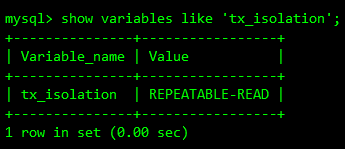

- 建表

  ```sql
  CREATE TABLE `test_innodb_lock` (
    `a` int(11) DEFAULT NULL,
    `b` varchar(16) DEFAULT NULL
  ) ENGINE=InnoDB DEFAULT CHARSET=utf8;

  insert into test_innodb_lock values(1,'b2');
  insert into test_innodb_lock values(3,'3');
  insert into test_innodb_lock values(4,'4000');
  insert into test_innodb_lock values(5,'5000');
  insert into test_innodb_lock values(6,'6000');
  insert into test_innodb_lock values(7,'7000');
  insert into test_innodb_lock values(8,'8000');
  insert into test_innodb_lock values(9,'9000');
  insert into test_innodb_lock values(1,'b1');

  create index idx_innodb_a on test_innodb_lock(a);
  create index idx_innodb_b on test_innodb_lock(b);
  ```

- 演示--开启session1，session2
  - 全部关闭数据库自动提交

    ```sql
    set autocommit = 0;
    ```

  - session1更新但不提交，session2读到的还是原来的数据

    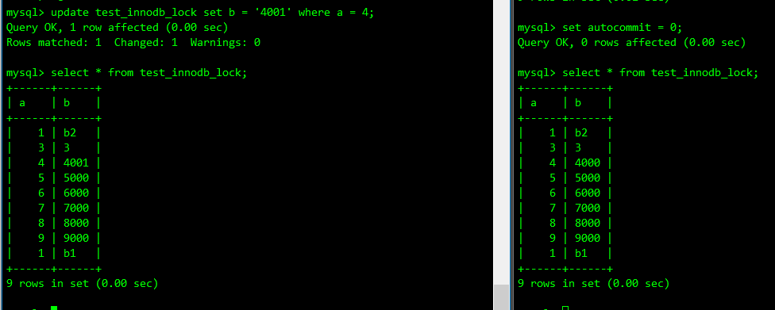

  - session1提交更新

    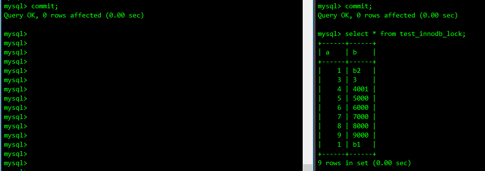

  - session1先更新但不提交，session2更新同一条数据会阻塞

    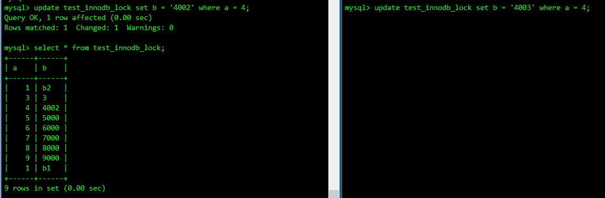

  - session1提交，session2才能执行更新操作，session2更新要生效需要commit

    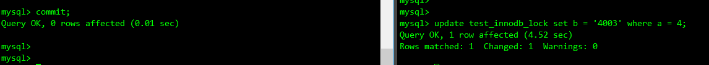

    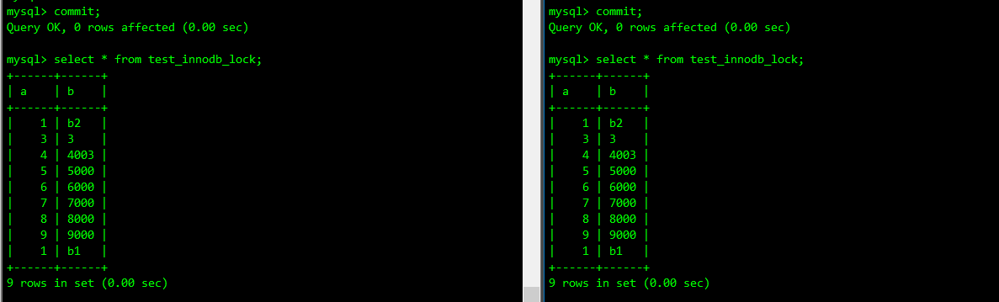

  - session1、session2不更新同一条数据，不会发生阻塞

    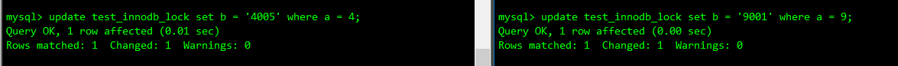

  - session1、session2提交之后

    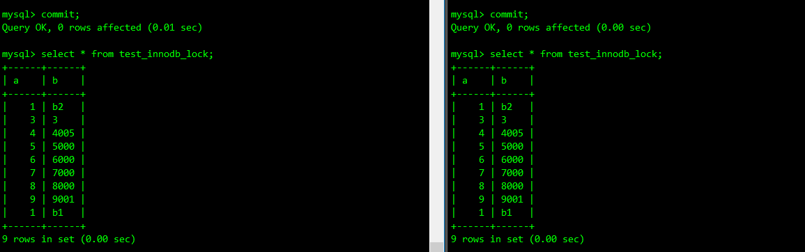

- 索引失效--行锁变表锁

  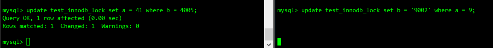

  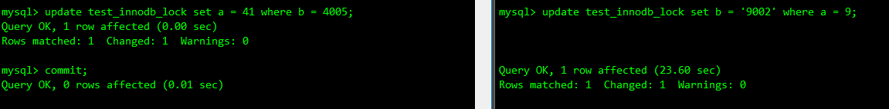

- 数据还原

  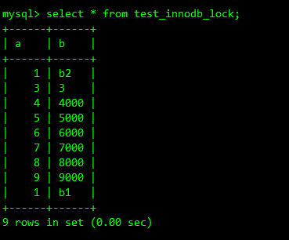

- 间隙锁

  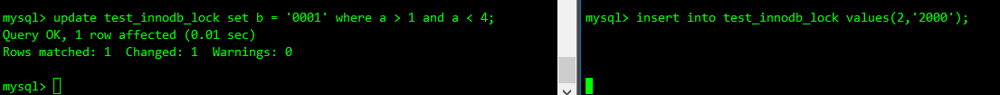

  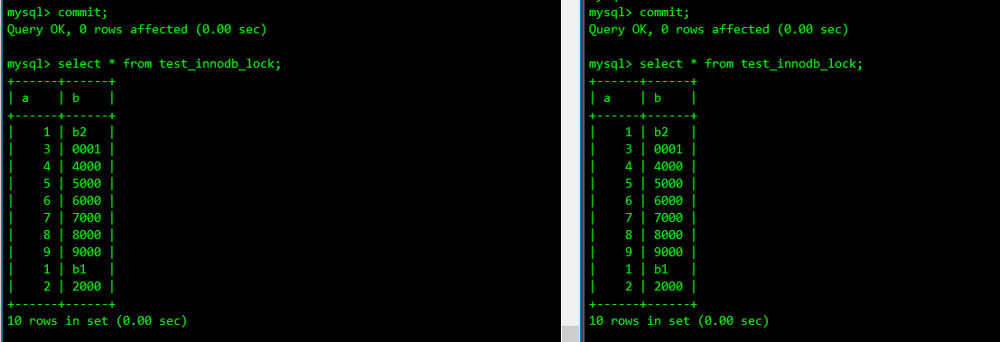

  当我们用范围条件而不是相等条件检索数据，并请求共享或排它锁时，InnoDB会给符合条件的已有数据记录的索引项加锁，对于键值在条件范围内但并不存在的记录叫做`间隙（GAP）`。InnoDB也会对这个间隙加锁，这种锁机制就是间隙锁（Next-Key锁）；

  危害：

  因为Query执行过程中通过范围查找的话，它会锁定整个范围内所有的键值，即使这个键值不存在。

  间隙锁有一个比较致命的弱点，就是当锁定一个范围键值后，即使某些不存在的键值也会被无辜锁定，而造成在锁定的时候无法插入键值范围内的任何数据，在某些场景下可能会对性能造成很大的危害。

- 如何锁定一行

  select xxx for update锁定某一行后，其它的操作会被阻塞，知道锁定行的会话执行commit操作。

  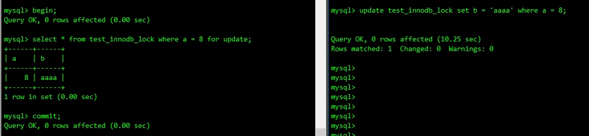

- 结论

  InnoDB存储引擎实现了行级锁定，虽然在锁机制的实现方面带来的性能损耗可能比表级锁要高一些，但是在整体并发处理能力方面要远远优于MyISAM的表级锁定。当系统并发量较高的时候，InnoDB的整体性能和MyISAM相比就会有明显的优势了。但是，当我们使用不当的时候，也可能会让InnoDB的整体性能表现不及MyISAM高，甚至可能会更差。
  - 如何分析表锁定

    通过检查InnoDB_row_lock状态变量来分析系统上的行锁的争夺情况

    ```sql
    show status like 'innodb_row_lock%';
    ```

    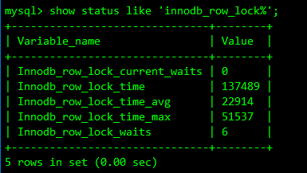

    | 字段                          | 含义                                     |
    | ----------------------------- | ---------------------------------------- |
    | Innodb_row_lock_current_waits | 当前正在等待锁定的数量                   |
    | Innodb_row_lock_time          | 从系统启动到现在锁定总时长               |
    | Innodb_row_lock_time_avg      | 没每次等待所花平均时间                   |
    | Innodb_row_lock_time_max      | 从系统启动到现在等待最长的一次所花的时间 |
    | Innodb_row_lock_waits         | 吃从系统启动到现在总共等待次数           |

    当等待次数很高，而且每次等待时长也不小的时候，我们就需要分析系统中为何会出现如此多的等待，然后分析结果着手制定优化计划。

- 优化建议
  - 尽可能让所有数据检索都通过索引来完成，避免无索引行锁升级为表锁
  - 合理设计索引，尽量缩小锁的范围
  - 尽可能减少检索条件，避免间隙锁
  - 尽量控制事务大小，减少锁定资源和时间长度
  - 尽可能低级别事务隔离

### 4.页锁（了解）

开销和加锁时间界于表锁和行锁之间，会出现死锁，锁定粒度界于表锁和行锁之间，并发度一般。

