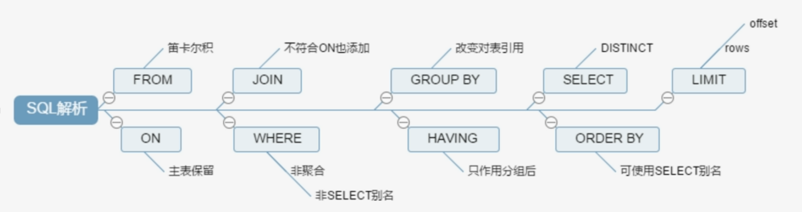

### 1.SQL性能下降的原因

- 根本原因
  - 执行时间长
  - 等待时间长
- 主要原因
  - SQL写的烂
  - 索引失效
  - 关联查询太多join
  - 服务器调优及各个参数设置（缓冲、线程数等）

### 2.SQL的执行顺序

- 手写

  ```sql
  select distinct 查询字段
  from 表名1
  [left]/[right]/[inner] join 表名2
  on 表1.字段=表2.字段
  where 查询条件
  group by 分组字段
  having 分组后判断条件
  order by 排序字段 [asc|desc]
  limit 分页字段
  ```

- 机读

  ```sql
  1.执行 from 表名1
  2.执行 on 关联条件得到它们的交集
  3.执行 [left|right|inner] join 表名2
  4.执行 where 判断条件
  5.执行 group by 进行分组
  6.执行 having 对结果再次进行筛选
  7.执行 select
  8.执行 order by 进行排序
  9.执行 limit
  ```

- 总结

  

  ```sql
  1.from 笛卡尔集
  2.on 主表保留
  3.join 不符合on也添加
  4.where 非聚合,非select 别名
  5.grouip by 改变对表的引用
  6.having 只作用分组后
  7.select distrinct
  8.order by 可使用select 别名
  9.limit rows offiset
  ```

