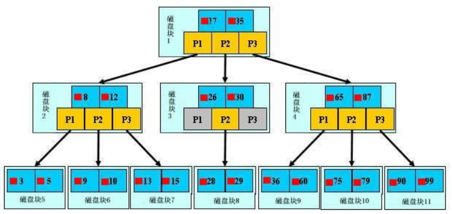
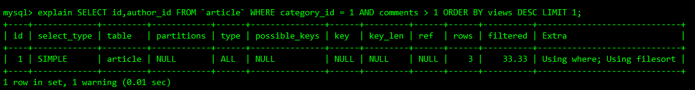
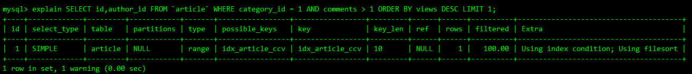
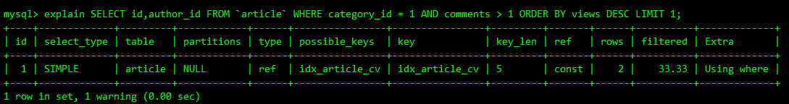
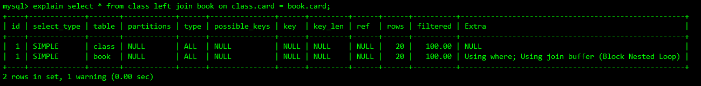
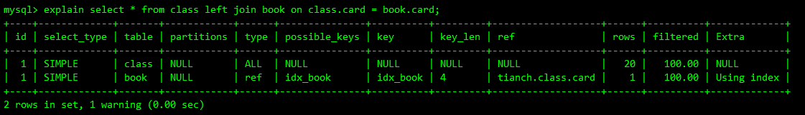
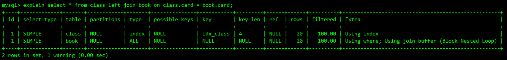
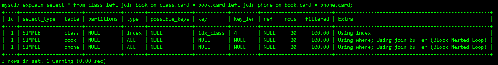
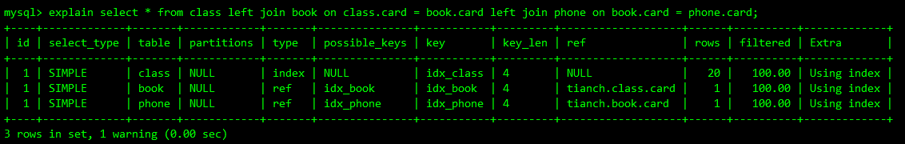

### 1.什么是索引

MySQL官方对索引的定义为：索引（Index）是帮助MySQL高效获取数据的数据结构（有序）。所以，就可以得到索引的本质：索引是有序的数据结构。

索引的目的在于提高查找效率，可类比字典。

### 2.索引的优势劣势

- 优势
  1. 类似大学图书馆建数目索引。提高数据检索效率，降低数据库的IO成本。
  2. 通过索引列对数据进行排序，降低数据排序的成本，降低了CPU的消耗。
- 劣势
  1. 实际上索引也是一张表，该表保存了主键与索引字段，并执行实体表的记录，所以索引列也是要占用空间的。
  2. 虽然索引大大提高了查询速度，同时却降低了更新表的速度。如对表进行`INSERT` `UPDATE` `DELETE`。因为更新表时，MySQL不仅要保存数据，还要保存索引文件每次更新添加了索引列的字段，都会调整因为更新带来的键值变化后的索引信息。
  3. 索引只是提高效率的一个因素，如果你的MySQL有大数据量的表，就需要花大量时间研究建立最优秀的索引或者优化查询。索引是在不断的分析、建立（建了删 删了建 ...）逐步优化出来的，索引的建立不是一朝一夕的，它需要根据业务场景等诸多因素。

### 3.索引的分类

- 主键索引

  设置为主键的列会自动创建索引，InnoDB为`聚簇索引`。

- 单值索引

  一个索引只包含单个列，一个表可以有多个单列索引。

- 唯一索引

  索引列的值必须唯一，但允许有NULL值（注意是NULL值 不能是空字符串）

- 复合索引

  一个索引可以包含多个列

### 4.索引的创建删除查看

- 创建

  ```sql
  -- tableName()中可以是一个列也可以是多个列 []表示可选
  CREATE [UNIQUE] INDEX indexName ON tableName(columnname(length));
  ALTER tableName ADD [UNIQUE] INDEX [indexName](columnname(length));
  ```

  - 4种索引创建的alter命令

    ```sql
    -- 给表添加一个主键,这意味着索引值必须是唯一的,且不能为null
    alter table 表名 add primary key (主键字段);

    -- 创建索引的值必须是唯一的(除了null外,null可能会出现多次修改)
    alter table 表名 add unique 表名(表字段);

    -- 添加普通索引 索引值可出现多次
    alter table 表名 add index 表名(字段);

    -- 全文索引
    alter table 表名 add fulltext 表名(字段);
    ```

- 删除

  ```sql
  drop index indexName on tableName;
  ```

- 查看

  ```sql
  -- \G 将结果按列打印 每个字段单独一行
  show index from 表名\G;
  ```

### 5.MySQL的索引结构

- BTree索引

  
  - 初始化介绍

  一颗B+树，浅蓝色的块，我们称之为一个磁盘块，可以看成每个磁盘块包含几个数据项（深蓝色所示）和指针（黄色所示），如磁盘块1包含数据项17和35，包含指针P1、P2、P3，P1表示小于17的磁盘块，P2表示在17和35之间的磁盘块，P3表示大于35的磁盘块。

  `真实的数据存在于叶子节点`即3、5、9、10、13、15、28、29、36、60、75、79、90、99。

  `非叶子节点不存储真实的数据，只存储指引搜索方向的数据项`，如17、35并不真实存在于数据表中。
  - 查找过程

    如果要查找数据项29，那么首先会把磁盘块1由磁盘加载到内存，此时发生一次IO，在内存中使用二分查找确定29在17和35之间，锁定磁盘块1的P2指针，内存时间因为非常短（相对于磁盘IO来说）可以忽略不计，通过磁盘块1的P2指针的磁盘地址把磁盘块3由磁盘加载到内存，发生第二次IO，29在26和30之间，锁定磁盘块3的P2指针，通过指针加载磁盘块8到内存，发生第三次IO，同时内存中做二分查找找到29，结束查询，总计3次IO。

  真实情况是，3层的B+树可以表示上百万的数据，如果上百万的数据查找只需要3次IO，性能提升将是巨大的，如果没有索引，每个数据项都要发生一次IO，那么总共需要百万次的IO，显然成本非常高。

- Hash索引

- full-text全文索引

- R-Tree索引

### 6.哪些情况需要建立索引

1. 主键自动建立唯一索引
2. 频繁作为查询条件的字段应该建立索引
3. 查询中与其它表关联的字段，外键关系建立索引。
4. 单值/复合索引的选择问题（在高并发下倾向于建立复合索引）
5. 查询中排序的字段，排序字段若通过索引去访问将大大提高排序速度。
6. 查询中统计或者分组的字段

### 7.哪些情况不要创建索引

1. 表记录太少

2. 频繁更新的字段不适合创建索引（简单的说就是每次更新不仅仅要更新数据记录，还需要更新索引）

3. where条件里用不到的字段不创建索引

4. 过滤性不好的字段不适合创建索引

5. 数据重复且分布平均的字段不适合创建索引。

   注意: 如果某个数据列包含许多重复的内容,为它建立索引就没有太大的实际效果

   假如一个表中有10万行数据,有一个字段A只有 T和 F 两种值,且每个值的分布概率大约为 50%,那么对这种表A字段建立索引一般不会提高数据库的查询速度。

   索引的选择性是指索引列中不同值的数目与表中记录数的比。如果一个表中2000条记录,表索引列有1980个不同的值,那么这个索引的选择性就是 1980/2000 =0.99，一个索引的选择越接近1，这个索引的效率就越高。

### 8.索引优化

- 单表优化
  - 建表

    ```sql
    CREATE TABLE `article` (
      `id` int(10) NOT NULL AUTO_INCREMENT,
      `author_id` int(10) DEFAULT NULL,
      `category_id` int(10) DEFAULT NULL,
      `views` int(10) DEFAULT NULL,
      `comments` int(10) DEFAULT NULL,
      `title` varchar(255) DEFAULT NULL,
      `content` text NOT NULL,
      PRIMARY KEY (`id`)
    ) ENGINE=InnoDB DEFAULT CHARSET=utf8;

    INSERT INTO `tianch`.`article`(`id`, `author_id`, `category_id`, `views`, `comments`, `title`, `content`) VALUES (1, 1, 1, 1, 1, '1', '1');
    INSERT INTO `tianch`.`article`(`id`, `author_id`, `category_id`, `views`, `comments`, `title`, `content`) VALUES (2, 2, 2, 2, 2, '2', '2');
    INSERT INTO `tianch`.`article`(`id`, `author_id`, `category_id`, `views`, `comments`, `title`, `content`) VALUES (3, 1, 1, 3, 3, '3', '3');
    ```

  - 查看执行计划

    ```sql
    -- 查询category_id为1且comments大于1的情况下 views最多的id
    SELECT id,author_id FROM `article` WHERE category_id = 1 AND comments > 1 ORDER BY views DESC LIMIT 1;
    ```

    

    很显然，type是ALl，即最坏的情况。Extra里还出现了Using filesort，也是最坏的情况，优化是必须的。

  - 开始第一次优化
    - 建立索引

      ```sql
      create index idx_article_ccv on article(category_id,comments,views);
      ```

    - 再次查看执行计划

      

      全表扫描的问题解决了，但是文件排序的问题没有解决，因为范围查询后面的索引失效了。

    - 结论

      type变成了range是可以接受的，但是Extra里使用了Using filesort是无法接受的。

      但是我们已经建立了索引，为什么没有效果呢？

      这是因为按照B+树索引的工作原理：

      先排序category_id

      如果遇到相同的category_id，再排序comments

      如果遇到相同的comments，再排序views。

      当comments字段再联合索引中处于中间位置是

      因为comments>1条件是一个范围值

      MySQL无法利用索引再对后面的views部分进行检索，也就是说range类型查询字段后面的索引无效。

  - 开始第二次优化
    - 删除原来的索引

      ```sql
      drop index idx_article_ccv on article;
      ```

    - 建立新的索引

      ```sql
      create index idx_article_cv on article(category_id,views);
      ```

    - 查看执行计划

      

    - 结论

      type变成了ref，Extra中的Using filesort也消失了，索引优化有效。

- 两表优化
  - 建表

    ```sql
    CREATE TABLE `class` (
      `id` int(10) NOT NULL AUTO_INCREMENT,
      `card` int(10) NOT NULL,
      PRIMARY KEY (`id`)
    ) ENGINE=InnoDB DEFAULT CHARSET=utf8;

    CREATE TABLE `book` (
      `bookid` int(10) NOT NULL AUTO_INCREMENT,
      `card` int(10) NOT NULL,
      PRIMARY KEY (`bookid`)
    ) ENGINE=InnoDB DEFAULT CHARSET=utf8;
    -- 各表创建20条
    INSERT INTO class(card) VALUES(FLOOR(1 +(RAND() * 20)));
    INSERT INTO book(card) VALUES(FLOOR(1 +(RAND() * 20)));
    ```

  - 查看执行计划

    ```sql
    select * from class left join book on class.card = book.card;
    ```

    

    type有ALL

  - 给book(右表)表添加索引

    ```sql
    create index idx_book on book(card);
    ```

    

  - 删除book表索引 给class表添加索引

    ```sql
    drop index idx_book on book;
    create index idx_class on class(card);
    ```

  - 再次查看执行计划

    

  - 结论

    左连接查询时，在给book表添加索引之后，type变成了ref，rows也变了，优化比较明显。在给class添加索引之后，只有type变成了index。

    这是由左连接的特性决定的。left join 条件用于确定如何从右表搜索行，左边一定都有，所以右表是关键，一定要建立索引。

    同理，右连接时，左表一定要建立索引。

- 三表优化
  - 建表 删除之前两表创建的索引

    ```sql
    CREATE TABLE `phone` (
      `phoneid` int(10) NOT NULL AUTO_INCREMENT,
      `card` int(10) NOT NULL,
      PRIMARY KEY (`phoneid`)
    ) ENGINE=InnoDB DEFAULT CHARSET=utf8;

    -- 创建20条
    INSERT INTO phone(card) VALUES(FLOOR(1 +(RAND() * 20)));
    ```

  - 查看执行计划

    ```sql
    select * from class left join book on class.card = book.card left join phone on book.card = phone.card;
    ```

    

  - 根据两表的结论 给两个右表(book，phone)添加索引

    ```sql
    create index idx_book on book(card);
    create index idx_phone on phone(card);
    ```

  - 再次查看执行计划

    

  - 结论

    尽可能减少join语句中嵌套循环的循环总次数：永远用小的结果集驱动大的结果集；

    优先优化嵌套循环的内层循环；

    保证join语句中被驱动表上join条件字段已经被索引；

    当无法保证被驱动表的join条件字段被索引且内存资源充足的前提下，增大JoinBuffer的值。

### 9.索引失效（应该避免）

- 建表

  ```sql
  CREATE TABLE `staffs` (
    `id` int(11) NOT NULL AUTO_INCREMENT,
    `name` varchar(24) NOT NULL,
    `age` int(10) NOT NULL DEFAULT '0',
    `pos` varchar(20) NOT NULL,
    `add_time` timestamp NOT NULL DEFAULT CURRENT_TIMESTAMP,
    PRIMARY KEY (`id`)
  ) ENGINE=InnoDB DEFAULT CHARSET=utf8;

  INSERT INTO staffs(NAME,age,pos,add_time)VALUES('z3',22,'manager',NOW());
  INSERT INTO staffs(NAME,age,pos,add_time)VALUES('July' ,23,'dev',NOW());
  INSERT INTO staffs(NAME,age,pos,add_time)VALUES('2000',23,'dev',NOW());
  ```

