### 1.MySQL Query Optimizer

MySQL中有专门负责优化SELECT语句的优化器模块，主要功能：通过计算分析系统中搜集到的统计信息，为客户端请求的Query提供它认为最优执行计划（它认为最优的数据检索方式，但不见得是DBA认为是最优的）。

当客户端向MySQL请求一条Query，命令解析器完成请求分类，区分出是SELECT并转发给MySQL Query Optimizer，MySQL Query Optimizer首先会对整条Query进行优化，处理掉一些常见表达式的预算，直接换算成常量值，并对Query中的查询条件进行简化和转换，如去掉一些无用或显而易见的条件、结果调整等。然后分析Query中的Hint信息（如果有），看显示Hint信息是否可以完全确定该Query的执行计划，如果没有Hint或Hint信息还不足以完全确定执行计划，则会读取所涉及对象的统计信息，根据Query进行相应的计算分析，然后再得出最后的执行计划。

### 2.MySQL常见瓶颈

- CPU:CPU在饱和的时候一般发生在数据装入内存或从磁盘上读取数据的时候
- IO:磁盘I/O瓶颈发生在装入数据远大于内存容量的时候
- 服务器硬件的性能瓶颈

### 3.EXPLAIN-查看执行计划

使用EXPLAIN关键字可以模拟优化器执行SQL查询语句，从而知道MySQL是如何处理你的SQL语句的，分析你的查询语句或是表结构的性能瓶颈。

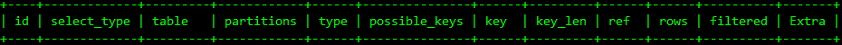

- id 表的读取顺序

  select查询的顺序号，包含一组数字，表示查询中执行select子句或操作表的顺序，有以下3中情况：
  1. id相同 执行顺序由上至下

     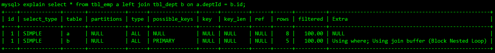

  2. id不同 如果是子查询，id的序号会递增，id值越大，优先级越高，越先被执行

     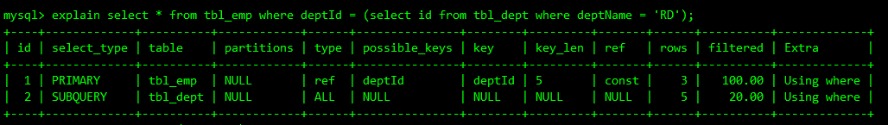

  3. id相同又不同

     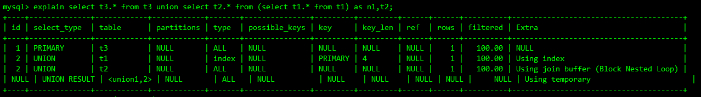

     id如果相同，可以认为是一组，从上往下顺序执行。在所有组中，id值越大，优先级越高，越先执行

- select_type 数据读取操作的操作类型
  1. SIMPLE 简单的select查询，查询中不包含子查询或union
  2. PRIMARY 查询中若包含任何复杂的子部分，最外层查询则被标记为PRIMARY
  3. SUBQUERY 在select或where列表中包含了子查询
  4. DERIVED 在from列表中包含的子查询被标记为DERIVED（衍生），MySQL会递归执行这些子查询，把结果放在临时表里
  5. UNION 若第二个select出现在union之后，则被标记为union，若union包含在from子句的子查询中，外层select将被标记为DERIVED。
  6. UNION RESULT 从UNION表获取结果的select

- table 表示这一行的数据是哪张表的

- type 访问类型

  从最好到最差依次是：system>const>eq_ref>ref>range>index>ALL
  - system 表只有一行记录（等于系统表），是const类型的特例，平时不会出现，可以忽略不计

  - const 表示通过索引一次就找到了，const用于比较primary key或者unique索引。因为只匹配一行数据，所以很快。如将主键置于where列表中，MySQL就能将该查询转换为一个常量。

  - eq_ref 唯一性索引扫描，对于每个索引键，表中只有一条记录与之匹配。常见于主键或唯一索引扫描

  - ref 非唯一索引扫描，返回匹配某个单独值的所有行，本质上也是一中索引访问。

  - range 只检索给定范围的行，使用一个索引来选择行。key列显示使用了哪些索引。一般就是在你的where语句中出现了between 、<、>、in等的查询。这种范围扫描，索引扫描比全表扫描要好，因为它只需要开始于索引的某一个点，而结束于另一个点，不用扫描全部索引。

  - index Full Index Scan，index与ALL的区别在于index类型只遍历索引树，这通常比ALL快，因为索引文件通常比数据文件小。也就是说ALL和index都是读全表，但index是从索引中读取的，而ALL是从硬盘中读的。

  - ALL Full Table Scan 将遍历全表找到匹配的行。

  - possible_keys 显示可能应用在这张表中的索引，一个或多个。查询涉及到的字段上若存在索引，则索引将会被列出，但不一定被实际使用。

  - key 实际使用的索引，如果为NULL，则没用使用索引。查询中若使用了覆盖索引，则该索引仅出现在key列表中。

    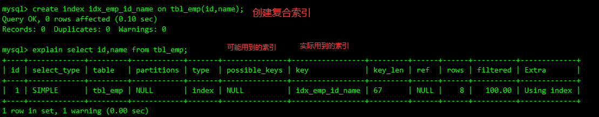

  - key_len 表示索引中使用字节数，可通过该列计算查询中使用的索引的长度，在不损失精确性的前提下，长度越短越好。key_len显示的值是索引字段的最大可能长度，并非实际使用长度，即key_len是根据表定义计算而得，不是通过表内检索出的。

  - ref 显示索引的哪一列被使用了，如果可能的话，最好是一个常数。哪些列或常量被用于查找索引列上的值。

    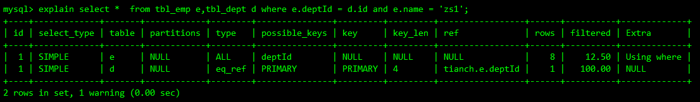

  - rows 根据表统计信息及索引选用情况，大致估算出找到所需记录时需要读取的行数。

  - Extra 包含不适合在其它列显示但十分重要的额外信息
    - Using filesort 说明MySQL会对数据使用一个外部的索引排序，而不是按照表内的索引进行读取。MySQL中无法利用索引完成的排序操作称为`文件排序`。

      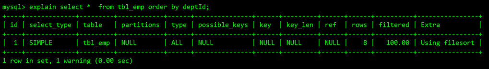

    - Using temporary 使用了临时表保存中间结果，MySQL在对查询结果排序时使用了临时表。常见于排序order by和分组查询group by。

      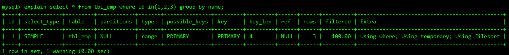

      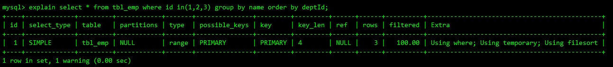

    - Using index 表示响应的select操作使用了覆盖索引，避免访问了表的数据行。如果同时出现了 Using where，表明索引被用来执行索引键值的查找。如果没有同时出现Using where，表明索引来读取数据而非执行查找动作。

      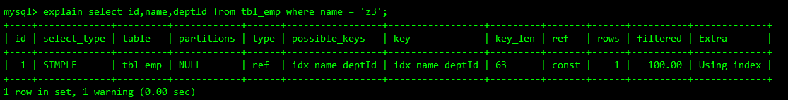

    - Using where 表明使用了where过滤

      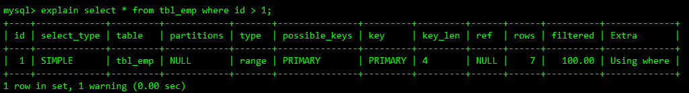

    - Using join buffer 使用了连接缓存

    - Impossible where where子句的值总是false，不能用来获取元组

      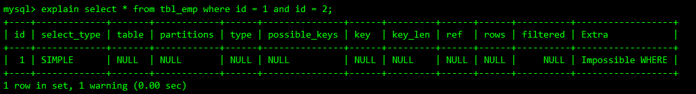

