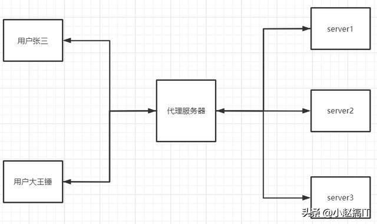

说到 大名鼎鼎的 Nginx， 大家肯定都不陌生，不管是做运维，做开发，还是做网络的都应该对他很熟悉。Nginx的功能很多，很强大，今天我主要是分享一下 Nginx 反向代理的常见用法。

**什么是反向代理?**

`举个例子： 比如用户去访问百度，用户在浏览器输入www.baidu.com时，对于百度来说，浏览器就是客户端。 客户端将请求发送到百度的代理服务器，由代理服务器去选择目标服务器获取数据后，在返回给客户端。   这样做有三个好处： 1、隐藏了目标服务器IP地址，暴露出去的只是代理服务器 2、访问量很大的时候可以轻松扩容，目标服务器可以有很多个 3、客户端对代理是无感知的，客户端不需要任何配置就可以访问`

看下面这张图 可能更直观一些



**现在来看一些Nginx 反向代理的实战用法：**

**1、Nginx 反代 websocket**

```shell
#在http区域内一定要添加下面配置： map $http_upgrade $connection_upgrade { default upgrade; '' close; } 作用主要是根据客户端请求中$http_upgrade 的值，来构造改变$connection_upgrade的值，即根据变量$http_upgrade的值创建新的变量$connection_upgrade， 创建的规则就是{}里面的东西。其中的规则没有做匹配，因此使用默认的，即 $connection_upgrade 的值会一直是 upgrade。然后如果 $http_upgrade为空字符串的话， 那值会是 close
server {
    listen 80;
    server_name XXXXX;
    location / {
        proxy_pass http://192.168.10.100:9504;
        proxy_set_header X-Real-IP $remote_addr;
        proxy_set_header Host $host;
        proxy_set_header X-Forwarded-For $proxy_add_x_forwarded_for;
        proxy_http_version 1.1;
        proxy_set_header Upgrade $http_upgrade;
        proxy_set_header Connection "upgrade";
    }
}
# 这里需要注意的是 proxy_http_version 1.1;  这个参数很重要 # 因为Nginx对HTTP的反向代理，默认使用HTTP 1.0连接到后端，那样没法保持长连接，后端作出HTTP响应后，连接就断了，而websocket是长连接，所以启用HTTP 1.1以支持长连接
```

2、nginx 七层 反向代理

```shell
# 七层就是应用层  例子1：  经典的LNMP #在nginx 中添加如下配置：
location ~ \.php$ {
    fastcgi_pass   127.0.0.1:9000;
    fastcgi_index  index.php;
    include        fastcgi.conf;
}
# 表示把以php 结尾的请求都转发到 127.0.0.1:9000 即 我设置的php-fpm 默认端口
#例子2： 传参式
location ~ ^/api/(.*)$ {
    proxy_pass http://127.0.0.1:9901/$1;
    proxy_set_header   Host             $host;
    proxy_set_header   X-Real-IP        $remote_addr;
    proxy_set_header   X-Forwarded-For  $proxy_add_x_forwarded_for;
}
# 重要指令： proxy_pass 可以包含传输协议、主机名称或IP地址加端口号，URI等 # http://127.0.0.1:9901/$1 这里的 $1 就是我通过接口传进来的参数
```

3、nginx 四层反向代理

```shell
# 四层是网络层，例子：允许某个IP 可以连接内网的mysql 数据库
stream {
    upstream mysqldb {
        hash $remote_addr consistent;
        # $binary_remote_addr;
        server 172.18.1.101:3306;
	}
	server {
        listen 3306;
        allow x.x.x.0/24;
        deny all;
        proxy_connect_timeout 10s;
        proxy_timeout 900s;
        #设置客户端和代理服务之间的超时时间，如果15分钟内没操作将自动断开。
        proxy_pass mysqldb;
    }
}
#注意，需要nginx 有 stream模块，在编译的过程中加参数  --with-stream
```

nginx 反代的用法挺多的，我只是列举出我觉得最实用的几种，如果有错误的地方请指出来，大家共同学习。

原文:https://www.toutiao.com/i6823738067870810635/

