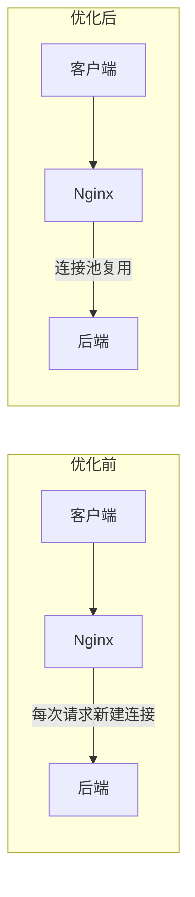

网上关于 Nginx 优化的文章，大多是一张参数清单：`worker_processes = CPU核数`、`sendfile on`、`gzip on`……照着抄一遍，却说不清**为什么有效、什么时候有效、有没有副作用**。本文换一种思路：**先测量，再调优，再验证**。

因为性能优化的第一原则是——**没有数据的优化都是玄学**。不先压测定位瓶颈，盲目堆参数可能适得其反。

## 一、第一步：先测量，别急着改

### 1. 压测工具选择

| 工具 | 特点 | 适用场景 |
| --- | --- | --- |
| `ab`（Apache Bench） | 单机单进程，简单直接 | 快速验证某个参数前后对比 |
| `wrk` | 高并发多线程，性能好 | 模拟较高并发、看延迟分布 |
| `hey` / `vegeta` | Go 实现，使用简单 | 长时间压测、打点上报 |
| `locust` / `JMeter` | 分布式、可视化 | 端到端压测、断言 |

Windows / Linux 上最常用的快速验证组合就是 `ab` 加 `wrk`。压测前确认已安装：

```shell
# Ubuntu
apt install -y apache2-utils wrk
# CentOS
yum install -y httpd-tools
# wrk 需要源码编译安装
```

### 2. 建立基线数据

调优前必须测出**当前基准**，否则无法判断优化是否有效：

```shell
# 压测一个静态文件，20000 请求，100 并发
ab -n 20000 -c 100 http://127.0.0.1/static/test.js

# 输出关键指标
# Requests per second:    吞吐量（QPS）
# Time per request:       平均延迟
# Transfer rate:          带宽
# Failed requests:        失败数（必须为 0 或极小）
# 非 2xx 响应码：         观察错误率
```

同时压测**动态接口**（经 Nginx 反代到后端）和**静态资源**，因为它们的优化策略完全不同：

```shell
# 动态接口压测
ab -n 5000 -c 50 http://127.0.0.1/api/user/1

# 反向代理链路压测
ab -n 5000 -c 50 http://127.0.0.1:8080/api/user/1
```

### 3. 识别瓶颈方向

| 现象 | 可能瓶颈 |
| --- | --- |
| QPS 低但 CPU 不高、有大量 TIME_WAIT | 连接未复用（keepalive 缺失） |
| CPU 满载且 QPS 上不去 | worker 数量/亲和性、gzip 计算、磁盘 IO |
| 静态文件 QPS 低 | sendfile/零拷贝、open_file_cache 未开启 |
| 反代到后端慢 | 上游 keepalive、proxy_buffering、后端本身 |
| 延迟稳定但吞吐低 | 单 worker 处理能力、锁竞争 |

**记住一个原则：优化要有针对性。** 下面每个优化项，我都标注了"解决什么问题"和"何时有效"。

## 二、连接与进程模型调优

### 1. worker_processes：进程数与 CPU 核数匹配

Nginx 的 worker 是单进程事件循环（异步非阻塞），**一个 worker 可以同时处理成千上万连接**。但 worker 多了并不会线性提升性能，反而增加上下文切换和内存消耗。

```nginx
# 最简单的写法：= 逻辑 CPU 核数
worker_processes auto;

# 或显式指定
worker_processes 8;

# 静态内容为主的站点，可适当减少到 1~2 个
# 大量反代/动态请求，建议等于核数
```

`auto` 会自动检测核数，够用且不折腾。

### 2. worker_cpu_affinity：CPU 亲和性（多核部署时）

每个 worker 绑定固定 CPU，避免进程在核间频繁切换，减少缓存抖动：

```nginx
# 8 核机器，每个 worker 绑一个核
worker_cpu_affinity 00000001 00000010 00000100 00001000
                   00010000 00100000 01000000 10000000;

# 或 auto（1.9+ 支持）
worker_cpu_affinity auto;
```

> 适用于 worker 数 ≥ 2 且机器核数明确的场景。单核、容器内无法感知核数时不适用。

### 3. worker_connections：每个 worker 能开的连接上限

这是**并发能力**的关键参数。Nginx 单 worker 能承载的连接数远超这个值，它是"上限保护"。

```nginx
events {
    # 每个 worker 最大连接数（默认 512 或 1024，建议调大）
    worker_connections 10240;
}
```

**系统层面配合**：`worker_connections × worker_processes` 不能超过系统 `ulimit -n`（文件描述符上限）：

```shell
# 查看当前限制
ulimit -n
# 临时调大（重启失效）
ulimit -n 65535

# 永久修改 /etc/security/limits.conf
# * soft nofile 65535
# * hard nofile 65535
```

Linux 同时要放宽端口范围、缩短 TIME_WAIT 回收时间，配合连接复用：

```shell
# /etc/sysctl.conf
net.ipv4.ip_local_port_range = 1024 65535      # 可用端口范围
net.ipv4.tcp_tw_reuse = 1                       # 快速复用 TIME_WAIT 连接
net.core.somaxconn = 65535                      # accept 队列上限
```

```nginx
events {
    # listen 的 accept 队列长度，与 somaxconn 配合
    listen 80 backlog=65535;
    # 关闭 accept_mutex，减少惊群（高并发下受益）
    accept_mutex off;
}
```

### 4. keepalive：复用连接，减少三次握手

HTTP 每建一次连接要 1 次 RTT（加上 TLS 要 2~3 次）。**长连接复用**能把热请求的建连开销省掉。

```nginx
http {
    # 客户端→Nginx 长连接
    keepalive_timeout 65;        # 空闲连接保持 65 秒
    keepalive_requests 10000;    # 单连接最多服务 1 万个请求

    # 如果站点是 API 服务且客户端是移动端/浏览器，keepalive 收益明显
    # 纯静态文件站也可以开，收益中等
}
```

**这是最容易忽视、又性价比极高的一项。** 优化前如果观察到大量 `TIME_WAIT` 连接，多半就是 keepalive 没开。

## 三、静态资源与 IO 调优

### 1. sendfile：零拷贝，让内核直接发文件

传统流程：`磁盘 → 内核缓冲区 → 应用缓冲区 → 内核 socket 缓冲区 → 网卡`，数据在用户态内核态间拷贝了 4 次。开启 `sendfile` 后：`磁盘 → 内核缓冲区 → 网卡`，**用户态完全不参与**。

```nginx
http {
    sendfile on;                # 静态文件零拷贝
    tcp_nopush on;              # 攒够包再发，减少小包，配合 sendfile
    tcp_nodelay on;             # 禁用 Nagle 算法，降低交互式延迟
}
```

- `tcp_nopush` 适合**大文件**（图片、JS/CSS），攒包批量发送；
- `tcp_nodelay` 适合**小响应**（API、JSON），降低首字节延迟；
- 两者不冲突，生产环境通常同时开启。

### 2. gzip：压缩传输体积

文本类资源压缩后体积能降到 1/3~1/5，直接减少带宽和传输时间：

```nginx
http {
    gzip on;
    gzip_min_length 1k;              # 小于 1KB 不压缩（压缩本身有开销）
    gzip_comp_level 5;               # 1-9，越高越耗 CPU，5 是性价比平衡点
    gzip_types text/plain text/css application/json
               application/javascript application/xml
               application/x-httpd-php image/svg+xml;
    gzip_vary on;                    # 响应头加 Vary: Accept-Encoding
}
```

**注意副作用**：gzip 是 CPU 密集型操作，`gzip_comp_level` 过高或对已经压缩过的资源（图片、视频）开启会白白消耗 CPU。**图片/视频不要 gzip**，它们本身已压缩。

### 3. open_file_cache：缓存文件元数据

每次静态文件请求都要 `open()` 文件。`open_file_cache` 把文件句柄、大小、修改时间缓存在内存里，省掉重复 `open/stat`：

```nginx
http {
    open_file_cache max=10000 inactive=60s;   # 最多缓存 1 万个文件，60 秒内未被访问则淘汰
    open_file_cache_valid 60s;                # 每 60 秒检查一次缓存是否失效
    open_file_cache_min_uses 2;               # 访问 2 次以上才缓存
    open_file_cache_errors on;                # 缓存找不到文件的错误
}
```

**何时有效**：热点静态文件多、请求重复访问时收益明显。文件被修改后 `open_file_cache_valid` 周期内可能读到旧缓存，但 Nginx 会按文件 `mtime` 失效，所以不担心。

### 4. 静态文件单独处理 + 浏览器缓存

让 Nginx 直接服务静态资源，并下发**强缓存**头，让浏览器不反复请求：

```nginx
location ~* \.(js|css|png|jpg|jpeg|gif|webp|svg|woff2?)$ {
    root /var/www/static;
    expires 30d;                    # 浏览器强缓存 30 天
    add_header Cache-Control "public, immutable";
    access_log off;                 # 静态资源不打访问日志
    log_not_found off;
}
```

> 只有文件名带 hash（如 `app.8f3k2d.js`）的资源才能用 `immutable`，否则更新后用户拿不到新版本。

## 四、反向代理场景调优

### 1. upstream keepalive：复用到后端的连接

**这是反代场景最容易被忽略的配置**。默认 Nginx 每次转发请求都向后端新建一条 TCP 连接（还不带 TLS 复用），后端连接压力巨大。

```nginx
upstream backend {
    server 127.0.0.1:8080 weight=2;
    server 127.0.0.1:8081 weight=1;

    # 连接池中保持的空闲连接数
    keepalive 300;
    # 单条连接最多复用请求数
    keepalive_requests 10000;
    # 连接空闲超时
    keepalive_timeout 60s;
}

server {
    location /api/ {
        proxy_pass http://backend;

        # 告诉后端使用 HTTP/1.1 并复用连接（关键！）
        proxy_http_version 1.1;
        proxy_set_header Connection "";

        proxy_set_header Host $host;
        proxy_set_header X-Real-IP $remote_addr;
        proxy_set_header X-Forwarded-For $proxy_add_x_forwarded_for;
        proxy_set_header X-Forwarded-Proto $scheme;

        # 后端响应缓冲到 Nginx 再统一返回
        proxy_buffering on;
        proxy_buffer_size 4k;
        proxy_buffers 8 4k;
        proxy_busy_buffers_size 8k;
    }
}
```

**调优前后对比（示意）：**



### 2. proxy_cache：后端响应缓存到 Nginx

后端接口结果变化不频繁时，让 Nginx 直接缓存响应，后端压力直接降为 0：

```nginx
http {
    # 定义缓存区：路径、层级、大小
    proxy_cache_path /var/cache/nginx levels=1:2
                     keys_zone=api_cache:50m inactive=10m max_size=1g;

    server {
        location /api/hot/ {
            proxy_cache api_cache;              # 使用该缓存区
            proxy_cache_key $scheme$host$uri$args;
            proxy_cache_valid 200 5m;           # 200 响应缓存 5 分钟
            proxy_cache_valid 404 1m;
            proxy_cache_use_stale error timeout; # 后端异常时返回旧缓存
            proxy_cache_lock on;                # 防止缓存击穿
            add_header X-Cache-Status $upstream_cache_status;  # 调试用
        }
    }
}
```

- `$upstream_cache_status` 会返回 `HIT`/`MISS`/`EXPIRED`/`BYPASS`，**上线后用 `curl -I` 验证缓存是否命中**；
- `proxy_cache_lock on`：同一 key 多个请求并发时只让一个去后端回源，其余等缓存（防击穿）。

### 3. 超时与连接参数

```nginx
location /api/ {
    proxy_connect_timeout 5s;    # 连接后端超时
    proxy_send_timeout 10s;      # 发送请求超时
    proxy_read_timeout 15s;      # 读取响应超时
    proxy_next_upstream error timeout http_502 http_503;  # 失败自动切换上游
}
```

超时太长会让 Nginx 积累大量挂起的 worker；太短又会误伤慢接口。**按后端真实 P99 延迟设置**，不要拍脑袋。

## 五、HTTP/2 与 TLS 加速

### 1. 开启 HTTP/2（多路复用、头压缩）

HTTP/2 单连接多路复用，配合 `http2` 只需一行：

```nginx
server {
    listen 443 ssl http2;
    server_name www.example.com;

    ssl_certificate     /etc/nginx/certs/fullchain.pem;
    ssl_certificate_key /etc/nginx/certs/privkey.pem;

    ssl_protocols TLSv1.2 TLSv1.3;      # 只留安全版本
    ssl_ciphers HIGH:!aNULL:!MD5;
    ssl_session_cache shared:SSL:10m;   # 会话缓存
    ssl_session_timeout 10m;            # 会话超时
}
```

`ssl_session_cache` 能让客户端复用 TLS 会话，**省掉每次握手的计算**，对移动端高频请求尤其重要。

### 2. OCSP Stapling 减少证书校验延迟

```nginx
ssl_stapling on;
ssl_stapling_verify on;
resolver 8.8.8.8 valid=300s;
resolver_timeout 5s;
```

让 Nginx 自己完成 OCSP 校验并缓存，浏览器不必每次向 CA 查询。

## 六、限流与保护：防止性能被拖垮

优化是让正常流量更快，**限流是让异常流量打不倒你**：

```nginx
http {
    # 定义限流：1 秒 10 个请求，超出排队或拒绝
    limit_req_zone $binary_remote_addr zone=req_limit:10m rate=10r/s;
    # 连接数限制
    limit_conn_zone $binary_remote_addr zone=conn_limit:10m;

    server {
        location /api/ {
            limit_req zone=req_limit burst=20 nodelay;
            limit_conn conn_limit 20;
        }
    }
}
```

- `burst=20`：允许突发 20 个请求排队；
- `nodelay`：排队请求不延迟直接放行（超过 burst 才拒绝）；
- 别给**后端接口**和**静态资源**设置同样的限流——静态资源限流会拖累正常用户。

## 七、调优验证与监控

### 1. 每次只改一个参数，然后对比

**这是全文最重要的方法论：** 一次改一个参数，改完重载 + 压测，用数据说话。禁止一次性改 10 个参数然后"感觉快多了"。

```shell
nginx -t && nginx -s reload
ab -n 20000 -c 100 http://127.0.0.1/static/test.js
```

### 2. Nginx 内置状态页

```nginx
location = /nginx_status {
    stub_status on;
    access_log off;
    allow 127.0.0.1;   # 只允许内网访问
    deny all;
}
```

```shell
curl http://127.0.0.1/nginx_status
# Active connections: 120
# server accepts handled requests
#  10000 10000 45000
# Reading: 0 Writing: 3 Waiting: 117
```

- `Reading`：正在读请求头的连接；
- `Writing`：正在写响应的连接；
- `Waiting`：keepalive 空闲连接（数量大说明连接复用有效）。

### 3. 观察系统指标

```shell
# CPU 使用率与核心分布（看是否单核打满）
top -H

# 网络连接状态统计（TIME_WAIT 多 = 连接未复用）
ss -s

# 磁盘 IO（静态文件站注意）
iostat -x 1

# 慢日志（Nginx 1.9+）
# 在 location 或 server 里开启
# log_format 里增加 $request_time
```

## 八、完整优化示例配置

```nginx
user  nginx;
worker_processes auto;                # 进程数 = CPU 核数
worker_cpu_affinity auto;
worker_rlimit_nofile 65535;           # 每个 worker 的文件描述符上限

events {
    worker_connections 10240;
    accept_mutex off;
}

http {
    # ---- 基础 IO ----
    sendfile on;
    tcp_nopush on;
    tcp_nodelay on;
    server_tokens off;                # 隐藏版本号，减少暴露

    # ---- 连接复用 ----
    keepalive_timeout 65;
    keepalive_requests 10000;

    # ---- 压缩 ----
    gzip on;
    gzip_min_length 1k;
    gzip_comp_level 5;
    gzip_types text/plain text/css application/json
               application/javascript application/xml image/svg+xml;

    # ---- 文件缓存 ----
    open_file_cache max=10000 inactive=60s;
    open_file_cache_valid 60s;
    open_file_cache_min_uses 2;

    # ---- 反向代理 ----
    upstream backend {
        server 127.0.0.1:8080;
        keepalive 300;
    }

    # ---- 缓存区 ----
    proxy_cache_path /var/cache/nginx levels=1:2
                     keys_zone=api_cache:50m inactive=10m max_size=1g;

    server {
        listen 80;
        listen 443 ssl http2;
        server_name www.example.com;
        # TLS 配置见上文...

        # 静态资源：零拷贝 + 浏览器强缓存
        location ~* \.(js|css|png|jpg|jpeg|gif|webp|svg|woff2?)$ {
            root /var/www/static;
            expires 30d;
            add_header Cache-Control "public, immutable";
            access_log off;
        }

        # 动态接口：反代 + 连接复用 + 超时兜底
        location /api/ {
            proxy_pass http://backend;
            proxy_http_version 1.1;
            proxy_set_header Connection "";
            proxy_buffering on;
            proxy_connect_timeout 5s;
            proxy_read_timeout 15s;
        }

        # 热点接口：Nginx 层缓存
        location /api/hot/ {
            proxy_cache api_cache;
            proxy_cache_valid 200 5m;
            proxy_cache_lock on;
            proxy_pass http://backend;
        }

        # 状态页
        location = /nginx_status {
            stub_status on;
            allow 127.0.0.1;
            deny all;
        }
    }
}
```

## 九、容易踩的坑

| 坑 | 说明 |
| --- | --- |
| 一次改多个参数 | 无法定位是哪个参数起的作用，出了新问题也难回滚 |
| 在容器里设 `worker_cpu_affinity` | 容器内看到的核数不一定真实，容易错绑 |
| 对图片/视频开 gzip | 白耗 CPU，体积几乎不降 |
| `worker_connections` 超过 `ulimit -n` | 并发上来后 worker 报 "too many open files" |
| 静态资源设置 `Cache-Control: immutable` 但没带 hash 文件名 | 更新后用户拿到旧资源 |
| 后端接口 TTL 设太长 | 数据一致性出问题 |
| 状态页对公网开放 | 泄露连接数等内部信息，必须限制 IP |
| 调优后不压测验证 | 等于没调，全靠"感觉" |

## 十、总结

- **先测量后优化**：ab/wrk 建基线，每次只改一个参数，改完对比数据；
- **连接复用优先**：keepalive（客户端 + upstream）是最容易见效的一项，先查 `TIME_WAIT`；
- **静态走零拷贝**：`sendfile` + `open_file_cache` + 浏览器强缓存；
- **动态走反代优化**：upstream keepalive + proxy_buffering + proxy_cache 分层；
- **协议升级**：HTTP/2 + TLS 会话缓存，移动端收益大；
- **限流兜底**：`limit_req`/`limit_conn` 让异常流量打不倒你；
- **验证闭环**：`nginx_status` + `top`/`ss` 观察指标，用 QPS、延迟、错误率三个数说话。

最后提醒一句：**Nginx 本身性能极强，绝大多数"Nginx 慢"的问题，真正瓶颈在磁盘 IO、后端服务或网络，而不在 Nginx 参数。** 调优前先用数据确认瓶颈到底在哪一层，避免把时间花在错误的优化上。
