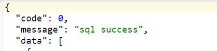
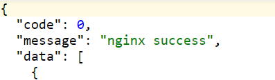
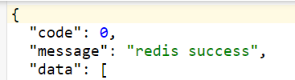

- 下载OpenResty镜像

  ```shell
  docker pull openresty/openresty
  ```

- 运行镜像

  ```shell
  docker run -d -p 880:80 --name openresty --restart always -v /etc/localtime:/etc/localtime openresty/openresty
  ```

- 进入容器

  ```shell
  docker exec -it openresty /bin/bash
  ```

- 安装lua

  ```she
  apt-get update -y
  apt-get install -y gcc
  apt-get install -y curl
  apt-get install -y make
  apt-get install -y vim
  apt-get install libreadline-dev -y
  curl -R -O http://www.lua.org/ftp/lua-5.3.5.tar.gz
  tar -zxf lua-5.3.5.tar.gz
  cd lua-5.3.5
  make linux test
  make install
  ```

- 编写lua脚本并上传到服务器

  ```lua
  ngx.header.content_type = "application/json;charset=utf8"

  --获取本地缓存
  local cache_ngx = ngx.shared.dis_cache;
  -- 获取本地缓存数据
  local ngCache = cache_ngx:get('lua:application-data')
  if ngCache == "" or ngCache == nil then
      --引入redis库
      local cjson = require("cjson")
      local redis = require("resty.redis")
      local red = redis:new()
      red:set_timeout(2000)

      local ip = "127.0.0.1"
      local port = 6379
      red:connect(ip, port)
      red:auth("123456")

      local redCache = red:get("lua:application-data")
      if redCache == ngx.null or redCache == "" or redCache == nil then
          --引入mysql库
          local mysql = require("resty.mysql")
          local db = mysql:new()
          db:set_timeout(3000)
          local props = {
              host = "127.0.0.1",
              port = 3306,
              database = "test",
              user = "root",
              password = "root"
          }

          local res = db:connect(props)
          local select_sql = "SELECT xxx from tb_level where xxx"
          res = db:query(select_sql)
          db:close()
          red:set("lua:application-data", cjson.encode(res))
          red:close()
          --将redis中获取到的数据存入nginx本地缓存10分钟 测试阶段先1分钟
          cache_ngx:set('lua-game-milk-tea:level-data', cjson.encode(res), 1 * 60)
          ngx.say("{\"code\":0,\"message\":\"sql success\",\"data\":" .. cjson.encode(res) .. "}")
      else
          --将redis中获取到的数据存入nginx本地缓存10分钟 测试阶段先1分钟
          cache_ngx:set('lua:application-data', redCache, 1 * 60)
          ngx.say("{\"code\":0,\"message\":\"redis success\",\"data\":" .. redCache .. "}")
      end
  else
      ngx.say("{\"code\":0,\"message\":\"nginx success\",\"data\":" .. ngCache .. "}")
  end
  ```

  - 特别说明

    ```text
    lua读取redis数据返回结果为空时，返回的结果不是nil而是userdata类型的ngx.null
    ```

- 在http节点下开启nginx共享内存

  ```shell
  vim /usr/local/openresty/nginx/conf/nginx.conf
  ```

  ```nginx
  lua_shared_dict dis_cache 10m;
  ```

- 在server节点添加lua配置

  ```
  location /lua {
      content_by_lua_file /opt/lua/cache.lua;
      add_header Access-Control-Allow-Origin *;
      add_header Access-Control-Allow-Methods 'GET, POST, OPTIONS';
      add_header Access-Control-Allow-Headers '*';
  }
  ```

  

  

  

