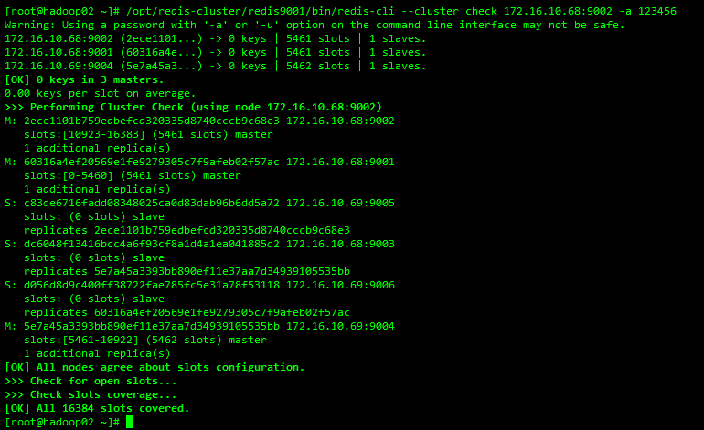
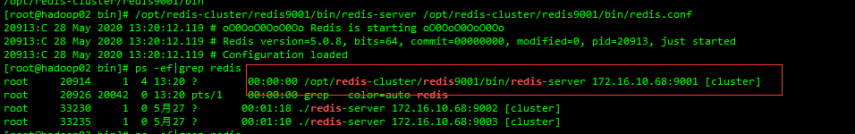

### [Redis单机搭建](http://www.tianch.xyz/archives/linux%E4%B8%8B%E6%90%AD%E5%BB%BAredis%E9%9B%86%E7%BE%A4%E5%B8%A6%E5%AF%86%E7%A0%81)

### [Redis集群搭建](http://www.tianch.xyz/archives/linux%E4%B8%8B%E6%90%AD%E5%BB%BAredis%E9%9B%86%E7%BE%A4%E5%B8%A6%E5%AF%86%E7%A0%81)

在使用redis4前，可以使用redis-migrate-tool工具做redis在线数据迁移（参考https://wxy0327.blog.csdn.net/article/details/84138537）。但是我们现在使用的redis server已经升级到5.0.8版本，再用redis-migrate-tool做迁移会报错：

```shell
[2019-04-19 13:26:35.847] rmt_redis.c:6446 ERROR: Can't handle RDB format version 455180296
[2019-04-19 13:26:36.484] rmt_redis.c:6715 ERROR: Rdb file for node[140.210.73.38:20003] parsed failed
```

- 查看集群状态

  ```shell
  /opt/redis-cluster/redis9001/bin/redis-cli --cluster check 172.16.10.68:9001 -a 123456
  ```

  

- 将所有master上的slot重新分配到一个master(9001)上

  ```shell
  /opt/redis-cluster/redis9001/bin/redis-cli -a 123456 --cluster reshard --cluster-from 2ece1101b759edbefcd320335d8740cccb9c68e3 --cluster-to 60316a4ef20569e1fe9279305c7f9afeb02f57ac --cluster-slots 5461 --cluster-yes 172.16.10.68:9001

  /opt/redis-cluster/redis9001/bin/redis-cli -a 123456 --cluster reshard --cluster-from 5e7a45a3393bb890ef11e37aa7d34939105535bb --cluster-to 60316a4ef20569e1fe9279305c7f9afeb02f57ac --cluster-slots 5462 --cluster-yes 172.16.10.68:9001
  ```

- 停止上一步唯一持有slots的master

  ```shell
  /opt/redis-cluster/redis9001/bin/redis-cli -h 172.16.10.68 -p 9001 -a 123456
  172.16.10.68:9001> shutdown
  not connected>
  ```

- 将单实例持久化的rdb文件或aof文件拷贝到唯一持有slots的master的数据目录下

  同时有rdb和aof会优先加载aof 持久化文件的拷贝和上传这里不做描述

  使用XFTP等工具或者在本机直接复制（cp命令）

- 启动唯一持有slots的master

  ```shell
  /opt/redis-cluster/redis9001/bin/redis-server /opt/redis-cluster/redis9001/bin/redis.conf
  ```

  

- 检查redis集群状态

  ```shell
  /opt/redis-cluster/redis9001/bin/redis-cli --cluster check 172.16.10.68:9001 -a 123456
  ```

- 在集群master间重新分配slots

  ```shell

  /opt/redis-cluster/redis9001/bin/redis-cli -a 123456 --cluster reshard --cluster-from 60316a4ef20569e1fe9279305c7f9afeb02f57ac --cluster-to 5e7a45a3393bb890ef11e37aa7d34939105535bb --cluster-slots 5462 --cluster-yes 172.16.10.68:9001

  /opt/redis-cluster/redis9001/bin/redis-cli -a 123456 --cluster reshard --cluster-from 60316a4ef20569e1fe9279305c7f9afeb02f57ac --cluster-to 2ece1101b759edbefcd320335d8740cccb9c68e3 --cluster-slots 5461 --cluster-yes 172.16.10.68:9001
  ```

  [参考](https://blog.csdn.net/wzy0623/article/details/89405708?utm_medium=distribute.pc_relevant.none-task-blog-BlogCommendFromMachineLearnPai2-1.nonecase&depth_1-utm_source=distribute.pc_relevant.none-task-blog-BlogCommendFromMachineLearnPai2-1.nonecase)

