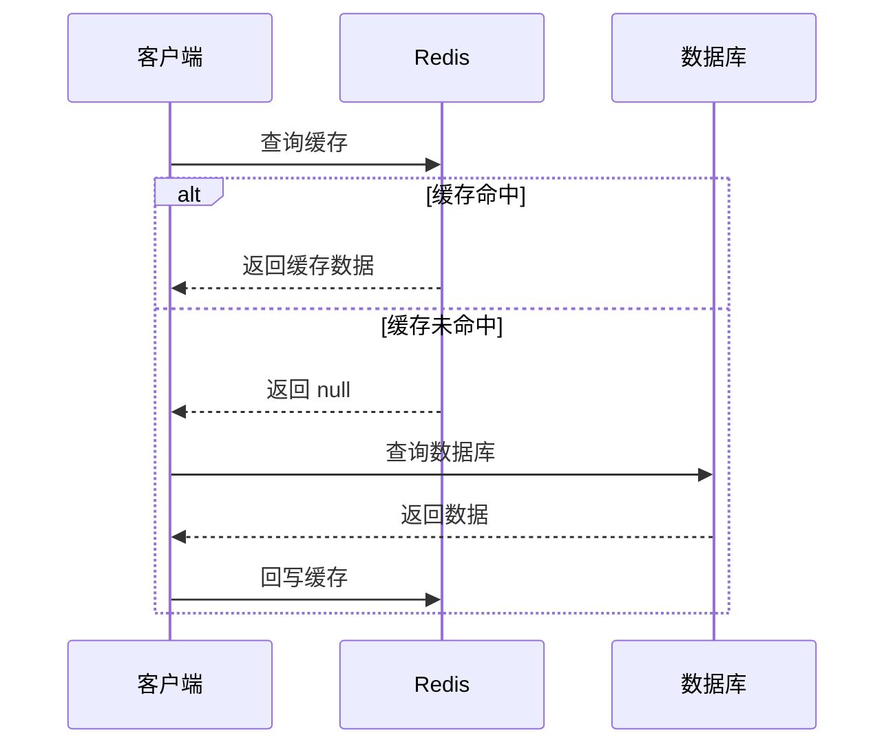
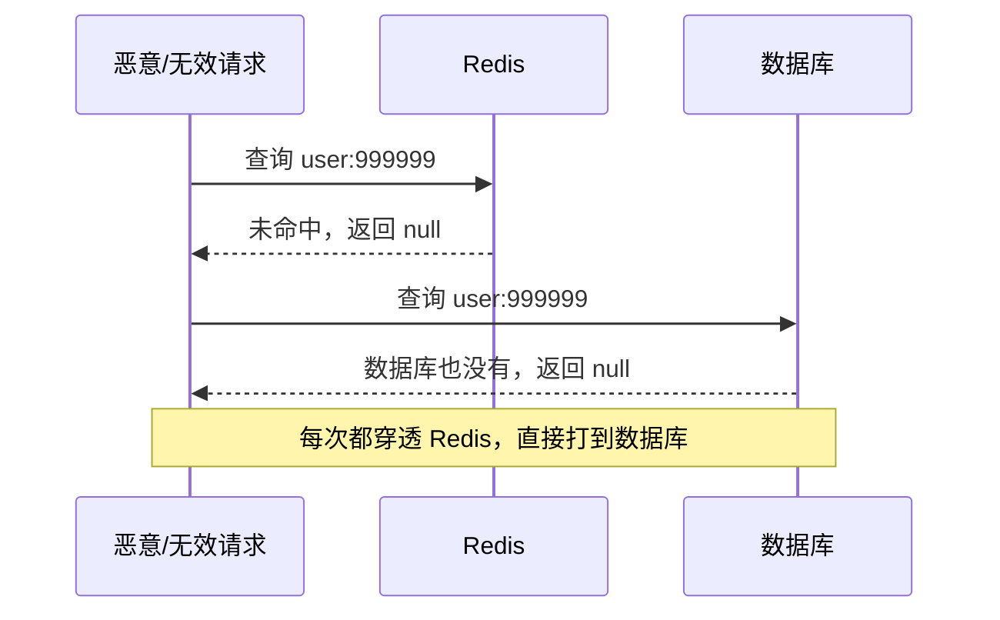
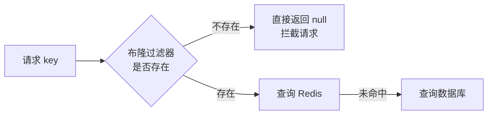
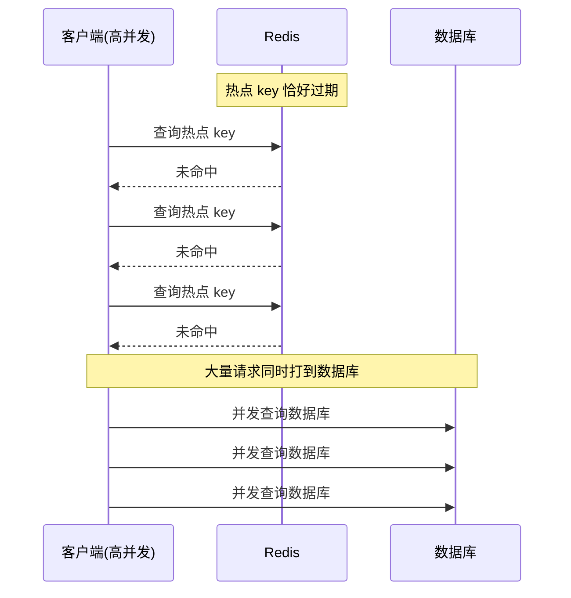
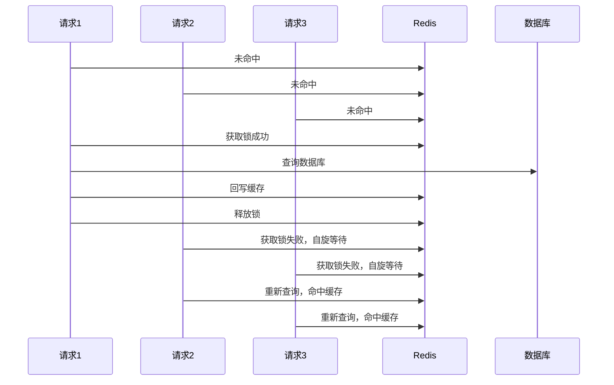
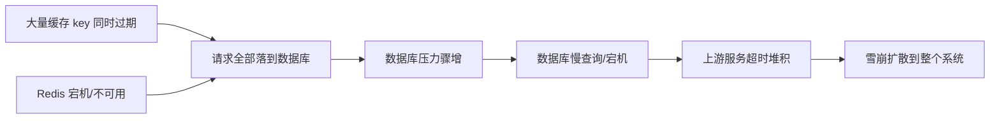

在高并发场景下，为了避免每次请求都打到数据库，我们通常会在数据库前面加一层 Redis 缓存。但缓存引入后，随之而来的还有三个经典问题：**缓存穿透**、**缓存击穿**、**缓存雪崩**。这三者名字相近、表现相似，经常被混淆，也是面试中最高频的考点之一。

本文将从「定义 → 产生原因 → 危害 → 解决方案」四个维度逐个拆解，最后用一张表格对比三者的区别。

## 一、正常的缓存流程

先看一段最基础的缓存查询逻辑：

```java
public Object queryById(Long id) {
    // 1. 先查缓存
    Object cache = redisTemplate.get("user:" + id);
    if (cache != null) {
        return cache;
    }
    // 2. 缓存未命中，查数据库
    Object user = userMapper.selectById(id);
    if (user != null) {
        // 3. 回写缓存，设置过期时间
        redisTemplate.set("user:" + id, user, 30, TimeUnit.MINUTES);
    }
    return user;
}
```

对应的时序图如下：



在理想情况下，大部分请求都会被 Redis 拦截，数据库压力很小。但一旦出现下面三种异常情况，Redis 就会"失效"，压力全部涌向数据库，甚至导致数据库宕机。

## 二、缓存穿透

### 1. 什么是缓存穿透

**缓存穿透**是指：查询的数据在缓存和数据库中**都不存在**，导致每次请求都绕过缓存，直接打到数据库。

比如查询一个不存在的用户 id（`user:999999`）：



由于缓存中**没有**这个 key，回写缓存这一步也不会执行，于是**每一次**请求都会击穿缓存层，请求量一大，数据库必然被打爆。

### 2. 产生原因与危害

- 恶意攻击：批量请求不存在的 id（如自增 id 被遍历到不存在的区间）；
- 业务 bug：前端传入了脏数据、非法参数；
- 用户误操作：拼写错误的商品编号等。

**危害**：Redis 完全失去保护作用，数据库承受全部请求压力，严重时直接宕机，拖垮整个服务。

### 3. 解决方案

#### 方案一：缓存空对象

当数据库查不到数据时，也向缓存中写入一个**空值**，并设置一个**较短的过期时间**（如 3~5 分钟），这样后续相同的请求就能命中缓存，不再打穿到数据库。

```java
public Object queryById(Long id) {
    // 1. 先查缓存
    Object cache = redisTemplate.get("user:" + id);
    if (cache != null) {
        return "".equals(cache) ? null : cache; // 空值缓存直接返回 null
    }
    // 2. 查数据库
    Object user = userMapper.selectById(id);
    if (user != null) {
        redisTemplate.set("user:" + id, user, 30, TimeUnit.MINUTES);
    } else {
        // 3. 数据库也没有 → 缓存空值，短过期时间
        redisTemplate.set("user:" + id, "", 3, TimeUnit.MINUTES);
    }
    return user;
}
```

> 注意：缓存空值存在两个小问题——① 会有大量空 key 占用 Redis 内存，需要设置较短的 TTL；② 可能造成短时间内的**数据不一致**（数据库刚插入数据，但空缓存还没过期）。所以空值 TTL 要尽量短，并配合业务补偿。

#### 方案二：布隆过滤器

在缓存和数据库之间再加一层**布隆过滤器**，把所有**存在的 id 先存入布隆过滤器**。请求进来先判断 id 是否在布隆过滤器中：

- 不存在 → 直接返回，请求根本不会进入 Redis 和数据库；
- 存在 → 才继续走缓存查询流程。



布隆过滤器的核心特点是：**判断"不存在"是 100% 准确，判断"存在"有小概率误判**。这正好契合我们的场景——宁可让少数真实存在的 key 多走一次数据库，也要把大量不存在的 key 拦在门外。

```java
// 初始化布隆过滤器（Guava 示例）
BloomFilter<Long> bloomFilter = BloomFilter.create(
        Funnels.longFunnel(),      // 类型
        100_0000,                  // 预计元素数量
        0.01);                     // 误判率

// 初始化时把所有商品/用户 id 预加载进去
List<Long> ids = userMapper.selectAllIds();
ids.forEach(bloomFilter::put);

// 查询时先过滤
public Object queryById(Long id) {
    if (!bloomFilter.mightContain(id)) {
        return null; // 一定不存在，直接拦截
    }
    // ... 正常走缓存流程
}
```

> 生产环境布隆过滤器通常用 Redis 原生实现（`RedisBloom` 模块，命令如 `BF.ADD` / `BF.EXISTS`），或者引入独立组件（如 `redisson` 的 `RBloomFilter`），避免在应用内存中维护。

#### 方案三：接口层参数校验 + 限流

在入口处做**参数合法性校验**（id 必须大于 0、格式正确），并对高频非法请求做**接口限流 / 封禁 IP**，从源头减少恶意流量。

**小结**：缓存穿透的核心矛盾是「数据根本不存在」，所以要么**把"不存在"也缓存起来**（空值缓存），要么**在缓存之前就把不存在的请求拦截掉**（布隆过滤器、参数校验）。

## 三、缓存击穿

### 1. 什么是缓存击穿

**缓存击穿**是指：某个**热点 key** 在过期的瞬间，大量请求同时涌入，发现缓存失效后**并发**去查询数据库。

注意区别：穿透是「数据不存在」，击穿是「数据存在，只是 key 恰好过期了」。由于是热点 key，并发极高，瞬间的请求洪峰会把数据库打垮。



### 2. 产生原因与危害

- 热点数据（秒杀商品、微博热搜、爆款文章）TTL 到期；
- 缓存没有做"续期/预加载"机制，key 一到期就重新走数据库。

**危害**：单点热点 key 失效引发请求洪峰，数据库连接瞬间被占满，导致慢查询、宕机。

### 3. 解决方案

#### 方案一：互斥锁（分布式锁）

当缓存未命中时，**只允许一个线程**去数据库查询并回写缓存，其余线程等待锁释放后**重新读缓存**。



```java
public Object queryByIdWithLock(Long id) {
    String key = "user:" + id;
    Object cache = redisTemplate.get(key);
    if (cache != null) {
        return cache;
    }
    String lockKey = "lock:user:" + id;
    boolean locked = redisTemplate.opsForValue()
            .setIfAbsent(lockKey, "1", 10, TimeUnit.SECONDS); // 加锁 + 超时兜底
    if (locked) {
        try {
            // 拿到锁，再查一次缓存（防止等待期间其他线程已回写）
            cache = redisTemplate.get(key);
            if (cache != null) {
                return cache;
            }
            Object user = userMapper.selectById(id);
            redisTemplate.set(key, user, 30, TimeUnit.MINUTES);
            return user;
        } finally {
            // 释放锁（建议配合 Lua 脚本校验 value，防止误删）
            redisTemplate.delete(lockKey);
        }
    } else {
        // 没拿到锁，自旋重试
        try {
            Thread.sleep(50);
        } catch (InterruptedException e) {
            Thread.currentThread().interrupt();
        }
        return queryByIdWithLock(id); // 递归重试
    }
}
```

> 使用 `Redisson` 更优雅：`RLock lock = redissonClient.getLock(key)`，它内部封装了自动续期（watch dog）、可重入等能力，避免锁超时与业务执行时间不匹配的问题。

#### 方案二：逻辑过期

不给 key 设置**物理过期时间**，而是在 value 中额外存一个**逻辑过期时间字段**。查询时：

- 逻辑上未过期 → 直接返回缓存；
- 逻辑上已过期 → 返回**旧数据**的同时，异步线程去数据库更新缓存。

```java
// 缓存结构：Data = { value, expireTime }
@Data
class CacheData<T> {
    private T data;
    private Long expireTime;
}

public T queryByIdWithLogicalExpire(Long id) {
    String key = "hot:user:" + id;
    CacheData<T> cacheData = (CacheData<T>) redisTemplate.get(key);
    if (cacheData == null) {
        // 冷数据兜底，走互斥锁查库（略）
        return queryFromDb(id);
    }
    // 1. 逻辑过期时间未到，直接返回
    if (cacheData.getExpireTime() > System.currentTimeMillis()) {
        return cacheData.getData();
    }
    // 2. 逻辑过期，先返回旧数据，再异步刷新
    executor.submit(() -> refreshCache(id, key));
    return cacheData.getData();
}
```

**优点**：请求永远有数据可返回，**不会阻塞等待**，对用户完全无感；
**缺点**：会有短暂的数据不一致（旧数据多存活一小段时间），且需要维护额外的逻辑过期字段。

#### 方案三：热点 key 永不过期 + 定时重建

对确定的热点 key 设置**永不过期**，由后台任务（定时任务 / 消息队列）定期重建缓存、刷新数据，将"过期"从被动失效变成主动更新。

**小结**：缓存击穿的核心矛盾是「热点 key 并发失效」，解决思路就两条——**让并发请求串行化**（互斥锁），或**让 key 不真正失效**（逻辑过期、永不过期）。

## 四、缓存雪崩

### 1. 什么是缓存雪崩

**缓存雪崩**是指：**大量 key 在同一时间集中过期**，或者 **Redis 服务整体宕机**，导致海量请求瞬间全部打到数据库，数据库被压垮，进而引发连锁反应（服务雪崩）。



### 2. 产生原因与危害

- **集中过期**：业务上设置了相同的过期时间（如统一 TTL = 30 分钟），某一刻集体失效；
- **Redis 宕机**：主从切换、网络分区、内存溢出导致 Redis 不可用；
- **热点数据同一时间失效**：比如双十一 0 点大批商品缓存同时到期。

**危害**：比击穿更严重。击穿是"一根针"，雪崩是"一片海"，直接导致数据库宕机、系统级故障，且故障会向上游链路扩散。

### 3. 解决方案

#### 方案一：过期时间加随机值

避免 key 集体失效，给每个 key 的 TTL 加上一个**随机偏移量**，把失效时间打散：

```java
// 基础 TTL 30 分钟 + 随机 0~300 秒
long ttl = 30 * 60 + ThreadLocalRandom.current().nextLong(0, 300);
redisTemplate.set(key, value, ttl, TimeUnit.SECONDS);
```

也可以在业务代码里把同一批数据的过期时间错开（比如按 id 取模 + 偏移）。

#### 方案二：Redis 高可用（主从 + 哨兵 / 集群）

即使个别节点宕机，也能通过主从切换、集群分片继续提供服务：

- 主从复制 + 哨兵（Sentinel）：自动故障转移；
- Redis Cluster：分片存储，单点故障只影响部分数据；
- 多机房 / 多副本：进一步提升可用性。

#### 方案三：多级缓存（本地缓存 + Redis）

在 Redis 前面再加一层 **JVM 本地缓存**（Caffeine / Guava）。即使 Redis 整体宕机，本地缓存依然能扛住大部分请求，给 Redis 恢复争取时间。


#### 方案四：限流 + 降级 + 熔断

- **限流**：对数据库访问做限流（如 Sentinel / Hystrix / 网关限流），超出阈值直接拒绝或排队；
- **降级**：Redis 不可用时，返回兜底数据（默认值 / 缓存副本 / 静态数据），保证核心链路可用；
- **熔断**：数据库连续异常时快速熔断，避免继续打爆数据库。

#### 方案五：提前预加载 / 双缓存

- 通过定时任务在缓存**即将过期前主动预热**（后台重建，而不是等过期）；
- 或者维护主、备两份缓存，主缓存过期时用备缓存兜底。

**小结**：缓存雪崩的核心矛盾是「大量 key 同时失效或缓存整体不可用」，解决思路——**分散过期时间**（随机化）、**提高可用性**（集群）、**多级兜底**（本地缓存、降级）、**削峰**（限流熔断）。

## 五、三兄弟对比总结

| 对比项 | 缓存穿透 | 缓存击穿 | 缓存雪崩 |
| --- | --- | --- | --- |
| 缓存中是否有数据 | 无（key 本身不存在） | 有，但恰好过期 | 有，但大量同时过期 / Redis 宕机 |
| 数据库是否有数据 | 无 | 有 | 有 |
| 影响范围 | 单个/一批不存在的 key | 单个热点 key | 大量 key / 整个缓存层 |
| 核心原因 | 查询不存在的数据 | 热点 key 并发失效 | 集体失效 / Redis 不可用 |
| 危害程度 | 大（持续打库） | 大（瞬时洪峰） | 巨大（系统级雪崩） |
| 核心方案 | 缓存空值、布隆过滤器、参数校验、限流 | 互斥锁、逻辑过期、永不过期 | TTL 随机化、高可用集群、多级缓存、限流降级 |

## 六、最佳实践建议

实际生产中，通常**组合使用**而不是只选一种：

1. **入口层**：参数校验 + 布隆过滤器，把大部分非法请求挡在最外层；
2. **缓存层**：热点 key 用互斥锁 / 逻辑过期防止击穿，TTL 加随机值防止雪崩；
3. **存储层**：数据库访问加限流降级，作为最后一道防线；
4. **运维层**：Redis 用主从 + 哨兵或集群保证高可用，配合监控报警（命中率骤降、慢查询增多时及时告警）。

## 七、一句话记忆

- **穿透**：查**不存在**的数据 → 缓存空值 / 布隆过滤器拦在门口；
- **击穿**：**单个热点** key 过期瞬间被打 → 互斥锁 / 逻辑过期；
- **雪崩**：**大量** key 同时过期或 Redis 挂了 → TTL 随机化 / 高可用 / 多级缓存 / 限流降级。

**记住一句话：穿透是"不在"，击穿是"单点失效"，雪崩是"成片失效"。** 理解了这三者的本质区别，解决方案自然就记住了。
