### 1.索引的本质

在生产环境中，随着数据量的不断增长，SQL执行速度会越来越慢，常见的手段就是通过所用来提升查询速度，那么究竟为什么要添加索引？应该如何正确添加索引？

MySQL官方对索引的定义为：索引（Index）是帮助MySQL高效获取数据的数据结构（有序）。所以，就可以得到索引的本质：索引是有序的数据结构。

- 环境

  [安装MySQL5.7](http://www.tianch.xyz/archives/linux%E4%B8%8B%E5%9F%BA%E4%BA%8Edocker%E5%AE%89%E8%A3%85mysql57)

- 索引文件

  在MySQL中，索引实际上存储在文件中的，器位置与数据库数据文件在相同的目录中。

  ```mysql
  -- 创建测试表
  CREATE TABLE `tb_user` (
  `id` int(11) NOT NULL AUTO_INCREMENT,
  `username` varchar(20) DEFAULT NULL,
  `password` varchar(20) DEFAULT NULL,
  `created` datetime DEFAULT NULL,
  PRIMARY KEY (`id`),
  KEY `username` (`username`) USING BTREE
  ) ENGINE=InnoDB AUTO_INCREMENT=2 DEFAULT CHARSET=utf8;
  CREATE TABLE `tb_user2` (
  `id` int(11) NOT NULL AUTO_INCREMENT,
  `username` varchar(20) DEFAULT NULL,
  `password` varchar(20) DEFAULT NULL,
  `created` datetime DEFAULT NULL,
  PRIMARY KEY (`id`)
  ) ENGINE=MyISAM DEFAULT CHARSET=utf8;
  ```

  查看数据库文件，路径：/etc/mysql/data

  ```shell
  -rw-r----- 1 polkitd input     61 12月 25 16:27 db.opt
  -rw-r----- 1 polkitd input   8668 12月 25 16:27 tb_user2.frm #表结构⽂件
  -rw-r----- 1 polkitd input      0 12月 25 16:27 tb_user2.MYD #MyISAM引擎类型的表数据文件
  -rw-r----- 1 polkitd input   1024 12月 25 16:27 tb_user2.MYI # MyISAM引擎类型的索引文件
  -rw-r----- 1 polkitd input   8668 12月 25 16:27 tb_user.frm #表结构⽂件
  -rw-r----- 1 polkitd input 114688 12月 25 16:27 tb_user.ibd #InnoDB的表空间文件 用于存储数据以及索引
  ```

### 2.B+树深入剖析

- MySQL索引为什么使用B+树

  首先需要明确的是，B树或B+树要比二叉树更适合作为索引存储，因为B树中的节点可以存储多个数据，从而就可以减少树的高度，也就提升了查找性能。

  那么在MySQL中为什么选择B+树而不选择使用B树呢？

  主要原因体现在在3个方面：
  - B+树的磁盘读取代价更低
    - B+树的内部节点并没有指向关键字具体信息的指针，因此其内部节点相对B树更小，如果把所有同一内部节点的关键字存放在同一块磁盘中，那么盘块所能容纳的关键字数量也就越多，一次性读入内存的需要查找的关键字也就越多，相对IO读写次数就降低了。
  - B+树的查询效率更加稳定
    - 由于非终结点并不是最终指向文件内容的节点，而只是叶子结点中关键字的索引。所以任何关键字的查找必须走一条从根节点到叶子节点的路。
    - 所有关键字查询的路径长度相同，导致每一个数据的查询效率相当。
  - 由于B+树的数据都存储在叶子节点中，分支节点均为索引，方便扫库，只需要扫一遍叶子节点即可，但是B树因为其分支节点同样存储着数据，需要从根节点按序开始扫描，所以B+树更加适合在区间查询的情况，所以通常将B+树用于数据库索引。

- MySQL索引实现

  在MySQL中，索引属于存储引擎级别的概念，不同的存储引擎对索引的实现方式是不同的。
  - MyISAM索引实现

    MyISAM引擎使用B+树作为索引结构，叶子节点的data域存放的是数据记录的地址。

    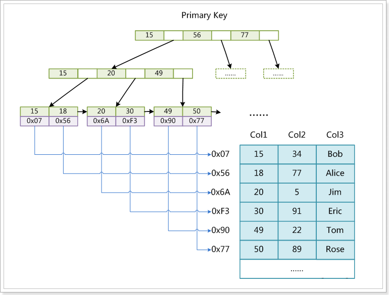

    这里设表一共有三列，假设我们以Col1为主键，上图是一个MyISAM表的主键索引（Primary Key）示意。可以看出MyISAM的索引文件仅仅保存数据记录的地址，在MyISAM中，主键索引和辅助索引在结构上没有任何区别，只是主键索引要求key是唯一的，而辅助索引的key可以重复。

    如果我们在Col2上建立一个辅助索引，则此索引的结果如下图所示：

    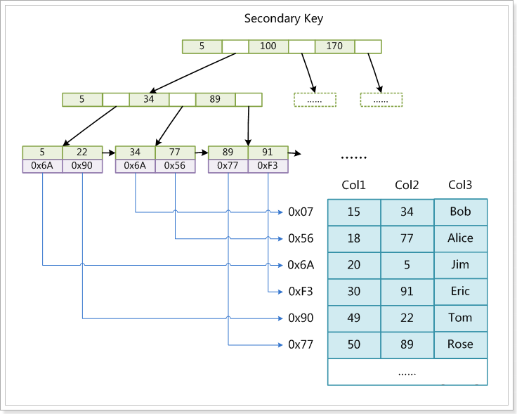

    同样也是一颗B+树，data域保存数据记录的地址。因此，MyISAM中索引检索的算法为：首先按照B+树搜索算法搜索索引，如果指定的key存在，则取出其data域的值，然后以data域的值为地址，读取相应的数据记录。

    MyISAM的索引方式也叫作“非聚集”的，之所以这么称呼是为了与InnoDB的聚集索引区分。

  - InnoDB索引的实现

    InnoDB中的索引结构与MyISAM的索引结构有很大的不同。

    第一个重大区别是InnoDB的数据文本本身就是索引文件。在MyISAM中，索引文件和数据文件是分离的，索引文件仅保存数据记录的地址。而在InnoDB中，表数据文件本身就是按B+Tree组织的一个索引结构，这棵树的叶子结点data域保存了完整的数据记录，这个索引key是数据表的主键，所以InnoDB表数据文件本身就会说主索引。

    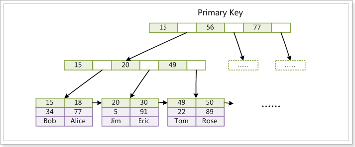

    从图中可以看出，叶子节点包含了完整的数据记录。这种索引叫做聚集索引。

    `因为InnoDB的数据文件本身要按主键聚集，所以InnoDB要求表必须有主键（MyISAM可以没有），如果没有显式指定，则MySQL系统会自动选择一个可以唯一标识数据记录的列作为主键，如果不存在这种列，则MySQL自动为InnoDB表生成一个隐含字段作为主键，这个字段长度为6个字节，类型为长整型。`

    第二个与MyISAM索引不同的是，InnoDB的辅助索引data域存储相应记录主键的值而不是地址。换句话说：InnoDB的所有辅助索引都引用主键作为data域。如下图是一个定义在Col3上的辅助索引：

    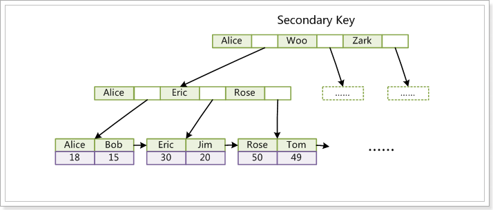

    这里以英文字符的ASCII码作为比较准则。聚集索引这张种实现方式使得按主键的搜索十分高效，但是辅助索引搜索需要检索两遍索引：首先检索辅助索引获得主键，然后用主键到主索引中检索获得记录。

    `InnoDB的B+树索引的特点是高扇出性，因此一般树的高度为2~4层，这样我们在查找一条记录时只用I/O2~4次。当前机械硬盘每秒至少100次IO/s，因此查询时只需0.02~0.04s。`

### 3.索引的使用

- 主键索引

  在InnoDB存储引擎中，每张表都会有主键，数据按照主键顺序组织存放，如果表定义时没有显式定义主键，则会按照以下方式选择或者创建主键：
  - 先判断表中是否有`非空的唯一索引`，如果有
    - 如果仅有一条`非空唯一索引`，则该索引为主键
    - 如果有多条`非空唯一索引`，根据索引索引的先后顺序，选择第一个定义的非空唯一索引作为主键。
  - 如果表中无`非空唯一索引`，则自动创建一个6字节大小的指针作为主键，但是该主键是不能被查询的。

  测试：

  ```sql
  --创建表
  CREATE TABLE `tb_test1` (
  `id` int(11) NOT NULL, -- ⾮空
  `name` varchar(20) DEFAULT NULL,
  `age` int(11) DEFAULT NULL,
  UNIQUE KEY `id` (`id`) USING BTREE -- 唯⼀索引
  ) ENGINE=InnoDB DEFAULT CHARSET=utf8;
  --插⼊数据
  INSERT INTO `tb_test1` (`id`, `name`, `age`) VALUES ('1', 'zhangsan', '20');
  INSERT INTO `tb_test1` (`id`, `name`, `age`) VALUES ('2', 'lisi', '21');
  --查询，_rowid就是视为主键，如果表⾥设置了主键之后，_rowid就是对应主键。
  SELECT *, _rowid FROM tb_test1;
  --查询结果，可以看到_rowid的值与id值相同
  +----+----------+------+--------+
  | id | name     | age  | _rowid |
  +----+----------+------+--------+
  |  1 | zhangsan |   20 |      1 |
  |  2 | lisi     |   21 |      2 |
  +----+----------+------+--------+
  --⽆索引的表测试
  CREATE TABLE `tb_test2` (
  `id` int(11) DEFAULT NULL,
  `name` varchar(20) DEFAULT NULL,
  `age` int(11) DEFAULT NULL
  ) ENGINE=InnoDB DEFAULT CHARSET=utf8;
  --查询
  SELECT *, _rowid FROM tb_test2;
  -- ERROR 1054 (42S22): Unknown column '_rowid' in 'field list'
  ```

  在InnoDB中，建议使用自增Id作为表的主键，这样有利于数据组在底层的顺序存储，如果对于分表存储的数据，可以设置不同的步长或者使用第三方的代理框架解决。

- 联合索引

  联合索引就是将表中的多个列一起进行索引，需要注意的是，联合索引是有顺序的，比如A、B、C列的索引与A、C、B列的索引是不一样的。
  - 表数据

    ```sql
    CREATE TABLE `tb_contact` (
    `id` bigint(20) NOT NULL AUTO_INCREMENT,
    `index_code` varchar(1) DEFAULT NULL COMMENT '索引编号',
    `surname` varchar(5) DEFAULT NULL COMMENT '姓',
    `name` varchar(10) DEFAULT NULL COMMENT '名',
    `mobile_code` varchar(11) DEFAULT NULL COMMENT '手机号',
    `created` datetime DEFAULT NULL,
    `updated` datetime DEFAULT NULL,
    PRIMARY KEY (`id`),
    KEY `index_code` (`index_code`,`surname`,`name`) USING BTREE
    ) ENGINE=InnoDB AUTO_INCREMENT=9 DEFAULT CHARSET=utf8;
    INSERT INTO `tb_contact` (`id`, `index_code`, `surname`, `name`, `mobile_code`,`created`, `updated`) VALUES ('1', 'Z', 'zhang', 'san', '13911111111', '2020-09-01 15:33:21', '2020-09-01 15:33:15');
    INSERT INTO `tb_contact` (`id`, `index_code`, `surname`, `name`, `mobile_code`,`created`, `updated`) VALUES ('2', 'L', 'li', 'si', '13922222222', '2020-09-02 15:33:29', '2020-09-02 15:33:25');
    INSERT INTO `tb_contact` (`id`, `index_code`, `surname`, `name`, `mobile_code`,`created`, `updated`) VALUES ('3', 'W', 'wang', 'wu', '13933333333', '2020-09-03 15:33:37', '2020-09-03 15:33:34');
    INSERT INTO `tb_contact` (`id`, `index_code`, `surname`, `name`, `mobile_code`,`created`, `updated`) VALUES ('4', 'Z', 'zhao', 'liu', '13944444444', '2020-09-04 15:33:43', '2020-09-04 15:33:40');
    INSERT INTO `tb_contact` (`id`, `index_code`, `surname`, `name`, `mobile_code`,`created`, `updated`) VALUES ('5', 'L', 'liu', 'hulan', '13955555555', '2020-09-05 15:33:52', '2020-09-05 15:33:47');
    INSERT INTO `tb_contact` (`id`, `index_code`, `surname`, `name`, `mobile_code`,`created`, `updated`) VALUES ('6', 'L', 'lei', 'jun', '13966666666', '2020-09-06 15:34:02', '2020-09-06 15:33:57');
    INSERT INTO `tb_contact` (`id`, `index_code`, `surname`, `name`, `mobile_code`,`created`, `updated`) VALUES ('7', 'M', 'ma', 'yun', '13977777777', '2020-09-07 15:34:12', '2020-09-07 15:34:08');
    INSERT INTO `tb_contact` (`id`, `index_code`, `surname`, `name`, `mobile_code`,`created`, `updated`) VALUES ('8', 'Q', 'qian', 'laoda', '13988888888', '2020-09-08 15:34:18', '2020-09-08 15:34:15');
    ```

    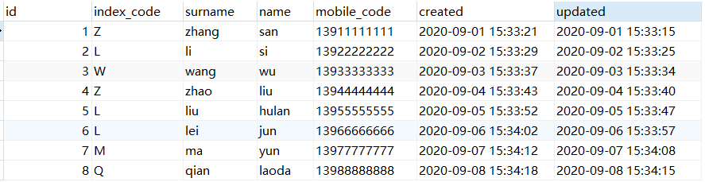

    在联系人表中，id为主键，index_code、suname、name这三个字段建立了联合索引。

  - 底层数据结构

    联合索引的底层也是基于B+树的，其结果示意图如下：

    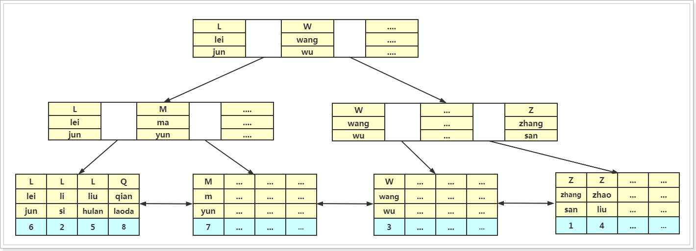

    InnoDB会使用主键索引在B+树维护索引和数据文件，然后我们创建了联合索引（index_code surname name）也会生成一个索引树，同样是B+树的结构，只不过它的data域存储的是联合索引所在行的主键值。

    对于联合索引来说只不过比单值索引多了几列，而这些索引列全部出现在索引树上。对于联合索引，存储引擎会首先根据第一个索引列排序，如上图中第一个索引列：L、L、L、Q、M、W、Z、Z是根据英文字母正序排序的。

    如果第一列相等则根据第二列排序，以此类推就构成了上图的索引树，如：L lei jun、L li si等。

  - 联合索引的查询

    如果查询`mayun`用户的手机号码，需要执行SQL为

    ```sql
    SELECT * FROM tb_contact WHERE index_code = 'M' AND surname = 'ma' AND name = 'yun';
    ```

    联合索引的执行过程如下：

    首先从根节点开始查找，根节点一般是常驻在内存中的，第一列为index_code，其值为`M`，在`L`和`W`之间，会继续向子节点查询：

    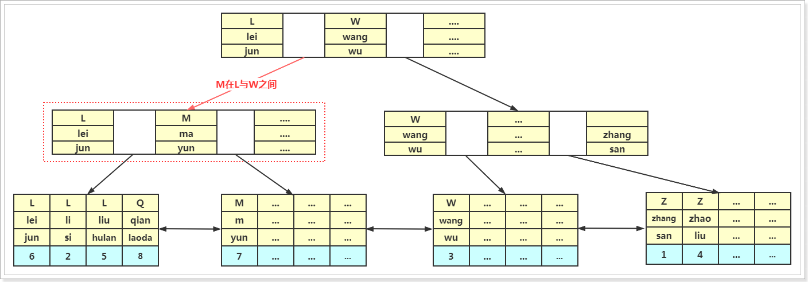

    在查找到子节点后，将子节点数据从磁盘加载到内存，采用二分法进行查找，找到`M` `ma` `yun` 数据符合条件，在继续查找子节点，读取到子节点中的data数据，其数据就是这条记录的主键，然后再通过主键索引查询数据，最终将在主键索引中查询到数据：

    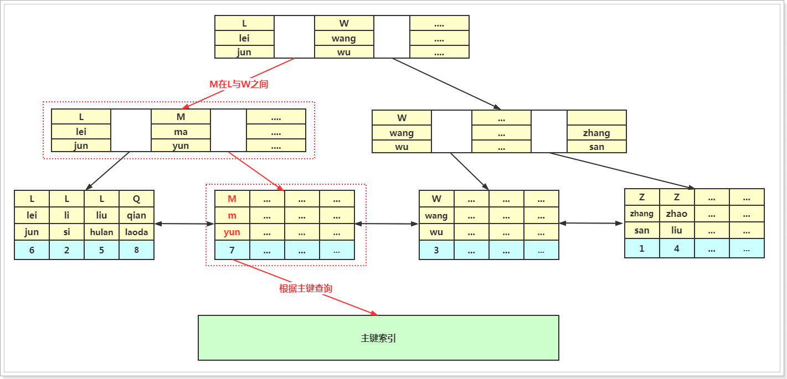

  - 最左前缀原则

    在使用联合索引时，必须按照索引的顺序查询，例如：

    ```sql
    SELECT * FROM tb_contact WHERE index_code = 'M' AND surname = 'ma' AND name ='yun'; -- 索引会生效
    SELECT * FROM tb_contact WHERE index_code = 'M' AND surname = 'ma'; -- 索引会生效
    SELECT * FROM tb_contact WHERE index_code = 'M'; -- 索引会生效
    SELECT * FROM tb_contact WHERE surname = 'ma' AND name = 'yun'; -- 索引不会生效
    ```

    - 通过索引编号+姓+名 就能定位到手机号，因为在索引结构中是排好序的
    - 如果没有使用索引编号，那么整体来看就是混乱无序的，就无法使用排好序的索引，所以索引就不会生效

- EXPLAIN

  使用`EXPLAIN`可以查看SQL语句的执行计划，从而可知道SQL的瓶颈在哪里，就可以有针对性的就行优化了。

  用法：

  ```sql
  EXPLAIN [SELECT语句]
  -- 举例
  EXPLAIN SELECT * FROM tb_contact WHERE index_code = 'M';
  ```

  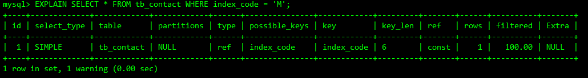

  在查询中的每个表会输出一行信息，如果两个表通过`jion`连接查询，那么会输出两行，表的含义比较广泛：可以是子查询、一个union结果等。

  需要注意的是，在MySQL5.7.3之后的版本，EXPLAIN已经默认添加了EXTENDED参数，在结果中添加了`filtered`结果字段，`filtered`是指返回结果的行占需要读到的行（rows列的值）的百分比。紧跟着执行`show warning;`语句可以查看优化后的查询语句。

  ```sql
  EXPLAIN SELECT * FROM tb_contact WHERE index_code = 'M' AND surname = 'ma';
  SHOW WARNINGS;
  ```

  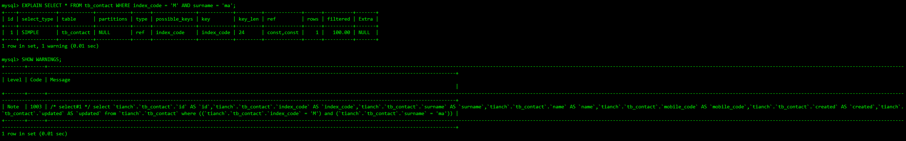

  一般而言，优化的结果建议并不准确，仅作为参考。
  - id列表

    id列的编号是select的序列号，有几个select就有几个id，并且id的顺序是按select出现的顺序增长的，其值越大执行优先级越高，id相同则从上往下执行，id为`NULL`最后执行。

    ```sql
    -- ⼦查询
    EXPLAIN SELECT (SELECT 1 FROM tb_contact LIMIT 1) FROM tb_contact;
    ```

    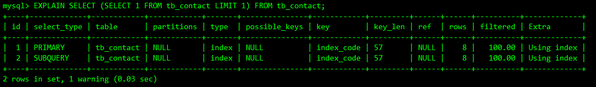

  - select_type

    表示SELECT语句的类型

    有以下几种值：
    1. `SIMPLE`:表示简单查询，其中不包含连接查询和子查询。

       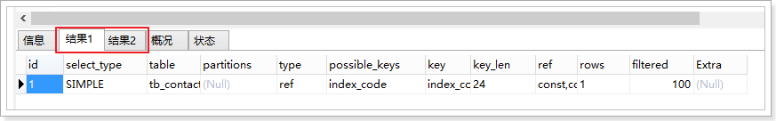

    2. `PRIMARY`:表示主查询，或者是最外面的查询语句。

       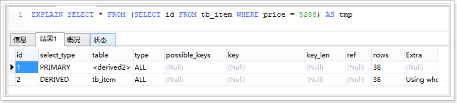

    3. `UNION`:表示连接查询的第2个或者后面的查询语句

       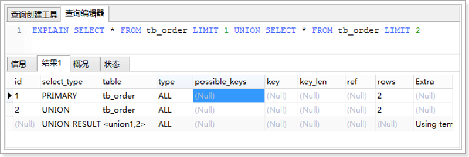

    4. `DEPENDENT UNION`:UNION中的第二个或后面的SELECT语句，取决于外面的查询。

    5. `UNION RESULT`:`连接查询`的结果

    6. `SUBQUERY`:子查询中第一个SELECT语句

       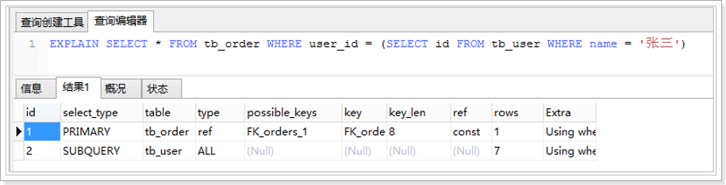

    7. `DEPENDENT SUBQUERY`:子查询中的第一个SELECT语句，取决于外面的查询。

    8. `DERIVED`:SELECT (FROM 子句的子查询)

  - table

    执行计划的表，当from子句中有子查询时，table列是<derivenN>格式，表示当前查询依赖id=N的查询，于是先执行id=N的查询。当有UNION时，UNION RESULT的table列的值为<nuion1,2>，1和2表示参与union的select行id。

  - type

    表示关联类型或访问类型，即MySQL决定如何查找表中的行，查找数据记录的大概范围。依次从最优到最差分别为：system>const>eq_ref>ref>range>index>ALL
    - system

      表仅有一行，这是const类型的特例，平时不会出现，可以忽略不计

    - const

      数据表最多只有一个匹配行，因为只匹配一行数据，所以很快，常用于`PRIMARY KEY`或者`UNIQUE`索引的查询，可理解为const是最优化的。

      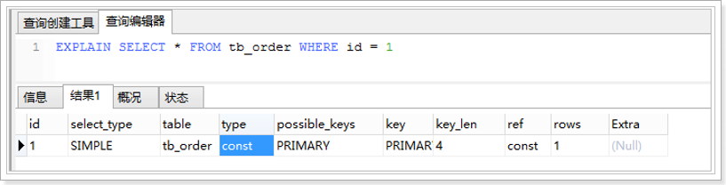

    - eq_ref

      `PRIMARY KEY`或`UNIQUE KEY`索引的所有部分被连接使用，最多只会返回一条符合条件的记录。这可能是在const之外最好的连接类型了，简单的select查询不会出现这种type。

      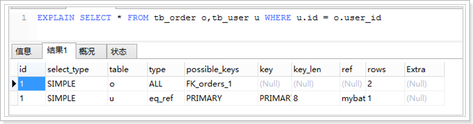

    - ref

      相比eq_ref,不适用唯一索引，而是使用普通索引或者唯一索引的部分前缀，索引要和某个值相比较，可能会找到多个符合条件的行。

      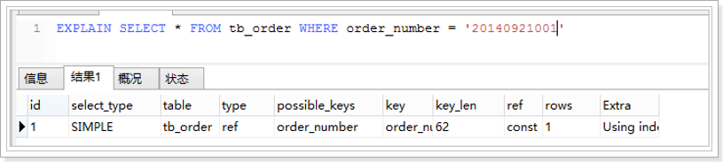

    - range

      范围扫描通常出现在`in()`、`between` `>` `<` `>=`等操作中。使用一个索引来检索给定范围的行。

      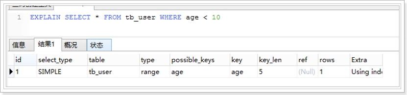

    - index

      和ALL一样，不同的是MySQL只需扫描索引树，通常比ALL快一些

    - ALL

      即全表扫描，意味着MySQL从头到尾去查找所需要的行，通常情况下这种需要增加索引来进行优化。

  - possible_keys

    这一列显示可能使用到了哪些索引来进行查询。

    explain时可能出现possible_keys有值，而key显示为NULL的情况，这种情况是因为表中数据不多，MySQL认为索引对此查询的帮助不大，放弃使用索引。

    如果该列显示为NULL，则没有相关的索引。在这种情况下，可以通过检查where子句看是否可以创建一个适当的索引来提高查询性能，然后用explain查看效果。

  - key

    显示MySQL实际使用的索引，如果没有选择索引，值为NULL。

    可以强制使用索引或者忽略索引：

    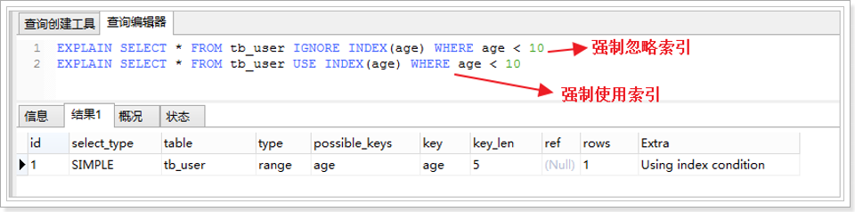

  - key_len

    表示MySQL在索引里使用的字节数，通过这个值可以算出具体使用了索引中的哪些列。

    key_len计算规则如下：
    - 字符串
      - char(n):n字节长度
      - varchar(n):2字节存储字符串长度，如果是utf-8，则长度为3n+2
    - 数值类型
      - tinyint:1字节
      - smallint:2字节
      - int:4字节
      - bigint:8字节
    - 时间类型
      - date:3字节
      - timestamp:4字节
      - datetime:8字节
    - 如果字段允许为NULL，需要1字节记录是否为NULL

    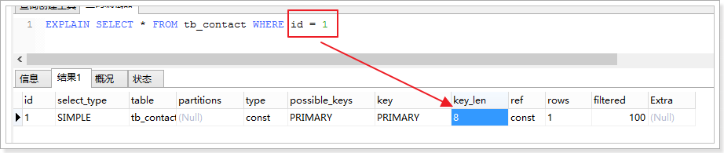

    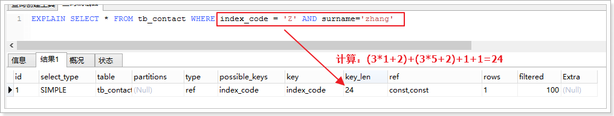

    索引最大长度是768字节，当字符串过长时，MySQL会做一个类似左前缀索引的处理，将前半部分的字符提取出来做索引。

  - ref

    表示在key列记录的索引中，表查找值所用到的列或常量，常见的有：const(常量)、func、NULL、字段名。

  - rows

    这一列是MySQL估计要读取并检测的行数，注意这个不是结果集里的行数。

  - Extra

    这一列显示的是额外信息，常见的重要值如下：
    - Distinct：MySQL发现第一个匹配行后，停止为当前的`行组合`搜索更多的行。

    - Not exist:MySQL能够对查询进行LEFT JOIN优化，发现一个LEFT JION标准的行后，不再为前面的行组合在该表内检索更多的行。

    - range checked for each record(index map:#):MySQL没有发现好的可以使用的索引，但发现如果来自前面的表列值已知，可能部分索引可以使用。

    - Using filesort（重点）:MySQL会对结果使用一个外部索引排序，而不是按索引次序从表里读取行。此时MySQL会根据连接类型浏览所有符合条件的记录，并保存排序关键字和行指针，然后排序关键字并按顺序检索行信息。这种情况下一般也是要考虑使用索引来优化的。 

      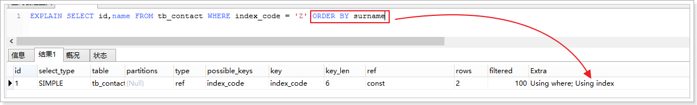

    - Using index(重点)：只使用索引树中的信息而不需要进行进一步搜索读取实际的行来检索表中的列信息。 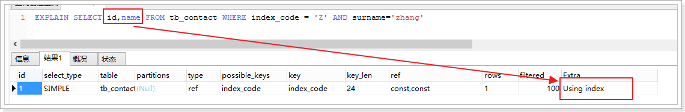

    - Using temporary（重点）:MySQL需要创建一张临时表来处理查询。出现这种情况一般是要进行优化的，首先是要想到索引来优化。 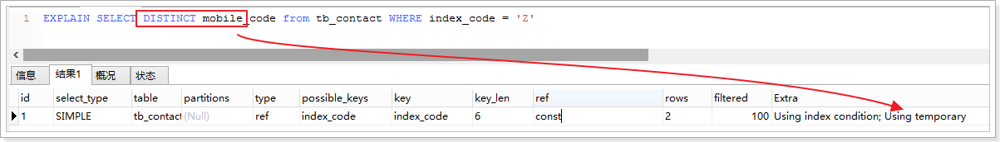

    - Using where:MySQL服务器将在存储引擎检索行后再进行过滤，就是先读取整行数据，再按where条件进行检查，符合就留下，不符合就丢弃。

    - Using index condition：与Using where类似，查询的列不完全被索引覆盖，where条件中是一个前导列的范围。

    - Using sort_union(...),Using union(...),Using intersect(...):这些函数说明如何为index_merge连接类型合并索引扫描。

    - Using index for group-by:类似于访问表的Using index方式，Using index for group-by表示MySQL发现了一个索引，可以用来查询GROUP BY 或DISTINCT查询的所有列，而不要额外搜索硬盘访问实际的表。

    - NULL:查询的列未被索引覆盖，并且where筛选条件是索引的前导列，意味着用到了索引，但是部分字段未被索引覆盖，必须通过`回表`来实现，不是纯粹的用到了索引，也不是完全没用到索引。

- 覆盖索引与回表查询
  - 什么是覆盖索引

    只需要在一颗索引树上就能获取SQL所需的所有列数据，无需回表，速度更快。

  - 什么是回表查询

    先通过非主键索引定位到主键值，在通过主键定位到行记录，这就是回表查询，它的性能较扫描一遍索引树更低。

  举例：

  ```sql
  EXPLAIN SELECT * from tb_contact WHERE index_code = 'L'; -- 回表查询
  EXPLAIN SELECT id,name from tb_contact WHERE index_code = 'L'; -- 覆盖索引
  ```

  需要回表查询：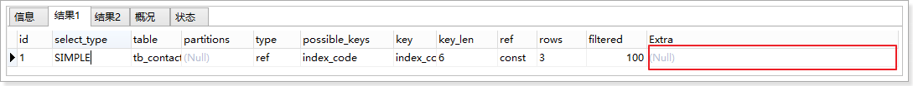

  Using inde：使用覆盖索引的时候就会出现

  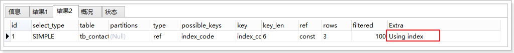

  Using index condition：查找使用了索引，但是需要回表查询数据

  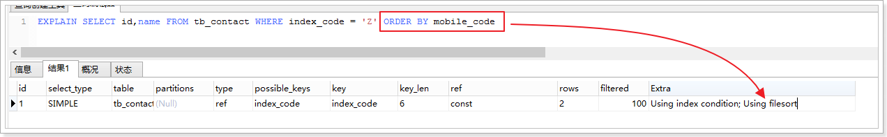

  Using index & Using where:查找使用了索引，需要是数据再索引列中也都能找到，不需要回表查询数据

  

