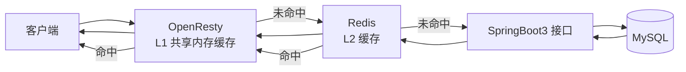
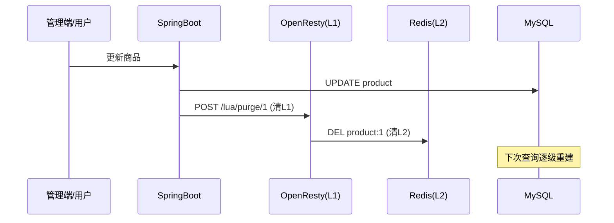

在高并发读场景下，单一缓存层往往扛不住压力：请求打到应用层后，应用还要查一次 Redis，多一次网络往返。如果能**在请求入口（Nginx）就拦截下来**，性能会提升一个数量级。

本文完整搭建一套**三级缓存架构**：

- **L1：OpenResty 共享内存缓存**（进程内，微秒级）；
- **L2：Redis 分布式缓存**（毫秒级，可集群扩展）；
- **L3：MySQL**（通过 SpringBoot3 接口查询，兜底）。

每一级都给出完整可运行的配置、Lua 脚本和 Java 代码。

## 一、三级缓存架构概述

### 1. 为什么需要三级缓存

单靠「应用层查 Redis」有两个问题：

- 每个请求都要经历 `客户端 → Nginx → 应用 → Redis → 应用 → 客户端`，链路长、延迟高；
- 热点数据明明可以更早返回，却要白白走完整个链路。

把缓存下推到 Nginx 层之后，**大部分请求在 L1 就返回了**，根本不进应用和数据库。



### 2. 三级缓存对比

| 层级 | 实现 | 访问耗时 | 容量 | 特点 |
| --- | --- | --- | --- | --- |
| L1 | OpenResty `lua_shared_dict` | 微秒级 | 内存，几十 MB 级 | 最快，进程内，单机 |
| L2 | Redis | 毫秒级 | 内存，可集群 | 快，分布式共享，跨实例 |
| L3 | MySQL | 5~50ms | 磁盘 | 慢，数据最终来源 |

### 3. 请求流程

1. 请求进入 OpenResty，Lua 先查 **L1 共享内存**，命中直接返回；
2. L1 未命中，查 **L2 Redis**，命中回填 L1 后返回；
3. L2 也未命中，通过子请求调 **SpringBoot3 接口查 MySQL**，逐级回填 L2、L1 后返回。

## 二、环境搭建

### 1. 安装 OpenResty（Docker）

```shell
# 拉取镜像并运行，映射 80 端口
docker run -d -p 80:80 --name openresty --restart always \
  -v /opt/lua:/opt/lua \
  -v /usr/local/openresty/nginx/conf/nginx.conf:/usr/local/openresty/nginx/conf/nginx.conf \
  openresty/openresty
```

> 需要把本地 `/opt/lua` 目录（放 Lua 脚本）和 `nginx.conf` 挂载进容器。如果不用挂载，也可以先进入容器再编辑。

### 2. 安装 Redis

```shell
docker run -d -p 6379:6379 --name redis --restart always redis
# 设置密码的方式
docker run -d -p 6379:6379 --name redis --restart always redis --requirepass 你的密码
```

### 3. 安装 MySQL

```shell
docker run -d -p 3306:3306 --name mysql --restart always \
  -e MYSQL_ROOT_PASSWORD=你的密码 \
  -e MYSQL_DATABASE=cache_demo \
  mysql:8.0
```

### 4. 准备测试表

```sql
USE cache_demo;

CREATE TABLE product (
    id    BIGINT PRIMARY KEY AUTO_INCREMENT,
    name  VARCHAR(64)  NOT NULL,
    price DECIMAL(10,2) NOT NULL,
    stock INT          NOT NULL
) COMMENT '商品表';

INSERT INTO product (name, price, stock) VALUES ('iphone 15', 6999.00, 100);
INSERT INTO product (name, price, stock) VALUES ('macbook pro', 14999.00, 50);
INSERT INTO product (name, price, stock) VALUES ('airpods pro', 1899.00, 200);
```

## 三、SpringBoot3 后端接口

后端只做一件事：**查 MySQL + 数据变更时清缓存**。

### 1. pom.xml 依赖

```xml
<?xml version="1.0" encoding="UTF-8"?>
<project>
    <parent>
        <groupId>org.springframework.boot</groupId>
        <artifactId>spring-boot-starter-parent</artifactId>
        <version>3.2.5</version>
    </parent>

    <dependencies>
        <!-- Web -->
        <dependency>
            <groupId>org.springframework.boot</groupId>
            <artifactId>spring-boot-starter-web</artifactId>
        </dependency>
        <!-- MyBatis-Plus (Spring Boot3 专用 starter) -->
        <dependency>
            <groupId>com.baomidou</groupId>
            <artifactId>mybatis-plus-spring-boot3-starter</artifactId>
            <version>3.5.7</version>
        </dependency>
        <!-- MySQL 驱动 -->
        <dependency>
            <groupId>com.mysql</groupId>
            <artifactId>mysql-connector-j</artifactId>
            <scope>runtime</scope>
        </dependency>
    </dependencies>
</project>
```

### 2. application.yml

```yaml
server:
  port: 8080

spring:
  datasource:
    url: jdbc:mysql://127.0.0.1:3306/cache_demo?useUnicode=true&characterEncoding=utf8&serverTimezone=Asia/Shanghai
    username: root
    password: 你的密码
    driver-class-name: com.mysql.cj.jdbc.Driver

mybatis-plus:
  configuration:
    log-impl: org.apache.ibatis.logging.stdout.StdOutImpl   # 打印SQL，方便观察是否走了数据库
```

### 3. 实体类

```java
@Data
@TableName("product")
public class Product {
    @TableId(type = IdType.AUTO)
    private Long id;
    private String name;
    private BigDecimal price;
    private Integer stock;
}
```

### 4. Mapper

```java
@Mapper
public interface ProductMapper extends BaseMapper<Product> {
}
```

### 5. Controller

```java
@RestController
@RequestMapping("/api/product")
public class ProductController {

    private final ProductMapper productMapper;
    private final CachePurgeService cachePurgeService;

    public ProductController(ProductMapper productMapper, CachePurgeService cachePurgeService) {
        this.productMapper = productMapper;
        this.cachePurgeService = cachePurgeService;
    }

    /** 查询商品：L3 兜底接口，由 Lua 在 L1/L2 未命中时调用 */
    @GetMapping("/{id}")
    public Product getById(@PathVariable Long id) {
        return productMapper.selectById(id);
    }

    /** 更新商品：更新 MySQL 后主动清掉各级缓存 */
    @PutMapping
    public Result update(@RequestBody Product product) {
        productMapper.updateById(product);
        // 清 L2(Redis) + 通知清 L1(Nginx共享内存)
        cachePurgeService.purge(product.getId());
        return Result.ok();
    }

    /** 删除商品：删除后同样清缓存 */
    @DeleteMapping("/{id}")
    public Result delete(@PathVariable Long id) {
        productMapper.deleteById(id);
        cachePurgeService.purge(id);
        return Result.ok();
    }
}
```

### 6. 清缓存服务

数据变更后，除了删 Redis，还要调用 OpenResty 提供的**清缓存接口**删掉 Nginx 共享内存里的旧数据，否则 L1 里的脏数据最长要等 TTL 过期才被覆盖。

```java
@Service
public class CachePurgeService {

    private final RestTemplate restTemplate = new RestTemplate();

    /** 主动清掉某商品在 Redis 和 Nginx 共享内存中的缓存 */
    public void purge(Long productId) {
        // 调 OpenResty 的 purge 接口（内部会删 shared_dict + Redis）
        restTemplate.postForObject(
                "http://127.0.0.1/lua/purge/" + productId,
                null, String.class);
    }
}
```

## 四、OpenResty 配置

### 1. nginx.conf 关键配置

```nginx
http {
    # 开启共享内存，作为 L1 缓存（10MB，可按需调整）
    lua_shared_dict product_cache 10m;

    # Lua 模块搜索路径（lua-resty-redis 等）
    lua_package_path "/usr/local/openresty/lualib/?.lua;;";

    server {
        listen 80;

        # ======= 三级缓存查询入口 =======
        location ~ ^/lua/product/(\d+)$ {
            set $id $1;
            content_by_lua_file /opt/lua/cache.lua;
        }

        # ======= 清缓存接口（后端数据变更时调用） =======
        location ~ ^/lua/purge/(\d+)$ {
            set $id $1;
            content_by_lua_file /opt/lua/purge.lua;
        }

        # ======= 后端 SpringBoot 反向代理 =======
        location /api/ {
            proxy_pass http://127.0.0.1:8080;
            proxy_set_header Host $host;
            proxy_set_header X-Real-IP $remote_addr;
            proxy_connect_timeout 1s;
            proxy_read_timeout 2s;
        }
    }
}
```

> `lua_shared_dict` 是多个 worker 进程**共享**的缓存区，命令读取无需加锁（Lua 侧保证原子性），所以并发下不用担心脏读。

## 五、三级缓存核心 Lua 脚本

### 1. cache.lua（查询 + 三级回填）

```lua
-- =====================================================================
-- cache.lua 三级缓存查询脚本
--   1. 先查 OpenResty 共享内存(L1)
--   2. 未命中查 Redis(L2)
--   3. 未命中调后端 SpringBoot 接口查 MySQL(L3)
--   4. 逐级回填缓存
-- 通过响应头 X-Cache-Level 标记命中层级，方便调试和压测
-- =====================================================================
ngx.header.content_type = "application/json;charset=utf8"

local id = ngx.var.id
local cache_key = "product:" .. id

-- ================== L1：共享内存缓存 ==================
local shared = ngx.shared.product_cache
local l1_data = shared:get(cache_key)
if l1_data then
    ngx.header["X-Cache-Level"] = "L1"
    ngx.say(l1_data)
    return
end

-- ================== L2：Redis 缓存 ==================
local redis = require("resty.redis")
local red = redis:new()
red:set_timeout(1000)                 -- 1秒超时，Redis 挂了快速失败
local ok, err = red:connect("127.0.0.1", 6379)
if not ok then
    ngx.log(ngx.ERR, "redis connect failed: ", err)
end

if ok then
    -- 生产环境有密码：red:auth("你的密码")
    local l2_data = red:get(cache_key)
    if l2_data and l2_data ~= ngx.null then
        -- 回填 L1，TTL 短一些（60秒），保证一致性
        shared:set(cache_key, l2_data, 60)
        ngx.header["X-Cache-Level"] = "L2"
        ngx.say(l2_data)
        red:set_keepalive(10000, 100)   -- 归还连接到连接池
        return
    end
    red:set_keepalive(10000, 100)
end

-- ================== L3：MySQL（经 SpringBoot 接口） ==================
-- 用子请求转发到后端，避免自己实现 HTTP 客户端
local res = ngx.location.capture("/api/product/" .. id)
if res.status == 200 and res.body and res.body ~= "null" then
    -- 回填 L2，TTL 长一些（300秒）
    local red2 = redis:new()
    red2:set_timeout(1000)
    local ok2 = red2:connect("127.0.0.1", 6379)
    if ok2 then
        red2:setex(cache_key, 300, res.body)
        red2:set_keepalive(10000, 100)
    end
    -- 回填 L1
    shared:set(cache_key, res.body, 60)
    ngx.header["X-Cache-Level"] = "L3"
    ngx.say(res.body)
    return
end

-- ================== 兜底：查不到数据 ==================
-- 缓存空值，防止恶意 id 反复穿透到后端（防缓存穿透）
local empty_body = '{"id":' .. id .. '}'
local red3 = redis:new()
red3:set_timeout(1000)
local ok3 = red3:connect("127.0.0.1", 6379)
if ok3 then
    red3:setex(cache_key, 60, empty_body)   -- 空值也缓存，60秒
    red3:set_keepalive(10000, 100)
end
shared:set(cache_key, empty_body, 60)
ngx.header["X-Cache-Level"] = "MISS"
ngx.status = 404
ngx.say('{"code":404,"msg":"商品不存在"}')
```

### 2. purge.lua（清理缓存）

```lua
-- =====================================================================
-- purge.lua 清理指定商品的各级缓存
-- 由后端在数据变更后调用：POST /lua/purge/{id}
-- =====================================================================
ngx.header.content_type = "application/json;charset=utf8"

local id = ngx.var.id
local cache_key = "product:" .. id

-- 清 L1 共享内存
local shared = ngx.shared.product_cache
shared:delete(cache_key)

-- 清 L2 Redis
local redis = require("resty.redis")
local red = redis:new()
red:set_timeout(1000)
local ok, err = red:connect("127.0.0.1", 6379)
if not ok then
    ngx.log(ngx.ERR, "redis connect failed: ", err)
    ngx.say('{"code":500,"msg":"redis down"}')
    return
end
red:del(cache_key)
red:set_keepalive(10000, 100)

ngx.say('{"code":200,"msg":"cache purged"}')
```

## 六、测试与验证

### 1. 重启 OpenResty 加载配置

```shell
# 进入容器
docker exec -it openresty /bin/bash
# 检查配置并重载
/usr/local/openresty/nginx/sbin/nginx -t
/usr/local/openresty/nginx/sbin/nginx -s reload
```

### 2. 首次访问（应命中 L3）

```shell
curl -i http://127.0.0.1/lua/product/1

HTTP/1.1 200 OK
X-Cache-Level: L3
{"id":1,"name":"iphone 15","price":6999.00,"stock":100}
```

后端日志会打印 SQL，证明这次查询打到了 MySQL。

### 3. 再次访问（依次命中 L2、L1）

```shell
# 第二次：Redis 已被回填，命中 L2
curl -i http://127.0.0.1/lua/product/1 | grep X-Cache-Level
X-Cache-Level: L2

# 第三次：共享内存已被回填，命中 L1，不再走网络
curl -i http://127.0.0.1/lua/product/1 | grep X-Cache-Level
X-Cache-Level: L1
```

### 4. 数据变更后缓存被清理

```shell
# 更新商品（后端会调用 /lua/purge/1 清缓存）
curl -X PUT http://127.0.0.1:8080/api/product \
  -H "Content-Type: application/json" \
  -d '{"id":1,"name":"iphone 15 pro","price":7999.00,"stock":80}'

# 再查询：缓存已清，重新走 L3
curl -i http://127.0.0.1/lua/product/1 | grep X-Cache-Level
X-Cache-Level: L3
```

### 5. 压测对比

用 `ab` 对比「直接打后端接口」和「走三级缓存」：

```shell
# 直接打后端（无缓存保护）
ab -n 10000 -c 100 http://127.0.0.1:8080/api/product/1

# 走三级缓存（大部分命中 L1）
ab -n 10000 -c 100 http://127.0.0.1/lua/product/1
```

典型结果对比（仅供参考，机器不同有差异）：

| 场景 | QPS | 平均延迟 | 数据库压力 |
| --- | --- | --- | --- |
| 直接打后端接口 | 2k ~ 5k | 5~20ms | 高 |
| 走三级缓存 | 20k ~ 50k | <1ms | 几乎为 0 |

## 七、缓存一致性策略

三级缓存最大的难点是**各级缓存间的数据一致性**。上面用到的策略总结如下：

### 1. 主动清理（核心）

数据变更时由后端**主动删除**各级缓存：



### 2. TTL 分层兜底

即使主动清理失败（比如 purge 接口超时），TTL 也能兜底：

- L1 过期时间短（60 秒），脏数据存活时间短；
- L2 过期时间中等（300 秒）；
- 数据最终一致时间 = 最长 TTL。

### 3. 延迟双删（可选增强）

更新数据库后，先删缓存 → 短暂延迟 → 再删一次缓存，避免并发下「旧数据先回填缓存」的问题：

```java
public void update(Product product) {
    productMapper.updateById(product);
    cachePurgeService.purge(product.getId());   // 第一次删
    // 延迟100ms再删一次，防止并发读回填旧值
    new Thread(() -> {
        try { Thread.sleep(100); } catch (InterruptedException ignored) {}
        cachePurgeService.purge(product.getId()); // 第二次删
    }).start();
}
```

## 八、缓存穿透 / 击穿 / 雪崩防护

这套架构同样面临经典的缓存三兄弟问题，在 Lua 层做防护：

### 1. 穿透防护（已实现）

脚本中对查不到的数据也缓存了空值（60 秒），恶意请求不存在的 id 时，L1/L2 直接拦截，不会打到后端。

### 2. 击穿防护（热点 key 加锁）

某个热点商品缓存过期瞬间，大量并发同时发现未命中。可以用 `resty.lock` 只放一个请求去回填：

```lua
local lock = require("resty.lock")
local lock_obj, lock_err = lock:new("product_lock")
-- 尝试获取锁，300ms 拿不到就放弃
local elapsed, err = lock_obj:lock("lock:" .. id, 300)
if not elapsed then
    ngx.log(ngx.ERR, "get lock failed: ", err)
end
-- 拿到锁后：再查一次缓存（double check）→ 仍未命中才查后端
-- ...（业务逻辑）
lock_obj:unlock()   -- 释放锁
```

### 3. 雪崩防护（过期时间随机化）

给 TTL 加随机偏移，避免同一批 key 集体过期：

```lua
-- Redis 回填时，TTL 加随机值（240~360秒之间）
local ttl = 240 + math.random(0, 120)
red2:setex(cache_key, ttl, res.body)
```

## 九、注意事项与总结

### 1. 注意事项

- **L1 是进程内缓存**，多实例部署时各实例独立，主动清理要逐台调用（可通过 Redis Pub/Sub 广播清缓存命令）；
- `lua_shared_dict` 的 `set` 有容量限制，**缓存写满后会按 LRU 淘汰**，属于正常行为；
- Redis 连接要 `set_keepalive` 归还连接池，否则每请求建连，性能大降；
- 后端接口要设置超时（`proxy_read_timeout`），后端故障时 Lua 快速失败，不要无限等待拖垮 OpenResty。

### 2. 总结

| 关键点 | 说明 |
| --- | --- |
| 三级缓存 | L1 共享内存（微秒级）→ L2 Redis（毫秒级）→ L3 MySQL 兜底 |
| 核心脚本 | `cache.lua` 查询回填、`purge.lua` 主动清理 |
| 一致性 | 主动清理 + TTL 分层 + 延迟双删 |
| 性能提升 | 热点数据 QPS 可提升 5~10 倍，数据库压力趋近于零 |
| 适用场景 | 读多写少、热点集中的业务（商品详情、新闻列表、配置） |

**一句话总结**：在 OpenResty 上用 Lua 把「共享内存 + Redis + 数据库」串成一条回源链，命中率越高、性能越好，再配合主动清缓存保证一致性，就是一套经典的高性能读架构。
