### 1.环境准备

- [安装MySQL](http://blog.tianch.xyz/archives/linux%E4%B8%8B%E5%9F%BA%E4%BA%8Edocker%E5%AE%89%E8%A3%85mysql57)

- 登录MySQL

  ```shell
  docker exec -it mysql5.7.29 mysql -uroot -p
  ```

- 数据准备

  去github上https://github.com/wuda0112/mysql-tester
  - 下载jar包

  - 下载sql脚本

  - 执行sql脚本

  - 运行jar包

    ```shell
    # 比如要生成1000w条用户数据
    java -jar mysql-tester-1.0.4.jar --mysql-username=root --mysql-password=root --user-count=10000000
    ```

  - 耐心等待 升级越多 生成越慢

### 2.慢查询分析

- show profiles

  show profiles 是MySQL提供的可以用来分析当前会话中语句执行的资源消耗情况。可以用于SQL调优测量，show profiles 能够在做SQL优化时帮助我们了解时间都消耗到哪里去了。
  - 查看当前MySQL是否支持profiles

    ```mysql
    mysql> select @@have_profiling;
    +------------------+
    | @@have_profiling |
    +------------------+
    | YES              |
    +------------------+
    ```

  - 查看是否开启profiling 默认是关闭的

    ```mysql
    mysql> select @@profiling;
    +-------------+
    | @@profiling |
    +-------------+
    |           0 |
    +-------------+
    ```

  - 开启profiling

    ```mysql
    mysql> set profiling=1;
    Query OK, 0 rows affected, 1 warning (0.55 sec)

    mysql> select @@profiling;
    +-------------+
    | @@profiling |
    +-------------+
    |           1 |
    +-------------+
    1 row in set, 1 warning (0.02 sec)
    ```

  - 一顿操作猛如虎

    ```shell
    create database test default charset = 'UTF8';
    use test;
    create table `tb_seller` (
    	`sellerid` varchar (100),
    	`name` varchar (100),
    	`nickname` varchar (50),
    	`password` varchar (60),
    	`status` varchar (1),
    	`address` varchar (100),
    	`createtime` datetime,
        primary key(`sellerid`)
    )engine=innodb default charset=utf8mb4;

    INSERT INTO `test`.`tb_seller`(`sellerid`, `name`, `nickname`, `password`, `status`, `address`, `createtime`) VALUES ('alibaba', '阿里巴巴', '阿里小店', 'e10adc3949ba59abbe56e057f20f883e', '1', '北京市', '2088-01-01 12:00:00');
    INSERT INTO `test`.`tb_seller`(`sellerid`, `name`, `nickname`, `password`, `status`, `address`, `createtime`) VALUES ('baidu', '百度科技有限公司', '百度小店', 'e10adc3949ba59abbe56e057f20f883e', '1', '北京市', '2088-01-01 12:00:00');
    INSERT INTO `test`.`tb_seller`(`sellerid`, `name`, `nickname`, `password`, `status`, `address`, `createtime`) VALUES ('eleme', '饿了么外卖', '饿了么', 'e10adc3949ba59abbe56e057f20f883e', '0', '北京市', '2088-01-01 12:00:00');
    INSERT INTO `test`.`tb_seller`(`sellerid`, `name`, `nickname`, `password`, `status`, `address`, `createtime`) VALUES ('huawei', '华为科技有限公司', '华为小店', 'e10adc3949ba59abbe56e057f20f883e', '0', '北京市', '2088-01-01 12:00:00');
    INSERT INTO `test`.`tb_seller`(`sellerid`, `name`, `nickname`, `password`, `status`, `address`, `createtime`) VALUES ('luoji', '罗技科技有限公司', '罗技小店', 'e10adc3949ba59abbe56e057f20f883e', '1', '北京市', '2088-01-01 12:00:00');
    INSERT INTO `test`.`tb_seller`(`sellerid`, `name`, `nickname`, `password`, `status`, `address`, `createtime`) VALUES ('meituan', '美团外卖', '美团', 'e10adc3949ba59abbe56e057f20f883e', '1', '北京市', '2088-01-01 12:00:00');
    INSERT INTO `test`.`tb_seller`(`sellerid`, `name`, `nickname`, `password`, `status`, `address`, `createtime`) VALUES ('oppo', 'OPPO科技有限公司', 'OPPO官方旗舰店', 'e10adc3949ba59abbe56e057f20f883e', '0', '北京市', '2088-01-01 12:00:00');
    INSERT INTO `test`.`tb_seller`(`sellerid`, `name`, `nickname`, `password`, `status`, `address`, `createtime`) VALUES ('ourpalm', '掌趣科技股份有限公司', '掌趣小店', 'e10adc3949ba59abbe56e057f20f883e', '1', '北京市', '2088-01-01 12:00:00');
    INSERT INTO `test`.`tb_seller`(`sellerid`, `name`, `nickname`, `password`, `status`, `address`, `createtime`) VALUES ('qiandu', '千度科技', '千度小店', 'e10adc3949ba59abbe56e057f20f883e', '2', '北京市', '2088-01-01 12:00:00');
    INSERT INTO `test`.`tb_seller`(`sellerid`, `name`, `nickname`, `password`, `status`, `address`, `createtime`) VALUES ('sina', '新浪科技有限公司', '新浪官方旗舰店', 'e10adc3949ba59abbe56e057f20f883e', '1', '北京市', '2088-01-01 12:00:00');
    INSERT INTO `test`.`tb_seller`(`sellerid`, `name`, `nickname`, `password`, `status`, `address`, `createtime`) VALUES ('xiaomi', '小米科技', '小米官方旗舰店', 'e10adc3949ba59abbe56e057f20f883e', '1', '西安市', '2088-01-01 12:00:00');
    INSERT INTO `test`.`tb_seller`(`sellerid`, `name`, `nickname`, `password`, `status`, `address`, `createtime`) VALUES ('yijia', '宜家家居', '宜家家居旗舰店', 'e10adc3949ba59abbe56e057f20f883e', '1', '北京市', '2088-01-01 12:00:00');

    show databases;
    use test;
    select * from tb_seller;
    select count(*) from tb_seller;
    ```

  - 指定`show profiles` 查看SQL语句执行的耗时

    ```mysql
    mysql> show profiles;
    +----------+------------+------------------------------------------+
    | Query_ID | Duration   | Query                                    |
    +----------+------------+------------------------------------------+
    |        1 | 0.02424850 | select @@profiling                       |
    |        2 | 0.00104450 | show databases                           |
    |        3 | 0.00008000 | SELECT DATABASE()                        |
    |        4 | 0.00090550 | show databases                           |
    |        5 | 0.00024550 | show tables                              |
    |        6 | 0.00022025 | show tables                              |
    |        7 | 0.43363400 | select * from tb_seller where sellerid<5 |
    |        8 | 0.00030725 | select * from tb_seller                  |
    |        9 | 0.00020850 | select count(*) from tb_seller           |
    +----------+------------+------------------------------------------+
    9 rows in set, 1 warning (0.16 sec)
    ```

  - 通过`show profile for query [Query_ID]` 查看该SQL执行过程中每个线程的状态和消耗的时间

    ```mysql
    mysql> show profile for query 7;
    +----------------------+----------+
    | Status               | Duration |
    +----------------------+----------+
    | starting             | 0.000057 |
    | checking permissions | 0.000009 |
    | Opening tables       | 0.000015 |
    | init                 | 0.000638 |
    | System lock          | 0.000019 |
    | optimizing           | 0.000010 |
    | statistics           | 0.040910 |
    | preparing            | 0.000023 |
    | executing            | 0.000004 |
    | Sending data         | 0.391880 |
    | end                  | 0.000017 |
    | query end            | 0.000008 |
    | closing tables       | 0.000009 |
    | freeing items        | 0.000024 |
    | cleaning up          | 0.000014 |
    +----------------------+----------+
    15 rows in set, 1 warning (0.07 sec)
    ```

    - 注意：

      Sending data 状态表示MySQL线程开始访问数据行并把结果返回给客户端，而不仅仅是返回给客户端。由于 Sending data 状态下，MySQL线程往往需要做大量的磁盘读取操作，所以经常是整个查询中耗时最长的状态。

    在获取到最耗时的线程状态后，MySQL支持进一步选择 `all`,`cpu`,`block io`,`context switches`,`page faults`等明细类型来查看MySQL在使用什么资源上耗费了过高的时间。例如查看cpu的耗费时间。

    ```mysql
    mysql> show profile cpu for query 7;
    +----------------------+----------+----------+------------+
    | Status               | Duration | CPU_user | CPU_system |
    +----------------------+----------+----------+------------+
    | starting             | 0.000057 | 0.000071 |   0.000034 |
    | checking permissions | 0.000009 | 0.000011 |   0.000005 |
    | Opening tables       | 0.000015 | 0.000020 |   0.000010 |
    | init                 | 0.000638 | 0.000830 |   0.000394 |
    | System lock          | 0.000019 | 0.000008 |   0.000004 |
    | optimizing           | 0.000010 | 0.000007 |   0.000003 |
    | statistics           | 0.040910 | 0.057685 |   0.034339 |
    | preparing            | 0.000023 | 0.000010 |   0.000005 |
    | executing            | 0.000004 | 0.000002 |   0.000001 |
    | Sending data         | 0.391880 | 0.210177 |   0.158030 |
    | end                  | 0.000017 | 0.000007 |   0.000003 |
    | query end            | 0.000008 | 0.000005 |   0.000002 |
    | closing tables       | 0.000009 | 0.000006 |   0.000003 |
    | freeing items        | 0.000024 | 0.000016 |   0.000007 |
    | cleaning up          | 0.000014 | 0.000009 |   0.000005 |
    +----------------------+----------+----------+------------+
    15 rows in set, 1 warning (0.02 sec)
    ```

    | 字段       | 含义                      |
    | ---------- | ------------------------- |
    | Status     | SQL语句的执行状态         |
    | Duration   | SQL执行过程中每一步的耗时 |
    | CPU_user   | 当前用户占有的cpu         |
    | CPU_system | 系统占有的cpu             |

    | 字段             | 含义                                   |
    | ---------------- | -------------------------------------- |
    | all              | 显示所有的开销信息                     |
    | cpu              | 显示用户CPU时间、系统CPU时间           |
    | block io         | 显示块IO操作的次数                     |
    | context switches | 显示上下文切换次数，不管是主动还是被动 |
    | page faults      | 显示页错误数量                         |
    | ipc              | 显示发送和接收的消息数量               |
    | source           | 显示源码中的函数名称与位置             |
    | swaps            | 显示SWAP的次数                         |

- 慢查询日志

  慢查询日志记录了所以执行时间超过参数`long_query_time`设置值并且扫描记录不小于`min_examined_row_limit`的所有的SQL语句的日志。`long_query_time`默认为10秒，最小为0，精度可以到微秒。
  - 慢查询日志设置 修改配置文件后需要重启MySQL服务

    ```mysql
    # 慢查询日志默认是关闭的 可以通过设置下面连个参数来控制慢查询日志

    ## 修改配置文件/etc/mysql/mysql.conf.d/mysqld.cnf添加添加下面3个配置

    ## 该参数用来控制慢查询日志是否开启 可设置为0或1。 1代表开启 0代表关闭
    slow_query_log=1

    ## 该参数用来指定慢查询日志的文件名
    slow_query_log_file=slow_query.log

    ## 该参数用来配置查询的时间限制，超过这个时间将认为是慢查询 将进行日志记录 默认为10s
    long_query_time=1

    ## 重启
    docker restart mysql5.7.29
    ```

  - 日志读取

    ```mysql
    mysql> show variables like 'long%';
    +-----------------+----------+
    | Variable_name   | Value    |
    +-----------------+----------+
    | long_query_time | 1.000000 |
    +-----------------+----------+
    1 row in set (0.00 sec)
    ```

  - 执行几条慢SQL

    ```mysql
    mysql> select count(content) from item_description;
    +----------------+
    | count(content) |
    +----------------+
    |       18257247 |
    +----------------+
    1 row in set (35.10 sec)
    ```

  - `cat`查看慢查询日志文件 执行语句的时候也可以 `tail -f 慢查询日志文件` 实时查看

    ```shell
    # Time: 2020-12-22T11:56:54.923733Z
    # User@Host: root[root] @ localhost []  Id:     2
    # Query_time: 35.097646  Lock_time: 0.000073 Rows_sent: 1  Rows_examined: 18257247
    SET timestamp=1608638214;
    select count(content) from item_description;
    ```

    如果慢查询日志内容过多，直接查看文件比较麻烦，可以借助于MySQL自带的`mysqldumpslow`工具来对慢查询日志进行分类汇总

    ```shell
    docker exec -it mysql5.7.29 mysqldumpslow /var/lib/mysql/slow_query.log
    ```

    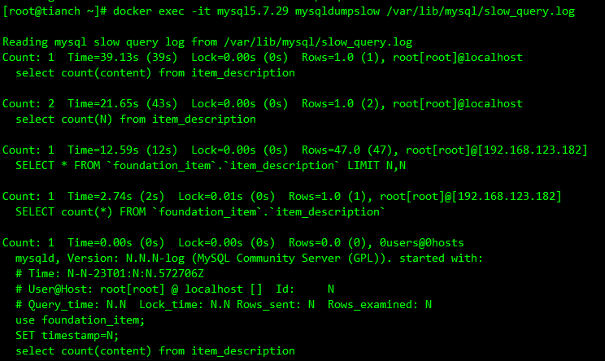

- explain

  通过上面的手段查询到效率低的SQL语句之后，可以通过`explain` 关键字可以模拟优化器执行 SQL 查询语句,从而知道 MySQL 是如何处理你的SQL语句的,分析你的查询语句或是表结构的性能瓶颈 .

  ```mysql
  explain select * from item_description  where item_description_id = 357967462756522813;
  explain select * from item_description  where content like '%VRMZ%YOZB%';
  ```

  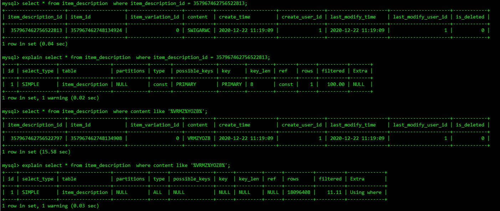

  | 字段          | 含义                                                                               |
  | ------------- | ---------------------------------------------------------------------------------- |
  | id            | select查询的序列号,包含一组数字,标识查询中执行select字句或者操作表的顺序           |
  | select_type   | 表示select的类型 常见取值有 `SIMPLE` `PRIMARY` `UNION` 等                          |
  | table         | 输出结果集的表                                                                     |
  | partitions    | 命中的分区                                                                         |
  | type          | 表示连接类型                                                                       |
  | possible_keys | 表示查询时 可能用到的索引                                                          |
  | key           | 表示查询时 实际用到的索引                                                          |
  | key_len       | 表示索引字段的长度                                                                 |
  | ref           | 表示上述表的连接匹配条件，即哪些列或常量被用于查找索引列上的值                     |
  | rows          | 每张表有多少行被物理查询                                                           |
  | filtered      | 表示存储引擎返回的数据在server层过滤后，剩下多少满足查询的记录数量的比例，是百分比 |
  | Extra         | 执行情况的说明和描述                                                               |

- 索引的使用

  `  索引（index）是帮助MySQL高效获取数据的数据结构（有序）。在数据之外，数据库系统还维护者满足特定查找算法的数据结构，这些数据结构以某种方式引用（指向）数据， 这样就可以在这些数据结构上实现高级查找算法，这种数据结构就是索引。  `
  - 优势
    1. 提高了检索效率 降低了数据库的IO成本
    2. 通过索引列对数据进行排序,降低数据排序的成本,降低CPU的消耗

  - 劣势
    1. 索引实际上也是一张表,该表中保存了主键与索引字段,并指向实体类的记录,所以索引列也是要占用空间的
    2. 虽然索引大大提高了查询效率 同时也降低了更新表的速度,如对表进行`insert``update``delete`,因为更新表时,MySQL不仅要保存数据,同时还要保存一下索引文件每次更新添加了索引列的字段,都会调整因为更新所带来的键值变化后索引的信息.

  - 索引结构

    MySQL数据库默认存储引擎InnoDB的索引结构为B+Tree,而根据叶子节点的内存存储不同,索引类型分为`主键索引`和`非主键索引`.

    `主键索引`的叶子节点存储的是整行数据,在InnoDB中`主键索引`也被称为`聚簇索引`

    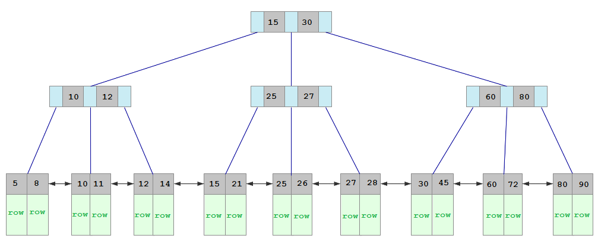

    而`非主键索引`的叶子节点内容存储的是主键的值,在InnoDB中,`非主键索引`也被称为`二级索引`或`辅助索引`

    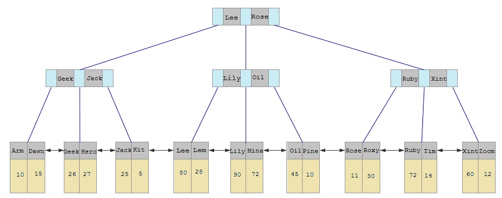

  - 索引验证

    在`item_description`表中有1800w+的数据

    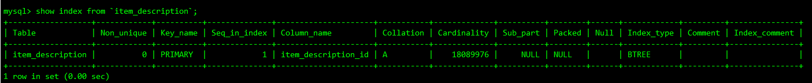
    1. 根据主键id查询很快

       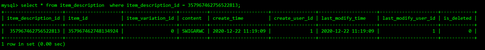

    2. 根据content查询速度变慢

       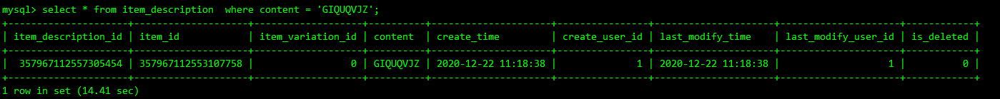

    3. 给content字段建立索引之后再次查询

       ```mysql
       create index idx_item_content on item_description(content);
       ```

       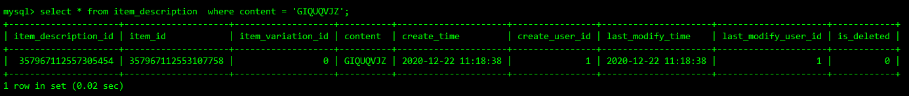

  - 索引使用规则
    - 切换到`test`数据库下

      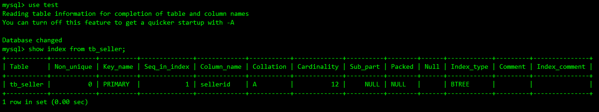

    - 没有建立索引之前的执行计划

      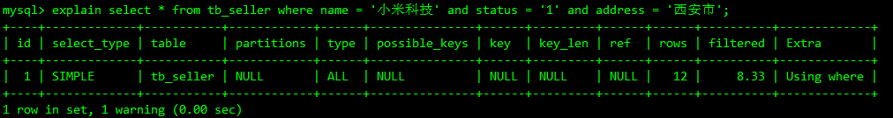

    - 建立索引

      ```mysql
      create index idx_seller_name_stat_addr on tb_seller(name,status,address);
      ```

    - 建立索引之后的执行计划

      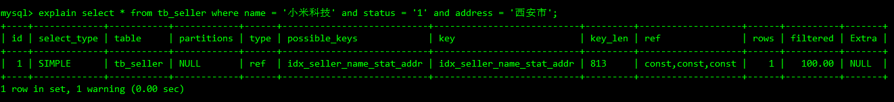
    1. 全值匹配 对索引中所有列都指定具体值

       该情况下 索引生效 执行效率高

       

    2. 最左前缀法则

       如果索引了多列,要遵守`最左前缀法则`.指的是查询从所有的最左前列开始,并且不能跳过索引中的列

       匹配最左前缀法则,索引生效

       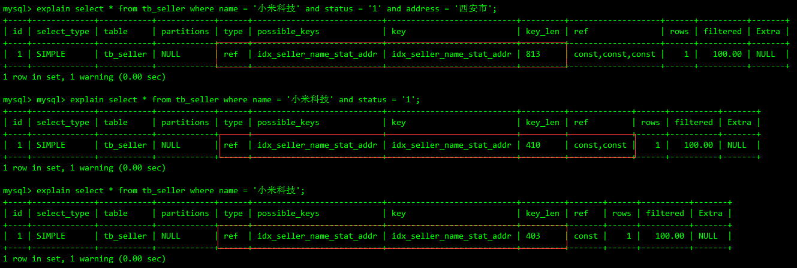

       违反最左前缀法则,索引失效

       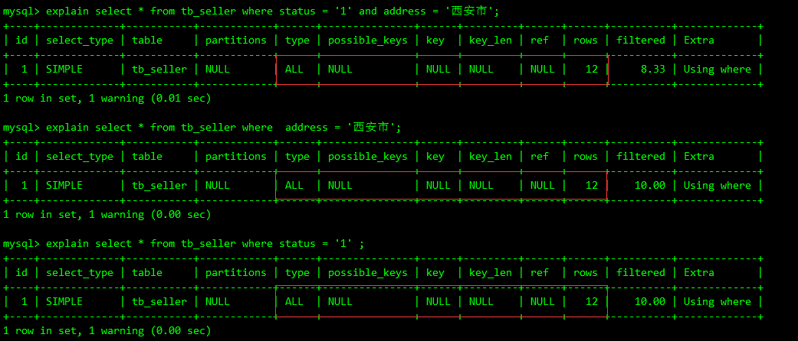

       符合最左前缀法则,但是出现跳跃某一列,则只有最左列索引生效

       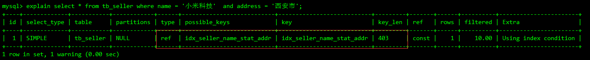

       总结一句话就是`带头大哥不能死 中间兄弟不能断`

    3. 范围查询右边的列,不能使用索引

       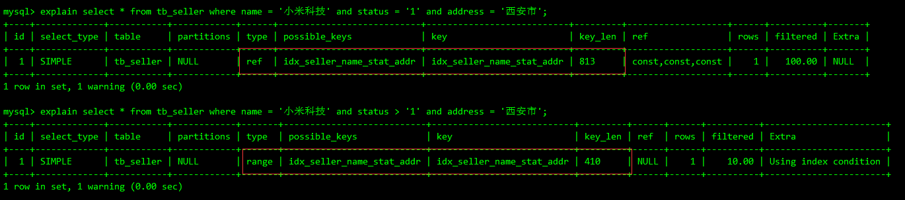

       根据前面`name``status`查询时走索引的索引长度可知,本次查询`address`没有用到索引

    4. 在索引列上进行运算操作,索引失效

       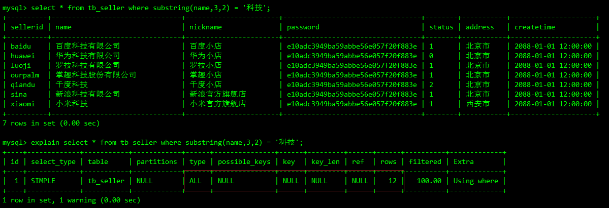

    5. 字符串不加单引号,索引失效

       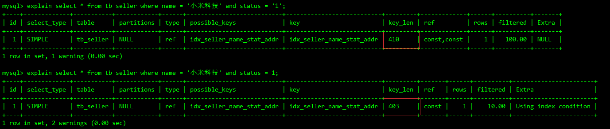

       因为在查询时没有对字符串加单引号,MySQL的查询优化器会自动的进行类型转换,从而索引失效.

    6. 用`or`分割开的条件,如果`or`前的条件中的列有索引,而后面的列没有索引,那么涉及的索引都失效

       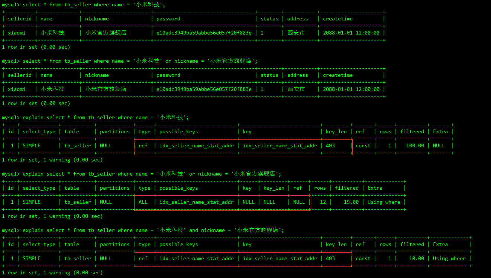

    7. 以`%`开头的`like`模糊查询 索引失效

       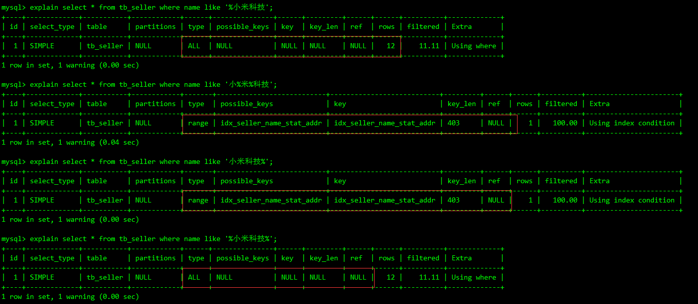

       通过`覆盖索引`解决模糊匹配索引失效的问题

       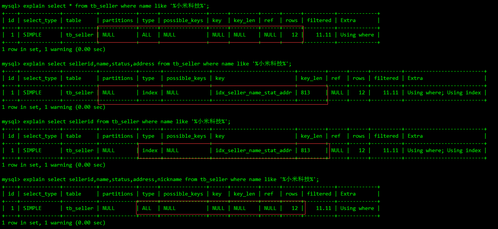

       `覆盖索引`: SQL只需要通过索引就可以返回查询所需要的数据，而不必通过`辅助索引`查到主键之后再回表去查询数据

    8. 如果MySQL评估使用索引比全表更慢,则放弃使用索引

       ```mysql
       # 删除之前的辅助索引 给address字段建立单值索引
       drop index idx_seller_name_stat_addr on tb_seller;
       create index idx_seller_address on tb_seller(address);
       ```

       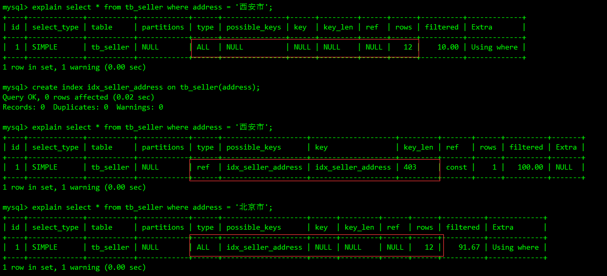

       因为`address = 西安市`的就一条数据 走索引比较快,但是`address = 北京市`有很多条数据,区分度不高,常见的还有性别字段等,走索引的效率反而没有全表查询的效率高,MySQL果断放弃索引走全表查询

    9. `is NULL` `is NOT NULL` 有时索引失效

       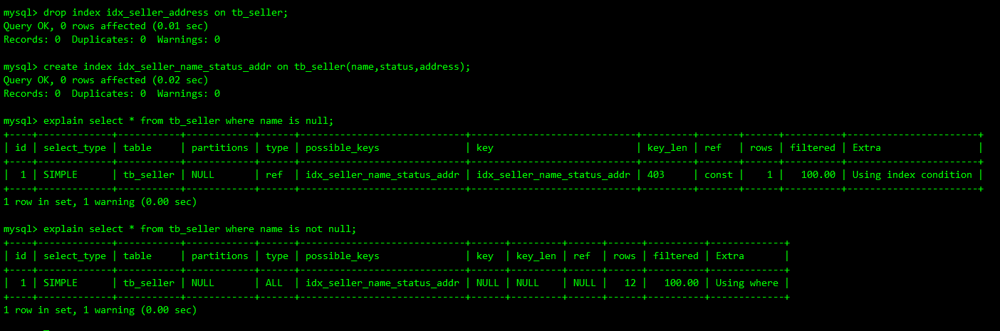

    10. `in` `not in`有时索引失效 原因同第9条

        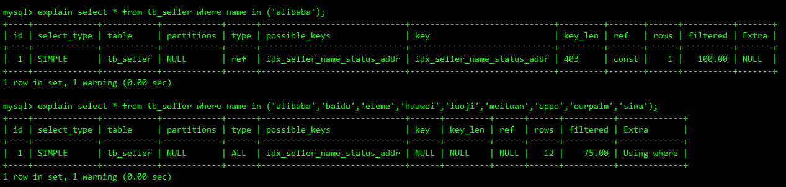

    11. 尽量使用`覆盖索引` ,避免 `select *` 如果查询列超出索引列,也会降低性能

        

    | Extra                     | 含义                                                                                                 |
    | ------------------------- | ---------------------------------------------------------------------------------------------------- |
    | using index               | 覆盖索引,没有使用查询条件                                                                            |
    | using where               | 需要通过索引回表查询数据                                                                             |
    | using index condition     | 先条件过滤索引,过滤完索引之后找到符合索引条件的数据行,然后根据 WHREE子句中的其他条件去过滤这些数据行 |
    | using index & using where | 覆盖索引,但是后面带了查询条件                                                                        |

  - 索引设计原则
    - 对查询频次高且数据量比较大的表建立索引
    - 索引字段的选择,最佳候选列应当从where子句的条件中提取,如果where子句中的组合比较多,name应当挑选最常用且过滤效果做好的列的组合
    - 使用唯一索引,区分度越高使用索引的效率越高
    - 索引可以有效的提升查询效率,单索引数量并不是越多越好,索引越多,维护索引的代价也就越大
    - 使用短索引,索引创建之后也是使用硬盘来存储的,如果提升了索引访问的I/O效率,也可以提升总体的访问效率.
    - 利用最左前缀,N个列组合而成的复合索引,也就相当于创建了N个索引,如果查询时where子句中使用了组成该索引的前几个字段,那么这条SQL可以利用组合索引提升查询效率.

- 常见SQL优化
  - 环境准备

    ```mysql
    use test;
    CREATE TABLE `emp` (
    `id` int(11) NOT NULL AUTO_INCREMENT,
    `name` varchar(100) NOT NULL,
    `age` int(3) NOT NULL,
    `salary` int(11) DEFAULT NULL,
    PRIMARY KEY (`id`)
    ) ENGINE=InnoDB DEFAULT CHARSET=utf8mb4;
    insert into `emp` (`id`, `name`, `age`, `salary`) values('1','Tom','25','2300');
    insert into `emp` (`id`, `name`, `age`, `salary`) values('2','Jerry','30','3500');
    insert into `emp` (`id`, `name`, `age`, `salary`) values('3','Luci','25','2800');
    insert into `emp` (`id`, `name`, `age`, `salary`) values('4','Jay','36','3500');
    insert into `emp` (`id`, `name`, `age`, `salary`) values('5','Tom2','21','2200');
    insert into `emp` (`id`, `name`, `age`, `salary`) values('6','Jerry2','31','3300');
    insert into `emp` (`id`, `name`, `age`, `salary`) values('7','Luci2','26','2700');
    insert into `emp` (`id`, `name`, `age`, `salary`) values('8','Jay2','33','3500');
    insert into `emp` (`id`, `name`, `age`, `salary`) values('9','Tom3','23','2400');
    insert into `emp` (`id`, `name`, `age`, `salary`) values('10','Jerry3','32','3100');
    insert into `emp` (`id`, `name`, `age`, `salary`) values('11','Luci3','26','2900');
    insert into `emp` (`id`, `name`, `age`, `salary`) values('12','Jay3','37','4500');
    create index idx_emp_age_salary on emp(age,salary);
    ```

  - order by优化
    1. 通过对返回数据进行排序,也就是通常说的`filesort`排序,所有不是通过索引返回排序结果的排序都叫`filesort`排序

       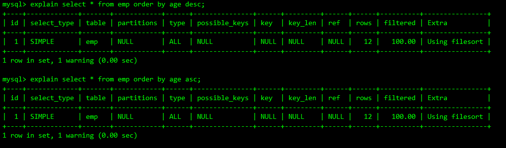

    2. 通过有序索引顺序扫描直接返回有序数据,这种情况即为`using index`,不需要额外排序,操作效率高

       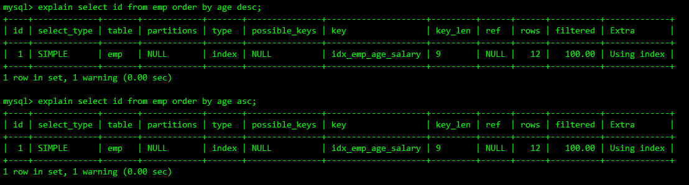

       多字段排序

       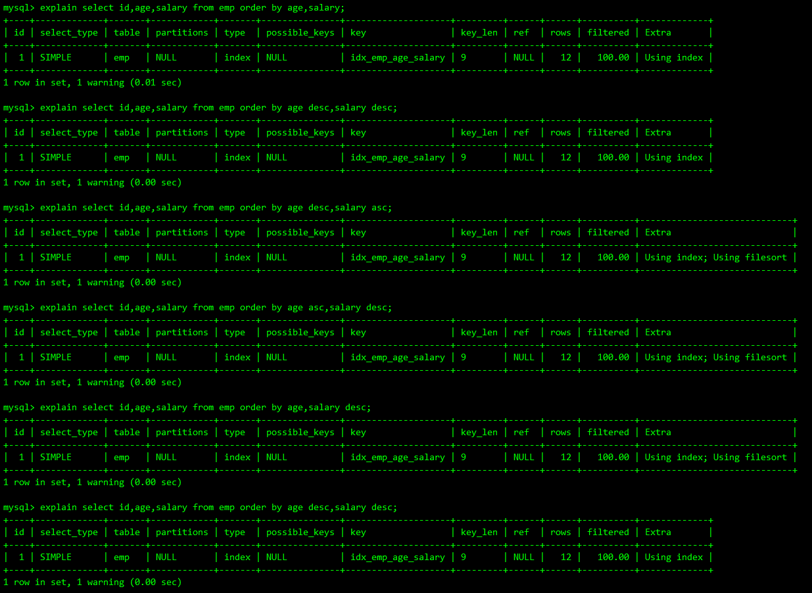

       尽量减少额外的排序,通过索引直接返回有序数据.where条件和order by使用相同的索引,并且order by的顺序和索引的顺序相同,并且order by的字段都是升序或者都是降序,否则肯定需要额为的操作,这样就会出现`filesort`.

  - filesort的优化

    ​ 通过创建合适的索引,能够减少filesort的出现,但是在某些条件下不能让filesort消失,那么就需要加快filesort的排序操作.对于filesort MySQL现在采用的是一次扫描算法:一次性取出满足条件的所有字段,然后在排序区`sort buffer`中排序后直接输出结果集,排序时内存开销较大,但是排序效率比两次扫描算法要高.

    ​ MySQL通过比较系统变量`  max_length_for_sort_data  `的大小和Query语句取出的字段总大小来判定使用哪种排序算法,如果`  max_length_for_sort_data  `更大,那么使用第二种优化之后的算法,否则使用第一种.

    ​ 可以适当提高`sort_buffer_size`和`  max_length_for_sort_data  `系统变量,来增大排序区的大小,提高排序的效率.

    查看排序缓冲区大小

    ```mysql
    mysql> show variables like 'sort_buffer_size%';
    +------------------+--------+
    | Variable_name    | Value  |
    +------------------+--------+
    | sort_buffer_size | 262144 |
    +------------------+--------+
    1 row in set (0.03 sec)
    ```

  - group by优化

    ​ 由于`group by`实际上也会进行排序操作,而且与`order by`相比,`group by`主要只是多了排序之后的分组操作.如果在分组的时候还使用可其他的一些聚合和函数,那么还需要一些聚合函数的计算,所以在`group by`的实现过程中,与`order by`一样也可以利用到索引.

    ​ 如果查询包含`group by`,但是用户又想要避免排序结果的消耗,则可以使用`order by null`禁止排序.

    ```mysql
    drop index idx_emp_age_salary on emp;
    explain select age,count(*) from emp group by age;
    ```

    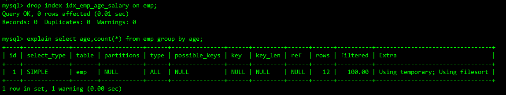

    优化后

    ```mysql
    explain select age,count(*) from emp group by age order by null;
    ```

    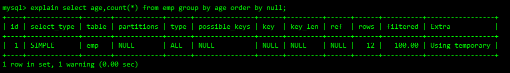

    创建索引后

    ```mysql
    create index idx_emp_age_salary on emp(age,salary);
    ```

    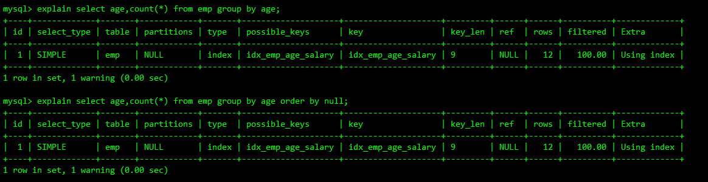

  - limit优化

    ​ 一般分页查询时,通过创建覆盖索引能够比较好的提升性能.一个常见又比较头疼的问题就是`limit 5000000,10`,此时需要MySQL排序前5000010条记录,仅仅返回5000000-5000010的记录,其它记录丢弃,查询排序的代价非常大.

    ​ `limit`分页操作,越往后性能越低

    ```mysql
    select * from item_description limit 10000000,10;
    ```

    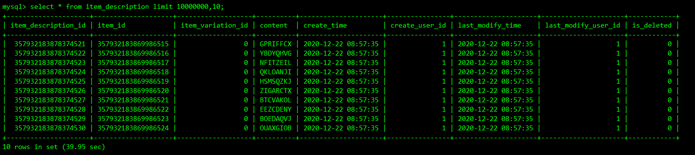

    优化方案

    ```mysql
    # 这种写法是错误的 This version of MySQL doesn't yet support 'LIMIT & IN/ALL/ANY/SOME subquery'
    select * from item_description where item_description_id in (select item_description_id from item_description limit 10000000,10);
    ```

    ```mysql
    # 这是正确写法
    select * from item_description a,(select item_description_id from item_description limit 10000000,10) b where a.item_description_id = b.item_description_id;
    ```

    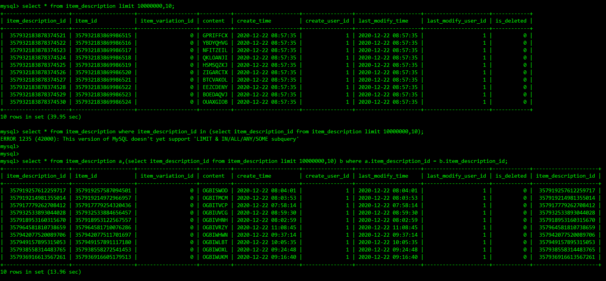

  - count优化

    ​ 在很多的业务系统中,都需要考虑进行分页操作,但是我们执行分页操作时,都系要进行一次`count`操作求取总记录数,如果数据库表的数据量大,在InnoDB引擎中,执行`count`操作的性能是比较低的,需要遍历全表数据,对计数进行累加

    优化方案
    1. 在大数据量的查询中,只查询数据,而不展示总记录数;
    2. 通过缓存redis维护一个表的计数,来记录数据库表的总记录数,在执行插入/删除时需要动态更新;
    3. 在数据库表中定义一个大数据量的计数表,在执行插入/删除时需要动态更新;

  - 大批量插入优化

    ```mysql
    CREATE TABLE `tb_user` (
    `id` INT(11) NOT NULL AUTO_INCREMENT,
    `username` VARCHAR(50) NOT NULL,
    `password` VARCHAR(50) NOT NULL,
    `name` VARCHAR(20) NOT NULL,
    `birthday` DATE DEFAULT NULL,
    `sex` CHAR(1) DEFAULT NULL,
    PRIMARY KEY (`id`),
    UNIQUE KEY `unique_user_username` (`username`)
    ) ENGINE=INNODB DEFAULT CHARSET=utf8;
    ```

    当使用`load`命令导入数据的时候,适当的设置可以提高导入的效率.

    对于InnoDB类型的表,有以下几种方式可以提高导入的效率
    1. 主键的顺序插入

       因为InnoDB类型的表是按照主键的顺序保存的,所以导入的数据按照主键的顺序排列,可以有效地提高导入数据的效率.如果InnoDB表没有主键,那么系统会自动默认创建一个内部列作为主键,所以如果给表创建一个主键,可以利用这点来提高导入数据的效率.

       使用`source sql文件` 10w条数据耗时大概4分钟

       ```java
       // 简单代码  自己改吧

       public static void writeInsert() throws Exception {


               FileOutputStream fos = new FileOutputStream(new File("E:/user_insert_10w.sql"));
               OutputStreamWriter osw = new OutputStreamWriter(fos, "UTF-8");
               BufferedWriter bw = new BufferedWriter(osw);

               for (int i = 1; i <= 100000; i++) {

                   String sql = "INSERT INTO `test`.`tb_user`(`id`, `username`, `password`, `name`, `birthday`, `sex`) VALUES (" + i + ", 'tianch" + i + "', '123456', '田小晖', '2020-12-23', '1');";
                   bw.write(sql + "\n");
               }
               //注意关闭的先后顺序，先打开的后关闭，后打开的先关闭
               bw.close();
               osw.close();
               fos.close();
           }


           public static void writeLoad() throws Exception {
               FileOutputStream fos = new FileOutputStream(new File("E:/user_load_1000w_disorder.sql"));
               OutputStreamWriter osw = new OutputStreamWriter(fos, StandardCharsets.UTF_8);
               BufferedWriter bw = new BufferedWriter(osw);

               Set<Long> set = new HashSet<>();
               Random random = new Random();
               while (set.size() < 10000000) {
                   set.add(Math.abs(random.nextLong()));
               }

               List<Long> list = new ArrayList<>();
               list.addAll(set);
               Collections.shuffle(list);

               for (Long i : list) {
                   String sql = "" + i + ",tianch" + i + ",123456,田小晖,2020-12-23,1";
                   bw.write(sql + "\n");
               }
               //注意关闭的先后顺序，先打开的后关闭，后打开的先关闭
               bw.close();
               osw.close();
               fos.close();
           }
       ```

       ```mysql
       # 从本地路径文件导入到哪个表 数据字段之间以`,`分隔 行之间以`\n`分隔
       load data local infile '[路径]' into table `[表名]` fields terminated by ',' lines terminated by '\n';
       ```

       插入ID有序 垃圾机器居然跑了近20分钟

       

       插入ID无序 竟然跑了4个半小时

       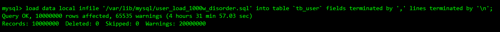

    2. 关闭唯一性校验

       在导入数据之前执行`set unique_checks=0;`,关闭唯一性校验,在导入结束后执行`set unique_checks=1;`恢复唯一性校验,可以提高导入的效率.

    3. 手动提交事务

       在导入数据前执行`set autocommit=0;`关闭自动提交,导入结束后再执行`set autocommit=1;`打开自动提交,也可以提高导入的效率.

- MySQL存储引擎
  - MySQL体系架构

    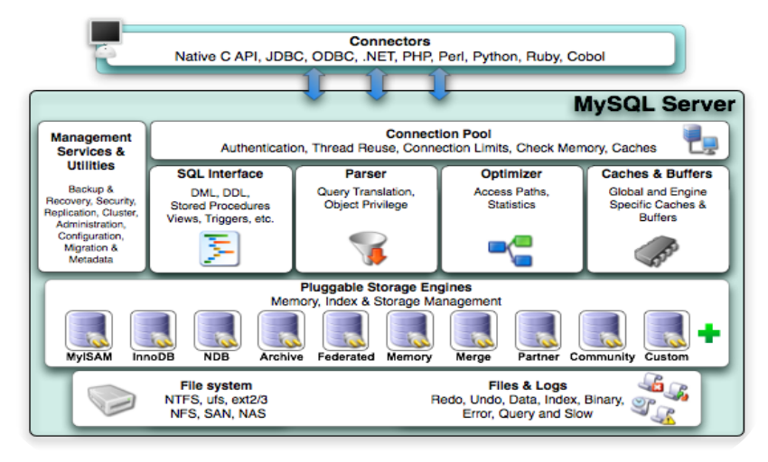

    | 组件                            | 说明               |
    | ------------------------------- | ------------------ |
    | Connection Pool                 | 连接池组件         |
    | Management Services $ Utilities | 管理服务和工具组件 |
    | SQL Ubterface                   | SQL接口组件        |
    | Parser                          | 查询分析器组件     |
    | Optimizer                       | 优化器组件         |
    | Caches & Buffers                | 缓冲池组件         |
    | Pluggable Storage Engines       | 存储引擎           |
    | File System                     | 文件系统           |
    1. 连接层

       最上层是是一些客户端和连接服务,包含本地 socket通信和大多数基于客服端/服务端工具实现的类似于TCP/IP的通信.主要完成一些类似于连接处理 授权认证及相关的安全方案.在该层上引入了线程池的概念,为通过认证安全接入的客户端提供线程.同样在该层上可以实现基于SSL的安全连接.服务器也会为安全接入的每个客户端验证它所具有的操作权限.

    2. 服务层

       第二层架构主要完成大所数的核心服务功能,如SQL接口,并完成缓存的查询,SQL的分析和优化,部分内置函数的执行.所有跨存储引擎的功能也在这一层实现,如 `过程` `函数`等.在该层 服务器会解析查询并创建相应的内部解析树,并对其完成相应的优化 如确定表的查询顺序,是否利用索引等,最后生成相应的执行操作.如果是`select`语句,服务器还会查询内部的缓存,如果缓存空间足够大,这样在解决大量读操作的环境中能够很好的提升系统的性能.

    3. 引擎层

       存储引擎真正负责了MySQL中数据的存储和读取,服务器通过API和存储引擎进行通信.不同的存储引擎有不同的功能,这样我们可以根据自己的需要来选择合适的存储引擎.

    4. 存储层

       主要是将数据存储在文件系统之上,并完成与存储引擎的交互.

    与其它数据库相比,MySQL有点与众不同,它的架构可以在多种不同的场景中应用并发挥良好作用,主要体现在存储引擎上,插件式的存储引擎架构,将查询处理和其它的系统任务以及数据的存储提取分离.这种架构可以根据业务的需求和实际需要选择合适的存储引擎.

  - 存储引擎的介绍

    和大多数数据库不同,MySQL中有一个存储引擎的概念,针对不同的需求可以选择最优的存储引擎.存储引擎就是存储数据 建立索引 更新查询数据等等技术的实现方式.存储引擎是基于表的,而不是基于库的,所以存储引擎也被称为表类型.

    MySQL中支持的存储引擎比较多,可以通过SQL查看当前数据库支持的存储引擎

    ```mysql
    show engines;
    ```

    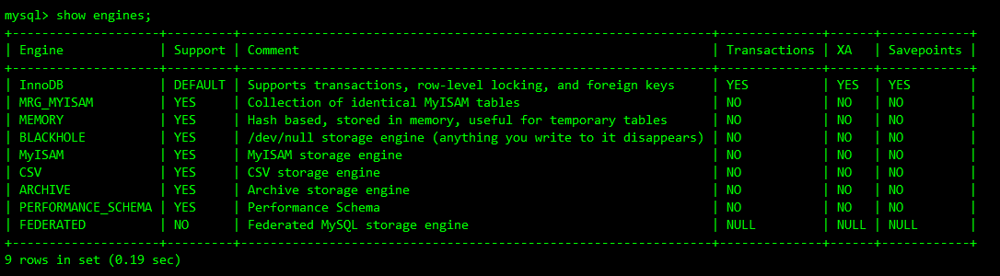

  - 存储引擎特点

    MySQL支持的存储引擎比较多,我们这里重点列出两种 `InnoDB`和`MyISAM`

    | 特点         | InnoDB                    | MyISAM |
    | ------------ | ------------------------- | ------ |
    | 存储限制     | 64T                       | 256T   |
    | 事务安全     | 支持                      | -      |
    | 锁机制       | 行锁                      | 表锁   |
    | B树索引      | 支持                      | 支持   |
    | 哈希索引     | -(具有自适应哈希索引功能) | -      |
    | 全文索引     | 5.6之后支持               | 支持   |
    | 集群索引     | 支持                      | -      |
    | 数据索引     | 支持                      | -      |
    | 索引缓存     | 支持                      | 支持   |
    | 数据可压缩   | 支持                      | 支持   |
    | 空间使用     | 高                        | 低     |
    | 内存使用     | 高                        | 低     |
    | 批量插入速速 | 低                        | 高     |
    | 支持外键     | 支持                      | -      |

    示例:

    ```mysql
    create table goods_innodb(
    id int NOT NULL AUTO_INCREMENT,
    name varchar(20) NOT NULL,
    primary key(id)
    )ENGINE=innodb DEFAULT CHARSET=utf8;
    create table goods_myisam(
    id int NOT NULL AUTO_INCREMENT,
    name varchar(20) NOT NULL,
    primary key(id)
    )ENGINE=myisam DEFAULT CHARSET=utf8;


    create table country_innodb(
    country_id int NOT NULL AUTO_INCREMENT,
    country_name varchar(100) NOT NULL,
    primary key(country_id)
    )ENGINE=InnoDB DEFAULT CHARSET=utf8;

    create table city_innodb(
    city_id int NOT NULL AUTO_INCREMENT,
    city_name varchar(50) NOT NULL,
    country_id int NOT NULL,
    primary key(city_id),
    key idx_fk_country_id(country_id),
    CONSTRAINT `fk_city_country` FOREIGN KEY(country_id) REFERENCES
    country_innodb(country_id) ON DELETE RESTRICT ON UPDATE CASCADE
    )ENGINE=InnoDB DEFAULT CHARSET=utf8;


    insert into country_innodb values(null,'China'),(null,'America'),(null,'Japan');
    insert into city_innodb values(null,'Xian',1),(null,'NewYork',2),(null,'BeiJing',1);

    create table country_myisam(
    country_id int NOT NULL AUTO_INCREMENT,
    country_name varchar(100) NOT NULL,
    primary key(country_id)
    )ENGINE=myisam DEFAULT CHARSET=utf8;


    create table city_myisam(
    city_id int NOT NULL AUTO_INCREMENT,
    city_name varchar(50) NOT NULL,
    country_id int NOT NULL,
    primary key(city_id),
    key idx_fk_country_id(country_id),
    CONSTRAINT `fk_city_country` FOREIGN KEY(country_id) REFERENCES
    country_myisam(country_id) ON DELETE RESTRICT ON UPDATE CASCADE
    )ENGINE=myisam DEFAULT CHARSET=utf8;


    insert into country_myisam values(null,'China'),(null,'America'),(null,'Japan');
    insert into city_myisam values(null,'Xian',1),(null,'NewYork',2),(null,'BeiJing',1);
    ```

- InnoDB存储引擎深度剖析
  - InnoDB体系结构

    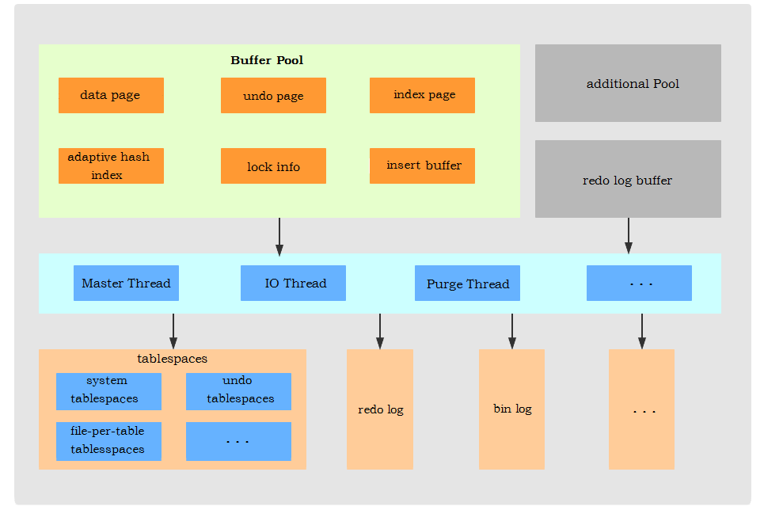
    - 缓冲池
      1. 介绍

         ​ InnoDB存储引擎基于磁盘文件存储,访问物理磁盘和在内存中进行访问,速度差别很大,为了尽可能弥补这两者之间I/O效率的差值,就需要把经常使用的数据加载到缓冲池中,避免每次访问都进行磁盘I/O.

         在InnoDB的缓冲池中不仅缓存了索引页和数据页,还包含了undo页 自适应hash索引以及InnoDB的锁信息等等.

      2. 读取

         ​ 在数据库进行读取页的操作时,首先将磁盘中读取到的页数据放到缓冲池中,下一次再读取相同的页时,首先判断缓冲池中是否存在,如果缓冲池被命中,则直接读取数据,如果没有,则读取磁盘中的页数据.

      3. 更新

         ​ 对于数据库中页的修改操作,则首先修改缓冲池中的页,然后再以一定的频率刷新到磁盘上,从而保证缓冲池中的数据与磁盘中的数据一致.页从缓冲池中刷新回磁盘的操作并不是在每次页发生更新时都需要触发,处于整体性能的考虑,而是通过`checkpoint`机制刷新回磁盘

      4. 参数配置

         在专用服务器上,通常将多大80%的物理内存分配给缓冲池.参数查看:

         ```mysql
         show variables like 'innodb_buffer_pool_size%';
         ```

         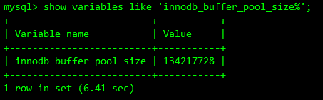

         在InnoDB引擎中,允许有多个缓冲池实例,根据页的哈希值分配到不同的缓冲池实例中,从而减少数据库内部的资源竞争,提升并发处理能力. 参数查看:

         ```mysql
         show variables like 'innodb_buffer_pool_instances%';
         ```

         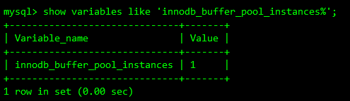

         参数配置

         ```shell
         vim /etc/mysql/mysql.conf.d/mysqld.cnf

         innodb_buffer_pool_size=268435456
         ```

    - 后台线程
      1. Master Thread

         主要负责将缓冲池中的数据异步刷新到磁盘中,保持数据的一致性,还包括脏页的刷新 合并插入缓存 undo页的回收

      2. IO Thread

         在InnoDB引擎中大量使用了AIO来处理IO请求,这样可以极大地提高数据库的性能,而IO Thread主要负责这些IO请求的回调.

         | Thread               | 线程数 | 参数配置                |
         | -------------------- | ------ | ----------------------- |
         | read thread          | 4      | innodb_read_io_threads  |
         | write thread         | 4      | innodb_write_io_threads |
         | insert buffer thread | 1      | -                       |
         | log thread           | 1      | -                       |

      3. Purge Thread

         主要用于回收已经提交了的 `undo log`,在事务提交之后,`undo log`可能不用了,就用它来回收.

         ```mysql
         show variables like 'innodb_purge_threads%';
         ```

         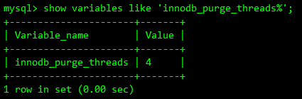

      4. Pager Cleaner Thread

         新引入的一个用于协助`Master Thread`刷新脏页到磁盘的线程,它可以减轻`Master Thread`的工作压力,减少阻塞.

    - 文件
      1. frm文件

         用来保存每个表的元数据信息,主要包含表结构的数据.

      2. 系统表空间

         系统表空间是InnoDB数据字典 二次写缓冲区 更改缓冲区和撤销日志的存储区.系统表空间可以具有一个或多个数据文件,默认情况下会在数据存放目录中创建一个名为`ibtmp1`表空间数据文件.该文件名称可以通过参数`innodb_data_file_path`指定.

         ```mysql
         show variables like 'innodb_data_file_path%';
         ```

         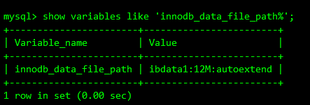

      3. 独占表空间

         InnoDB中设置了参数`innodb_file_per_table`为1/ON,则会将存储的数据 索引等信息单独存储在一个独占表空间,因此也会产生一个独占表空间文件(ibd)

      4. redo log

         重做日志,用于恢复提交事务修改的页操作,用来保证事务的原子性和持久性.主要是解决提交的事务没有执行完成但是数据库崩溃了,当数据库恢复之后,可以完整的恢复数据.在执行操作时,InnoDB存储引擎会首先将重做日志放到缓冲区`redo log buffer`,然后按照不同的策略和频率将buffer中的数据刷新到重做日志中.`redo log`在磁盘中保存的名称为`ib_logfile0` `ib_logfile1`

      5. bin log

         二进制日志,其中记录表结构中的数据变更,包含DDL和DML.

      6. 其它

         错误日志 查询日志 慢查询日志等.

  - InnoDB逻辑存储结构

    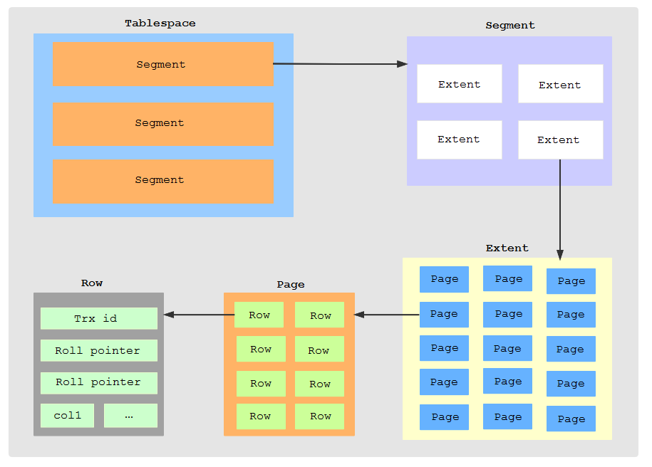
    1. 表空间

       表空间是InnoDB存储引擎逻辑结构的最高层,大部分数据都存在于共享表空间`ibtmp1`中.如果启用了参数`innodb_file_per_table`,则每张表都会有一个表空间(xxx.ibd),里面存放表中的数据 索引和插入缓存Bitmap页.其它的数据如ubdo log 插入缓存索引页 系统事务信息 二次写缓存 都是在共享表空间中.

    2. 段

       表空间是由各个段组成的,常见的段有 数据段 索引段 回滚段等.InnoDB存储引擎是基于索引组织的,因此数据既是索引,索引即数据.数据段就是B+树的叶子节点,索引段即为B+树的非叶子节点.

       InnoDB中对于段的管理,都是引擎自身完成,不需要人为对其控制.

    3. 区

       区是表空间的单元结构,每个区的大小为1M.默认情况下.InnoDB存储引擎页大小为16K,即一个区中一共有64个连续的页.

    4. 页

       页时组成区的最小单元,页也是InnoDB存储引擎磁盘管理的最小单元,每个页的大小默认为16KB.为了保证页的连续性,InnoDB存储引擎每次从磁盘中申请4-5个区.

    5. 行

       InnoDB存储引擎是面向行的(row-oriented),也就是说数据是按行进行存放的,每个页存放的行记录也是有硬性定义的,最多允许存放(16KB/2)-200行,即7992行
       - trx_id:每次对某条聚簇索引记录进行改动时,都会把对应的的事务id赋值给trx_id隐藏列.
       - roll_pointer:每次对某条聚簇索引记录进行改动时,都会把旧的版本写入到undo日志中,然后这个隐藏列就相当于一个指针,可以通过它来找到该记录修改前的信息.

  - checkpoint
    1. 介绍

       由于日常的DML语句操作时,首先操作的是缓冲池,并没有直接写入到磁盘,这可能导致内存中的数据与磁盘中的数据产生不一致的情况,而与磁盘中数据不一致的页我们称为`脏页`.而`checkpoint`的工作就是把内存中的脏页在`一定条件下`刷新到磁盘.

       如果在从缓冲池将也数据刷新到磁盘的过程中发生宕机,那么数据就无法恢复了,为了避免这种情况的发生,采用了`Write Ahead Log(WAL)`策略,即当事务提交时,先写重做日志(redo log),再修改缓冲池页数据,最后通过`checkpoint`刷新到磁盘(事务提交会触发checkpoint),这样正在执行的事务,因为存在日志,都可以被恢复,没有日志的事务还没有执行,也不会丢失数据.

    2. 作用
       - 缩短数据恢复时间

         当数据库放生宕机时,数据库不用重做所有的日志,因为checkpoint之前的页都已经刷新回磁盘了,故数据库只需要重做checkpoint之后的日志就好,这样就大大缩短了恢复时间.

       - 缓冲池不够用时,需要先将脏页数据刷新到磁盘中

         当缓冲池不够用时,根据LRU算法移除最近最少使用的页,如果此页时脏页,则强制执行checkpoint,刷新脏页到磁盘.

       - 重做日志不可用时,刷新脏页磁盘

         redo log大小是固定的.当前的InnoDB引擎中,重做日志的设计都是循环使用的,并不是无限增大的.重做日志可以被重用的部分是已经不再需要的,数据库发生宕机也不需要这部分的重做日志,因此可以被覆盖使用,如果此时重做日志还需要使用,那么必须强制执行checkpoint,将缓冲池中的页至少刷新到磁盘,checkpoint移动当前重做日志的位置.

         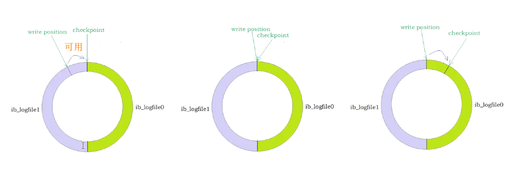

         write pos表示日志当前记录的位置,当ib_logfile_1写满后,会从ib_logfile_0从头开始记录,checkpoint表示将日志记录的修改写进磁盘,完成数据落盘,数据落盘后checkpoint会将日志上的相关记录擦除掉,即write position-->checkpoint直接的部分都是redo log空着的部分,用于记录新的记录.checkpoint-->write position之间是redo log待落盘的数据修改记录.当write position追上checkpoint时,得先停下记录,先推动checkpoint向前移动,空出位置记录新的日志.

    3. 分类
       - Sharp Checkpoint

         Sharp Checkpoint 发生在数据关闭时,将所有的脏页都刷新回磁盘,这是默认的工作方式.参数:innodb_fast_shutdown=1.

       - Fuzzy Checkpoint

         在InnoDB存储引擎运行时,使用Fuzzy Checkpoint进行页刷新,只刷新一部分脏页.

  - InnoDB关键特性
    - 插入缓存

      插入缓存是InnoDB存储引擎关键特性中最令人激动的.

      主键是行唯一的标识符,在应用程序中行记录的插入顺序一般是按照主键递增的顺序进行插入的.因此,插入聚集索引一般是顺序的,不需要磁盘的随机读取,因此在这样的情况下,插入操作一般很快就能完成.但是,不可能每张表上只有聚集索引,在更多的情况下,一张表上有多个非聚集的辅助索引(secondary index).比如我们需要按照name这个字段就行查找,并且name这个字段不是唯一的,这样的情况下产生了一个非聚集的并且不是唯一的索引,在进行插入操作时,数据页存放的还是按主键id的执行顺序存放,但是对于非聚集索引,叶子节点的插入不再是顺序的了,这时就需要离散地访问非聚集索引页,插入性能在这里变低了,然而就并不是这个name字段上索引的错误,因为B+树的特性决定了非聚集索引插入的离散性.

      InnoDB存储引擎开创性地设计了插入缓冲,对于非聚集索引的插入或更新操作,不是每一次直接插入索引页中,而是先判断插入的非聚集索引页是否在缓冲池中,如果在 则直接插入,如果不在,则先放入一个插入缓冲池中,好似欺骗数据库这个非聚集索引已经插到叶子节点了,然后再以一定的频率执行插入缓冲和非聚集索引叶子节点的合并操作,这时通常能将多个插入合并到一个操作中(因为在一个索引页中),这就大大提高了对非聚集索引执行插入和修改操作的性能.

      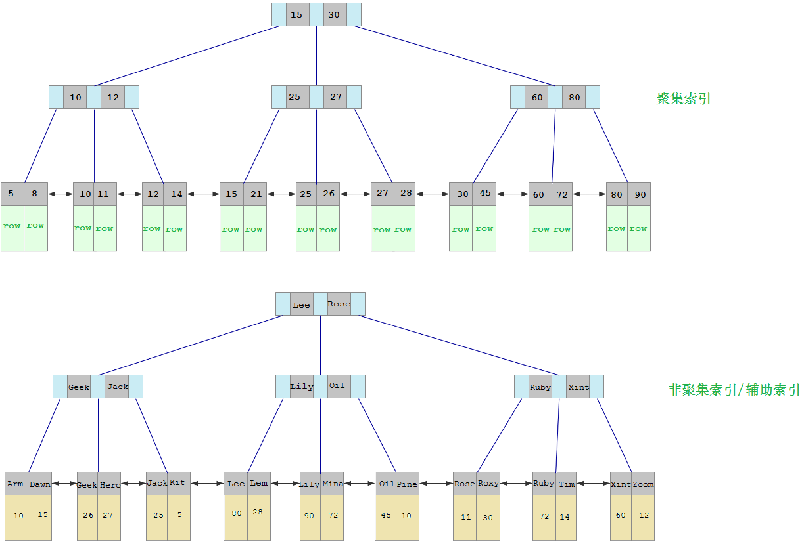

    - 两次写

      当数据库写物理页时,如果宕机了,那么可能导致物理页的一致性被破坏.

      可能有人说,重做日志不是可以恢复物理页吗?实际上是的,但是要求是在物理页一致的情况下.也就是说,如果物理页完全是未写之前的状态,则可以用重做日志恢复.如果物理页已经写完了,那么也可以用重做日志恢复.但是如果物理页前面2K写了新的数据,但是后面2K还是旧的数据,这种情况下就无法使用重做日志恢复了.

      这里的两次写就是保证了物理页的一致性,即使宕机,也可以用重做日志恢复.

      在写物理页时,并不是直接写到真正的物理页上去,而是先写到一个临时页上去,临时页写完后,再写到物理页,这样一来:
      1. 如果写临时页宕机了,物理页还是完全未写之前的状态,可以用重做日志恢复
      2. 如果写物理页时宕机了,则可以使用临时页来恢复物理数据

      InnoDB中共享表空间中划了2M的空间,叫做`double write`,专门存放临时页

      InnoDB还从内存中划出了2M的缓存空间,叫做`double write buffer`,专门缓存临时页

      每次写物理页时,先写到`double write buffer`中,然后从`double write buffer`写到`double write`上去,最后再从`double write buffer`写到物理页上去.

      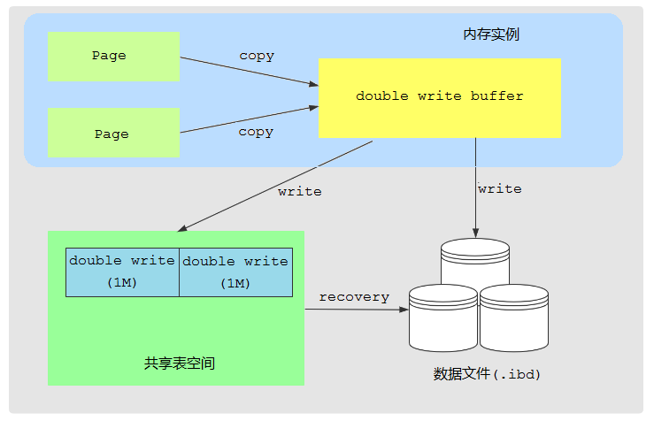

    - 自适应Hash索引

      在InnoDB中默认支持的索引结构是B+Tree,B+Tree索引可以使用到范围查找,同时是按照顺序的方式对数据进行存储,因此很容易对数据进行排序操作,在联合索引中也可以利用部分索引键进行查询.而对于Hash索引,只能满足`= <> in`查询,不能使用范围查询,二亲数据的存储是没有顺序的.MySQL默认使用B+Tree作为索引,因为B+Tree有着Hash索引没有的优点,那么为什么还需要`自适应Hash索引`呢?这是因为B+Tree的查找次数,取决于B+Tree的高度,在生产环境中,B+Tree的高度一般为3-4层,故需要3-4次查询.而Hash索引在进行数据检索的时候效率非常高,通常只需要O(1)的复杂度,也就是一次就可以完成数据的检索.虽然Hash索引的使用场景有很多限制,但是优点也很明显.InnoDB存储引擎会监控对表上各索引页的查询,如果观察到Hash索引可以提升速度,则建立Hash索引,称之为`自适应Hash索引`(Adaptive Hash Index, AHI).

      注意:这里的自适应指的是不需要人工来是定,系统会根据情况自动完成.

      什么情况下才会使用`自适应Hash索引`呢?如果某个数据经常被访问,当满足一定条件的时候,就会将这个数据页的地址存放到Hash表中,这样下次查询的时候就可以直接找到这个页面的所有位置.值得注意的是,Hash索引只能用于`= in`的查询,对于其它的查询类型,如范围匹配等 是不能使用Hash索引的,而且自适应Hash索引只保存热点数据(经常被使用到的数据),并非全表数据,因此 数据量并不会很大,因此自适应Hash索引也是存放到缓冲池中,这样进一步提升了查找效率.

      ```mysql
      show variables like '%adaptive_hash_index';
      ```

      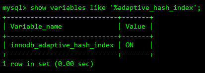

    - 异步IO

      为了提高磁盘的操作性能,在InnoDB存储引擎中使用异步非阻塞AIO的方式来操作磁盘.

      与AIO对应的是Sync IO,如果是同步IO操作,则每进行一次IO操作,需要等待此次操作结束后才可以进行接下来的操作,但是如果发出的是一条索引扫描的查询,那么这条SQL可能需要扫描多个索引页,也就是需要进行多次IO操作,每扫描一个页并等待其完成之后,再进行下一次扫描,这是没有必要的.可以在发出一个IO请求后立即再发出另一个IO请求,当全部的IO请求发送完毕后,等待所有的IO操作完成,这就是AIO.

    - 刷新临接页

      InnoDB提供刷新临接页的功能:当刷新一个脏页时,同时检测所在区(extent)的所有页,如果有脏页则一并刷新,好处是通过AIO特性合并写IO请求,缺点则是有些也不怎么脏也会被刷新,而且频繁的更改那些不怎么脏的页又很快变成脏页,造成频繁刷新,对于固态硬盘则考虑关闭此功能(将`innodb_flush_neighbors`设置为0).

  - InnoDB事务

    事务可由一条简单的SLQ组成,也可以由一组复杂的SQL语句组成.事务是访问并更新数据库中各个数据项的一个程序执行单元.在事务操作时,这组执行单元中的SQL,要么全部成功,要么全部失败.

    事务具有以下4个特性,简称为事务ACID属性.

    | ACID属性           | 含义                                                                      |
    | ------------------ | ------------------------------------------------------------------------- |
    | 原子性(Atomicity)  | 事务是一个原子操作单元,其对数据的修改要么全部成功 要么全部失败            |
    | 一致性(Consistent) | 在事务开始和完成时,数据都必须保持一致状态                                 |
    | 隔离性(Isolation)  | 数据库系统提供一定的隔离机制,保证事务在不受外部并发操作的`独立`环境下运行 |
    | 持久性(Durable)    | 事务完成之后,对于数据的修改时永久的                                       |
    - 隔离级别

      并发事务带来的问题:

      | 问题                             | 含义                                                                                                                          |
      | -------------------------------- | ----------------------------------------------------------------------------------------------------------------------------- |
      | 丢失更新(Lost Update)            | 当两个或者多个事务选择同一行,最初的事务修改的值,会被后面的事务修改的值覆盖                                                    |
      | 脏读(Dirty Reads)                | 当一个事务正在访问数据,并且对数据进行了修改,而这种修改还没有提交到数据库中,这时,另外一个事务也访问这个数据,然后使用了这个数据 |
      | 不可重复读(Non-Repeatable Reads) | 一个事务在读取某些数据后的某个时间,再次读取以前读过的数据,却发现和以前读出的数据不一致                                        |
      | 幻读(Phantom Reads)              | 一个事务按照相同的查询条件重新读取以前查询过的数据,却发现其它事务插入可满足其查询条件的新数据                                 |

      为了解决上述提到的事务并发问题,数据库提供了一定的事务隔离机制来解决这个问题.数据库的事务隔离越严格,并发副作用越小,但付出的代价也就越大,因为事务隔离实质上就是使用事务在一定程度上`串行化`进行,这显然与`并发`是矛盾的.

      数据库的隔离级别有4个.由低到高依次是`Read uncommitted` `Read committed` `Repeatable read` `Serializable`,这4个级别逐个解决脏写 脏读 不可重复读 幻读这几类问题.

      | 隔离级别              | 丢失更新 | 脏读 | 不可重复读 | 幻读 |
      | --------------------- | -------- | ---- | ---------- | ---- |
      | Read uncommitted      | ×        | √    | √          | √    |
      | Read committed        | ×        | ×    | √          | √    |
      | Repeatable read(默认) | ×        | ×    | ×          | √    |
      | Serializable          | ×        | ×    | ×          | ×    |

    - 实现
      1. redo log

         redo log叫做重做日志,用来实现事务的持久性.该日志文件由两部分组成:重做日志缓冲(redo log buffer)以及重做日志文件(redo log),前者是在内存中,后者是在磁盘中.当事务提交之后会把所有修改信息都会存到该日志中,用于在刷新脏页到磁盘发生错误时,进行数据恢复使用.

         例:

         原始数据内容:

         

         执行事务操作:

         ```mysql
         start transaction;
         select balance from bank where name="Tom";
         -- 生成 重做日志 balance=8000
         update bank set balance = balance - 2000;
         -- 生成 重做日志 account=2000
         update finance set account = account + 2000;
         commit;
         ```

         流程:

         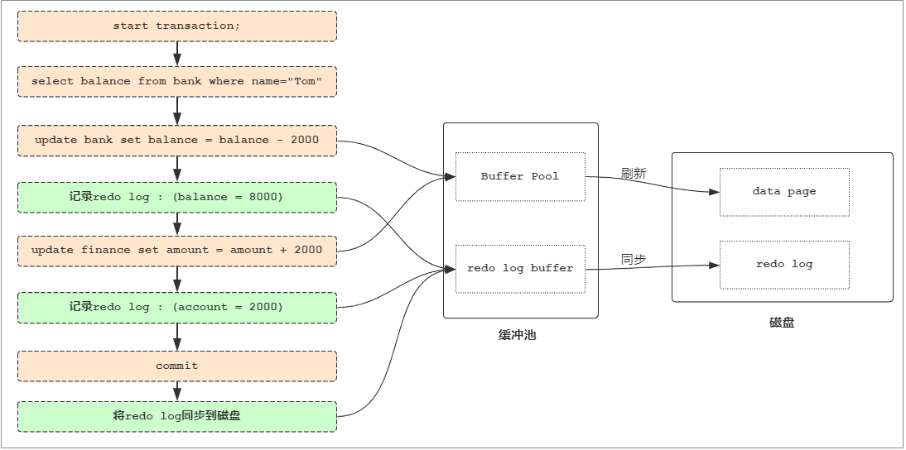

         MySQl为了提升性能不会把每次的修改都实时同步到磁盘,而是先存到`Buffer Pool`(缓冲池)中,把这个当做缓存来用,然后使用后台线程将缓冲池刷新到磁盘.

         当在执行刷新时,宕机或突然断电,可能会丢失部分数据,所以引入了`redo log`来记录已经成功提交事务的修改信息,并且在事务提交时会把`redo log`持久化到磁盘,系统重启之后再读取`redo log`恢复最新数据.

         简单来说.`redo log`是用来恢复数据的,用于保障已经提交事务的持久化特性.

      2. undo log

         `undo log`叫做回滚日志,用于记录数据被修改前的信息,它正好跟前面所说的重做日志所记录的相反,重做日志记录数据被修改后的信息.`undo log`主要记录的是数据的逻辑变化,为了在发生错误时回滚之前的操作,需要将之前的操作都记录下来,然后在发生错误是才可以回滚.

         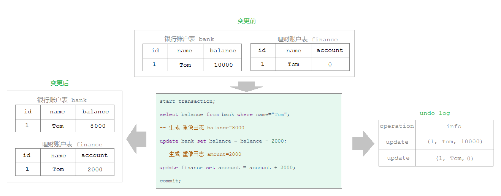

         `undo log`记录事务修改之前版本的数据信息,因此加入由于系统错误或者rollback操作而回滚的话,可以根据`undo log`的信息来进行回滚到没被修改前的状态.

